# NCCL 两大流程梳理：建链主流程（网络面）与消息处理流（数据面）

> 本文档按照费曼学习法，系统梳理 NCCL 的两个核心流程：**建链主流程（网络面）**和**消息处理流（数据面）**。

---

## 第一步：用最简单的语言解释（给12岁孩子听）

想象你要和一群朋友建立一个秘密通讯系统：

1. **建链主流程（网络面）**：就像你们要先互相认识，交换电话号码，确认每个人都能收到消息。这个过程只做一次，就像建微信群一样，建好了以后就可以一直用。

2. **消息处理流（数据面）**：就像你们在群里发消息、收消息、处理消息的过程。每次有人要发消息，都要经过：写消息 → 排队 → 发送 → 接收 → 处理 → 回复。

NCCL 也是这样：**建链**是第一次见面时建立连接，**数据面**是之后每次通信时处理数据。

---

## 第二步：用生活场景类比

### 类比：建立公司内部通讯系统

#### 建链主流程（网络面）—— 搭建通讯基础设施

想象你要建立一个公司内部的通讯系统：

1. **交换名片（Bootstrap）**：所有员工先通过一个公共渠道（比如 HR 系统）交换联系方式，知道每个人的地址和电话。

2. **绘制公司地图（拓扑发现）**：了解公司的物理布局——哪些人在同一层楼（同一节点），哪些人需要通过电梯（网络）联系，哪些人可以直接面对面（P2P）。

3. **建立专用线路（传输层初始化）**：为每对需要频繁沟通的员工建立专用电话线或网络连接。比如销售部和市场部之间建立直连线路。

4. **配置通讯设备（连接建立）**：确保每台电话、每台电脑都能正常工作，能互相拨通。

5. **测试连通性（连接验证）**：互相打电话测试，确保所有线路都畅通。

#### 消息处理流（数据面）—— 日常通讯流程

一旦基础设施建好，日常通讯流程是：

1. **提交任务（用户 API）**：员工 A 说"我要给所有人发一份报告"。

2. **任务登记（入队）**：前台把任务登记到待办清单上。

3. **任务调度（排产）**：调度员查看待办清单，决定先处理哪些任务，分配给哪些线路。

4. **执行任务（Kernel 启动）**：实际执行任务——可能是复制文件、计算数据、或者发送消息。

5. **网络传输（Proxy 处理）**：如果需要跨部门传输，由专门的传输员（Proxy）负责把数据送到对端。

6. **底层发送（IB Verbs）**：传输员把数据交给快递公司（网卡驱动），通过物理线路发送。

---

## 第三步：逐步深入技术细节

### 流程一：建链主流程（网络面）

#### 阶段 1：用户入口与前置检查

**在做什么**：用户调用初始化 API，系统进行参数校验和全局初始化。

**代码位置**：
- `src/init.cc:1382` - `ncclCommInitRank`
- `src/init.cc:1409` - `ncclCommInitAll`
- `src/init.cc:77` - `ncclInit`（全局初始化）

**关键代码片段**：
```c
// src/init.cc:1382
ncclResult_t ncclCommInitRank(ncclComm_t* newcomm, int nranks, ncclUniqueId commId, int myrank) {
  // 获取当前 CUDA 设备
  int cudaDev;
  CUDACHECK(cudaGetDevice(&cudaDev));
  // 调用核心初始化函数
  NCCLCHECK(ncclCommInitRankDev(newcomm, nranks, commId, myrank, cudaDev, NULL));
  return ncclSuccess;
}
```

**类比**：员工到 HR 部门报到，HR 先检查身份证、确认工位。

---

#### 阶段 2：通信器资源分配（commAlloc）

**在做什么**：分配 `ncclComm` 结构体，初始化内存管理、CUDA Stream、通道等基础资源。

**代码位置**：
- `src/init.cc:316` - `commAlloc`

**关键代码片段**：
```c
// src/init.cc:316
static ncclResult_t commAlloc(ncclComm_t* comret, int ndev, int rank) {
  // 分配通信器结构体
  NCCLCHECK(ncclCalloc(&comm, 1));
  
  // 内存管理初始化
  ncclMemoryStackConstruct(&comm->memPermanent);
  ncclMemoryStackConstruct(&comm->memScoped);
  
  // 网络层初始化
  NCCLCHECK(ncclNetInit(comm));
  
  // CUDA Stream 创建
  NCCLCHECK(ncclStrongStreamConstruct(&comm->deviceStream));
  NCCLCHECK(ncclStrongStreamConstruct(&comm->hostStream));
  
  // 获取 GPU 信息（PCIe Bus ID）
  NCCLCHECK(getBusId(comm->cudaDev, &comm->busId));
  
  // 通道初始化
  for (int c=0; c<MAXCHANNELS; c++) {
    NCCLCHECK(initChannel(comm, c, comm->nRanks));
  }
}
```

**类比**：给新员工分配工位、电脑、电话、文件柜等基础设施。

---

#### 阶段 3：Bootstrap 初始化与 AllGather1

**在做什么**：初始化用于 rank 间初始通信的 Bootstrap 网络（通常是 Socket），然后通过 AllGather 收集所有 rank 的 `peerInfo`（包括 busId、hostHash、compCap 等）。

**为什么在拓扑发现之前**：
- **Bootstrap 初始化**必须先完成，因为它是 rank 间通信的基础设施（建立 Socket 连接）
- **AllGather1** 收集所有 rank 的 `peerInfo`（特别是 `busId`），这些信息是构建完整拓扑图所必需的
- **拓扑发现**需要知道所有 rank 的 `busId`，才能将本地探测到的硬件与远程 rank 的 GPU 关联起来，构建跨节点的完整拓扑图

**简单时序图（文字版）**：

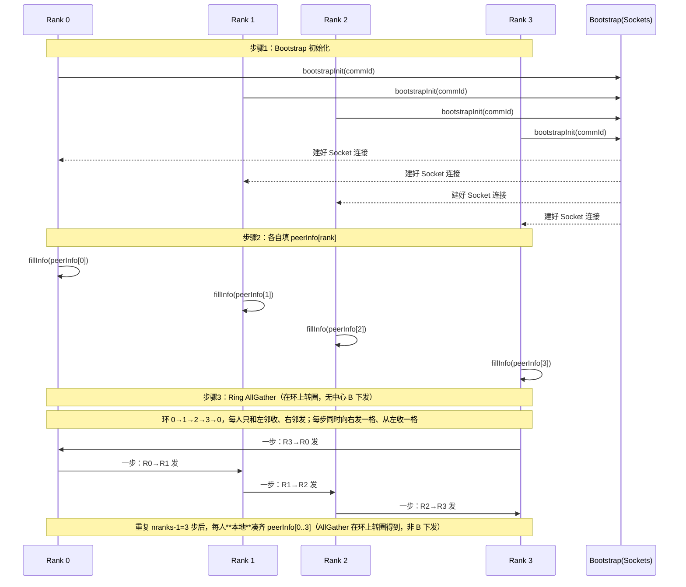

**说明**：步骤 3 不是“各 rank 把 peerInfo 发给 B、再由 B 下发给大家”。实际是 **Ring AllGather**：没有中心节点下发，数据只在环上相邻 rank 之间传递；每人只和左邻、右邻收发，转 nranks−1 步后，**每人本地**凑齐所有人的 peerInfo。

**具体例子：4 个 rank，2 台机器**：

- **节点与 GPU 分布**：
  - Node A：rank 0（GPU0，busId=0x0001）、rank 1（GPU1，busId=0x0002）
  - Node B：rank 2（GPU0，busId=0x0003）、rank 3（GPU1，busId=0x0004）
- **Step1：Bootstrap 初始化（建“微信群”）**：
  - rank 0 在端口 `A:5000` 上监听，其他 rank 通过 `ncclUniqueId` 里的地址/端口信息用 Socket 连上来
  - NCCL 内部搭好一个所有 rank 连通的临时通信拓扑（通常是 ring）
- **Step2：每个 rank 本地填自己的 peerInfo（自我介绍）**：
  - rank 0：`hostHash=H_A, busId=0x0001, compCap=8.0`
  - rank 1：`hostHash=H_A, busId=0x0002, compCap=8.0`
  - rank 2：`hostHash=H_B, busId=0x0003, compCap=8.0`
  - rank 3：`hostHash=H_B, busId=0x0004, compCap=8.0`
  - 此时每个 rank 只知道 **peerInfo[自己]**。
- **Step3：Bootstrap AllGather（群里抄花名册）**：
  - 通过 `bootstrapAllGather`，所有 rank 把自己的那条 `peerInfo[rank]` 广播出去
  - 最终每个 rank 都拿到同一份数组 `peerInfo[0..3]`，也就是**全局 GPU 花名册**

有了这份“花名册”（特别是每个 rank 的 `hostHash` 和 `busId`），后面的拓扑发现才能把“本机探到的 GPU/NIC/PCIe 关系”和“远程 rank”一一对应起来，拼出跨节点的完整拓扑图。

---

**AllGather 过程举例（4 个 rank，ring 顺序 0→1→2→3→0）**

NCCL 的 `bootstrapAllGather` 是**基于环的 AllGather**：每个 rank 只和**左邻、右邻**收发；每一步“向右发一块、从左收一块”，共做 **nranks−1** 步，最后每人都有所有人的数据。

- **约定**：每个 rank 有一块缓冲区 `data[0..nranks-1]`，每格存一个 rank 的一份数据（例如一份 `peerInfo`）。一开始只有 `data[rank]` 是自己的，其它格为空。
- **环**：右邻居 = (rank+1)%4，左邻居 = (rank−1+4)%4。即 0 的右邻是 1、左邻是 3；1 的右邻是 2、左邻是 0；以此类推。
- **每一步 i（i=0,1,2）**：每个 rank 同时
  - **向右发**：把当前缓冲区里“第 sslice 格”的内容发给右邻居（sslice = (rank−i+nranks)%nranks，第一步发自己的格，之后发上一轮从左邻收来的那一格）；
  - **从左收**：从左邻居收一块，写入“第 rslice 格”（rslice = (rank−i−1+nranks)%nranks）。

下面用 4 个 rank、每格用 A0/A1/A2/A3 表示各 rank 的那一份数据，看三步后如何凑满。

| 步骤 | rank 0 的 data[] | rank 1 的 data[] | rank 2 的 data[] | rank 3 的 data[] |
|------|------------------|------------------|------------------|------------------|
| **初始** | [A0, _, _, _] | [_, A1, _, _] | [_, _, A2, _] | [_, _, _, A3] |
| **i=0** 每人向右发自己的格，从左收一格 | 发 A0→1，从 3 收→填格 3 | 发 A1→2，从 0 收→填格 0 | 发 A2→3，从 1 收→填格 1 | 发 A3→0，从 2 收→填格 2 |
| **i=0 后** | [A0, _, _, A3] | [A0, A1, _, _] | [_, A1, A2, _] | [_, _, A2, A3] |
| **i=1** 每人向右发“上一轮刚收的那格”，再从左收一格 | 发 A3→1，从 3 收→填格 2 | 发 A0→2，从 0 收→填格 3 | 发 A1→3，从 1 收→填格 0 | 发 A2→0，从 2 收→填格 1 |
| **i=1 后** | [A0, _, A2, A3] | [A0, A1, _, A3] | [A0, A1, A2, _] | [_, A1, A2, A3] |
| **i=2** 再发一格、收一格 | 发 A2→1，从 3 收→填格 1 | 发 A3→2，从 0 收→填格 2 | 发 A0→3，从 1 收→填格 3 | 发 A1→0，从 2 收→填格 0 |
| **i=2 后** | [A0, A1, A2, A3] | [A0, A1, A2, A3] | [A0, A1, A2, A3] | [A0, A1, A2, A3] |

**小结**：3 步（nranks−1）后，每个 rank 的 `data[]` 里都有一份完整的 [A0, A1, A2, A3]，即**所有人的 peerInfo（或 listen 地址）**。数据只在**环上相邻**的 rank 之间传递，没有“两两全连接”；每人只和左、右邻有 Socket，通过“转圈”把信息收集齐。对应代码：`src/bootstrap.cc` 中 `bootstrapAllGather` 的 for 循环（i=0..nranks-2），每轮 `bootstrapNetSend(ringSendSocket, data+sslice*size, size)` 与 `bootstrapNetRecv(ringRecvSocket, data+rslice*size, size)`。

**代码位置**：
- `src/init.cc:600` - `bootstrapInit`（在 `initTransportsRank` 中调用）
- `src/bootstrap.cc:215` - `bootstrapInit` 实现
- `src/init.cc:605-621` - AllGather1 收集 `peerInfo`
- `src/bootstrap.cc:290` - `bootstrapAllGather` 实现


**关键代码片段**：
```c
// src/init.cc:600-621
// ========== 步骤1: Bootstrap初始化 ==========
NCCLCHECK(bootstrapInit(commId, comm));

// ========== 步骤2: AllGather1 - 收集所有rank的peerInfo ==========
NCCLCHECK(ncclCalloc(&comm->peerInfo, nranks+1));
// 填充当前rank的peerInfo（hostHash、busId、compCap等）
NCCLCHECK(fillInfo(comm, comm->peerInfo+rank, commHash));
// 通过Bootstrap进行AllGather，收集所有rank的peerInfo
NCCLCHECK(bootstrapAllGather(comm->bootstrap, comm->peerInfo, sizeof(struct ncclPeerInfo)));
```

**类比**：先建立公共的"员工通讯录系统"（Bootstrap），然后让所有员工登记自己的工位号（busId）和部门（hostHash），最后才能绘制完整的公司地图（拓扑发现）。

---

##### Bootstrap 澄清：环 vs 全连接、AllGather 如何获得信息

**常见误解**：Bootstrap 初始化 + AllGather1 之后，每个 rank 已经和**所有其他 rank** 都建好了 Socket（两两全连接）。

**更准确的说法**：

1. **Bootstrap 之后并没有“所有 rank 两两都建了 Socket”**  
   Bootstrap 结束时，每个 rank **只和“环上的左邻、右邻”**有常驻 Socket：
   - 一条**出边**：`ringSendSocket` → 连到下一跳 rank（(rank+1)%nRanks）
   - 一条**入边**：`ringRecvSocket` ← 接受上一跳 rank（(rank-1+nRanks)%nRanks）的连接  
   此外，每个 rank 在初始化时曾**临时**连过 root（rank 0），从 root 拿到“环上下一跳”的地址后，这条到 root 的连接会关掉。  
   所以拓扑是**一个环**（rank0 → rank1 → … → rank(n-1) → rank0），**不是**两两全连的 mesh。

2. **AllGather 的信息是“通过 Bootstrap 环”得到的**  
   AllGather 的结果（例如 peerInfo、peerCommAddresses）**不是**每个 rank 直接连到所有其他 rank 去要来的，而是：
   - 用**已经建好的这条环**做 ring AllGather：每一步从左边邻居收一块、向右边邻居发一块，转若干轮后，每个 rank 都得到完整的一份（所有人的 listen 地址、所有人的 peerInfo 等）。
   - 也就是说：**AllGather 的数据是靠“环上转圈”传出来的**，是由 Bootstrap 机制（root 建环 + 环上收发）获得的。

3. **和“某个具体对方”的 Socket 是什么时候建的？**  
   **不是**在 Bootstrap/AllGather1 时就和所有 rank 都建好。当后面某次逻辑需要“给某个 peer 发控制信息”时（例如 `bootstrapSend(peer, tag, data)`），会用已经 AllGather 到的 `peerCommAddresses[peer]` **按需**建一条到那个 peer 的 Socket，发完/收完可以关掉。  
   所以“和对方（某个 peer）的 Socket”是**按需建立**的，不是一开始就全连好。

**小结**：Bootstrap 阶段只建了一个**环**（每人只和左、右邻有 Socket），AllGather 的信息是**通过这个环一圈圈传出来的**；并没有在此时就和所有 rank 两两建好 Socket，和“某个具体对方”的 Socket 是后面按需（例如 `bootstrapSend(peer, ...)`）再建的。

---

##### Bootstrap 与数据面 channel、阶段 7 的关系（Q&A）

**问**：是否可以这样理解——Bootstrap 初始化时的 AllGather 是为了**建立环**并**获得所有信息**；之后拓扑发现、路径计算与算法选择构成的 **channel 已经不是原来的环**，channel 上的 peer 之间**并没有建立 socket**；所以在**阶段 7**才要**建立连接**，并且**通过 Bootstrap** 来交换连接信息？

**答**：可以这样理解，且可以更精确一点说成下面这样。

1. **Bootstrap 初始化时的“环”是干什么的？**  
   Bootstrap 初始化时先建一个**控制面环**（按 rank 顺序 0→1→2→…→n-1→0），每人只和左邻、右邻有 Socket。在这个环上做 AllGather，通过“从左邻收、向右邻发”转圈，得到**所有人的信息**（例如 `peerCommAddresses[]`、`peerInfo[]` 等）。有了 `peerCommAddresses[peer]`，后面才能对**任意** peer 做 `bootstrapSend(peer, ...)`（按需建一条到该 peer 的 Socket）。也就是说：**环是为了做 AllGather，从而拿到“所有人的 listen 地址 + peerInfo”**。

2. **拓扑发现 + 路径计算 + 算法选择得到的 channel 和 Bootstrap 环是一回事吗？**  
   **不是**。Bootstrap 的环是**按 rank 编号**的固定环（0→1→…→n-1→0），只用于控制面（AllGather、以及后续“给任意 peer 发控制信息”）。拓扑发现 + 路径计算 + 算法选择得到的是**数据面**的 channel：例如 Ring 算法下每个 channel 有一条**逻辑环**（可能顺序是 2→0→3→1），或 Tree 的父子关系；这些**邻居关系**（ring 的 prev/next、tree 的 up/down）是按带宽、拓扑算出来的，和 rank 顺序无关。因此：**数据面 channel 里的“邻居”和 Bootstrap 环里的“邻居”不是同一批**；channel 上的 peer 之间此时**没有建任何 P2P/SHM/NET 连接，也没有为 channel 专门建 Socket**。

3. **阶段 7 在做什么？为什么还要用 Bootstrap？**  
   阶段 7（Transport Setup & Connect）根据已经算好的 channel（谁和谁要连），**真正建立** P2P/SHM/NET 连接（例如 IB 的 QP、Socket listen/connect 等）。要建连，双方必须先**交换“连接信息”**（例如 listen 地址、QP 信息、IPC handle 等）。此时唯一已经具备的能力是：**每个 rank 都知道所有人的 listen 地址**（`peerCommAddresses[]`，是 Bootstrap 阶段通过环上 AllGather 得到的）。所以就用 **Bootstrap 提供的“联系任意 peer”的能力**：`bootstrapSend(peer, tag, data)` / `bootstrapRecv(peer, tag, data)` 来交换连接信息。也就是说：**阶段 7 里“交换连接信息”这一步，是通过 Bootstrap（按需连到 peerCommAddresses[peer] 发/收）完成的**；不是用“channel 上已有的连接”（因为 channel 上此时根本没有连接）。

**小结表**：

| 说法 | 是否正确 |
|------|----------|
| Bootstrap 初始化时，AllGather 是**建立环**，**为了获得所有信息** | ✅ 对。环是控制面环（按 rank 顺序），在环上 AllGather 得到 peerCommAddresses、peerInfo 等。 |
| 拓扑发现、路径计算、算法选择构成的 **channel 已经不是原来的环**，他们之间**没有建立 socket** | ✅ 对。Channel 是数据面拓扑（ring prev/next 或 tree 等），和 Bootstrap 环不是同一张图；channel 上的 peer 之间此时没有建 socket，也没有建 P2P/NET 连接。 |
| 所以在**阶段 7**要**建立连接**，并且**通过 Bootstrap** 来（交换连接信息） | ✅ 对。阶段 7 用 channel 关系去建真正的传输连接；交换连接信息时，用的是 Bootstrap 提供的“能联系任意 peer”的能力（bootstrapSend/Recv）。 |

**一句话**：Bootstrap 的环只负责控制面（建环 + AllGather 拿到所有人的地址和 peerInfo）；数据面的 channel 是后面按拓扑/算法算出来的另一张图，channel 上的 peer 之间一开始没有任何连接；阶段 7 才按 channel 去建连，建连时交换连接信息靠的就是 Bootstrap 提供的“能联系任意 rank”的能力。

---

#### 阶段 4：拓扑发现（Topology Discovery）

**在做什么**：探测硬件拓扑结构，包括 GPU、PCIe、NVLink、网络接口的位置和连接关系。此时已经通过 AllGather1 获得了所有 rank 的 `peerInfo`，可以构建完整的跨节点拓扑图。

**代码位置**：
- `src/init.cc:625` - `ncclTopoGetSystem`（在 `initTransportsRank` 中调用）
- `src/graph/topo.cc` - 拓扑图构建
- `src/include/graph.h:22` - `ncclTopoGetSystem` 声明
- `src/graph/xml.cc` - 从 XML 或系统信息构建拓扑

**关键代码片段**（与源码注释一致，便于对照阅读）：
```c
// src/init.cc:623-640
// ========== 步骤3: 拓扑检测和系统图创建 ==========
// 【关键点】必须先有 AllGather1 的 peerInfo（含各 rank 的 busId），才能构建完整拓扑。
//
// 3.1 构建拓扑图：从 XML 或本地探测得到 GPU/CPU/PCI/NIC 节点及连接关系（带宽、类型）。
//     内部会用 peerInfo 给 GPU 打上 rank，并探测本机 NIC、GDR 支持等。
NCCLCHECK(ncclTopoGetSystem(comm, &comm->topo));

// 3.2 计算路径：为每对 (GPU,GPU)、(GPU,NIC) 等预计算路径（带宽、跳数、P2P/GDR/PXN 等）。
//     不可达的 peer（无 P2P 且无 SHM）会被标记为 count=0，供 Trim 使用。
NCCLCHECK(ncclTopoComputePaths(comm->topo, comm));

// 3.3 修剪拓扑：去掉“与本 rank 不在同一连通分量”的 GPU，以及单机场景下未用到的 NIC，
//     缩小图规模，便于后续 Ring/Tree 搜索。
NCCLCHECK(ncclTopoTrimSystem(comm->topo, comm));

// 3.4 修剪后图结构变化，需重新计算一次路径。
NCCLCHECK(ncclTopoComputePaths(comm->topo, comm));
```

**类比**：绘制公司地图，标注每个员工的工位、楼层、电梯位置、部门关系。此时已经知道所有员工的工位号（busId），可以准确标注。

---

**拓扑发现流程图**：

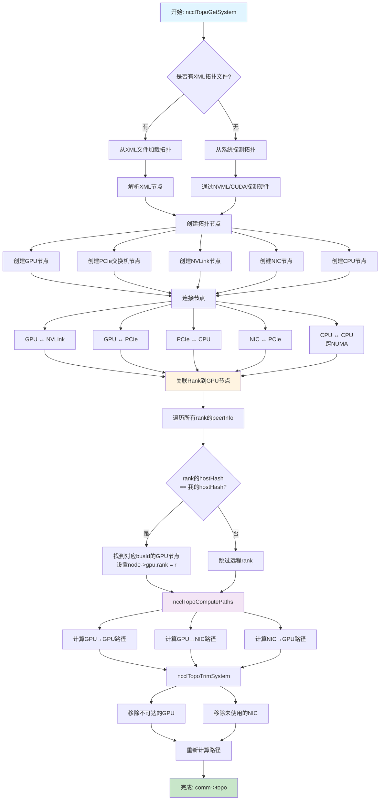

**具体例子：4 个 GPU，2 个节点，有 NVLink 和 PCIe**

假设我们有：
- **Node A**：GPU0（rank 0，busId=0x0001）、GPU1（rank 1，busId=0x0002）
- **Node B**：GPU2（rank 2，busId=0x0003）、GPU3（rank 3，busId=0x0004）
- **硬件连接**：
  - Node A：GPU0 ↔ GPU1（NVLink，双向 50 GB/s）
  - Node B：GPU2 ↔ GPU3（NVLink，双向 50 GB/s）
  - 每个 GPU 通过 PCIe 3.0 x16 连接到 CPU
  - 每个节点有一个 InfiniBand NIC（通过 PCIe 连接到 CPU）

**步骤 1：加载/探测拓扑**

每个 rank 在本地执行 `ncclTopoGetSystem`。这里容易混淆的一点是：**到底是“先识别硬件再生成 XML”，还是“先有 XML 再建图”？** 结论是：**图始终是从“一份 XML”建出来的；这份 XML 要么来自文件（再被运行时信息补全），要么完全由运行时探测生成。**

**拓扑与 XML 的关系（流程）：**

1. **加载或创建 XML**
   - 若设置了环境变量 `NCCL_TOPO_FILE`，则从该路径**读取**已有 XML。
   - 否则尝试读默认路径 `/var/run/nvidia-topologyd/virtualTopology.xml`（如 nvidia-topologyd 生成）；读不到或文件为空也不报错。
   - 若最终没有任何有效 XML（`xml->maxIndex == 0`），则**在内存里创建一个空的** `<system version="...">`，作为根节点。

2. **用运行时信息填充/补全 XML**
   - **GPU**：对本机可见的每个 rank，用 `ncclTopoFillGpu(xml, busId, ...)`，根据 busId 走 `/sys` 和 NVML/CUDA，在 XML 里创建或找到对应的 `cpu → pci → gpu` 树，并写入 `rank`、`keep`、`gdr` 等属性。
   - **NIC**：对本机每个网卡（CollNet 与普通 NET），用 `ncclTopoFillNet(xml, pciPath, name, ...)`，在 XML 里创建或找到 `pci → nic → net`，并写入 `speed`、`port`、`gdr`、`latency` 等。
   - 也就是说：**无论 XML 最初来自文件还是空壳，都会被“探测结果”填充或覆盖关键字段**；文件里的 XML 更像是“骨架”，运行时填的是 rank、带宽、GDR 等。

3. **修剪与可选导出**
   - 对 XML 做 `ncclTopoTrimXml`：只保留 `keep=1` 的节点（本机用不到的 GPU/NIC 等会被删掉）。
   - 若设置了 `NCCL_TOPO_DUMP_FILE`，则把当前这份 XML **写出到文件**（相当于“识别后生成/更新 XML”的产物，便于调试或复现）。

4. **从 XML 建内存图**
   - 最后**始终**调用 `ncclTopoGetSystemFromXml(xml, system)`，根据当前这份 XML 解析出 `ncclTopoSystem`（节点 + 边、带宽等），即**依据 XML 建图**。

因此：**不是“识别后生成 XML 图”和“依据 XML 建图”二选一，而是“先得到/补全一份 XML，再依据这份 XML 建图”；XML 可以来自文件（再被探测补全），也可以完全由探测生成。**

**拓扑 XML 的大致格式（NCCL 内部使用）：**

根节点为 `<system version="...">`，其下是 CPU 和 PCI 的层级，GPU、NIC 挂在 PCI 下，NVLink 挂在 GPU 下。结构可简化为：

```xml
<system version="...">
  <cpu numaid="0" arch="x86_64" affinity="..." vendor="..." familyid="..." modelid="...">
    <pci busid="0000:00:00.0" class="0x06" link_speed="16.0 GT/s PCIe" link_width="16">
      <pci busid="0000:01:00.0" ...>
        <gpu dev="0" sm="80" rank="0" keep="1" gdr="1"/>
      </pci>
      <pci busid="0000:02:00.0" ...>
        <gpu dev="1" sm="80" rank="1" keep="1" gdr="1">
          <nvlink target="0000:01:00.0" count="2"/>
        </nvlink>
      </pci>
      <pci busid="0000:03:00.0" ...>
        <nic>
          <net name="mlx5_0" speed="100" port="1" gdr="1" latency="..." guid="..." maxconn="..."/>
        </nic>
      </pci>
    </pci>
  </cpu>
  <!-- 更多 cpu 节点（如多 NUMA） -->
</system>
```

- **system**：根，`version` 为拓扑 XML 版本号。
- **cpu**：对应 NUMA 节点，`numaid`、`arch`、`affinity`、`vendor`、`familyid`、`modelid` 等用于 CPU 亲和与架构判断。
- **pci**：PCIe 设备或交换机，`busid` 为 PCI 总线号，`link_speed` / `link_width` 用于算 PCIe 带宽；可嵌套（交换机下挂设备）。
- **gpu**：挂在对应 `pci` 下，`dev` 为 CUDA 设备号，`sm` 为计算能力，`rank` / `keep` / `gdr` 由运行时填充。
- **nvlink**：挂在 `gpu` 下，`target` 为对端 GPU 的 busid，`count` 为链路数，用于建 NVLink 边。
- **nic** / **net**：网卡挂在对应 `pci` 下，`net` 的 `name`、`speed`、`port`、`gdr`、`latency`、`guid`、`maxconn` 等由运行时从 `ncclNetGetProperties` 等填入。

实际文件（如 nvidia-topologyd 的 `virtualTopology.xml`）会包含更多 PCI 层级和属性；上面是“建图所用”的最小理解结构。

**小结：**

- **图是怎么来的**：始终是**依据当前这份 XML 建出来的**（`ncclTopoGetSystemFromXml`）。
- **XML 是怎么来的**：要么从文件读入（再被运行时探测**补全**），要么从空 `<system>` 起**完全由运行时探测生成**（/sys、NVML、CUDA、ncclNet 等），必要时再通过 `NCCL_TOPO_DUMP_FILE` 导出为文件。

---

- **从 XML 或系统探测**（与上面一致）：
  - 若存在 `/var/run/nvidia-topologyd/virtualTopology.xml` 或 `NCCL_TOPO_FILE` 指定文件，则从该 XML **加载**，再被运行时**填充/覆盖** rank、带宽、GDR 等。
  - 若无有效 XML，则从空 `<system>` 起**完全通过 NVML/CUDA 与 /sys 等探测**生成整棵 XML，再**依据这份 XML 建图**。

- **探测到的硬件**（以 rank 0 为例）：
  ```
  本地硬件：
  - GPU0 (busId=0x0001) - 我的GPU
  - GPU1 (busId=0x0002) - 同节点的另一个GPU
  - PCIe Switch (busId=0x0000) - PCIe根交换机
  - CPU0 (NUMA node 0)
  - NIC0 (InfiniBand, busId=0x0005)
  
  连接关系：
  - GPU0 ↔ GPU1: NVLink (50 GB/s)
  - GPU0 → PCIe Switch: PCIe 3.0 x16 (16 GB/s)
  - GPU1 → PCIe Switch: PCIe 3.0 x16 (16 GB/s)
  - PCIe Switch → CPU0: PCIe 3.0 x16
  - NIC0 → PCIe Switch: PCIe 3.0 x8 (8 GB/s)
  ```

**单机硬件拓扑图（Mermaid，支持 Mermaid 的编辑器可渲染）：**

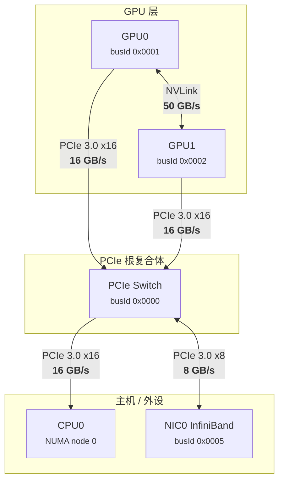

**单机 ASCII 拓扑图（纯文本，各路径已标带宽）：**

```
                              ┌─────────────────┐
                              │     GPU0        │
                              │  busId 0x0001   │
                              └────────┬────────┘
                                       │
              NVLink 50 GB/s           │  PCIe 3.0 x16  16 GB/s
         ◀─────────────────────────────┼───────────────────────────▶
              （GPU-GPU 最优路径）      │
                                       │
                              ┌────────┴────────┐
                              │     GPU1        │
                              │  busId 0x0002   │
                              └────────┬────────┘
                                       │
                                       │  PCIe 3.0 x16  16 GB/s
                                       ▼
                              ┌─────────────────┐
                              │  PCIe Switch    │
                              │  busId 0x0000   │
                              └────────┬────────┘
                    ┌──────────────────┼──────────────────┐
                    │                  │                  │
          PCIe x16  │         PCIe x8 │                  │
          16 GB/s   │         8 GB/s  │                  │
                    ▼                  ▼                  │
             ┌──────────┐      ┌──────────────┐          │
             │  CPU0    │      │  NIC0 (IB)   │          │
             │ NUMA 0   │      │  8 GB/s 上行 │          │
             └──────────┘      └──────────────┘          │
                                                          │
                                               （其他 PCIe 设备）
```

---

**双机（两节点）硬件拓扑图**

两机时：每台机器是独立的一颗“单机拓扑”；节点间通过 InfiniBand（或以太网）把两台机器的 NIC 连在一起，形成跨机通信路径。图中**每条链路均标注带宽**，便于理解多机瓶颈。

**双机 Mermaid 图（含路径带宽）：**

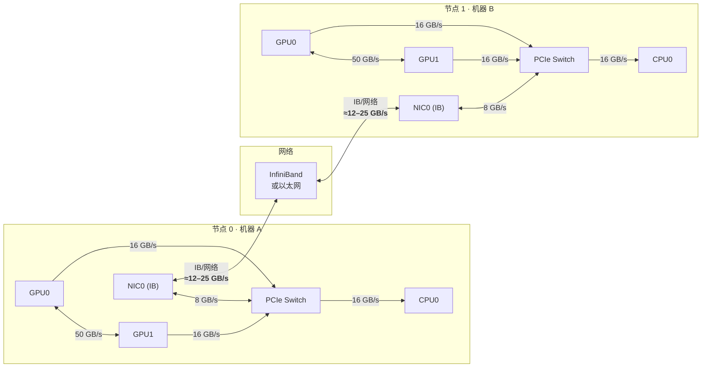

**双机 ASCII 图（各路径带宽已标）：**

```
┌─ 节点 0（机器 A） ───────────────────────────────────────────────────────────────────────┐
│                                                                                           │
│     GPU0 ◀──────── 50 GB/s (NVLink) ────────▶ GPU1                                        │
│       │                                          │                                         │
│       │ 16 GB/s                                  │ 16 GB/s                                 │
│       ▼                                          ▼                                         │
│     ┌─────────────────────────────────────────────────┐                                    │
│     │              PCIe Switch                        │                                    │
│     └────────────────────┬────────────────────────────┘                                    │
│              16 GB/s     │     8 GB/s                                                      │
│       ┌──────────────────┴──────────────────┐                                              │
│       ▼                                      ▼                                              │
│    CPU0                                  NIC0 (IB) ──────────────┐                          │
│                                                                   │                          │
└───────────────────────────────────────────────────────────────────│──────────────────────────┘
                                                                    │
                          InfiniBand / 网络  ≈12–25 GB/s（典型）    │
                                                                    │
┌───────────────────────────────────────────────────────────────────│──────────────────────────┐
│                                                                   │                          │
│  节点 1（机器 B）                                    NIC0 (IB) ◀───┘                          │
│                                                       │  8 GB/s                              │
│     GPU0 ◀──────── 50 GB/s (NVLink) ────────▶ GPU1    │                                       │
│       │                                          │    ▼                                       │
│       │ 16 GB/s                                  │  ┌─────────────────────────────────────┐   │
│       ▼                                          ▼  │         PCIe Switch                │   │
│     ┌─────────────────────────────────────────────────┐  └─────────────┬───────────────────┘   │
│     │              PCIe Switch                        │◀─────────────┘                       │
│     └────────────────────┬────────────────────────────┘       │ 16 GB/s                       │
│              16 GB/s     │                                                                   │
│       ┌──────────────────┴──────────────────┐                                                │
│       ▼                                      ▼                                                │
│    CPU0                                  （其他 PCIe 设备）                                    │
│                                                                                               │
└───────────────────────────────────────────────────────────────────────────────────────────────┘
```

**路径性能小结：**

| 路径类型           | 带宽（典型）   | 说明 |
|--------------------|----------------|------|
| GPU ↔ GPU（NVLink）| **50 GB/s**    | 单机内最优，NCCL 优先选此路径 |
| GPU ↔ PCIe Switch | **16 GB/s**    | PCIe 3.0 x16 单向 |
| NIC ↔ PCIe Switch | **8 GB/s**     | PCIe 3.0 x8，跨机上行受此限制 |
| 跨机 NIC ↔ 网络    | **≈12–25 GB/s**| InfiniBand 100G/200G 等，多机瓶颈常在此 |

**PCIe 与 NIC 带宽关系说明（为何图中 PCIe→NIC 低于网卡端口？）**

图中把「PCIe Switch → NIC」标成 **8 GB/s**（PCIe 3.0 x8），而典型网卡端口是 **100G（≈12.5 GB/s）**，看起来 PCIe 段比网卡“慢”，容易产生疑惑。说明如下。

1. **单位统一**
   - 网卡说的 **100G** 一般是 **100 Gb/s**（比特/秒）→ 换算成字节约 **12.5 GB/s**。
   - PCIe 带宽按 **GB/s** 更直观：PCIe 3.0 x8 ≈ 8 GB/s，x16 ≈ 16 GB/s；PCIe 4.0 x8 ≈ 16 GB/s，x16 ≈ 32 GB/s。

2. **为何图中 PCIe→NIC 会低于网卡端口？**
   - 图中采用的是 **PCIe 3.0 x8 接网卡** 的典型假设，即 PCIe 到 NIC 只有 **8 GB/s**。
   - 此时 **瓶颈在主机侧**：数据从 CPU/GPU 经 PCIe 到 NIC 最多 8 GB/s，NIC 的 100G 端口在这条路径上**跑不满**。
   - 这不是图画错，而是刻意表示「PCIe 带宽不足」的配置，用于说明多机时 **PCIe→NIC 或 NIC↔网络 其中一段可能成为瓶颈**。

3. **“PCIe 要能支撑网卡”的理解**
   - 正确理解：要真正发挥 100G 网卡，PCIe 至少应提供 **≥12.5 GB/s**（例如 PCIe 3.0 x16 或 PCIe 4.0 x8）。
   - 若插槽是 PCIe 3.0 x8（8 GB/s），则 PCIe→NIC 段就是瓶颈，图中把该段标为 8 GB/s 即表示这种配置。
   - 若使用 PCIe 4.0 x8/x16（16/32 GB/s），则可将该路径标为更高带宽，并注明「可支撑 100G/200G NIC」。

4. **小结**
   - 图中 **PCIe Switch → NIC = 8 GB/s** 表示 PCIe 3.0 x8 插槽，在该配置下确实低于 100G 网卡的 12.5 GB/s，用于体现瓶颈位置。
   - 你的理解「PCIe 带宽应 ≥ 网卡端口速率才能支持网卡」是对的；图中展示的是未满足该条件时的典型情况。

**要点（多机时）：**

- 每个节点内部：拓扑与单机相同（GPU、PCIe Switch、CPU、NIC 及 NVLink/PCIe 连接）。
- 跨机路径：本机 GPU → PCIe → 本机 NIC → 网络 → 对端 NIC → 对端 PCIe → 对端 GPU。
- NCCL 会为每条“本机 GPU ↔ 本机 NIC”和“NIC ↔ 网络”建链、算带宽，用于多机 AllReduce 等选路。

---

**步骤 2：创建拓扑节点**

NCCL 在内存中创建 `ncclTopoSystem` 结构：

```c
struct ncclTopoSystem {
  struct ncclTopoNodeSet nodes[6];  // GPU, PCI, NVS, CPU, NIC, NET
  float maxBw;
  float totalBw;
};
```

每个节点类型都有独立的节点数组：

```
nodes[GPU]: [GPU0, GPU1]           // 本地探测到的GPU
nodes[PCI]: [PCIe Switch]          // PCIe交换机
nodes[CPU]: [CPU0]                 // CPU节点
nodes[NIC]: [NIC0]                 // 网络接口卡
nodes[NET]: [NET0]                 // 网络抽象节点
```

**步骤 3：连接节点（构建拓扑图）**

根据物理连接关系，调用 `ncclTopoConnectNodes`：

```
GPU0 --[NVLink, 50GB/s]--> GPU1
GPU0 --[PCIe, 16GB/s]--> PCIe Switch
GPU1 --[PCIe, 16GB/s]--> PCIe Switch
PCIe Switch --[PCIe, 16GB/s]--> CPU0
NIC0 --[PCIe, 8GB/s]--> PCIe Switch
```

**步骤 4：关联 Rank 到 GPU 节点**

此时已经通过 AllGather1 获得了所有 rank 的 `peerInfo`：

```c
// comm->peerInfo 数组（每个rank都有完整副本）
peerInfo[0] = { rank=0, hostHash=H_A, busId=0x0001, ... }
peerInfo[1] = { rank=1, hostHash=H_A, busId=0x0002, ... }
peerInfo[2] = { rank=2, hostHash=H_B, busId=0x0003, ... }
peerInfo[3] = { rank=3, hostHash=H_B, busId=0x0004, ... }
```

在 `ncclTopoGetSystem` 中（`src/graph/topo.cc:614-624`）：

```c
// 遍历所有rank的peerInfo
for (int r=0; r<comm->nRanks; r++) {
  // 只处理同节点的rank（hostHash相同）
  if (comm->peerInfo[r].hostHash == comm->peerInfo[comm->rank].hostHash) {
    // 根据busId找到对应的GPU节点
    char busId[NVML_DEVICE_PCI_BUS_ID_BUFFER_SIZE];
    int64ToBusId(comm->peerInfo[r].busId, busId);
    struct ncclXmlNode* node;
    ncclTopoFillGpu(xml, busId, &node);
    
    // 关联rank到GPU节点
    xmlSetAttrInt(node, "rank", r);  // node->gpu.rank = r
  }
}
```

**结果**（以 rank 0 的视角）：
- `nodes[GPU][0]`（GPU0，busId=0x0001）→ `gpu.rank = 0`
- `nodes[GPU][1]`（GPU1，busId=0x0002）→ `gpu.rank = 1`
- rank 2 和 rank 3 的 GPU **不在本地拓扑中**（它们在 Node B）

**步骤 5：计算路径（`ncclTopoComputePaths`）**

**5.1 路径是“谁到谁”、算的是什么？**

- **不是**“只算从本 rank 到其他 rank 的性能”。  
- **是**：在**本机拓扑**（`ncclTopoSystem`）里，对**所有类型的节点**（CPU、GPU、NET）做**全对全**的路径计算。  
- 本机拓扑里只有**本机可见的 GPU 和 NIC**（同 `hostHash` 的 rank 对应的 GPU + 本机网卡），没有其他机器上的 GPU。因此：
  - **本 rank 到同机其他 rank**：对应本机拓扑里 **GPU → GPU** 的路径（和带宽）。
  - **本 rank 到跨机 rank**：在本机拓扑里只算到 **GPU → NIC**；跨机段由网络和后续 channel/search 处理，不在这里算“到远程 GPU”的整条路径。

**5.2 路径性能是怎么算出来的？**

- 对每个**起点**（每个 CPU、每个 GPU、每个 NET），用 **BFS** 从该起点向外扩展，得到它到**所有其他节点**的路径。
- 每扩展一条边时：
  - **路径带宽** = `min(当前路径带宽, 本条边的带宽)`，即整条路径的**瓶颈带宽**。
  - **路径类型** = 根据经过的边类型和是否经 CPU 等，标成 PATH_NVL / PATH_PIX / PATH_PHB / PATH_PXB / PATH_NET 等。
  - **跳数** = 路径上的边数。
- 若存在多条可达路径，会选**带宽更优**或**跳数更少**的更新（具体见 `ncclTopoSetPaths` 中的 `remPath->bw < bw` 与 `remPath->count > path->count` 条件）。

因此：**“路径性能”= 从起点到终点的整条路径的瓶颈带宽（及类型、跳数）**，不是“本 rank 到其他 rank 的端到端延迟”，也不是跨机整条链路的带宽（跨机只算到本机 NIC）。

**5.3 谁到谁、存哪儿？**

- 每个节点（如 GPU_i）有一个 **paths[类型][下标]** 的二维结构：  
  `paths[GPU][j]` = 从该节点到第 j 个 GPU 的路径（带宽、跳数、类型）；  
  `paths[NET][n]` = 到第 n 个 NET（NIC）的路径；同理有到 CPU 的路径。
- 所以是 **“每个起点 → 到所有终点”** 的预计算表，供后续 **ncclTopoCompute**（建 ring/tree、选 channel）时查：任意两个本机 GPU 之间、任意 GPU 到任意本机 NIC 的带宽和路径类型都知道。

**5.4 P2P 与 GDR 是什么？为何“无”时要特别处理？**

先弄清两个概念，再说明为何要单独处理“无 P2P”“无 GDR”的情况。

**P2P（GPU Peer-to-Peer）**

- **含义**：两块 GPU 之间**直接**传数据，**不经过 CPU 内存**。
- **典型实现**：
  - **NVLink**：同机多卡，GPU 间有 NVLink 或 NVSwitch 时，走专用链路，带宽高、延迟低。
  - **PCIe P2P**：同一 PCIe 域内，一块 GPU 可直接 DMA 访问另一块 GPU 的显存（`cudaDeviceEnablePeerAccess`），不经过 CPU 拷贝。
- **无 P2P 时**：拓扑/驱动不允许直连（例如不同机器、或 PCIe 拓扑/策略不允许），则数据只能 **GPU → 拷到 CPU 内存 → 再拷到另一块 GPU**（或经网络到对端），即路径必须**经 CPU 中转**。带宽和延迟都差很多，所以 NCCL 在算路径时会把这类 GPU 对改成“经 CPU”的路径；若连 SHM（共享内存）也没有，则标为不可达。

**GDR（GPUDirect RDMA / GPU Direct RDMA）**

- **含义**：网卡（NIC）可以直接 **DMA 读/写 GPU 显存**，**不经过 CPU 内存**。
- **有 GDR 时**：路径是 **GPU ↔（PCIe）↔ NIC ↔ 网络**，数据在 GPU 与网卡之间直通，CPU 不参与拷贝。
- **无 GDR 时**：网卡只能访问主机内存，不能直接访问显存。数据必须 **GPU → 拷到 CPU 内存 → 再交给 NIC 发出**（收方向同理），即路径必须**经 CPU 中转**（GPU → CPU → NIC 或 NIC → CPU → GPU）。同样会显著增加延迟、占用 CPU 和内存带宽，所以 NCCL 在算“GPU 到 NIC”的路径时，会为无 GDR 的 GPU–NIC 对插入经 CPU 的路径。

**为何要“特别处理”？**

- **有 P2P / 有 GDR**：路径是“直连”（GPU–GPU 或 GPU–NIC），带宽高、跳数少，NCCL 直接使用这些路径即可。
- **无 P2P / 无 GDR**：物理上不能直连，**必须**走 CPU 中转；若不显式把路径改成“经 CPU”，拓扑里就会错误地以为还能直连，导致建链或选 channel 时假设了不存在的带宽。因此需要**单独分支**：在路径计算里把“无 P2P”的 GPU 对改成经 CPU 的路径，把“无 GDR”的 GPU–NIC 对改成经 CPU 的路径，这样后续搜索（ring/tree、channel）才会按真实可达路径和带宽来选。

**5.5 无 P2P / 无 GDR 时的具体处理**

- **GPU 对无 P2P**：路径会改为经 **CPU 中转**（GPU → PCIe → CPU → PCIe → GPU）；若既无 P2P 也无 SHM，则该 GPU 对在本机拓扑里被标为**不可达**（path count=0），后续 Trim 会删掉。
- **GPU 到 NIC 无 GDR**：路径会经 **CPU 中转**（GPU → CPU → NIC 或 NIC → CPU → GPU）。
- **PXN**（经另一块 GPU 到 NIC）：若开启且存在更优路径，会为 GPU→NIC 插入“经某块 GPU 中转”的路径。

**5.6 小结**

- **计算范围**：本机拓扑内，CPU/GPU/NET 的**全对全**路径（不是“只算本 rank 到其他 rank”）。
- **性能含义**：每条路径的**瓶颈带宽**（min 沿路链路带宽）+ 路径类型 + 跳数。
- **用途**：为后续建图（ring/tree）、选 channel 提供“任意两本机节点间带宽与路径类型”，从而优先选 NVLink、避免经 CPU 等。

---

对每个 GPU 节点，计算到所有其他 GPU 和 NIC 的最优路径（如上所述，仅限本机拓扑内）。下面表格是**单机两卡 + 一 NIC** 时，以 GPU0 为起点的路径示例（多机时本机拓扑不含其他节点的 GPU，故无“GPU0→GPU2/GPU3”的本地路径）：

**GPU0 的路径表**（示例：单机 2 GPU + 1 NIC）：

| 目标 | 路径类型 | 路径 | 带宽 | 跳数 |
|------|---------|------|------|------|
| GPU1 | PATH_NVL | GPU0 →[NVLink]→ GPU1 | 50 GB/s | 1 |
| GPU2 | PATH_NET | GPU0 →[PCIe]→ PCIe →[PCIe]→ CPU →[PCIe]→ NIC →[IB]→ 网络 →[IB]→ NIC →[PCIe]→ CPU →[PCIe]→ PCIe →[PCIe]→ GPU2 | 8 GB/s | 7 |
| GPU3 | PATH_NET | GPU0 →[PCIe]→ PCIe →[PCIe]→ CPU →[PCIe]→ NIC →[IB]→ 网络 →[IB]→ NIC →[PCIe]→ CPU →[PCIe]→ PCIe →[PCIe]→ GPU3 | 8 GB/s | 7 |
| NIC0 | PATH_PIX | GPU0 →[PCIe]→ PCIe →[PCIe]→ NIC | 8 GB/s | 3 |

多机时，本机拓扑中**没有** GPU2、GPU3（它们在另一台机器上）；`ncclTopoComputePaths` 只算本机内的路径，因此不会有“GPU0→GPU2”的 path 表项。跨机时，到 rank2/rank3 的流量是“GPU0→NIC0→网络→对端”，对端 NIC/GPU 由 channel 与 transport 处理；上表若写出 GPU2/GPU3 行，仅为**逻辑上的端到端示意**，不是 `paths[GPU][.]` 里实际存储的内容。

**路径类型说明**：
- **PATH_NVL**：NVLink 直连（最快，同节点 GPU 之间）
- **PATH_PIX**：PCIe 路径（同节点内，GPU 到 NIC）
- **PATH_NET**：网络路径（跨节点，经过 IB 网络）
- **PATH_SYS**：系统路径（跨 NUMA，经过 CPU 间互连）

**步骤 6：修剪拓扑（`ncclTopoTrimSystem`）**

移除不可达的 GPU 和未使用的 NIC：

- 如果某个 GPU 无法到达任何其他 GPU → 移除
- 如果某个 NIC 没有被任何 GPU 使用 → 移除

**步骤 7：重新计算路径**

修剪后，重新计算所有路径（因为节点数量可能变化）。

---

**最终拓扑图（可视化）**：

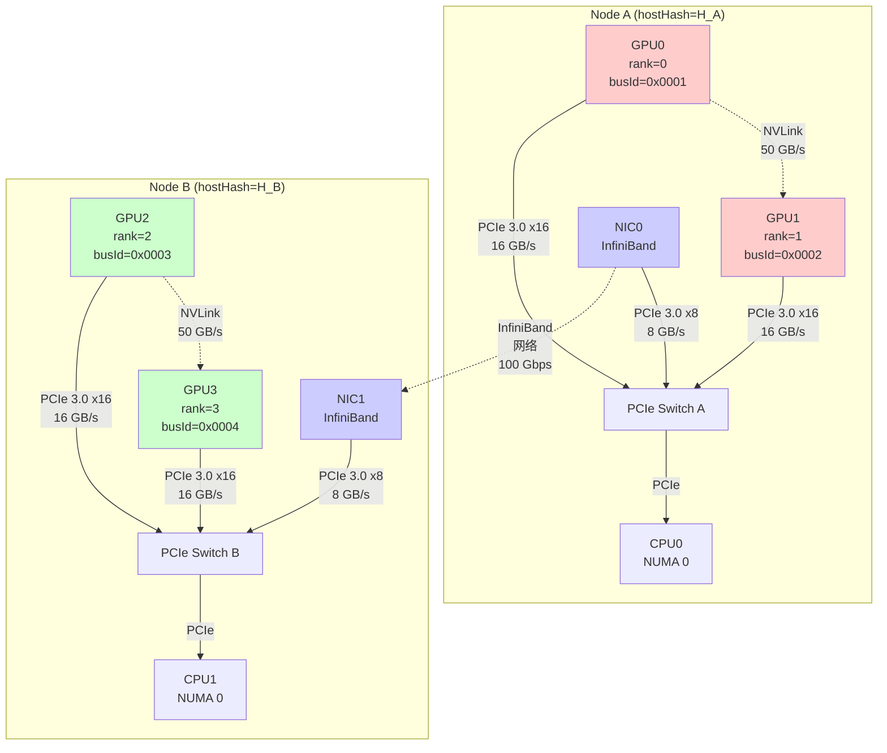

**关键点总结**：

1. **拓扑发现是本地操作**：每个 rank 只探测**本地硬件**，但通过 AllGather1 获得的 `peerInfo` 知道**所有 rank 的 GPU 位置**
2. **跨节点拓扑是“拼接”出来的**：本地拓扑 + `peerInfo` 中的 `hostHash` 和 `busId` → 知道哪些 GPU 在远程节点
3. **路径计算是全局的**：虽然每个 rank 只看到本地硬件，但路径计算会考虑**所有 rank 的 GPU**（通过 `peerInfo` 关联）
4. **路径类型决定传输方式**：
   - PATH_NVL → 使用 P2P（NVLink）
   - PATH_PIX → 使用 P2P（PCIe）或 SHM
   - PATH_NET → 使用 NET（IB/Socket）

**路径计算与传输方式选择示例**：

假设 rank 0 要和 rank 1、rank 2 通信：

| 通信对 | 路径类型 | 路径详情 | 选择的传输方式 | 原因 |
|--------|---------|---------|---------------|------|
| rank 0 → rank 1 | PATH_NVL | GPU0 →[NVLink]→ GPU1 | **P2P (NVLink)** | 同节点，NVLink 直连，带宽最高（50 GB/s） |
| rank 0 → rank 2 | PATH_NET | GPU0 →[PCIe]→ NIC →[IB]→ 网络 →[IB]→ NIC →[PCIe]→ GPU2 | **NET (IB)** | 跨节点，必须走网络，带宽受 IB 限制（100 Gbps ≈ 12.5 GB/s） |
| rank 0 → rank 1（如果NVLink不可用） | PATH_PIX | GPU0 →[PCIe]→ PCIe Switch →[PCIe]→ GPU1 | **P2P (PCIe)** 或 **SHM** | 同节点但无NVLink，走PCIe路径，如果同进程则用SHM更快 |

**代码中的路径类型定义**（`src/graph/topo.h`）：

```c
#define PATH_LOC 0  // Local (same GPU)
#define PATH_NVL 1  // NVLink
#define PATH_NVB 2  // NVLink via NVSwitch
#define PATH_PIX 3  // PCIe (same node)
#define PATH_PXB 4  // PCIe via PCIe bridge
#define PATH_PXN 5  // PCIe via NUMA
#define PATH_PHB 6  // PCIe via PHB
#define PATH_SYS 7  // System (cross NUMA)
#define PATH_DIS 7  // Disconnected
```

**路径选择算法**（简化版，`src/graph/paths.cc`）：

```c
// 对每个GPU，计算到所有其他GPU的路径
for (每个GPU g) {
  for (每个GPU p) {
    if (g == p) {
      路径类型 = PATH_LOC;  // 自己到自己
    } else if (有NVLink直连) {
      路径类型 = PATH_NVL;  // NVLink最快
    } else if (同节点 && 有PCIe路径) {
      路径类型 = PATH_PIX;  // PCIe路径
    } else if (跨节点) {
      路径类型 = PATH_NET;  // 必须走网络
    } else {
      路径类型 = PATH_DIS;  // 不可达
    }
  }
}
```

**实际路径计算示例**（rank 0 的视角）：

```
GPU0 到 GPU1 的路径：
  类型: PATH_NVL
  路径: [GPU0] --NVLink(50GB/s)--> [GPU1]
  跳数: 1
  总带宽: 50 GB/s

GPU0 到 GPU2 的路径：
  类型: PATH_NET
  路径: [GPU0] --PCIe(16GB/s)--> [PCIe Switch] --PCIe--> [CPU] 
        --PCIe--> [NIC0] --IB(12.5GB/s)--> [网络] 
        --IB(12.5GB/s)--> [NIC1] --PCIe--> [CPU] 
        --PCIe--> [PCIe Switch] --PCIe(16GB/s)--> [GPU2]
  跳数: 7
  总带宽: 12.5 GB/s (瓶颈在IB网络)

GPU0 到 NIC0 的路径：
  类型: PATH_PIX
  路径: [GPU0] --PCIe(16GB/s)--> [PCIe Switch] --PCIe(8GB/s)--> [NIC0]
  跳数: 3
  总带宽: 8 GB/s (瓶颈在NIC的PCIe连接)
```

**拓扑信息如何被后续使用**：

拓扑发现完成后，`comm->topo` 会被用于：

1. **算法选择**（`ncclTopoCompute`）：
   - 根据拓扑计算 Ring/Tree 图
   - 选择最优的通信路径（优先使用 NVLink，其次 PCIe，最后网络）

2. **传输方式选择**（`selectTransport`）：
   - 根据路径类型（PATH_NVL/PATH_PIX/PATH_NET）选择 P2P/SHM/NET
   - 例如：PATH_NVL → `p2pTransport.canConnect` 返回 true → 使用 P2P

3. **性能调优**：
   - 根据路径带宽设置 `buffSizes[]`（不同协议的缓冲区大小）
   - 根据路径延迟设置 `threadThresholds[]`（算法切换阈值）

**完整数据流**：

```
AllGather1 (收集所有rank的peerInfo)
  ↓
ncclTopoGetSystem (探测本地硬件拓扑)
  ↓
关联rank到GPU节点 (通过peerInfo中的busId)
  ↓
ncclTopoComputePaths (计算所有GPU/NIC之间的路径)
  ↓
ncclTopoTrimSystem (移除不可达节点)
  ↓
ncclTopoComputePaths (重新计算路径)
  ↓
comm->topo 就绪
  ↓
ncclTopoCompute (根据拓扑计算Ring/Tree图)
  ↓
ncclTransportP2pSetup (根据拓扑选择传输方式)
  ↓
建立实际连接 (P2P/SHM/NET)
```

---

#### 阶段 5：路径计算与算法选择

**一句话**：阶段 5 只做一件事——**定好“谁和谁要连、连几条线”**，为后面的真正建链（阶段 6）提供“通讯录”；不选具体用 P2P 还是网卡，只定“谁和谁相邻、用几条通道”。

**用最简单的话说**：

1. **路径计算**：先算清楚“从任意一块 GPU 到另一块 GPU、或到网卡”这条路上**最窄的那一段有多宽**（瓶颈带宽）。例如：GPU0 到 GPU1 走 NVLink 有 50，GPU0 到 rank2 要经过网卡，整条路最窄 8，就记成 8。
2. **算法选择**：根据这些带宽，给**环（Ring）**和**树（Tree）**各定一套“谁和谁相邻、开几条通道”。例如：定成 1 条通道，环的顺序是 0→1→2→3→0，那 rank0 的“上一个”是 3、“下一个”是 1；rank1 的“上一个”是 0、“下一个”是 2，以此类推。阶段 6 会按这个“上一个/下一个”去真正建链（选 P2P 还是网卡）。

**一个具体例子（4 个 rank，2 台机）**：

- **输入**：拓扑已经知道——rank0、rank1 在机器 A，rank2、rank3 在机器 B；rank0↔rank1 之间很快（NVLink），rank0↔rank2 要经过网卡，比较慢。
- **路径计算**：得到“0↔1 带宽高、0↔2 带宽低”这样的表。
- **算法选择（环）**：决定用 1 条通道，环的顺序是 **0 → 1 → 2 → 3 → 0**。于是：
  - rank0：上一个=3，下一个=1  
  - rank1：上一个=0，下一个=2  
  - rank2：上一个=1，下一个=3  
  - rank3：上一个=2，下一个=0  
- **输出**：每个 rank 都知道自己在这条环上“上一个是谁、下一个是谁”；阶段 6 会按这个去和“上一个”“下一个”建一条连接（同机用 P2P/共享内存，跨机用网卡）。

**关键点**：
- **Channel（通道）**：可以理解成“几条并行的环”。1 个 channel = 一条环；2 个 channel = 两条环，每条环上都有 0→1→2→3→0，数据可以分摊到两条环上。
- **Ring**：就是“围成一圈”，每人只和左边、右边两个人连；AllReduce 等会用这种结构。
- **Tree**：就是“树形”，有人当父节点、有人当子节点；Reduce/Broadcast 等会用。阶段 5 也会给 Tree 定好“谁的父是谁、谁的孩子是谁”。

**环与 Channel 举例（帮助理解“环是不是完整一圈”）**：

- **环 = 完整的一个圈**：所有参与 rank 围成一圈，**首尾相连**。例如 4 个 rank 的一条环就是：0 → 1 → 2 → 3 → **回到 0**。所以“环”指的就是这一整条闭合的圈，不是半圈或一段。
- **1 个 Channel = 一条这样的完整圈**：只有一条环时，所有数据都在这条圈上依次传递。例如 AllReduce 时，数据沿 0→1→2→3→0 转一圈完成。
- **2 个 Channel = 两条完整的圈，数据分摊**：两条圈在**逻辑上**可以是同样的顺序（都是 0→1→2→3→0），但：
  - **数据分摊**：例如要 AllReduce 一块 8MB 的 buffer，Channel 0 负责前半段 4MB 在这条圈上传，Channel 1 负责后半段 4MB 在另一条圈上传，两条圈同时跑，总吞吐约等于单条圈的两倍。
  - **物理上**：两条圈可能走不同链路（如一条多走 NVLink、一条多走 PCIe），减轻单条链路的压力。
- **图示（4 rank，2 channel）**：
  - Channel 0：环 A = 0→1→2→3→0（完整一圈），传一部分数据。
  - Channel 1：环 B = 0→1→2→3→0（同样是完整一圈），传另一部分数据。
  所以“几条并行的环” = 多个**完整的圈**在并行工作，每个圈都包含所有 rank，只是把要传的数据分给不同的圈。

**为什么要有环？——从第一性原理看**：

- **要解决的问题**：N 块 GPU，每块有一份数据；要做 **AllReduce**——最后每块 GPU 上的结果都一样（例如“所有 GPU 上数据的和”）。本质是：**把 N 份数据聚合成一份，再广播回 N 份**。
- **朴素做法的问题**：若让每块 GPU 都直接和其余 N-1 块通信，需要 N×(N-1) 条连接、协调复杂，且容易在某几个节点形成带宽瓶颈（例如都经过某一台交换机）。
- **环的目的**：用**最少连接、无单点瓶颈**的方式完成上述聚合+广播。
  - **最少连接**：每人只和**左边一个、右边一个**邻居连（prev/next），共 N 条边围成一圈，连接数从 O(N²) 降到 O(N)。
  - **无单点瓶颈**：数据在环上**流水线式**传递，每条边同时在工作，没有“根节点”或“中心节点”被所有人挤爆；理论上有证明，在只靠相邻传递的前提下，环结构的 AllReduce 能达到**带宽利用上的最优**（每块 GPU 大约只收发 2 倍数据量）。
- **一句话**：环的存在，是为了在**只和左右邻居说话**的前提下，用**流水线**完成“大家的数据聚到一起再发回大家”，并尽量吃满每条链路的带宽。

**所有的环都是一样的吗？**：

- **不一定**。分两种情况理解：
  1. **多条 channel、顺序相同**：很多配置下，多条 channel 会用**同一种环顺序**（例如都是 0→1→2→3→0），这时“环的形状”一样，只是**数据分摊**到多条环上并行传，提高吞吐。
  2. **多条 channel、顺序不同**：NCCL 也会根据拓扑**给不同 channel 选不同的环顺序**（例如 channel0：0→1→2→3→0，channel1：0→2→1→3→0），让不同环走不同的物理链路（如一条多走 NVLink、一条多走 PCIe），避免所有流量挤在同几条链路上。所以**环的“谁和谁相邻”可以不同**，目的是均衡带宽。
- **小结**：环不要求“所有 channel 完全同一个顺序”；可以一样（简单分摊数据），也可以故意不一样（利用不同链路，提升整体带宽）。

**什么决定要多少个环？**：

- **输入约束**：`minChannels`（init 里 ring 设为 1）、`maxChannels`（ring 为 MAXCHANNELS/2）；tree 的 maxChannels 等于 ring 的 nChannels，保证 Ring 和 Tree 用同一套 channel 数。
- **搜索过程**：`ncclTopoCompute` 里用**回溯搜索**（ncclTopoSearchRec）：从 0 条 channel 开始，每找到一条**合法环**（满足带宽与路径类型约束、跨机时 NIC 的 maxChannels 未用尽）就 `nChannels++`，再继续搜下一条环；直到 `nChannels` 达到 `maxChannels` 或**超时**。每条环都要在拓扑上“走通”且满足 bwIntra/bwInter、typeIntra/typeInter。
- **“好不好”的标准**：`ncclTopoCompareGraphs` 比较当前解和已保存解——优先 **nChannels×bwIntra 更大**（更多通道且单机带宽不降），其次 **nHops 更少**。所以是在“尽量多 channel、尽量高带宽、尽量少跳数”之间搜索。
- **其他因素**：单机 NVLink 时 `ncclTopoGetNchannels` 会按 path->bw/nvlBw 算“建议 channel 数”；跨机用环境变量 `NCHANNELS_PER_NET_PEER`（默认 2）。init 里最终 `comm->nChannels = min(treeGraph.nChannels, ringGraph.nChannels)`，且 AllGather3 后取各 rank 的 min，保证全局一致。若 `graph->bwIntra >= 25.0`，还会把已搜到的环**复制一份**（dupChannels）把 channel 数翻倍，最多到 maxChannels，相当于“同顺序多开几条环”提吞吐。

**是否环相同（sameChannels）？**：

- **sameChannels=1（默认先试）**：多条 channel 用**同一种环顺序**。搜索时第一条环定顺序后，后续 channel 用 **Replay**：复用上一条 channel 的 GPU 顺序（`ncclTopoReplayGetGpu`），不再重新搜顺序；这样实现简单、且多条环只是“数据分摊”。
- **sameChannels=0（搜不到或未吃满 totalBw 时再试）**：允许每条 channel **不同顺序**。从不同 NIC、或不同起始 GPU 开始搜，得到不同环顺序，从而让不同环走**不同物理链路**（如一条多走 NVLink、一条多走 PCIe），减轻单条链路压力、提升整体带宽。搜索逻辑在 pass 1 里先试 sameChannels=1，超时或 `nChannels*bwInter < totalBw` 再设 `sameChannels=0` 重新搜。

**环的节点次序如何决定？**：

- **回溯 + 排序选“下一个”**：环的构造是**回溯搜索**：从某一起点（跨机时从某 NIC 连到某 GPU，单机从某 GPU）开始，每一步在“当前 GPU”上选**下一个 GPU** 接在环上；下一个候选由 `ncclTopoSearchNextGpuSort` 按**得分**排序后依次尝试。
- **得分优先级（cmpScore，从高到低）**：**interBw 大**（到 NIC 的带宽高）→ **interPciBw 大**（到 NIC 路径上的 PCI 带宽高）→ **interNhops 小**（到 NIC 跳数少）→ **intraBw 大**（单机内到该 GPU 带宽高）→ **intraNhops 小**（单机内跳数少）→ startIndex。即优先选“到网卡/到邻居带宽高、跳数少”的 GPU 作为环上的下一个节点，这样整条环的瓶颈带宽尽量高。
- **强制顺序**：**FORCED_ORDER_PCI**：按 PCI 顺序 0,1,2,... 试一遍，用作参考解；**FORCED_ORDER_REPLAY**：复用上一条 channel 的 GPU 顺序。搜索时先试 Replay（同顺序），再试 PCI 设参考，再按正常 sort 搜多种顺序。

**在做什么（稍细一点）**：本阶段分两步——**(1) 路径计算**：在拓扑图上为每对节点预计算可达路径及瓶颈带宽、类型、跳数；(2) **算法选择**：在路径已算好的前提下，为 Ring、Tree、CollNet 分别**搜索**最优的 channel 数、每 channel 的 GPU 顺序（ring 的 prev/next、tree 的 parent/child）以及 intra/inter 路径类型，得到可用的 `ncclTopoGraph`，供后续 Preset/Postset 和传输建链使用。**传输方式**（P2P、SHM、NET）的选择在阶段 6 建链时按 canConnect 决定，本阶段只产出“谁和谁在哪个 channel 上相邻”的图结构。

**阶段 5 整体流程**：

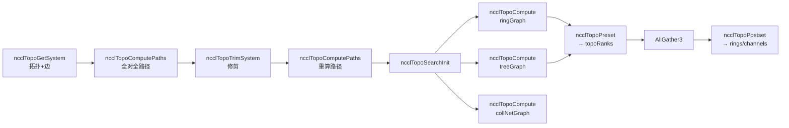

**两步分工**：

| 步骤 | 函数 | 文件 | 作用 |
|------|------|------|------|
| 路径计算 | `ncclTopoComputePaths` | paths.cc | 在 `ncclTopoSystem` 上做全对全 BFS，填满各节点的 `paths[类型][下标]`（带宽、类型、跳数）；无 P2P 时改经 CPU、无 GDR 时 GPU↔NIC 经 CPU；不可达标 count=0 |
| 算法搜索 | `ncclTopoCompute` | search.cc | 读 system 里已算好的路径，按 pattern（Ring/Tree/CollNet）搜索：channel 数、每 channel 的 GPU 顺序、intra/inter 类型与带宽约束，写出 `ncclTopoGraph`（intra/inter、nChannels、bwIntra/bwInter 等） |

**Ring / Tree / CollNet 在 init 中的用法**：

- **ringGraph**：pattern=RING，`ncclTopoCompute` 得到每个 channel 的 ring 顺序（`graph->intra` 即各 channel 的 GPU 排列），用于 AllReduce 等 ring 算法；后续 `ncclTopoPreset` 会转成 `ringPrev/ringNext`，`ncclTopoPostset` 后得到 `comm->channels[].ring.prev/next`，再交给阶段 6 建链。
- **treeGraph**：pattern=BALANCED_TREE 或 SPLIT_TREE 等，得到每 channel 的树形结构（parent/child），用于 Reduce/Broadcast 等 tree 算法；同样经 Preset/Postset 变成 `treeToParent/treeToChild0/1`，再建链。
- **collNetGraph**：pattern=TREE 且 collNet=1，在支持 CollNet 的硬件上为集合操作建专用图；若支持则建 CollNet 连接，否则退化为普通 NET/P2P。

**示例（4 rank，2 节点）**：

- 路径计算后：rank0↔rank1 同机，路径类型 PATH_NVL 或 PATH_PIX，带宽 50 或 16；rank0↔rank2 跨机，路径经 NIC，带宽受 NIC/网络限制。
- `ncclTopoCompute(ringGraph)`：可能得到 1 个 channel，ring 顺序 0→1→2→3→0（或按拓扑优化的顺序）；`bwIntra`/`bwInter` 为选定的带宽约束。
- `ncclTopoPreset`：根据 ringGraph/treeGraph 填本 rank 的 `topoRanks`（ringPrev/ringNext、treeToParent/treeToChild0/1）。
- AllGather3 后各 rank 拿到一致的 nChannels、graph 参数；Postset 统一 firstRanks、treePatterns，并调用 `ncclBuildRings` 等，得到最终 `rings[]` 和 channel 的 prev/next，供阶段 6 建链。

**代码位置**：
- `src/graph/paths.cc` - 路径计算（`ncclTopoComputePaths`、`ncclTopoSetPaths`）
- `src/graph/search.cc` - 算法搜索（`ncclTopoCompute`、`ncclTopoSearchRec`、带宽/类型约束与回溯）
- `src/graph/rings.cc` - 从 prev/next 构建 ring 顺序（`ncclBuildRings`，供 Postset 等使用）
- `src/graph/trees.cc` - Tree 相关辅助
- `src/include/graph.h` - `ncclTopoGraph`、`ncclTopoRanks` 定义

**关键代码与注释**：

**1. 拓扑图结果：ncclTopoGraph（graph.h）**

```c
// src/include/graph.h

#define NCCL_TOPO_PATTERN_BALANCED_TREE 1
#define NCCL_TOPO_PATTERN_SPLIT_TREE   2
#define NCCL_TOPO_PATTERN_TREE         3
#define NCCL_TOPO_PATTERN_RING         4

struct ncclTopoGraph {
  int id;           // 0=ring, 1=tree, 2=collnet
  int pattern;      // 上面之一，决定搜索策略
  int crossNic;     // 是否允许跨 NIC 分配
  int collNet;      // 是否 CollNet 图
  int minChannels;
  int maxChannels;
  // 输出：搜索得到
  int nChannels;    // 选定的 channel 数
  float bwIntra;    // 单机内路径带宽约束（GB/s）
  float bwInter;    // 跨机路径带宽约束（GB/s）
  float latencyInter;
  int typeIntra;    // 单机路径类型（如 PATH_NVL、PATH_PIX）
  int typeInter;    // 跨机路径类型（如 PATH_PIX、PATH_PXN）
  int sameChannels; // 各 channel 是否共用同一套拓扑顺序
  int nHops;
  // 每 channel 的 GPU 顺序（ring 即该 channel 的环序）；inter 为跨机时用的 NIC 等
  int intra[MAXCHANNELS*NCCL_TOPO_MAX_NODES];
  int inter[MAXCHANNELS*2];
};
```

**2. 算法搜索入口：ncclTopoCompute（search.cc）**

```c
// src/graph/search.cc（节选）

ncclResult_t ncclTopoCompute(struct ncclTopoSystem* system, struct ncclTopoGraph* graph) {
  int ngpus = system->nodes[GPU].count;
  graph->crossNic = ncclParamCrossNic();
  int crossNic = (system->nodes[NET].count > 1) && graph->crossNic ? 1 : 0;
  graph->bwIntra = graph->bwInter = 0;
  graph->latencyInter = 0;
  if (graph->crossNic == 2) graph->crossNic = 0;
  // 默认：单机内尽量 NVLink，跨机尽量 PIX
  graph->typeIntra = ngpus == 1 ? PATH_LOC : PATH_NVL;
  graph->typeInter = PATH_PIX;
  graph->nChannels = 0;
  graph->sameChannels = 1;

  // 若设置 NCCL_GRAPH_FILE，可从文件加载已算好的 graph，跳过搜索
  char* str = getenv("NCCL_GRAPH_FILE");
  if (str) {
    // ... 加载 XML graph，ncclTopoGetGraphFromXml，若 nChannels>0 直接 return
  }

  if (ngpus == 1 && graph->pattern != NCCL_TOPO_PATTERN_RING) graph->pattern = NCCL_TOPO_PATTERN_TREE;

  struct ncclTopoGraph tmpGraph;
  memcpy(&tmpGraph, graph, sizeof(struct ncclTopoGraph));
  // 按带宽档位与 pattern 做搜索：先试高带宽，不行再降带宽或放宽 typeIntra/typeInter
  int nspeeds = (system->nodes[NET].count == 0) ? NSPEEDSINTRA : NSPEEDSINTER;
  float* speedArray = (...);
  tmpGraph.bwIntra = tmpGraph.bwInter = speedArray[speedIndex];
  // 递归搜索：在 system 的路径上“试占”带宽，尝试构造满足 tmpGraph 约束的 channel 与 GPU 顺序
  NCCLCHECK(ncclTopoSearchRec(system, &tmpGraph, graph, &time));
  // 若未超时且已用满总带宽，则结束；否则尝试 sameChannels=0、或放宽 typeIntra/typeInter 再搜
  if (time == -1) goto done;
  if (graph->nChannels * graph->bwInter >= system->totalBw) goto done;
  // ... 多轮放宽约束后再次 ncclTopoSearchRec，最终得到 graph->nChannels、intra、inter、bwIntra、bwInter
done:
  return ncclSuccess;
}
```

**3. init 中如何调用（init.cc）**

```c
// src/init.cc（节选）

// 路径已在前面算过（且 Trim 后重算过），此处直接搜索三种图

struct ncclTopoGraph ringGraph;
ringGraph.id = 0;
ringGraph.pattern = NCCL_TOPO_PATTERN_RING;
ringGraph.collNet = 0;
ringGraph.minChannels = 1;
ringGraph.maxChannels = MAXCHANNELS/2;
NCCLCHECK(ncclTopoCompute(comm->topo, &ringGraph));   // 得到 ring 的 nChannels、intra、inter、bw 等

struct ncclTopoGraph treeGraph;
treeGraph.id = 1;
treeGraph.pattern = NCCL_TOPO_PATTERN_BALANCED_TREE;
treeGraph.collNet = 0;
treeGraph.minChannels = 1;
treeGraph.maxChannels = ringGraph.nChannels;          // tree 的 channel 数不超过 ring
NCCLCHECK(ncclTopoCompute(comm->topo, &treeGraph));

struct ncclTopoGraph collNetGraph;
collNetGraph.id = 2;
collNetGraph.pattern = NCCL_TOPO_PATTERN_TREE;
collNetGraph.collNet = 1;
collNetGraph.minChannels = collNetGraph.maxChannels = ringGraph.nChannels;
NCCLCHECK(ncclTopoCompute(comm->topo, &collNetGraph));

// 本 rank 的 graph 结果写入 allGather3Data[rank]，用于 AllGather3
comm->nChannels = std::min(treeGraph.nChannels, ringGraph.nChannels);
NCCLCHECK(ncclTopoPreset(comm, &treeGraph, &ringGraph, &allGather3Data[rank].topoRanks));
NCCLCHECK(bootstrapAllGather(comm->bootstrap, allGather3Data, sizeof(*allGather3Data)));
// ... 汇总各 rank 的 nChannels/bw/type，取最小/最大一致化 ...
NCCLCHECK(ncclTopoPostset(comm, nodesFirstRank, nodesTreePatterns, allTopoRanks, rings, &collNetGraph));
// 此后 comm->channels[].ring.prev/next、tree 等已填好，供 ncclTransportP2pSetup 建链
```

**4. 从 prev/next 构建 ring 顺序（rings.cc）**

```c
// src/graph/rings.cc

// 根据每个 channel 的 next 指针，从当前 rank 沿 next 走一圈，得到该 channel 的 ring 顺序 rings[r*nranks+0..nranks-1]
ncclResult_t ncclBuildRings(int nrings, int* rings, int rank, int nranks, int* prev, int* next) {
  for (int r = 0; r < nrings; r++) {
    int current = rank;
    for (int i = 0; i < nranks; i++) {
      rings[r*nranks+i] = current;
      current = next[r*nranks+current];  // 沿 next 走到下一跳
    }
    if (current != rank) return ncclInternalError;  // 必须回到起点，否则不是合法环
    // 校验每个 rank 都在环上
  }
  return ncclSuccess;
}
```

**小结**：阶段 5 先通过 **ncclTopoComputePaths** 在拓扑上算好“谁到谁、带宽与类型”；再通过 **ncclTopoCompute** 为 Ring/Tree/CollNet 分别搜索 channel 数与每 channel 的 GPU 顺序及带宽约束，得到 **ncclTopoGraph**；Preset 把 graph 转成 **ncclTopoRanks**（ringPrev/ringNext、treeToParent/Child），AllGather3 后 Postset 统一并填 **comm->channels** 的 prev/next 等，**传输方式**（P2P/SHM/NET）在阶段 6 建链时按 canConnect 选择。

**类比**：先画好地图上每两点间的可行路线与限速（路径计算），再根据业务需求规划“几条环线、每条环线经过哪些站点、限速多少”（算法选择），得到时刻表草案；真正“接线”（选内线/外线）在阶段 6 做。

---

#### 阶段 6：传输层初始化（Transport Init）

**在做什么**：根据拓扑与 graph 已确定的“谁和谁连、用哪个 channel”，为**每一对 (rank A → rank B)** 选择一种传输方式（P2P / SHM / NET / CollNet），并完成**建链**：setup → 交换 connect 信息 → connect，得到可用的 send/recv 连接，供后续数据面使用。传输层本身在进程启动时通过 `ncclTransports[]` 注册，本阶段是“**按需选择并建立连接**”，不是再次“初始化库”。

**四种传输方式与适用场景**：

| 传输类型 | 宏 / 下标 | 适用场景 | 典型条件 | 数据路径 |
|----------|------------|----------|----------|----------|
| **P2P** | `TRANSPORT_P2P` (0) | 同机、同进程或可 IPC，且 CUDA P2P 可用 | 同 hostHash、同 shmDev、`cudaDeviceCanAccessPeer` 为真 | GPU 显存 ↔ GPU 显存（NVLink/PCIe P2P） |
| **SHM** | `TRANSPORT_SHM` (1) | 同机、同节点，但无 P2P（如不同进程/容器共享 /dev/shm） | 同 hostHash、同 shmDev、P2P 不可用 | GPU → 主机共享内存 → GPU |
| **NET** | `TRANSPORT_NET` (2) | 跨节点 | hostHash 不同 | GPU → NIC → 网络 → 对端 NIC → GPU |
| **CollNet** | `TRANSPORT_COLLNET` (3) | 支持集合网络的硬件（如 NVSwitch + 专用 NIC）上做 AllReduce 等 | 拓扑与硬件支持 CollNet | 硬件集合网络 |

---

**P2P、SHM、NET 与 NVLink（NVL）的区别说明**

NCCL 里有 **4 种传输类型**（P2P、SHM、NET、CollNet），其中 **NVLink（NVL）不是单独的传输类型**，而是 P2P 使用的**物理链路类型**之一。下面分“传输类型”和“链路类型”两层说清楚。

**1. 先区分：传输类型 vs 链路类型**

- **传输类型（Transport）**：选“怎么传”——P2P / SHM / NET / CollNet，对应 `TRANSPORT_*`，在 `selectTransport` 里按条件选一种。
- **链路类型（Link）**：选完 P2P 后，“走哪条物理链路”——**NVLink（LINK_NVL）** 或 **PCIe（LINK_PCI）**，在拓扑/路径里用 `PATH_NVL` / `PATH_PIX` 等表示。

因此：**NVL 是 P2P 下的链路选项，不是和 P2P、SHM、NET 并列的第四种传输**。

**2. P2P、SHM、NET 三者对比**

| 维度 | P2P | SHM | NET |
|------|-----|-----|-----|
| **含义** | GPU 与 GPU **直接**访问显存，不经过主机内存 | 经**主机共享内存**（如 /dev/shm）中转，再拷贝到对端 GPU | **跨节点**，经网卡和网络 |
| **典型条件** | 同 hostHash、同 shmDev；拓扑有 P2P 路径；`cudaDeviceCanAccessPeer` 为真 | 同 hostHash、同 shmDev；P2P 不可用（或未启用） | hostHash 不同，或拓扑决定走网络更优 |
| **数据路径** | GPU 显存 ↔ GPU 显存（物理上可经 NVLink 或 PCIe） | GPU → 主机共享内存 → （对端读）→ GPU | GPU → NIC → 网络 → 对端 NIC → GPU |
| **谁决定** | `p2pCanConnect()`：先看同节点 + 拓扑 `ncclTopoCheckP2p`，再看 `cudaDeviceCanAccessPeer` | `shmCanConnect()`：同节点且同 /dev/shm，且未选 NET、P2P 不可用时 | 不同节点或 `ncclTopoCheckNet` 建议走网络时 |
| **性能** | 同机最快（尤其走 NVLink 时） | 同机但比 P2P 慢（多一次经主机内存） | 受网络带宽/延迟限制 |

**3. P2P 下的两种物理链路：NVLink（NVL）与 PCIe**

P2P 选好后，实际走的是哪条“物理路”由**拓扑发现**得到的路径类型决定：

| 链路类型 | 宏 | 含义 | 典型场景 | 带宽（量级） |
|----------|-----|------|----------|-------------|
| **NVLink** | `LINK_NVL` / `PATH_NVL` | GPU 之间通过 **NVLink** 直连 | 同机多 GPU，有 NVLink 连接（如 DGX、多卡服务器） | 很高（如 50–900 GB/s，视代际与链路数） |
| **PCIe** | `LINK_PCI` / `PATH_PIX` 等 | GPU 之间通过 **PCIe** 互访（P2P 或经 PCIe 交换机） | 同机多 GPU 但无 NVLink，或通过 PCIe 交换机相连 | 较低（如 PCIe 3.0 x16 ≈ 16 GB/s） |

要点：

- **P2P 走 NVLink**：拓扑里两 GPU 间有 `LINK_NVL`，路径类型为 `PATH_NVL` → 仍用 **P2P 传输**，只是物理链路是 NVL，带宽最高。
- **P2P 走 PCIe**：没有 NVLink 但有 PCIe P2P 或经 PCIe 可达 → 仍用 **P2P 传输**，物理链路是 PCIe，比 NVL 慢但比 SHM 快。
- **SHM**：同节点但 **不能**做 P2P（例如 `cudaDeviceCanAccessPeer` 为 0，或拓扑不提供 P2P）→ 退化为经主机共享内存，即 **SHM 传输**。

**4. 选择顺序（逻辑）**

对“rank A → rank B”的一条连接：

1. **是否同节点？**（hostHash、shmDev）
   - 否 → 用 **NET**（跨节点）。
   - 是 → 继续。

2. **同节点时，P2P 是否可用？**（`p2pCanConnect`：拓扑 + `cudaDeviceCanAccessPeer`）
   - 是 → 用 **P2P**；再根据拓扑看是 **NVLink（NVL）** 还是 **PCIe**。
   - 否 → 看 SHM。

3. **SHM 是否可用？**（同 /dev/shm、未禁用等）
   - 是 → 用 **SHM**（经主机共享内存）。
   - 否 → 用 **NET**（同机也走网络）。

**5. 小结表（传输 + 链路）**

| 传输类型 | 是否同节点 | 物理/逻辑路径 | 是否涉及 NVL |
|----------|------------|----------------|--------------|
| **P2P（走 NVLink）** | 是 | GPU ↔ GPU，链路类型 **NVL** | 是 |
| **P2P（走 PCIe）** | 是 | GPU ↔ GPU，链路类型 **PCIe** | 否 |
| **SHM** | 是 | GPU → 主机共享内存 → GPU | 否 |
| **NET** | 否（或拓扑决定走网） | GPU → NIC → 网络 → 对端 | 否 |

因此：**P2P 和 SHM、NET 是同一层的“传输类型”选择；NVL 是 P2P 被选中后，在拓扑层看到的“链路类型”，不是另一种传输。**

**传输选择流程图（单条连接）**：

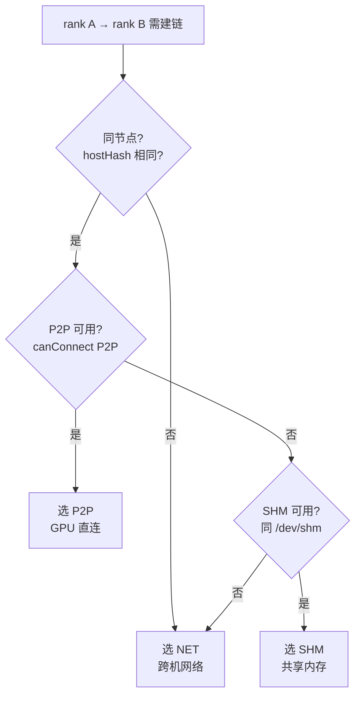

**示例（4 rank，2 节点）**：

- **rank0 → rank1**（同机）：若 `cudaDeviceCanAccessPeer(0,1)==1` → 选 **P2P**；否则同机同 /dev/shm → 选 **SHM**。
- **rank0 → rank2**（跨机）：hostHash 不同 → 选 **NET**（经本机 NIC、网络、对端 NIC）。
- **CollNet**：若硬件与拓扑支持，Ring/Tree 之外会再建 CollNet 专用 channel，对应连接用 **CollNet** 传输。

**代码位置**：
- `src/include/transport.h` - 传输抽象（`ncclTransport`、`ncclTransportComm`、常量）
- `src/transport.cc` - `ncclTransports[]` 注册、`selectTransport`、`ncclTransportP2pSetup`
- `src/transport/p2p.cc` - P2P：`canConnect`、send/recv setup/connect/free、proxy
- `src/transport/shm.cc` - SHM：`canConnect`、基于共享内存的 send/recv
- `src/transport/net.cc` - NET：封装 ncclNet，send/recv 与 proxy
- `src/transport/net_ib.cc` - InfiniBand 实现
- `src/transport/coll_net.cc` - CollNet 实现

**关键代码与注释**：

**1. 传输抽象（transport.h）**

```c
// src/include/transport.h

#define NTRANSPORTS 4
#define TRANSPORT_P2P 0
#define TRANSPORT_SHM 1
#define TRANSPORT_NET 2
#define TRANSPORT_COLLNET 3

// 每条连接在“连接建立”时交换的不透明数据（双方各填自己的 connect，对端用其 connect）
#define CONNECT_SIZE 128
struct ncclConnect {
  char data[CONNECT_SIZE];
};

// 某一传输的“发送侧/接收侧”能力：setup(生成本地 connect)、connect(用对端 connect 建链)、free、proxy 等
struct ncclTransportComm {
  ncclResult_t (*setup)(...);   // 本端生成 connect 信息，写入 connectInfo
  ncclResult_t (*connect)(...); // 用对端 recv 到的 connect 信息，完成本端连接
  ncclResult_t (*free)(...);
  ncclResult_t (*proxySharedInit)(...);
  ncclResult_t (*proxySetup)(...);
  ncclResult_t (*proxyConnect)(...);
  ncclResult_t (*proxyFree)(...);
  ncclResult_t (*proxyProgress)(...);
};

// 一种传输方式：名称、能否连接、发送/接收两侧的 TransportComm
struct ncclTransport {
  const char name[4];
  ncclResult_t (*canConnect)(int* ret, struct ncclTopoSystem* topo, struct ncclTopoGraph* graph,
                             struct ncclPeerInfo* info1, struct ncclPeerInfo* info2);
  struct ncclTransportComm send;  // 发送侧：setup/connect/free/proxy...
  struct ncclTransportComm recv;  // 接收侧：setup/connect/free/proxy...
};

extern struct ncclTransport p2pTransport, shmTransport, netTransport, collNetTransport;
extern struct ncclTransport* ncclTransports[];
```

**2. 传输数组与“选传输 + 建链”（transport.cc）**

```c
// src/transport.cc

// 全局传输表：按优先级排列，selectTransport 从 0 开始试，第一个 canConnect 成功的即被选用
struct ncclTransport* ncclTransports[NTRANSPORTS] = {
  &p2pTransport,      // [0] 优先：同机 GPU 直连（NVLink/PCIe P2P）
  &shmTransport,      // [1] 同机但无 P2P 时用共享内存
  &netTransport,      // [2] 跨节点用网络（如 IB）
  &collNetTransport   // [3] 支持时用集合网络
};

// 为 (comm, channelId, peer, connIndex) 选一种传输并执行 setup：遍历 ncclTransports，
// 调用 transport->canConnect；第一个返回 ret==1 的，用其 send 或 recv 的 setup 生成 connect 信息
template <int type>
static ncclResult_t selectTransport(struct ncclComm* comm, struct ncclTopoGraph* graph,
                                    struct ncclConnect* connect, int channelId, int peer,
                                    int connIndex, int* transportType) {
  struct ncclPeerInfo* myInfo = comm->peerInfo + comm->rank;
  struct ncclPeerInfo* peerInfo = comm->peerInfo + peer;
  struct ncclConnector* connector = (type == 1) ? comm->channels[channelId].peers[peer].send + connIndex
                                                : comm->channels[channelId].peers[peer].recv + connIndex;
  for (int t = 0; t < NTRANSPORTS; t++) {
    struct ncclTransport* transport = ncclTransports[t];
    struct ncclTransportComm* transportComm = (type == 1) ? &transport->send : &transport->recv;
    int ret = 0;
    NCCLCHECK(transport->canConnect(&ret, comm->topo, graph, myInfo, peerInfo));
    if (ret) {
      connector->transportComm = transportComm;
      NCCLCHECK(transportComm->setup(comm, graph, myInfo, peerInfo, connect, connector, channelId, connIndex));
      if (transportType) *transportType = t;
      return ncclSuccess;
    }
  }
  WARN("No transport found for rank %d -> rank %d", myInfo->rank, peerInfo->rank);
  return ncclSystemError;
}

// 建链主流程：按 graph 确定的“和谁建 recv/send”，对每个 peer 先 selectTransport（setup），
// 再通过 bootstrap 交换 ncclConnect，最后对每条连接调用 transportComm->connect 完成建链，
// 并把连接信息拷到设备端 devPeers，供 kernel 使用
ncclResult_t ncclTransportP2pSetup(struct ncclComm* comm, struct ncclTopoGraph* graph,
                                   int connIndex, int* highestTransportType) {
  // 1) 为每个 (recvPeer/sendPeer, channel) 调用 selectTransport -> setup，得到本地 connect
  // 2) bootstrapSend/bootstrapRecv 与对端交换 connect
  // 3) 对每条连接调用 transportComm->connect(comm, 对端 connect, ...)，标记 connected=1
  // 4) cudaMemcpyAsync 把 conn 信息拷到 comm->channels[c].devPeers[peer].send/recv，供 GPU 使用
  // ...
}
```

**3. P2P 传输实例（p2p.cc）**

```c
// src/transport/p2p.cc（节选）

// 判断两 peer 是否能用 P2P：同节点、同 shmDev、拓扑与 CUDA 均允许 P2P
static ncclResult_t p2pCanConnect(int* ret, ...) {
  if (info1->hostHash != info2->hostHash || info1->shmDev != info2->shmDev) {
    *ret = 0; return ncclSuccess;  // 不同节点或不同 /dev/shm -> 不用 P2P
  }
  NCCLCHECK(ncclTopoCheckP2p(topo, info1->busId, info2->busId, ret, NULL, &intermediateRank));
  if (*ret == 0) return ncclSuccess;
  // 还可检查 NCCL 是否倾向用 NET（如同机但走网络更快）
  int useNet = 0;
  NCCLCHECK(ncclTopoCheckNet(topo, info1->busId, info2->busId, &useNet));
  if (useNet) { *ret = 0; return ncclSuccess; }
  int p2p;
  if (cudaDeviceCanAccessPeer(&p2p, cudaDev1, cudaDev2) != cudaSuccess) { *ret = 0; return ncclSuccess; }
  *ret = (p2p != 0) ? 1 : 0;
  return ncclSuccess;
}

struct ncclTransport p2pTransport = {
  "P2P",
  p2pCanConnect,
  { p2pSendSetup, p2pSendConnect, p2pSendFree, NULL, p2pSendProxySetup, NULL, p2pSendProxyFree, NULL },
  { p2pRecvSetup, p2pRecvConnect, p2pRecvFree, NULL, p2pRecvProxySetup, NULL, p2pRecvProxyFree, NULL }
};
```

**小结**：阶段 6 利用拓扑与 graph 已定好的“邻居”关系，对每条需要的 (rank A, rank B, channel, connIndex) 用 **canConnect 按优先级选传输**（P2P → SHM → NET → CollNet），再 **setup → 交换 connect → connect** 建链，并把连接信息写入 `devPeers`，供数据面 kernel 使用。

**类比**：按通讯录（graph）决定“谁和谁通话”；对每一对，先看能不能用内线（P2P），不能再用对讲机（SHM），再不行走外线（NET）；选好后真正接通（setup + 交换 connect + connect），并把号码（conn）记到设备端，后面发数据就用这条“线”。

---

#### 阶段 7：连接建立（Transport Setup & Connect）

**在做什么**：为每个 channel 的每个 peer 建立实际的连接，包括交换连接信息、创建 QP（Queue Pair）、注册内存等。

**代码位置**：
- `src/transport.cc:68` - `ncclTransportP2pSetup`
- `src/transport.cc:42` - `ncclTransportP2pConnect`
- `src/transport/net_ib.cc` - IB 连接建立

**关键代码片段**：
```c
// src/transport.cc:68
ncclResult_t ncclTransportP2pSetup(struct ncclComm* comm, struct ncclTopoGraph* graph, int connIndex, int* highestTransportType) {
  // 为每个 peer 选择传输方式
  for (int c=0; c<MAXCHANNELS; c++) {
    if (recvMask & (1<<c)) {
      // 选择传输层（P2P/SHM/NET）
      NCCLCHECK(selectTransport<0>(comm, graph, recvData+recvChannels++, c, recvPeer, connIndex, &type));
    }
  }
  
  // 通过 Bootstrap 交换连接信息
  NCCLCHECK(bootstrapSend(comm->bootstrap, recvPeer, bootstrapTag, recvData, sizeof(struct ncclConnect)*recvChannels));
  NCCLCHECK(bootstrapRecv(comm->bootstrap, recvPeer, bootstrapTag, recvData, sizeof(struct ncclConnect)*recvChannels));
  
  // 建立实际连接
  NCCLCHECK(conn->transportComm->connect(comm, recvData++, 1, comm->rank, conn));
}
```

**类比**：实际建立电话线路——交换电话号码、测试拨号、确认连通。

---

##### 阶段 7 详解：建链做了什么？是直接调建链 API 吗？

---

###### 一、用最简单的话说（给 12 岁孩子听）

**阶段 7 在干什么？**  
就是让“我们这边”和“对方那边”**互相拿到对方的一张小纸条**，然后各自用这张纸条去**真正接通线路**。  
这张小纸条上写的东西，对不同线路不一样：  
- 同机两块显卡（P2P）：写的是“我家显存的门牌号”（IPC handle）；  
- 同机走共享内存（SHM）：写的是“一块共享内存的名字和大小”；  
- 跨机走网卡（NET/IB）：写的是“我在这台机器上的一个电话号码（Socket 地址）”，后面还要再通过这个电话**再交换更小的一张纸条**（QP 信息），才能让网卡和网卡对上号。

**为什么不能“直接建链”？**  
因为**建链需要双方的信息**。  
你这边可以自己先准备好“我家门牌号/电话/共享内存名”，但**对方的门牌号/电话/共享内存名你不知道**，必须对方先准备好、再通过一个**大家都信得过的中转（Bootstrap）** 换给你，你才能用“对方的纸条”真正连上。所以一定是：**先各自准备（setup）→ 再交换纸条（Bootstrap）→ 再用对方的纸条接通（connect）**。

---

###### 二、第一性原理：为什么要“先准备 → 再交换 → 再连接”？

**本质问题**：  
建链 = 让本端和对端**共享一种“约定”**（例如：同一块共享内存、同一个 QP 号+地址、同一个 IPC 句柄），这样后面发数据时两边才能找到同一个“通道”。  
这种约定里，**一半信息只有本端知道**（例如本端的 QP 号、本端的 listen 地址），**一半只有对端知道**，所以：

1. **只在本端“直接调建链 API”**：  
   你只能填好自己这一侧的资源，**得不到对端的 QP 号、地址、句柄等**，连不上。
2. **不交换就连接**：  
   没有“对方的纸条”，你没法知道要连到哪、用什么参数连，所以**必须先有一次“交换”**，把双方各自准备好的“连接信息”互换。
3. **谁来做“交换”？**  
   应用线程不能凭空变出对端的信息，必须通过**已经可用的通道**把“连接信息”发过去——这条通道就是 **Bootstrap**（前面阶段已经建好的 Socket 控制面）。所以逻辑顺序一定是：**先有 Bootstrap → 再在各端 setup 生成要交换的信息 → 用 Bootstrap 交换 → 再用换到的信息做 connect**。

**不这么做可以吗？**  
- **不交换就 connect**：不行，没有对端的 QP/地址/句柄，connect 调了也白调。  
- **不用 Bootstrap 而用别的通道交换**：可以，只要有一条**可靠、大家都能用的通道**就行；NCCL 选的是 Bootstrap（Socket），因为建链时只有这条已经建好、且所有 rank 都能访问。  
- **每种传输各搞一套流程**：从原理上可以，但代码会重复、难维护；所以 NCCL 把“**setup → 交换 → connect**”抽成**同一套三步**，只是每一步里调用的底层 API 按 P2P/SHM/NET 不同而不同。

**一句话**：  
**建链需要“双方的信息”；信息只能各自准备（setup）、再通过已有通道交换（Bootstrap）、再用对方的信息完成连接（connect）。** 不这么做，就拿不到对端信息，也就建不起链。

---

###### 三、生活类比：阶段 7 在干什么

- **Setup（准备）**：  
  你给自己家装好门牌、写好“我家地址+门牌号”的小纸条，但**不把纸条发给别人**。  
  对应：本端分配资源（QP、共享内存、listen 地址等），生成要交换的 `ncclConnect` 内容。
- **交换（Bootstrap）**：  
  通过“居委会”（Bootstrap）把“我家地址+门牌号”交给对方，同时收到“对方地址+门牌号”。  
  对应：`bootstrapSend` / `bootstrapRecv` 互换连接信息，双方拿到**对方的** handle/地址/QP 信息等。
- **Connect（连接）**：  
  拿着**对方的小纸条**，按上面的地址去对方家敲门、对暗号，把“线路”真正接通。  
  对应：用对方发来的信息调 `transportComm->connect`（P2P 做 IPC open，SHM 做 open/mmap，NET 做 Socket connect + 交换 QP + Verbs RTR/RTS），填好 `conn`，拷贝到 `devPeers`。

**RDMA/IB 多出来的一步**：  
网卡和网卡不能“隔空握手”，要先通过**一条已经能通的线**（TCP）互相说“我的 QP 号是多少、我的 GID 是多少、fifo 的 rkey/addr 是多少”。所以 IB 建链 = **先建 TCP（Listen/Connect/Accept）→ 在 TCP 上交换 QP 信息 → 两边各自建 QP 并做 RTR/RTS**。  
可以理解为：**先通电话（TCP），在电话里念纸条（QP 信息），再根据纸条把网卡对网卡的“门”打开（QP 状态机）**。

---

###### 四、统一流程（所有传输）：技术视角

**结论**：**不是**“直接调用对应通路的建链 API”一步完成。NCCL 对所有传输（P2P/SHM/NET）采用**同一套三步**：本端 **setup**（准备资源并生成要交换的“连接信息”）→ 通过 **Bootstrap 交换** 这些连接信息 → 本端 **connect**（用对方发来的信息完成建链或内存映射）。不同传输在 setup/connect 里调用的**底层 API 完全不同**；对 RDMA/IB 还多一步“先 TCP 建链，再在 TCP 上交换 QP 信息，再 Verbs 建 QP 并 RTR/RTS”。

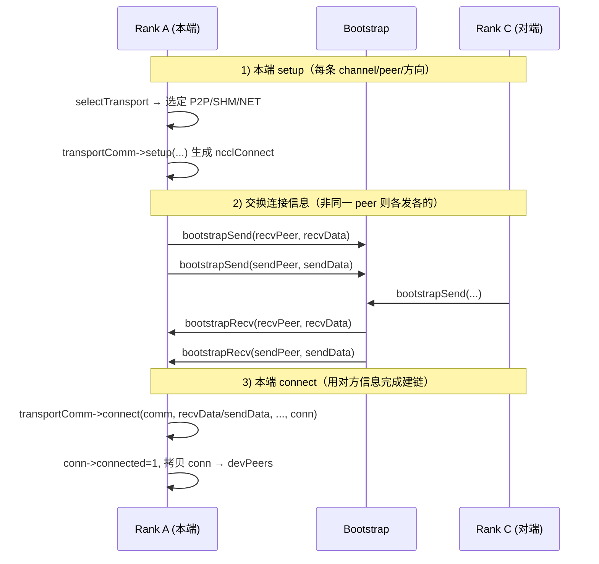

###### 五、例子与各传输底层 API

**例子（4 rank，2 台机，Rank 0 与 Rank 2 用 NET/IB 建链）**

- **步骤 1：setup（本端准备“连接信息”）**
  - **Rank 0 作为 recv 方**：对 (channel, peer=2, recv) 选 NET，在 Proxy 里调 `ncclNetListen`（IB 即 `ncclIbListen`：Socket listen，把本机地址写入 handle），得到 listen 的 handle。
  - **Rank 0 作为 send 方**：对 (channel, peer=2, send) 选 NET，`sendSetup` 只记 netDev、proxyRank 等，connectInfo 里是 proxyRank（或本侧要发给对方的 handle）。
  - **Rank 2** 同理：recv 侧 listen 得到 handle，send 侧记参数。双方各自产出一份“要发给对方”的 connect 信息（内含 listen 的 handle 或 proxyRank）。
- **步骤 2：交换（通过 Bootstrap 互换 connect 信息）**
  - Rank 0 把“发给 Rank 2 的 connect 信息”发给 Rank 2（内含 Rank 0 的 listen handle 等）。
  - Rank 2 把“发给 Rank 0 的 connect 信息”发给 Rank 0（内含 Rank 2 的 listen handle 等）。
  - 交换后，双方都拿到**对方的** listen 地址/handle，才能去 connect/accept。
- **步骤 3：connect（用对方发来的信息完成建链）**
  - **Rank 0（send 方）**：用 Rank 2 发来的 handle，在 Proxy 里调 `ncclNetConnect` → IB 里 `ncclIbConnect`：`ncclSocketConnect` 建 TCP → 创建 QP、RTR/RTS → 经 socket 交换 QP 信息（qpn、lid/gid、mtu、fifo 等）。
  - **Rank 2（recv 方）**：用 Rank 0 发来的 handle，在 Proxy 里调 `ncclNetAccept` → `ncclIbAccept`：`ncclSocketAccept` 接受 TCP → 收对方 QP 信息 → 本端建 QP、RTR/RTS → 经 socket 回传本端 QP 信息。
  - 两边都填好 `conn` 和 NET 的 connectMap，最后拷贝到 `devPeers`，数据面即可用这条连接。

下面按传输类型分块说明**建链具体做了什么、调用了哪些底层 API**。

---

**P2P**

- **交换的 connect 内容**：`p2pConnectInfo`（含 rank、read、IPC handle 或 CE 用的 shm 名等）。
- **setup 时本端做了什么**：
  - 分配 Send/Recv 侧资源。
  - 若跨进程：通过 Proxy 在对方 rank 上分配 GPU buffer，调 **cudaIpcGetMemHandle** 得到 p2pBuff，填入 p2pConnectInfo；CE 路径则准备 shm 名/大小。
- **connect 时本端做了什么**：
  - 用对方发来的 p2pBuff 做 **cudaIpcOpenMemHandle**，得到对端显存指针 remDevMem。
  - 填 conn 的 buffs、tail、head 等；若 CE 则 **ncclShmOpen** 打开对端 shm。
- **底层/系统 API**：**cudaIpcGetMemHandle**（创建方）、**cudaIpcOpenMemHandle**（连接方）；CE 路径还有 shm_open/mmap。

---

**SHM**

- **交换的 connect 内容**：`shmConnectInfo`（shmName、shmSize）。
- **setup 时本端做了什么**：
  - **ncclShmOpen(create=1)**：mkstemp 创建 `/dev/shm/nccl-XXXXXX`，ftruncate、mmap，再 **cudaHostRegister** + **cudaHostGetDevicePointer** 得到设备可访问的 host 指针。
  - 把 shmName、shmSize 写入 connectInfo。
- **connect 时本端做了什么**：
  - **ncclShmOpen(create=0)**：用对方发来的 shmName 做 open(shmPath)、mmap，同样 cudaHostRegister + cudaHostGetDevicePointer 得到对端共享内存指针。
  - 填 conn 的 buffs、tail、head。
- **底层/系统 API**：**mkstemp/open**、**ftruncate**、**mmap**、**cudaHostRegister**、**cudaHostGetDevicePointer**。

---

**NET (IB)**

- **交换的 connect 内容**：`ncclNetHandle_t`（内含 socket 地址；IB 即 connectAddr + stage）。
- **setup 时本端做了什么**：
  - **Recv 侧**：在 Proxy 里 **ncclNetListen** → **ncclIbListen**（GetSocketAddr、**ncclSocketListen**），把本机 connectAddr 写入 handle。
  - **Send 侧**：只记 netDev、proxyRank 等；connectInfo 里是 proxyRank 或由 recv 方 listen 得到并交换的 handle。
- **connect 时本端做了什么**：
  - **Send 侧**（在 Proxy 里）：**ncclNetConnect** → **ncclIbConnect**：**ncclSocketInit** + **ncclSocketConnect** 建 TCP → **ncclIbCreateQp**、**ncclIbRtrQp**、**ncclIbRtsQp**，**ibv_reg_mr**(fifo)，经 socket 收发交换 QP 信息（qpn、lid/gid、mtu、fifo rkey/addr）。
  - **Recv 侧**（在 Proxy 里）：**ncclNetAccept** → **ncclIbAccept**：**ncclSocketAccept** 接受 TCP → 收对方 QP 信息 → 本端 **ncclIbCreateQp**、**ncclIbRtrQp**、**ncclIbRtsQp**，可选 GDR flush QP，再经 socket 回传本端 QP 信息。
- **底层/系统 API**：**Socket**：ncclSocketListen / ncclSocketConnect / ncclSocketAccept；**Verbs**：**ibv_create_qp**、**ibv_modify_qp**(RTR/RTS)、**ibv_reg_mr**。建链 = 先 TCP 建链，再在 TCP 上交换 QP 信息，最后 QP 状态机 RTR/RTS。

---

**对照简表**（便于快速查阅）

| 传输   | 交换内容              | 底层 API 要点 |
|--------|-----------------------|----------------|
| **P2P**  | p2pConnectInfo（IPC handle / shm 名） | cudaIpcGetMemHandle / cudaIpcOpenMemHandle；CE 用 shm_open、mmap |
| **SHM**  | shmName、shmSize      | mkstemp、mmap、cudaHostRegister、cudaHostGetDevicePointer |
| **NET(IB)** | ncclNetHandle_t（socket 地址） | Socket Listen/Connect/Accept + ibv_create_qp、ibv_modify_qp(RTR/RTS)、ibv_reg_mr |

**RDMA/IB 建链多出来的动作（相对“直接调建链 API”）**：

1. **先建 TCP**：用 `ncclSocketListen` / `ncclSocketConnect` / `ncclSocketAccept` 建立 TCP 连接，用于可靠地交换 QP 信息（qpn、lid/gid、mtu、fifo rkey/addr 等）。
2. **再在 TCP 上交换 QP 信息**：双方通过 socket 收发 `ncclIbQpInfo`，而不是“只调 ibv_create_qp 就完事”。
3. **QP 状态机**：本端创建 QP 后，用对方发来的 qpn/lid/gid 等做 **ncclIbRtrQp**（RTR），再 **ncclIbRtsQp**（RTS），对方同理，这样两边 QP 才能互相发 RDMA 请求。
4. **Proxy 执行**：NET 的 Listen/Connect/Accept 都在 **Proxy 线程**里通过 `ncclProxyCall(ncclProxyMsgSetup/ncclProxyMsgConnect, ...)` 触发，应用线程只做 setup（填参数、拿 handle）和 connect（把 handle 交给 Proxy 并取回 connectMap）。

**小结**：建链 = **统一框架（setup → Bootstrap 交换 connect → connect）** + **各传输在 setup/connect 里做自己的事**。P2P 是 IPC handle 交换 + 映射；SHM 是共享内存名 + open/mmap；NET/IB 是 TCP 建链 + 交换 QP 信息 + Verbs 建 QP 并 RTR/RTS，**不是**“直接调用对应通路的建链 API”一步完成。

**费曼自测（阶段 7）**  
- **做了什么？** 对每条需要的 (channel, peer, 方向) 先 setup 生成“连接信息”，再通过 Bootstrap 互换这些信息，最后用对方的信息做 connect，把连接写入 `conn` 并拷贝到 `devPeers`。  
- **为什么要“先准备、再交换、再连接”？** 建链需要双方的信息；本端只有自己的，对端的 QP/地址/句柄必须通过对端准备好并交换过来才能连上。  
- **不这么做可以吗？** 不交换就 connect：不行，没有对端信息。不用 Bootstrap 而用别的可靠通道交换：可以，只要大家都能用；NCCL 选 Bootstrap 因为建链时只有它已建好。不统一三步而各传输各写一套：可以，但会重复难维护，所以 NCCL 抽成统一三步。

---

#### 阶段 8：设备端通信器设置（devCommSetup）

**在做什么**：将连接信息复制到 GPU 内存，创建设备端的通信器结构，供 Kernel 使用。

**代码位置**：
- `src/init.cc` - `devCommSetup`（通常在 `ncclCommInitRankFunc` 中调用）

**关键代码片段**：
```c
// src/init.cc（简化示例）
ncclResult_t devCommSetup(struct ncclComm* comm) {
  // 将 host 端的连接信息复制到 device 端
  // 创建 device 端的 ncclDevComm 结构
  // 设置 workFifo、proxyOpQueue 等共享内存结构
}
```

**类比**：把通讯录和线路信息同步到每个人的手机里，方便随时查看。

---

### 流程二：消息处理流（数据面）

#### 阶段 1：用户 API 调用

**在做什么**：用户调用集合通信 API（如 `ncclAllReduce`），传入数据缓冲区、大小、数据类型等参数。

**代码位置**：
- `src/collectives/all_reduce.cc:11` - `ncclAllReduce`
- `src/collectives/broadcast.cc` - `ncclBroadcast`
- `src/collectives/reduce.cc` - `ncclReduce`

**关键代码片段**：
```c
// src/collectives/all_reduce.cc:11
ncclResult_t ncclAllReduce(const void* sendbuff, void* recvbuff, size_t count,
    ncclDataType_t datatype, ncclRedOp_t op, ncclComm* comm, cudaStream_t stream) {
  // 构造 ncclInfo 结构
  struct ncclInfo info = { 
    ncclFuncAllReduce, "AllReduce",
    sendbuff, recvbuff, count, datatype, op, 0, comm, stream,
    ALLREDUCE_CHUNKSTEPS, ALLREDUCE_SLICESTEPS 
  };
  // 调用入队检查函数
  return ncclEnqueueCheck(&info);
}
```

**类比**：员工 A 说"我要给所有人发一份报告"。

---

#### 阶段 2：入队检查（Enqueue Check）

**在做什么**：检查通信器状态、参数合法性，将任务转换为 `ncclTaskColl` 或 `ncclTaskP2p`，加入 `comm->tasks` 队列。

**代码位置**：
- `src/enqueue.cc` - `ncclEnqueueCheck`
- `src/enqueue.cc` - `ncclEnqueueCheckColl` / `ncclEnqueueCheckP2p`

**关键代码片段**：
```c
// src/enqueue.cc（简化示例）
ncclResult_t ncclEnqueueCheck(struct ncclInfo* info) {
  // 检查通信器状态
  NCCLCHECK(ncclCommEnsureReady(info->comm));
  
  // 根据操作类型选择入队函数
  if (info->coll) {
    return ncclEnqueueCheckColl(info);
  } else {
    return ncclEnqueueCheckP2p(info);
  }
}

ncclResult_t ncclEnqueueCheckColl(struct ncclInfo* info) {
  // 创建 ncclTaskColl
  struct ncclTaskColl* task = ncclIntruQueueMallocTail(&info->comm->memPool_ncclTaskColl, &info->comm->tasks);
  
  // 填充任务信息
  task->func = info->func;
  task->sendbuff = info->sendbuff;
  task->recvbuff = info->recvbuff;
  // ...
  
  return ncclSuccess;
}
```

**类比**：前台把任务登记到待办清单，检查任务是否合法、员工是否在岗。

---

#### 阶段 3：排产（Launch Prepare）

**在做什么**：将 `comm->tasks` 中的任务转换为 `ncclKernelPlan`，每个 plan 包含 `workQueue`（GPU 工作）和 `proxyOpQueue`（Proxy 工作）。

**代码位置**：
- `src/enqueue.cc` - `ncclLaunchPrepare`
- `src/enqueue.cc` - `scheduleCollTasksToPlan`
- `src/enqueue.cc` - `computeColl`（选择算法/协议，生成 work 和 proxyOp）

**关键代码片段**：
```c
// src/enqueue.cc（简化示例）
ncclResult_t ncclLaunchPrepare(struct ncclComm* comm) {
  do {
    // 从 tasks 队列取任务，转换为 plan
    NCCLCHECK(scheduleCollTasksToPlan(comm, &plan));
    
    // 对每个任务调用 computeColl，生成 work 和 proxyOp
    NCCLCHECK(computeColl(&info, &workFuncIndex, &work, &proxyOp));
    
    // 将 work 加入 plan->workQueue
    // 将 proxyOp 加入 plan->proxyOpQueue
    
    // 完成当前 plan，加入 unlaunchedPlansHead
    NCCLCHECK(finishPlan(comm, &plan));
  } while (hasMoreTasks);
}
```

**类比**：调度员查看待办清单，决定先处理哪些任务，分配给哪些线路和人员。

---

#### 阶段 4：Kernel 启动（Launch Kernel）

**在做什么**：将 plan 中的 `workQueue` 上传到 GPU，启动 CUDA Kernel 执行集合通信计算。

**代码位置**：
- `src/group.cc` - `doLaunches`（按 clique 组织 launch）
- `src/enqueue.cc` - `ncclLaunchKernel`
- `src/enqueue.cc` - `uploadWork`（上传 work 到 GPU）

**关键代码片段**：
```c
// src/group.cc（简化示例）
static ncclResult_t doLaunches(struct ncclComm* head) {
  // 按 clique 迭代（同一进程内的 comm）
  for (struct ncclComm* comm = cliqueHead; comm != nullptr; comm = comm->intraNext) {
    // 排产：将 tasks 转换为 plans
    NCCLCHECK(ncclLaunchPrepare(comm));
    
    // 循环发射 plan
    while (comm->unlaunchedPlansHead != nullptr) {
      // LaunchBefore: 上传 work 到 GPU
      NCCLCHECK(ncclLaunchBefore(comm, plan));
      
      // LaunchKernel: 启动 CUDA Kernel
      NCCLCHECK(ncclLaunchKernel(comm, plan));
      
      // LaunchAfter: 处理 hostStream 任务
      NCCLCHECK(ncclLaunchAfter(comm, plan));
    }
  }
}
```

**类比**：实际执行任务——员工开始工作，处理数据、计算、复制。

---

#### 阶段 5：Proxy 线程处理（Proxy Progress）

**在做什么**：Proxy 线程（CPU）轮询 `proxyOpQueue`，处理网络操作，调用传输层的 `sendProxyProgress` / `recvProxyProgress`。

**代码位置**：
- `src/proxy.cc` - `ncclProxyProgress`（Proxy 主循环）
- `src/proxy.cc` - `progressOps`（处理 active 队列中的 op）
- `src/transport/net.cc` - `sendProxyProgress` / `recvProxyProgress`

**关键代码片段**：
```c
// src/proxy.cc（简化示例）
void* ncclProxyProgress(void *comm_) {
  struct ncclComm* comm = (struct ncclComm*)comm_;
  struct ncclProxyProgressState* state = &comm->proxyState.progressState;
  
  while (1) {
    // 处理 active 队列中的 op
    int idle = 0;
    NCCLCHECK(progressOps(comm, state, state->active, &idle));
    
    // 如果 idle，从 pool 拉取新 op
    if (idle) {
      NCCLCHECK(ncclProxyGetPostedOps(comm, state));
    }
  }
}

static ncclResult_t progressOps(struct ncclComm* comm, struct ncclProxyProgressState* state, 
                                 struct ncclProxyArgs* opStart, int* idle) {
  for (struct ncclProxyArgs* op = opStart->next; op != opStart; op = op->next) {
    // 调用 op->progress，最终会调到 net 的 sendProxyProgress/recvProxyProgress
    NCCLCHECK(op->progress(comm, op));
  }
  return ncclSuccess;
}
```

**类比**：专门的传输员（Proxy）负责跨部门的数据传输，查看待传输清单，执行传输任务。

---

#### 阶段 6：传输层处理（Transport Progress）

**在做什么**：传输层的 `sendProxyProgress` / `recvProxyProgress` 轮询 GPU 的 FIFO，数据就绪后调用 `ncclNetIsend` / `ncclNetIrecv`。

**代码位置**：
- `src/transport/net.cc` - `sendProxyProgress`
- `src/transport/net.cc` - `recvProxyProgress`

**关键代码片段**：
```c
// src/transport/net.cc（简化示例）
static ncclResult_t sendProxyProgress(struct ncclComm* comm, struct ncclProxyArgs* args) {
  // 轮询 GPU 的 sizesFifo，检查数据是否就绪
  int buffSlot = args->subIndex;
  uint32_t flag = args->nsteps;
  uint32_t* sizesFifo = (uint32_t*)args->send.proxyAppendPtr;
  
  // 等待数据就绪
  while (sizesFifo[buffSlot] == 0) {
    // 轮询或等待
  }
  
  // 数据就绪，调用 net 层的 Isend
  void* buff = args->send.buff + buffSlot * args->send.buffSize;
  int size = sizesFifo[buffSlot];
  NCCLCHECK(ncclNetIsend(comm, resources->netSendComm, buff, size, resources->rank, mhandle, sub->requests+buffSlot));
  
  return ncclSuccess;
}
```

**类比**：传输员检查数据是否准备好，准备好后交给快递公司。

---

#### 阶段 7：IB Verbs 调用（底层发送）

**在做什么**：`ncclIbIsend` / `ncclIbIrecv` 构造 IB Work Request，调用 `ibv_post_send` / `ibv_post_recv` 提交给 HCA。

**代码位置**：
- `src/transport/net_ib.cc` - `ncclIbIsend`
- `src/transport/net_ib.cc` - `ncclIbMultiSend`
- `src/transport/net_ib.cc:784` - `wrap_ibv_post_send`（实际调用 IB Verbs）

**关键代码片段**：
```c
// src/transport/net_ib.cc（简化示例）
ncclResult_t ncclIbIsend(void* sendComm, void* data, int size, int tag, void* mhandle, void** request) {
  struct ncclIbSendComm* comm = (struct ncclIbSendComm*)sendComm;
  
  // 从 slot 中取请求信息
  int slot = comm->tagToSlot[tag];
  struct ncclIbRequest* req = comm->slots[slot].reqs[0];
  
  // 填充请求信息
  req->send.data = data;
  req->send.size = size;
  req->send.mhandle = mhandle;
  
  // 调用 MultiSend 批量发送
  NCCLCHECK(ncclIbMultiSend(comm, slot));
  
  return ncclSuccess;
}

ncclResult_t ncclIbMultiSend(struct ncclIbSendComm* comm, int slot) {
  // 构造 ibv_sge（Scatter-Gather Element）
  struct ibv_sge* sge = comm->sges;
  sge->addr = (uintptr_t)reqs[r]->send.data;
  sge->length = reqs[r]->send.size;
  sge->lkey = reqs[r]->send.mhandle->lkey;
  
  // 构造 ibv_send_wr（Send Work Request）
  struct ibv_send_wr* wr = comm->wrs;
  wr->sg_list = sge;
  wr->num_sge = 1;
  wr->opcode = IBV_WR_SEND;
  wr->send_flags = IBV_SEND_SIGNALED;
  
  // 提交到 HCA
  struct ibv_send_wr* bad_wr;
  NCCLCHECK(wrap_ibv_post_send(comm->qps[q], comm->wrs, &bad_wr));
  
  return ncclSuccess;
}
```

**类比**：快递公司（网卡驱动）把包裹（数据包）通过物理线路发送出去。

---

## 第四步：调用链追踪

### 建链主流程完整调用链

以下是建链主流程的完整函数调用链，帮助跟踪代码跳转：

```
用户 API
  └─> ncclCommInitRank (src/init.cc:1382)
      └─> ncclCommInitRankDev (src/init.cc:1292)
          └─> ncclAsyncLaunch (src/group.cc)
              └─> ncclCommInitRankFunc (src/init.cc:1182)  [异步执行]
                  ├─> commAlloc (src/init.cc:316)
                  │   ├─> ncclNetInit (src/net.cc)  [网络层初始化]
                  │   ├─> ncclStrongStreamConstruct (src/strongstream.cc)  [CUDA Stream]
                  │   ├─> getBusId (src/init.cc)  [获取 GPU Bus ID]
                  │   └─> initChannel (src/channel.cc)  [通道初始化]
                  │
                  ├─> initTransportsRank (src/init.cc:594)  [核心初始化函数]
                  │   ├─> bootstrapInit (src/bootstrap.cc:215)
                  │   │   ├─> ncclSocketInit (src/misc/socket.cc)
                  │   │   ├─> ncclSocketListen (src/misc/socket.cc)
                  │   │   ├─> ncclSocketConnect (src/misc/socket.cc)
                  │   │   ├─> ncclSocketAccept (src/misc/socket.cc)
                  │   │   └─> bootstrapAllGather (src/bootstrap.cc:290)  [建立 AllGather ring]
                  │   │
                  │   ├─> fillInfo (src/init.cc:505)  [填充当前 rank 的 peerInfo]
                  │   │   ├─> getHostHash (src/init.cc)
                  │   │   ├─> getPidHash (src/init.cc)
                  │   │   └─> ncclGpuGdrSupport (src/misc/gdrwrap.cc)  [检查 GDR 支持]
                  │   │
                  │   ├─> bootstrapAllGather (src/bootstrap.cc:290)  [AllGather1: 收集所有 rank 的 peerInfo]
                  │   │   └─> bootstrapNetSend/Recv (src/bootstrap.cc:59/64)  [Socket 发送/接收]
                  │   │
                  │   ├─> ncclTopoGetSystem (src/graph/topo.cc)  [拓扑发现]
                  │   │   ├─> ncclTopoGetSystemFromXml (src/graph/xml.cc)  [从 XML 构建拓扑]
                  │   │   │   └─> ncclXmlLoadFromFile (src/graph/xml.cc)  [加载 XML]
                  │   │   │
                  │   │   └─> ncclTopoGetSystemFromDevices (src/graph/topo.cc)  [从设备构建拓扑]
                  │   │       ├─> ncclTopoCreateNode (src/graph/topo.cc:98)  [创建 GPU/CPU/PCI/NIC 节点]
                  │   │       ├─> ncclTopoConnectNodes (src/graph/topo.cc)  [连接节点]
                  │   │       ├─> ncclTopoConnectCpus (src/graph/topo.cc:235)  [连接 CPU]
                  │   │       └─> ncclTopoMergeMultiPort (src/graph/topo.cc)  [合并多端口设备]
                  │   │
                  │   ├─> ncclTopoComputePaths (src/graph/paths.cc)  [计算路径]
                  │   │   └─> ncclTopoGetPath (src/graph/paths.cc)  [获取两点间路径]
                  │   │
                  │   ├─> ncclTopoTrimSystem (src/graph/topo.cc)  [修剪拓扑]
                  │   │   └─> ncclTopoRemoveNode (src/graph/topo.cc)  [移除不可达节点]
                  │   │
                  │   ├─> ncclTopoGetCpuAffinity (src/graph/topo.cc)  [CPU 亲和性]
                  │   │
                  │   ├─> ncclProxyCreate (src/proxy.cc)  [启动 Proxy 线程]
                  │   │   └─> pthread_create (系统调用)  [创建线程]
                  │   │       └─> ncclProxyProgress (src/proxy.cc)  [Proxy 主循环]
                  │   │
                  │   ├─> ncclTopoCompute (src/graph/search.cc)  [计算 Ring/Tree 图]
                  │   │   ├─> ncclTopoSearchRec (src/graph/search.cc)  [递归搜索]
                  │   │   └─> ncclTopoSearchTryGpu (src/graph/search.cc)  [尝试 GPU 路径]
                  │   │
                  │   ├─> bootstrapAllGather (src/bootstrap.cc:290)  [AllGather3: 收集图信息]
                  │   │
                  │   ├─> ncclTopoPreset (src/graph/connect.cc)  [预设通道]
                  │   │
                  │   ├─> setupChannel (src/init.cc:526)  [设置通道]
                  │   │   └─> initChannel (src/channel.cc)
                  │   │
                  │   ├─> ncclTransportP2pConnect (src/transport.cc:42)  [连接 P2P]
                  │   │
                  │   └─> ncclTransportP2pSetup (src/transport.cc:68)  [建立传输连接]
                  │       ├─> selectTransport (src/transport.cc:21)  [选择传输层]
                  │       │   ├─> transport->canConnect (src/transport/p2p.cc, shm.cc, net_ib.cc)
                  │       │   └─> transportComm->setup (src/transport/p2p.cc, shm.cc, net_ib.cc)
                  │       │
                  │       ├─> bootstrapSend/Recv (src/bootstrap.cc:316/349)  [交换连接信息]
                  │       │
                  │       └─> transportComm->connect (src/transport/net_ib.cc)  [建立实际连接]
                  │           ├─> ncclIbGetQpInfo (src/transport/net_ib.cc)  [获取 QP 信息]
                  │           ├─> ncclIbCreateQp (src/transport/net_ib.cc)  [创建 QP]
                  │           ├─> ncclIbRtr (src/transport/net_ib.cc)  [RTR: Ready to Receive]
                  │           └─> ncclIbRts (src/transport/net_ib.cc)  [RTS: Ready to Send]
                  │
                  └─> devCommSetup (src/init.cc:421)
                      ├─> ncclCudaCallocAsync (src/misc/cudawrap.cc)  [GPU 内存分配]
                      └─> ncclCudaMemcpyAsync (src/misc/cudawrap.cc)  [复制到 GPU]
```

### 消息处理流完整调用链

以下是消息处理流的完整函数调用链：

```
用户 API
  └─> ncclAllReduce (src/collectives/all_reduce.cc:11)
      └─> ncclEnqueueCheck (src/enqueue.cc)
          └─> ncclEnqueueCheckColl (src/enqueue.cc)
              └─> ncclIntruQueueMallocTail (src/enqueue.cc)  [创建 ncclTaskColl]
                  └─> 加入 comm->tasks 队列
              
              └─> doLaunches (src/group.cc)  [如果不在组内，立即执行]
                  └─> ncclLaunchPrepare (src/enqueue.cc)  [排产]
                      ├─> scheduleCollTasksToPlan (src/enqueue.cc)
                      │   └─> computeColl (src/enqueue.cc:91)  [选择算法/协议]
                      │       ├─> ncclTopoGetAlgoInfo (src/graph/tuning.cc)  [获取算法信息]
                      │       ├─> ncclTopoGetProtoInfo (src/graph/tuning.cc)  [获取协议信息]
                      │       ├─> ncclGetCollNetSupport (src/transport/coll_net.cc)  [检查 CollNet 支持]
                      │       └─> 填充 ncclWorkElem 和 ncclProxyOp
                      │
                      ├─> uploadWork (src/enqueue.cc)  [上传 work 到 GPU]
                      │   └─> ncclCudaMemcpyAsync (src/misc/cudawrap.cc)
                      │
                      └─> finishPlan (src/enqueue.cc)  [完成 plan]
                          └─> 加入 comm->unlaunchedPlansHead 队列
                  
                  └─> ncclLaunchKernel (src/enqueue.cc)  [启动 Kernel]
                      ├─> ncclLaunchBefore (src/enqueue.cc)  [Launch 前处理]
                      │   └─> uploadWork (src/enqueue.cc)  [上传 work]
                      │
                      ├─> cudaLaunchKernel (CUDA API)  [启动 CUDA Kernel]
                      │   └─> Kernel 执行 (src/collectives/device/all_reduce.cu)
                      │       ├─> 执行集合通信计算
                      │       └─> 更新 sizesFifo (通知 Proxy)
                      │
                      └─> ncclLaunchAfter (src/enqueue.cc)  [Launch 后处理]
                          └─> hostStreamPlanTask (src/enqueue.cc)  [Host Stream 任务]
                              └─> ncclProxyPostOp (src/proxy.cc)  [提交 proxyOp 到 pool]
                                  └─> 写入 comm->proxyOpsPool

Proxy 线程 (独立线程)
  └─> ncclProxyProgress (src/proxy.cc)  [Proxy 主循环]
      └─> progressOps (src/proxy.cc)  [处理 active 队列]
          └─> op->progress (src/proxy.cc)  [调用 op 的 progress 函数]
              └─> sendProxyProgress (src/transport/net.cc)  [NET 传输的 send]
                  ├─> 轮询 sizesFifo (等待 GPU 数据就绪)
                  └─> ncclNetIsend (src/transport/net.cc)
                      └─> ncclIbIsend (src/transport/net_ib.cc)
                          └─> ncclIbMultiSend (src/transport/net_ib.cc)
                              ├─> 构造 ibv_sge (Scatter-Gather Element)
                              ├─> 构造 ibv_send_wr (Send Work Request)
                              └─> wrap_ibv_post_send (src/transport/net_ib.cc:784)
                                  └─> ibv_post_send (IB Verbs API)  [提交到 HCA]
```

### 关键跳转点说明

1. **`ncclCommInitRankFunc` → `initTransportsRank`**：
   - 位置：`src/init.cc:1219`
   - 这是建链流程的核心函数，包含 7 个主要步骤

2. **`initTransportsRank` → `bootstrapInit`**：
   - 位置：`src/init.cc:603`
   - 建立进程间通信基础设施

3. **`initTransportsRank` → `ncclTopoGetSystem`**：
   - 位置：`src/init.cc:625`
   - 必须在 AllGather1 之后，因为需要所有 rank 的 `peerInfo`

4. **`initTransportsRank` → `ncclTransportP2pSetup`**：
   - 位置：`src/init.cc:892`
   - 建立实际的传输层连接

5. **`ncclEnqueueCheck` → `doLaunches`**：
   - 位置：`src/group.cc`
   - 如果不在组内，立即执行；如果在组内，等待 `ncclGroupEnd`

6. **`ncclLaunchKernel` → CUDA Kernel**：
   - 位置：`src/enqueue.cc`
   - 通过 `cudaLaunchKernel` 启动 GPU Kernel

7. **`ncclProxyProgress` → `sendProxyProgress`**：
   - 位置：`src/proxy.cc` → `src/transport/net.cc`
   - Proxy 线程调用传输层的 progress 函数

8. **`ncclIbIsend` → `ibv_post_send`**：
   - 位置：`src/transport/net_ib.cc:784`
   - 最终调用 IB Verbs API

---

## 第五步：可视化

### 图 1：两大流程总览

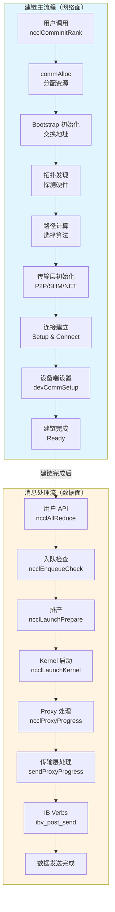

*图 1：NCCL 两大流程总览。建链主流程（蓝色）是一次性的初始化过程，消息处理流（橙色）是每次通信都要执行的流程。*

---

### 图 2：建链主流程详细时序图

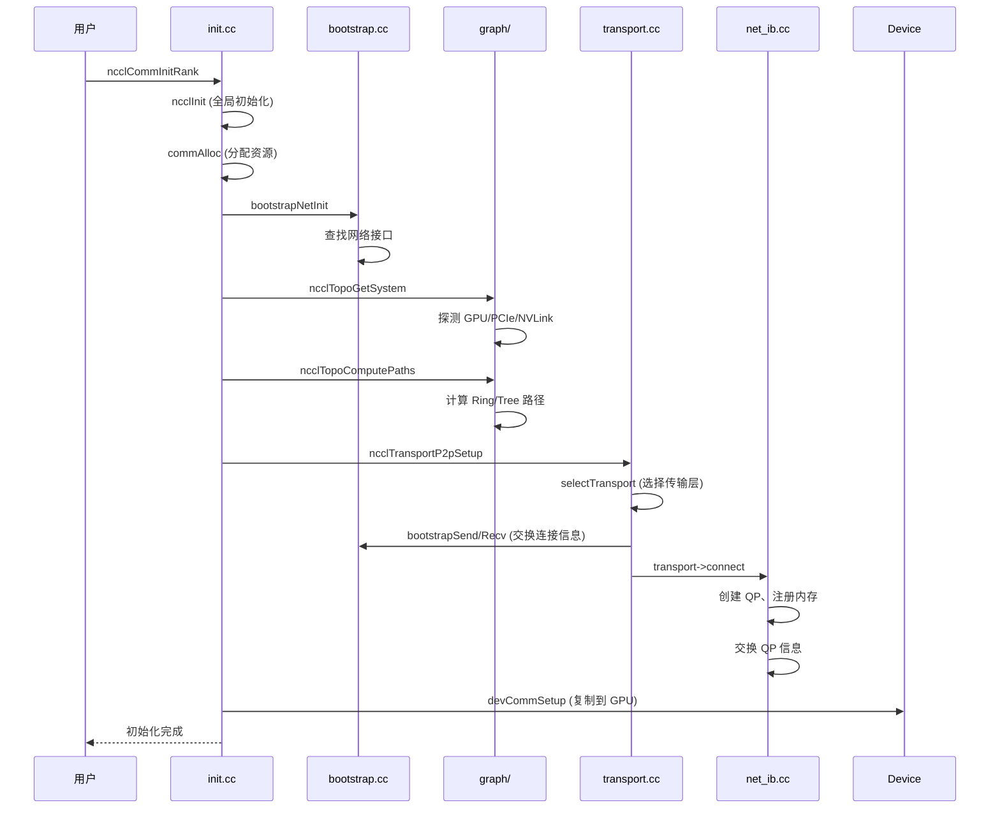

*图 2：建链主流程的详细时序图，展示了从用户 API 到设备端设置的完整调用链。*

---

### 图 3：消息处理流详细时序图

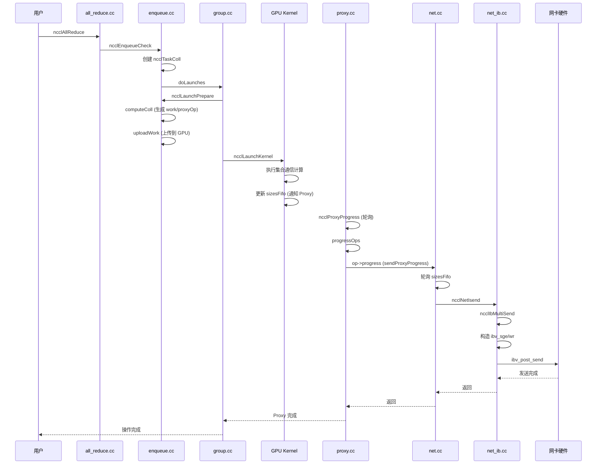

*图 3：消息处理流的详细时序图，展示了从用户 API 到 IB Verbs 的完整数据流。*

---

### 图 4：两大流程的模块关系图

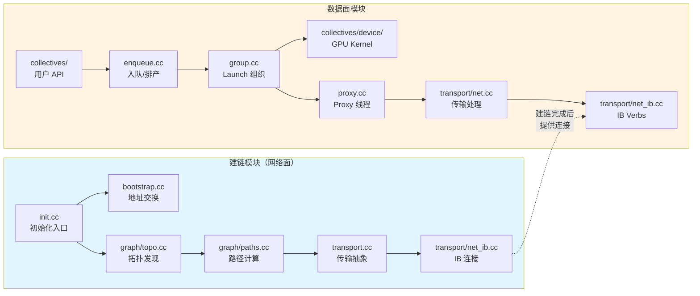

*图 4：两大流程的模块关系图，展示了各文件/模块的职责和依赖关系。*

---

### 如何将 Mermaid 导出为图片

1. **访问 Mermaid Live Editor**：打开 [https://mermaid.live/](https://mermaid.live/)
2. **粘贴代码**：将上述 Mermaid 代码块中的内容（去掉 ` ```mermaid ` 和 ` ``` `）粘贴到编辑器中
3. **预览**：编辑器会自动渲染图表
4. **导出**：点击右上角的 "Actions" → "Download PNG" 或 "Download SVG"
5. **保存路径**：建议保存到 `.claude/figures/NCCL两大流程/` 目录下，命名如：
   - `图1_两大流程总览.png`
   - `图2_建链主流程时序图.png`
   - `图3_消息处理流时序图.png`
   - `图4_模块关系图.png`

如果您的 Markdown 编辑器不支持 Mermaid 渲染，可以在文档中使用图片引用：
```markdown

```

---

## 第五步：为什么顺序是这样的？

### 问题：为什么 Bootstrap 在拓扑发现之前？

这是一个很好的问题！从直觉上看，似乎应该先探测本地硬件（拓扑发现），再建立远程连接（Bootstrap）。但 NCCL 的实际顺序是：**Bootstrap → AllGather1 → 拓扑发现**。

#### 原因分析

1. **拓扑发现需要全局信息**：
   - `ncclTopoGetSystem` 虽然主要探测**本地**硬件（GPU、PCIe、NVLink、NIC），但它需要知道**所有 rank 的 `busId`** 才能构建完整的跨节点拓扑图
   - 例如：rank 0 探测到本地有一个 GPU（busId=0x0001），但它需要知道 rank 1 的 GPU 的 busId 是多少，才能判断它们是否在同一节点、是否可以通过 P2P 通信

2. **AllGather1 需要 Bootstrap**：
   - `bootstrapAllGather` 需要先建立 Socket 连接（Bootstrap），才能进行 AllGather 操作
   - AllGather1 收集的信息包括：`hostHash`（判断是否同节点）、`busId`（GPU 标识）、`compCap`（计算能力）等

3. **执行顺序的依赖关系**：
   ```
   Bootstrap 初始化
     ↓ (建立 Socket 连接)
   AllGather1 (收集所有 rank 的 peerInfo)
     ↓ (获得所有 rank 的 busId)
   拓扑发现 (使用 busId 构建完整拓扑图)
   ```

#### 代码证据

```c
// src/init.cc:600-625
// 步骤1: Bootstrap初始化
NCCLCHECK(bootstrapInit(commId, comm));

// 步骤2: AllGather1 - 收集所有rank的peerInfo
NCCLCHECK(fillInfo(comm, comm->peerInfo+rank, commHash));  // 填充当前rank的peerInfo
NCCLCHECK(bootstrapAllGather(comm->bootstrap, comm->peerInfo, sizeof(struct ncclPeerInfo)));  // 收集所有rank的peerInfo

// 步骤3: 拓扑检测和系统图创建
// 此时 comm->peerInfo 已经包含所有 rank 的 busId
NCCLCHECK(ncclTopoGetSystem(comm, &comm->topo));  // 使用 peerInfo 构建完整拓扑
```

#### 类比说明

想象你要绘制一张"全国公司分布图"：
1. **Bootstrap**：先建立"全国通讯系统"（电话网络），让所有分公司能互相联系
2. **AllGather1**：让每个分公司报告自己的地址和工位号（busId）
3. **拓扑发现**：根据收集到的地址信息，绘制完整的"全国公司分布图"，标注哪些分公司在同一城市（同节点）、哪些可以通过高速公路连接（P2P）

如果顺序反过来（先拓扑发现，再 Bootstrap），就像在没有通讯系统的情况下，每个分公司只能画出自己的"本地地图"，无法知道其他分公司的位置，也就无法绘制完整的"全国地图"。

---

## 第六步：找出理解中的空白

### Q1: 建链主流程和数据面流程是完全独立的吗？

**A**: 不是。建链主流程为数据面流程提供基础设施：
- 建链时创建的 `ncclComm`、`ncclChannel`、连接信息（`ncclConnInfo`）等，在数据面流程中被持续使用
- 建链时选择的传输层（P2P/SHM/NET）决定了数据面流程中 `sendProxyProgress` 调用哪个传输层实现
- 建链时建立的 QP（Queue Pair）在数据面流程中被 `ibv_post_send` 使用

**类比**：建链是"修路"，数据面是"开车"。路修好了，车才能在上面跑。

---

### Q2: 为什么需要 Proxy 线程？GPU Kernel 不能直接调用 IB Verbs 吗？

**A**: 主要有两个原因：
1. **IB Verbs 是 CPU 接口**：`ibv_post_send` 等函数必须在 CPU 上执行，GPU Kernel 无法直接调用
2. **异步解耦**：Proxy 线程可以独立于 GPU Kernel 运行，实现异步的网络操作，提高并发性

**类比**：GPU Kernel 是"工厂工人"，Proxy 是"快递员"。工人专注于生产，快递员负责把产品送出去。

---

### Q3: `ncclLaunchPrepare` 中的"排产"具体是什么意思？

**A**: "排产"是指将用户提交的 `ncclTask` 转换为可执行的 `ncclKernelPlan`：
- **输入**：`comm->tasks` 队列中的 `ncclTaskColl` / `ncclTaskP2p`
- **处理**：调用 `computeColl` 选择算法/协议，生成 `ncclWorkElem`（GPU 工作）和 `ncclProxyOp`（Proxy 工作）
- **输出**：`ncclKernelPlan`，包含 `workQueue` 和 `proxyOpQueue`

**类比**：排产就像"生产计划员"把订单（task）拆解成具体的生产任务（work）和物流任务（proxyOp），分配给不同的部门。

---

### Q4: 建链流程中的"拓扑发现"和"路径计算"有什么区别？

**A**: 
- **拓扑发现**：探测硬件的物理连接关系，比如"GPU 0 通过 NVLink 连接到 GPU 1"，"GPU 0 通过 PCIe 连接到网卡"
- **路径计算**：根据拓扑信息，计算逻辑上的通信路径，比如"AllReduce 使用 Ring 算法，路径是 0→1→2→0"

**类比**：拓扑发现是"画地图"（标注所有道路），路径计算是"规划路线"（选择从 A 到 B 的最优路径）。

---

### Q5: 数据面流程中，GPU Kernel 和 Proxy 线程如何同步？

**A**: 主要通过共享内存的 FIFO 机制：
- **GPU → Proxy**：GPU Kernel 将数据写入共享内存，更新 `sizesFifo`，Proxy 轮询 `sizesFifo` 发现数据就绪
- **Proxy → GPU**：Proxy 接收数据后，更新 `recvFifo` 的 tail，GPU Kernel 轮询 tail 发现数据到达

**类比**：就像"信箱"机制——GPU 把信放进信箱（更新 sizesFifo），Proxy 定期检查信箱（轮询），发现信就取走。

---

### Q6: Bootstrap 的环和 channel 的环是一回事吗？阶段 7 为什么还要用 Bootstrap？

**A**: **不是一回事**。Bootstrap 初始化时建的是**控制面环**（按 rank 顺序 0→1→…→n-1→0），用来做 AllGather，拿到所有人的 listen 地址（`peerCommAddresses[]`）和 peerInfo。拓扑发现、路径计算、算法选择得到的是**数据面 channel**（例如 Ring 算法的逻辑环、Tree 的父子），channel 上的“邻居”（ring prev/next）和 Bootstrap 环的邻居不是同一批，且 channel 上的 peer 之间**此时没有建任何 socket 或 P2P/NET 连接**。所以在**阶段 7**才要按 channel 去**真正建连**；建连时需要交换连接信息（listen 地址、QP 信息等），此时唯一已经具备的能力就是 Bootstrap 提供的“能联系任意 rank”（`peerCommAddresses[peer]` + `bootstrapSend`/`bootstrapRecv`），所以阶段 7 交换连接信息**通过 Bootstrap** 完成。

**详见**：上文「阶段 3：Bootstrap 初始化与 AllGather1」下的 **「Bootstrap 与数据面 channel、阶段 7 的关系（Q&A）」**。

---

## 第七步：回顾和简化

### 核心流程总结

#### 建链主流程（网络面）- 8 步

1. **用户入口**：调用 `ncclCommInitRank` / `ncclCommInitAll`
2. **资源分配**：`commAlloc` 分配 `ncclComm`、内存、Stream、通道
3. **Bootstrap 初始化**：建立用于地址交换的 Socket 连接
4. **拓扑发现**：探测 GPU、PCIe、NVLink、网络接口的物理连接
5. **路径计算**：根据拓扑计算 Ring/Tree 等逻辑路径
6. **传输层初始化**：初始化 P2P、SHM、NET、CollNet 传输层
7. **连接建立**：为每个 channel 的每个 peer 建立连接，创建 QP、注册内存
8. **设备端设置**：将连接信息复制到 GPU 内存，供 Kernel 使用

#### 消息处理流（数据面）- 7 步

1. **用户 API**：调用 `ncclAllReduce` 等集合通信函数
2. **入队检查**：`ncclEnqueueCheck` 创建 `ncclTaskColl`，加入 `comm->tasks`
3. **排产**：`ncclLaunchPrepare` 将 task 转换为 `ncclKernelPlan`，生成 work 和 proxyOp
4. **Kernel 启动**：`ncclLaunchKernel` 上传 work 到 GPU，启动 CUDA Kernel
5. **Proxy 处理**：Proxy 线程轮询 `proxyOpQueue`，调用 `op->progress`
6. **传输层处理**：`sendProxyProgress` / `recvProxyProgress` 轮询 FIFO，调用 `ncclNetIsend` / `ncclNetIrecv`
7. **IB Verbs 调用**：`ncclIbIsend` 构造 Work Request，调用 `ibv_post_send` 提交给 HCA

---

### 关键概念

1. **`ncclComm`（通信器）**：NCCL 的核心数据结构，包含所有 rank 的连接信息、通道、内存池等，贯穿整个生命周期

2. **Bootstrap（引导）**：用于 rank 间初始通信的机制，通过 Socket 交换地址信息，为后续的传输层连接建立提供基础

3. **拓扑发现（Topology Discovery）**：探测硬件拓扑结构，包括 GPU、PCIe、NVLink、网络接口的位置和连接关系，用于选择最优的通信路径

4. **传输层（Transport）**：抽象层，支持多种传输方式（P2P、SHM、NET、CollNet），根据硬件拓扑自动选择最优方式

5. **Proxy 线程**：CPU 上的独立线程，负责处理网络操作，实现 GPU Kernel 和网络硬件的异步解耦

6. **排产（Launch Prepare）**：将用户任务（`ncclTask`）转换为可执行的计划（`ncclKernelPlan`），包含 GPU 工作（`ncclWork`）和 Proxy 工作（`ncclProxyOp`）

7. **IB Verbs**：InfiniBand 的底层 API，`ibv_post_send` / `ibv_post_recv` 用于向 HCA 提交 Work Request，实现 RDMA 通信

---

### 理解检查

1. **建链和数据面的关系**：建链流程创建了哪些资源，这些资源在数据面流程中如何被使用？

2. **Proxy 线程的作用**：为什么需要 Proxy 线程？GPU Kernel 和 Proxy 线程如何协作完成网络通信？

3. **排产的含义**：`ncclLaunchPrepare` 中的"排产"具体做了什么？输入是什么，输出是什么？

4. **拓扑发现 vs 路径计算**：拓扑发现和路径计算的区别是什么？它们分别解决了什么问题？

5. **数据流的完整路径**：从用户调用 `ncclAllReduce` 到数据通过网卡发送出去，完整的数据流路径是什么？

6. **传输层的选择**：NCCL 如何根据硬件拓扑选择传输层（P2P/SHM/NET）？选择的依据是什么？

7. **同步机制**：GPU Kernel 和 Proxy 线程之间如何同步？使用了哪些共享内存结构？

---

## 延伸阅读

### 相关文件

- **建链主流程**：
  - `src/init.cc` - 初始化入口
  - `src/bootstrap.cc` - Bootstrap 机制
  - `src/graph/topo.cc` - 拓扑发现
  - `src/graph/paths.cc` - 路径计算
  - `src/transport.cc` - 传输层抽象
  - `src/transport/net_ib.cc` - IB 传输实现

- **消息处理流**：
  - `src/collectives/all_reduce.cc` - 用户 API
  - `src/enqueue.cc` - 入队和排产
  - `src/group.cc` - Launch 组织
  - `src/collectives/device/all_reduce.cu` - GPU Kernel
  - `src/proxy.cc` - Proxy 线程
  - `src/transport/net.cc` - 传输层处理

### 相关文档

- `.claude/NCCL数据面阅读指南.md` - 数据面流程的详细阅读指南
- `.claude/费曼学习法_ncclEnqueueCheck与入队流程详解.md` - 入队流程的详细讲解
- `.claude/费曼学习法_ncclCommInitAll详解.md` - 初始化流程的详细讲解

---

## 版本与修订

- **v1.0** (2024-12-XX)：初版，梳理 NCCL 的两大核心流程：建链主流程（网络面）和消息处理流（数据面）
