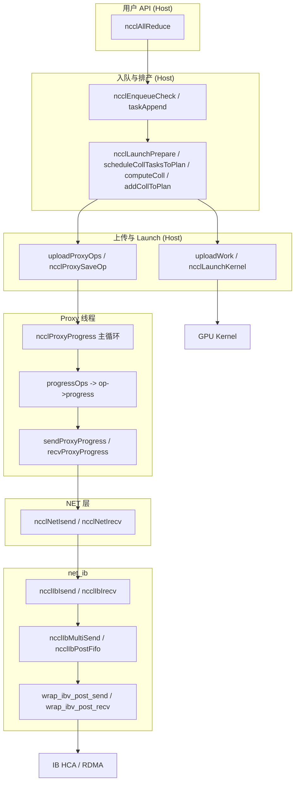

# NCCL 数据面阅读指南

本文档面向第一次跟读 NCCL **数据面**（从用户 API 到 `ibv_post_send`）的读者，给出主链路、阅读顺序、可跳过分支、grep 与跟读清单，并说明源码中的 `【数据面-第一次读】` / `【数据面-可后看】` 标记含义。

---

## 一、数据面主链路表

| 步骤 | 谁 → 谁 | 建议看的函数 | 文件 |
|------|---------|-------------|------|
| 1 | 用户 API → 入队 | `ncclEnqueueCheck`, `taskAppend` | `collectives/all_reduce.cc`, `enqueue.cc` |
| 2 | 入队 → 排产 | `ncclLaunchPrepare`, `scheduleCollTasksToPlan`, `computeColl`, `addCollToPlan` | `enqueue.cc` |
| 3 | 排产 → work/proxyOp | `addProxyOpIfNeeded`, `uploadWork`, `uploadProxyOps` | `enqueue.cc` |
| 4 | Host → Kernel / Proxy | `ncclLaunchKernel`, `hostStreamPlanTask` | `enqueue.cc`, `group.cc` |
| 5 | GroupEnd → doLaunches | `ncclGroupEndInternal`, `groupLaunch`, `doLaunches` | `group.cc` |
| 6 | Proxy 消费 op → net | `ncclProxyProgress`, `progressOps`, `op->progress` | `proxy.cc` |
| 7 | NET → IB Verbs | `sendProxyProgress`, `recvProxyProgress`, `ncclNetIsend`, `ncclNetIrecv` | `transport/net.cc` |
| 8 | IB 实现 | `ncclIbIsend`, `ncclIbMultiSend`, `ncclIbIrecv`, `ncclIbPostFifo`, `wrap_ibv_post_send`, `wrap_ibv_post_recv` | `transport/net_ib.cc` |

---

## 二、四阶段阅读顺序

### 阶段 1：入队与排产（Host，主线程）

| 目标 | 文件 | 函数 |
|------|------|------|
| 理解 coll 如何入队到 `comm->tasks`，以及 plan 里 work/proxyOp 的生成 | `enqueue.cc` | `ncclEnqueueCheck`, `taskAppend`, `ncclLaunchPrepare`, `scheduleCollTasksToPlan`, `computeColl`, `addCollToPlan`, `addProxyOpIfNeeded` |

### 阶段 2：work 上 GPU、proxyOp 交给 Proxy（Host）

| 目标 | 文件 | 函数 |
|------|------|------|
| 理解 work 如何进 `workFifoHeap`、Kernel 如何被启动，以及 proxyOp 如何经 `ncclProxySaveOp` 进入 Proxy | `enqueue.cc`, `group.cc` | `uploadWork`, `ncclLaunchKernel`, `hostStreamPlanTask`, `uploadProxyOps`, `doLaunches`, `groupLaunch`, `ncclGroupEndInternal` |

### 阶段 3：Proxy 消费 op、调 net（Proxy 线程）

| 目标 | 文件 | 函数 |
|------|------|------|
| 理解 Proxy 主循环如何拉取 op、对每个 op 调 `progress`，以及 `progress` 如何到 `ncclNetIsend`/`ncclNetIrecv` | `proxy.cc`, `transport/net.cc` | `ncclProxyProgress`, `progressOps`, `ncclProxyGetPostedOps`, `ProxyAppend`, `ncclProxySaveOp`（Ring 分支）, `sendProxyProgress`, `recvProxyProgress` |

### 阶段 4：net_ib 到 ibv_post_send（Proxy 线程）

| 目标 | 文件 | 函数 |
|------|------|------|
| 理解从 `ncclIbIsend`/`ncclIbIrecv` 到 `ibv_post_send`/`ibv_post_recv` 的路径 | `transport/net_ib.cc` | `ncclIbIsend`, `ncclIbMultiSend`, `ncclIbIrecv`, `ncclIbPostFifo`, `wrap_ibv_post_send`, `wrap_ibv_post_recv` |

---

## 三、建议第一次跟读的具体场景

- **集合操作**：`ncclAllReduce`
- **算法**：Ring（`ncclPatternRing` / `ncclPatternRingTwice`）
- **协议**：`NCCL_PROTO_SIMPLE`
- **传输**：NET/IB（`netTransport` → `ncclNetIb`）

这样可避开 Tree、LL/LL128、CollNet、P2P、Socket/SHM 等，先把「入队 → 排产 → uploadWork/uploadProxyOps → Proxy → net → ibv_post_send」这条骨架走通。

---

## 四、第一遍可先跳过的分支

| 类型 | 位置 / 说明 |
|------|-------------|
| 聚合 | `scheduleCollTasksToPlan` 里对多个 coll 的聚合、合并 |
| P2P | `scheduleP2pTasksToPlan`, `addP2pToPlan`, `ncclProxyComputeP2p`, `ncclProxySaveOp` 的 `ncclPatternSend`/`ncclPatternRecv` |
| LL / LL128 | `computeColl` 里对 LL/LL128 的选用，`sendProxyProgress`/`recvProxyProgress` 中 LL/LL128 就绪判断 |
| CollNet | `ncclProxySaveOp` 的 `ncclPatternCollnetChain`/`ncclPatternCollnetDirect`，以及 CollNet 传输实现 |
| Tree | `ncclProxySaveOp` 的 `ncclPatternTreeUp`/`ncclPatternTreeDown`/`ncclPatternTreeUpDown` |
| persistent / CUDA Graph | `ncclLaunchKernel` 等处的 persistent/graph 分支 |
| GDR Flush / 共享 buffer | `recvProxyProgress` 中 GDRCOPY flush、shared buffer 的 `sharedBuffersGet` 等 |

源码中上述位置已标 `【数据面-可后看】`，第一遍可跳过。

---

## 五、Grep 命令汇总

便于快速定位数据面关键符号（在 `src/` 下执行）：

```bash
# 入队、work、plan
rg 'workQueue|workFifoHeap|uploadWork' --type-add 'cc:*.cc' -t cc

# proxyOp、Proxy 队列
rg 'proxyOpQueue|proxyOp|ncclProxySaveOp|ncclLocalOpAppend|ncclProxyPost' --type-add 'cc:*.cc' -t cc

# NET 层 Isend/Irecv
rg 'ncclNetIsend|ncclNetIrecv|ncclNetTest' --type-add 'cc:*.cc' -t cc

# Proxy 主循环与 progress
rg 'progressOps|op->progress|ncclProxyGetPostedOps' --type-add 'cc:*.cc' -t cc

# IB 与 ibv
rg 'ibv_post_send|ibv_post_recv|wrap_ibv_post_send|ncclIbIsend|ncclIbMultiSend' --type-add 'cc:*.cc' -t cc
```

---

## 六、第一次跟读清单（7 步）

按顺序在对应文件里找到下列函数或调用，即可串起整条数据面：

| # | 目标 | 文件 | 函数 / 位置 |
|---|------|------|-------------|
| 1 | 入队入口 | `enqueue.cc` | `ncclEnqueueCheck` → `taskAppend` |
| 2 | 排产与 work/proxyOp 生成 | `enqueue.cc` | `ncclLaunchPrepare` → `scheduleCollTasksToPlan` → `computeColl` → `addCollToPlan` |
| 3 | work 上 GPU、proxyOp 提交 | `enqueue.cc` | `uploadWork`, `ncclLaunchKernel`, `hostStreamPlanTask` → `uploadProxyOps` |
| 4 | GroupEnd 触发 launch | `group.cc` | `ncclGroupEndInternal` → `groupLaunch` → `doLaunches` |
| 5 | Proxy 消费 op、调 progress | `proxy.cc` | `ncclProxyProgress` 主循环 → `progressOps` → `op->progress`；`ncclProxyGetPostedOps` → `ProxyAppend` |
| 6 | NET 调 Isend/Irecv | `transport/net.cc` | `sendProxyProgress` 中 `ncclNetIsend`；`recvProxyProgress` 中 `ncclNetIrecv` |
| 7 | IB 到 ibv_post_send | `transport/net_ib.cc` | `ncclIbIsend` → `ncclIbMultiSend` → `wrap_ibv_post_send`；`ncclIbIrecv` → `wrap_ibv_post_recv`、`ncclIbPostFifo` → `wrap_ibv_post_send` |

---

## 七、最小 5～6 个函数（时间很少时）

若时间紧张，优先只看这几处即可摸清数据面骨架：

| # | 函数 | 文件 | 作用 |
|---|------|------|------|
| 1 | `ncclEnqueueCheck` | `enqueue.cc` | 入队入口，到 `taskAppend` |
| 2 | `computeColl` | `enqueue.cc` | 产出 work、proxyOp，选算法/协议 |
| 3 | `uploadWork` / `uploadProxyOps` | `enqueue.cc` | work 上 GPU、proxyOp 交 Proxy |
| 4 | `ncclProxyProgress` + `progressOps` | `proxy.cc` | Proxy 主循环，对 op 调 `progress` |
| 5 | `sendProxyProgress` | `transport/net.cc` | 轮询 sizesFifo，调 `ncclNetIsend` |
| 6 | `ncclIbMultiSend` | `transport/net_ib.cc` | 填 WR/sge，`wrap_ibv_post_send` |

---

## 八、源码中的标记说明

在 `enqueue.cc`、`group.cc`、`proxy.cc`、`transport/net.cc`、`transport/net_ib.cc` 中使用了两种标记：

| 标记 | 含义 | 用法 |
|------|------|------|
| `【数据面-第一次读】` | 第一遍跟读数据面时**优先看**的代码块、函数或调用 | 入队、排产、uploadWork/uploadProxyOps、Proxy 主循环与 `progressOps`、`ncclProxySaveOp` 的 Ring/Pipeline 分支、`sendProxyProgress`/`recvProxyProgress`、`ncclNetIsend`/`ncclNetIrecv`、`ncclIbIsend`/`ncclIbMultiSend`/`ncclIbIrecv`/`ncclIbPostFifo`、`wrap_ibv_post_send`/`wrap_ibv_post_recv` |
| `【数据面-可后看】` | 第一遍可**跳过**，骨架清楚后再看 | 聚合、P2P、Tree、CollNet、LL/LL128、GDR Flush、shared 等 |

可用工程内搜索 `【数据面-第一次读】`、`【数据面-可后看】` 快速定位。

---

## 九、从 ncclAllReduce 到 ibv_post_send 的简化流程（Mermaid）



---

## 十、相关文档

- `.claude/ncclAllReduce_to_ncclIbIsend_flow.md`：从 `ncclAllReduce` 到 `ncclIbIsend` 的步骤说明与交接点。
- `CLAUDE.md`：项目级说明，要求按「用户 API → Kernel → Proxy → IB Verbs」做数据链路追踪。

---

**文档版本：** 1.0  
**与源码标记对应的提交：** 与 `【数据面-第一次读】`、`【数据面-可后看】` 标记同步更新。
