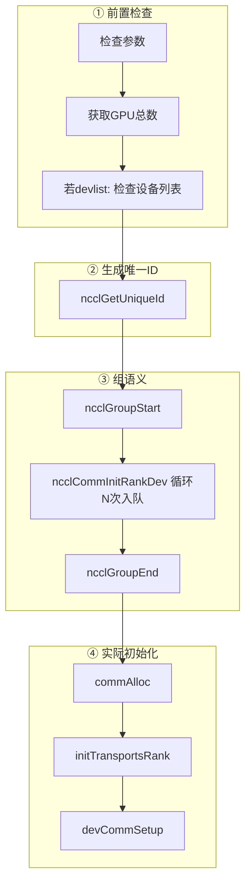
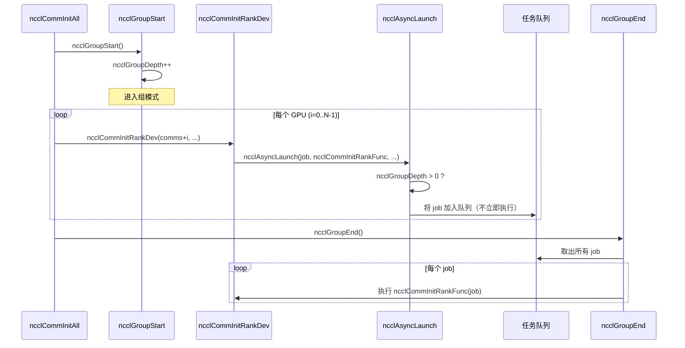
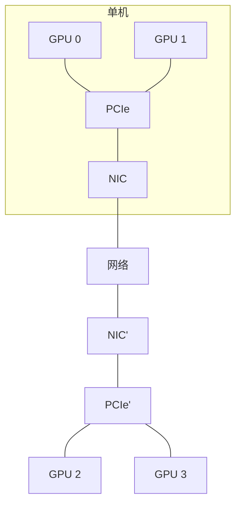
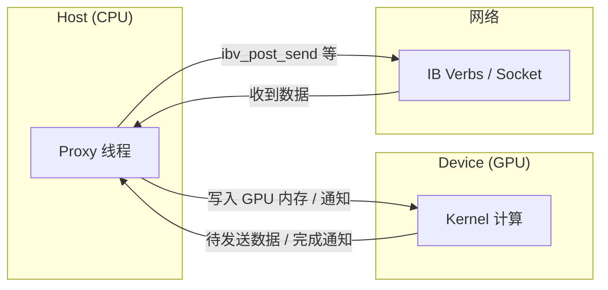
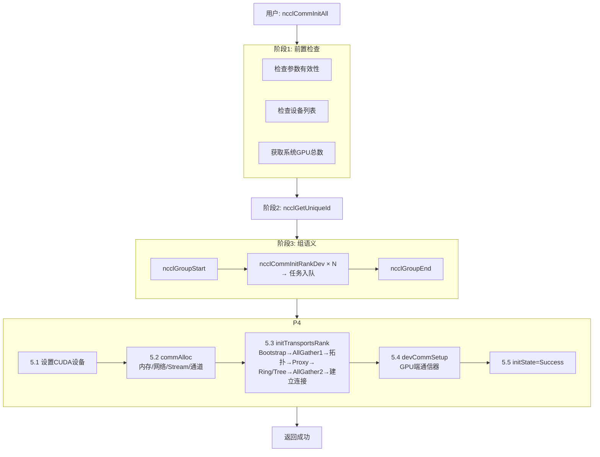
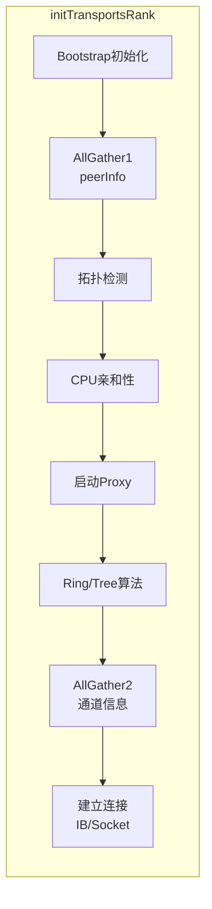
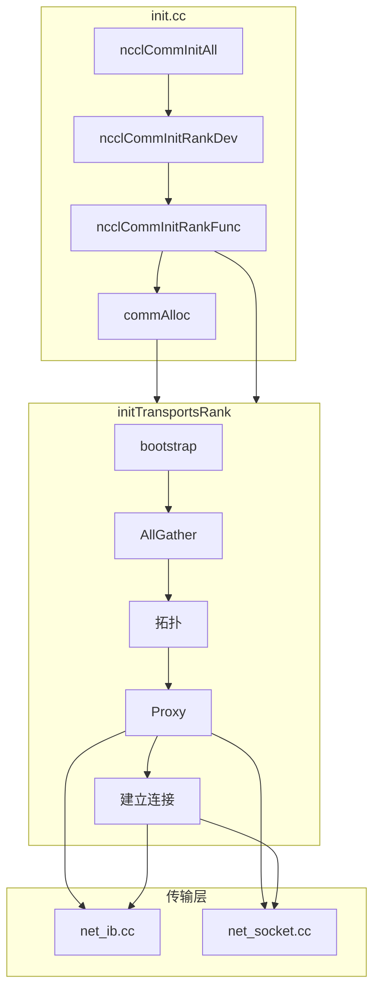

# 费曼学习法：ncclCommInitAll() 完整流程讲解

## 🎯 第一步：用最简单的语言解释（给12岁孩子听）

### 问题：什么是 ncclCommInitAll？

想象你要组织一个**多GPU团队**一起工作：

**场景：**
- 你有4个GPU（就像4个工人）
- 它们需要互相通信、协作完成任务
- 但是它们一开始互不认识，不知道如何联系

**ncclCommInitAll 的作用：**
就像给这4个工人建立一个"微信群"，让它们：
1. 互相认识（知道对方的地址）
2. 建立联系通道（知道怎么打电话给对方）
3. 准备好协作工具（准备好对讲机、工作流程）

---

## 📖 第二步：用生活场景类比

### 类比：建立公司内部通讯系统

```
ncclCommInitAll() = 建立公司内部通讯系统

步骤1: 检查设备（检查员工）
  └─> 确保每个GPU都是有效的，没有重复

步骤2: 生成公司ID（生成唯一标识）
  └─> 创建一个"公司编号"，所有员工共享

步骤3: 为每个员工建立档案（初始化每个通信器）
  └─> 为每个GPU创建"员工档案"（通信器对象）

步骤4: 建立内部电话系统（建立网络连接）
  └─> 让每个GPU知道如何联系其他GPU（IB/Socket连接）

步骤5: 启动后勤部门（启动Proxy线程）
  └─> 启动一个"后勤部门"负责数据搬运
```

### 总体流程概览（Mermaid 图）

> 可在 [Mermaid Live](https://mermaid.live/) 中粘贴代码，导出为 PNG/SVG 后插入到笔记或演示中。



*图1：ncclCommInitAll 四阶段总览。从检查设备到组内统一初始化，最后完成每个 rank 的资源分配与传输层建立。*

---

## 🔍 第三步：逐步深入技术细节

### 阶段1：前置检查（检查设备）

```c
// 就像检查员工名单
ncclCommInitAll(comms, 4, [0, 1, 2, 3])
```

**在做什么：**
1. ✅ 检查 `comms` 指针是否有效
2. ✅ 检查设备数量 `ndev` 是否合理（> 0）
3. ✅ 获取系统总GPU数
4. ✅ 如果提供了设备列表，检查：
   - 设备ID是否有效（不能是负数或超出范围）
   - 是否有重复设备（不能两个rank用同一个GPU）

**类比：**
- 就像HR检查员工名单，确保：
  - 名单不为空
  - 每个员工编号都有效
  - 没有重复的员工编号

---

### 阶段2：生成唯一通信ID

```c
ncclUniqueId uniqueId;
ncclGetUniqueId(&uniqueId);
```

**在做什么：**
- 生成一个128字节的唯一ID
- 这个ID标识一个"通信组"
- 所有要加入这个组的GPU必须使用相同的ID

**类比：**
- 就像创建一个"公司编号"
- 所有员工必须知道这个编号才能加入公司
- 不同公司有不同的编号

**为什么需要？**
- 在多进程场景下，不同进程的GPU需要知道它们属于同一个通信组
- 通过共享这个ID，它们可以找到彼此

---

### 阶段3：组语义包装（同步初始化）

```c
ncclGroupStart();  // 开始一个"组"
for (int i=0; i<ndev; i++) {
  ncclCommInitRankDev(...);  // 为每个GPU初始化
}
ncclGroupEnd();  // 执行所有初始化
```

**在做什么：**
- `ncclGroupStart()`: 进入"组模式"
- 循环为每个GPU调用 `ncclCommInitRankDev()`
- `ncclGroupEnd()`: 统一执行所有初始化任务

**为什么需要组语义？**
- 在单线程中初始化多个通信器需要同步
- 如果不用组语义，每个初始化会立即执行，可能导致：
  - 某些GPU还没准备好，其他GPU就开始连接
  - 连接顺序混乱

**类比：**
- 就像组织一个会议：
  - 不用组语义：每个人到了就立即开始讨论（混乱）
  - 用组语义：等所有人都到了，再统一开始（有序）

**执行机制：**



*图2：组语义执行机制。Start 后多次 InitRank 只入队，GroupEnd 时再统一执行，保证多 rank 同步初始化。*

---

### 阶段4：单个Rank初始化（ncclCommInitRankDev）

这是每个GPU初始化的核心函数：

#### 4.1 环境变量检查

```c
char* env = getenv("NCCL_COMM_ID");
if (env && myrank == 0) {
  bootstrapCreateRoot(&commId, true);
}
```

**在做什么：**
- 检查是否设置了 `NCCL_COMM_ID` 环境变量
- 如果设置了，使用环境变量中的ID（通常用于调试）

**类比：**
- 就像检查是否有"特殊指令"
- 如果有，就按照特殊指令执行

---

#### 4.2 全局初始化

```c
ncclInit();
```

**在做什么：**
- 初始化全局资源（只执行一次，用互斥锁保护）：
  - GDR（GPU Direct RDMA）支持
  - 网络插件（IB、Socket等）
  - Bootstrap网络

**类比：**
- 就像初始化公司的"基础设施"
- 只需要初始化一次，所有员工共享

---

#### 4.3 创建通信器对象

```c
ncclCalloc(&comm, 1);  // 分配通信器结构体
ncclCudaHostCalloc((uint32_t**)&comm->abortFlag, 1);  // 分配中止标志
*comm->abortFlag = 0;
comm->initState = ncclInternalError;  // 初始状态为错误
```

**在做什么：**
- 分配 `ncclComm` 结构体（通信器的"档案"）
- 分配 `abortFlag`（用于GPU检查是否需要中止）
- 设置初始状态为错误（只有成功后才改为成功）

**类比：**
- 就像创建"员工档案"
- 先标记为"未完成"，等所有手续办完才标记为"完成"

---

#### 4.4 异步启动初始化任务

```c
ncclAsyncLaunch(&job->base, ncclCommInitRankFunc, ...);
```

**在做什么：**
- 创建一个异步任务
- 如果不在组内：立即执行
- 如果在组内：加入队列，等 `ncclGroupEnd()` 时统一执行

**类比：**
- 就像提交一个"工作申请"
- 如果不在组内：立即处理
- 如果在组内：等所有申请都提交后，统一处理

---

### 阶段5：实际初始化执行（ncclCommInitRankFunc）

这是真正执行初始化的函数：

#### 5.1 设置CUDA设备

```c
cudaSetDevice(cudaDev);
cudaDeviceSetLimit(cudaLimitStackSize, maxLocalSizeBytes);
```

**在做什么：**
- 切换到指定的CUDA设备
- 设置Kernel栈大小限制（避免内存重配置）

**类比：**
- 就像告诉工人"你现在在这个工位工作"
- 设置好工作台的大小

---

#### 5.2 分配通信器资源（commAlloc）

```c
commAlloc(newcomm, nranks, myrank);
```

**在做什么：**

**5.2.1 内存管理初始化**
```c
ncclMemoryStackConstruct(&comm->memPermanent);  // 永久内存栈
ncclMemoryStackConstruct(&comm->memScoped);     // 作用域内存栈
```

**5.2.2 网络层初始化**
```c
ncclNetInit(comm);  // 初始化网络抽象层（检测IB/Socket等）
```

**5.2.3 CUDA Stream创建**
```c
ncclStrongStreamConstruct(&comm->deviceStream);  // GPU Kernel用
ncclStrongStreamConstruct(&comm->hostStream);    // Host操作用
```

**5.2.4 获取GPU信息**
```c
cudaGetDevice(&comm->cudaDev);  // 获取CUDA设备ID
getBusId(comm->cudaDev, &comm->busId);  // 获取PCIe Bus ID
```

**5.2.5 内存池初始化**
```c
ncclMemoryPoolConstruct(&comm->memPool_ncclKernelPlan);
ncclMemoryPoolConstruct(&comm->memPool_ncclProxyOp);
```

**5.2.6 通道初始化**
```c
for (int c=0; c < MAXCHANNELS; c++) 
  comm->channels[c].id = -1;  // 标记为未初始化
```

**类比：**
- 就像给员工准备：
  - 办公桌（内存管理）
  - 电话系统（网络层）
  - 工作流程（CUDA Stream）
  - 工牌（GPU信息）
  - 工具箱（内存池）
  - 工作通道（通道）

---

#### 5.3 初始化传输层（initTransportsRank）- **最复杂！**

这是最核心的部分，负责建立所有GPU之间的连接：

##### 5.3.1 Bootstrap初始化

```c
bootstrapInit(commId, comm);
```

**在做什么：**
- 建立进程间通信机制
- 在单进程多GPU场景下，用于rank间的同步

**类比：**
- 就像建立"内部通讯系统的基础设施"
- 让所有员工知道如何互相联系

---

##### 5.3.2 AllGather1 - 收集所有rank的信息

```c
// 分配peerInfo数组
ncclCalloc(&comm->peerInfo, nranks+1);

// 填充当前rank的信息
fillInfo(comm, comm->peerInfo+rank, commHash);
// 包含：hostHash, busId, compCap等

// 通过Bootstrap收集所有rank的信息
bootstrapAllGather(comm->bootstrap, comm->peerInfo, sizeof(struct ncclPeerInfo));
```

**在做什么：**
- 每个rank填写自己的信息（hostHash、busId、计算能力等）
- 通过AllGather操作，所有rank都能看到其他rank的信息

**类比：**
- 就像让每个员工填写"个人信息表"
- 然后通过"内部广播"让所有人都能看到其他人的信息
- 这样每个人都知道：
  - 谁在哪个工位（busId）
  - 谁在同一台机器上（hostHash）
  - 谁的能力更强（compCap）

**检查重复GPU：**
```c
for (int i = 0; i < nranks; i++) {
  if (重复的GPU) {
    WARN("Duplicate GPU detected");
    return error;
  }
}
```

---

##### 5.3.3 拓扑检测

```c
ncclTopoGetSystem(comm, &comm->topo);        // 获取系统拓扑
ncclTopoComputePaths(comm->topo, comm);      // 计算路径
ncclTopoTrimSystem(comm->topo, comm);            // 修剪拓扑
ncclTopoComputePaths(comm->topo, comm);      // 重新计算路径
ncclTopoSearchInit(comm->topo);              // 初始化搜索
```



*图3：拓扑抽象示意。拓扑检测会得到 GPU、NIC、PCIe 及网络连接，用于选路和 Ring/Tree 构造。*

**在做什么：**
- 检测系统拓扑结构：
  - GPU的位置（哪个PCIe插槽）
  - NIC（网卡）的位置
  - CPU的位置
  - PCIe交换机的连接关系
- 计算GPU与NIC之间的最优路径
- 移除不可达的GPU和未使用的NIC

**类比：**
- 就像绘制"公司地图"
- 标记：
  - 每个工位（GPU）在哪里
  - 网络接口（NIC）在哪里
  - 它们之间怎么连接（PCIe交换机）
- 找出从工位A到网络接口的最短路径

**为什么重要？**
- 知道拓扑后，可以选择最优的通信路径
- 例如：两个GPU在同一台机器上，可以用P2P（点对点）通信，更快
- 不同机器上的GPU，需要通过NIC和网络

---

##### 5.3.4 CPU亲和性设置

```c
ncclTopoGetCpuAffinity(comm->topo, comm->rank, &comm->cpuAffinity);
sched_setaffinity(0, sizeof(cpu_set_t), &comm->cpuAffinity);
```

**在做什么：**
- 将CPU线程绑定到与GPU相近的CPU核心
- 这样分配的所有Host内存都是"本地"的（在同一个NUMA节点）

**类比：**
- 就像让"后勤人员"（CPU线程）坐在离"工位"（GPU）最近的办公室
- 这样拿东西（访问内存）更快

**为什么重要？**
- NUMA架构下，访问本地内存比跨NUMA节点快得多
- 可以显著提高性能

---

##### 5.3.5 启动Proxy线程

```c
ncclProxyCreate(comm);
```

**在做什么：**
- 启动一个CPU线程（Proxy线程）
- 这个线程负责：
  - 处理网络通信（调用IB Verbs API，如 `ibv_post_send`）
  - 管理数据移动（Host <-> GPU <-> Network）
  - 处理异步操作

**类比：**
- 就像启动"后勤部门"
- 负责：
  - 发送/接收数据包（网络通信）
  - 在GPU和网络之间搬运数据
  - 处理各种杂务（异步操作）

**为什么需要？**
- GPU Kernel专注于计算，不能直接调用网络API
- Proxy线程在CPU上运行，可以调用IB Verbs等网络API
- 它们协作：GPU计算，Proxy搬运数据



*图4：Proxy 与 GPU Kernel、网络的协作。Kernel 只做计算和本地搬移，Proxy 负责调用 IB/Socket 做网络收发。*

---

##### 5.3.6 计算通信算法（Ring/Tree）

```c
// 计算Ring算法
struct ncclTopoGraph ringGraph;
ringGraph.pattern = NCCL_TOPO_PATTERN_RING;
ncclTopoCompute(comm->topo, &ringGraph);

// 计算Tree算法
struct ncclTopoGraph treeGraph;
treeGraph.pattern = NCCL_TOPO_PATTERN_TREE;
ncclTopoCompute(comm->topo, &treeGraph);
```

**在做什么：**
- 根据拓扑结构，计算最优的Ring和Tree算法
- Ring：所有GPU连成一个环
- Tree：所有GPU连成一棵树

**类比：**
- 就像规划"工作流程"
- Ring：每个人把工作传给下一个人，形成循环
- Tree：工作从叶子节点向上汇聚，再从根节点向下分发

---

##### 5.3.7 AllGather2 - 收集通道和拓扑信息

```c
// 收集：nChannels, graphInfo, topoRanks
bootstrapAllGather(...);
```

**在做什么：**
- 收集所有rank的通道数、图信息、拓扑rank等
- 确保所有rank都知道最终的通信配置

---

##### 5.3.8 建立传输连接

```c
// 建立IB连接
ncclIbSetup(comm, &ringGraph, &treeGraph);

// 或建立Socket连接
ncclSocketSetup(comm, &ringGraph, &treeGraph);
```

**在做什么：**
- 根据选择的传输方式（IB或Socket），建立实际的网络连接
- 对于IB：创建QP（Queue Pair）、注册内存等
- 对于Socket：建立TCP连接

**类比：**
- 就像实际"接通电话线"
- IB：建立高速专用线路（像专线电话）
- Socket：建立普通网络连接（像普通电话）

---

#### 5.4 设备端通信器设置（devCommSetup）

```c
devCommSetup(*newcomm);
```

**在做什么：**
- 在GPU内存中分配设备端通信器结构
- 将Host端的通信器信息复制到GPU内存
- 这样GPU Kernel可以直接访问通信器信息

**类比：**
- 就像给GPU准备一个"工作手册"
- 放在GPU能直接看到的地方（GPU内存）
- GPU工作时可以直接查阅

---

#### 5.5 标记初始化完成

```c
comm->initState = ncclSuccess;
```

**在做什么：**
- 将通信器状态从 `ncclInternalError` 改为 `ncclSuccess`
- 表示初始化成功

---

## 🎨 第四步：可视化流程图

### 主流程（Mermaid flowchart）



*图5：ncclCommInitAll 主流程。从参数检查到组内统一执行 ncclCommInitRankFunc，完成每个 rank 的 alloc、initTransports、devCommSetup。*

### initTransportsRank 子流程（Mermaid flowchart）



*图6：initTransportsRank 内部步骤。先收集 peer 信息与拓扑，再起 Proxy、算算法，最后建立传输连接。*

### 模块与数据流（Mermaid 模块图）



*图7：init.cc、initTransportsRank 与传输层（net_ib / net_socket）的调用与数据流关系。*

---

### 如何将 Mermaid 导出为图片

本文档中的图 1–7 均为 **Mermaid** 代码块，可导出为 PNG/SVG 用于讲义、博客或 Notion/语雀等：

1. **在线编辑与导出**
   - 打开 [Mermaid Live Editor](https://mermaid.live/)
   - 复制对应 ` ```mermaid ` 与 ` ``` ` 之间的整段代码
   - 粘贴到编辑区，右侧即预览
   - 点击 **Actions → PNG / SVG** 下载

2. **在 Markdown 中嵌图（若编辑器不支持 Mermaid）**
   - 将导出的图片保存到例如：`.claude/figures/ncclCommInitAll_图5_主流程.png`
   - 在文档中引用：``

3. **目录建议**
   - 在 `.claude/figures/` 下按主题建子目录，如：`ncclCommInitAll/`、`initTransportsRank/`
   - 图片命名：`{主题}_{图号}_{简短描述}.png`，便于与文档中的「图X」对应

---

## 🧩 第五步：找出理解中的空白

### 空白1：为什么需要两次AllGather？

**答案：**
- **AllGather1**: 收集基础信息（peerInfo），用于拓扑检测
- **AllGather2**: 收集计算后的信息（通道数、图信息），用于建立连接

**类比：**
- 第一次：收集"员工基本信息"（姓名、工位）
- 第二次：收集"工作分配结果"（谁负责什么、怎么协作）

---

### 空白2：Proxy线程和GPU Kernel如何协作？

**答案：**
- **GPU Kernel**: 执行计算和数据移动（GPU内存之间）
- **Proxy线程**: 处理网络通信（调用IB Verbs API）
- **协作方式**:
  - GPU Kernel将数据准备好，通知Proxy
  - Proxy调用 `ibv_post_send` 发送数据
  - 接收数据时，Proxy接收后通知GPU

**类比：**
- GPU Kernel = 工人（计算和搬运）
- Proxy = 快递员（网络传输）
- 工人把包裹准备好，交给快递员发送

---

### 空白3：Ring和Tree算法如何选择？

**答案：**
- 根据数据大小、网络带宽、GPU数量等因素
- 小数据：Ring（延迟低）
- 大数据：Tree（带宽利用率高）
- NCCL会自动选择最优算法

---

## 📚 第六步：回顾和简化

### 核心流程总结

```
1. 检查设备 ✅
2. 生成唯一ID 🆔
3. 进入组模式 📦
4. 为每个GPU创建通信器对象 📝
5. 统一执行初始化 🚀
   ├─ 分配资源
   ├─ 建立连接（最复杂！）
   └─ GPU端设置
6. 完成！🎉
```

### 关键概念

1. **组语义（Group Semantics）**
   - 用于同步多个初始化操作
   - 确保所有GPU同时准备好

2. **拓扑检测（Topology Detection）**
   - 了解系统结构（GPU、NIC、CPU的位置）
   - 选择最优通信路径

3. **Proxy线程**
   - CPU线程，负责网络通信
   - GPU Kernel专注于计算

4. **传输层初始化**
   - 建立IB/Socket连接
   - 创建QP、注册内存等

### 为什么这么复杂？

**因为要处理：**
- 多GPU（可能在不同机器上）
- 多种网络（IB、Socket、P2P）
- 多种算法（Ring、Tree）
- 异步操作（GPU和CPU协作）

**类比：**
- 就像建立一个"跨国公司"
- 需要处理：
  - 多个办公室（多GPU）
  - 多种通讯方式（IB、Socket）
  - 多种工作流程（Ring、Tree）
  - 跨部门协作（GPU和CPU）

---

## ✅ 最终理解检查

**你能回答这些问题吗？**

1. ✅ 为什么需要组语义？
2. ✅ 拓扑检测在做什么？
3. ✅ Proxy线程的作用是什么？
4. ✅ 为什么需要两次AllGather？
5. ✅ GPU如何知道其他GPU的地址？

**如果都能回答，说明你已经理解了！** 🎉
