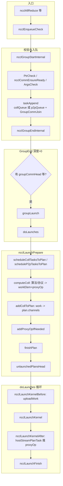
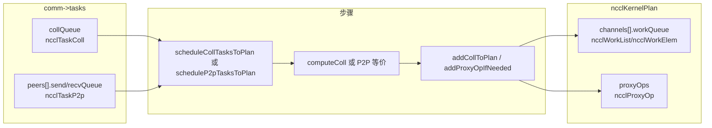
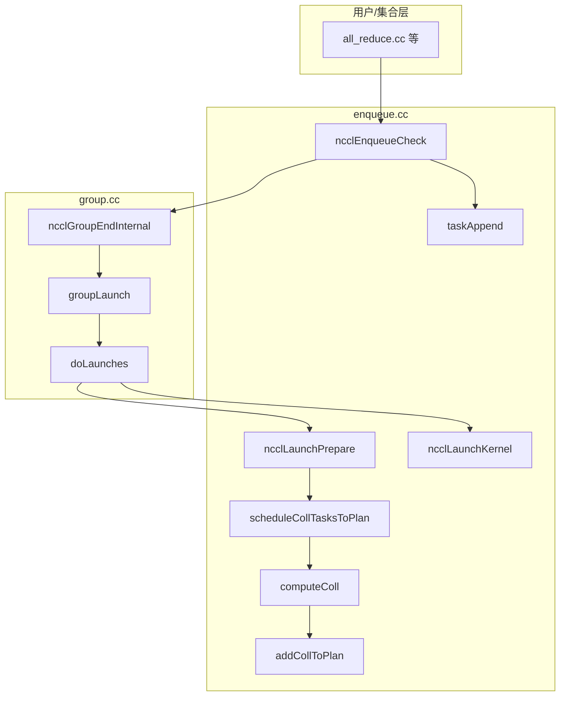
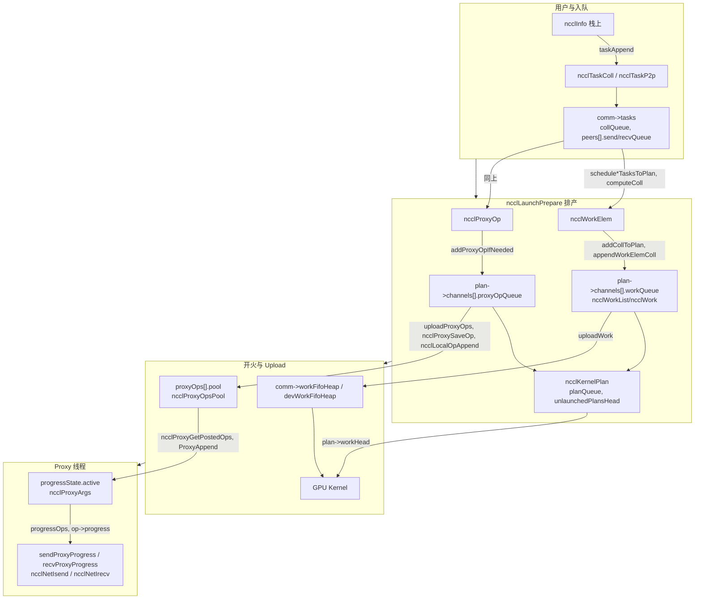

# 费曼学习法：ncclEnqueueCheck 与入队流程

---

## 第一步：用最简单的语言解释（给12岁孩子听）

### 问题：ncclEnqueueCheck 和「入队」在干什么？

想象你在**外卖平台**下单：

1. **你点菜**（用户调 `ncclAllReduce`）：选好菜、地址、份数。
2. **前台检查**（`ncclEnqueueCheck`）：看看订单有没有写错、餐厅接不接单、地址有没有问题。
3. **订单挂到「待做」板**（`taskAppend`）：把你的单子贴到厨房的「待做」列表里，**先不立刻做**。
4. **你点「提交订单」**（相当于一次 `ncclGroupEnd`）：如果只点了一道菜，就立刻开始做；如果点了一桌菜，就等**整桌一起**开始做。
5. **厨房排产**（`ncclLaunchPrepare`）：把「待做」里的单子，排成一份份**具体工作**：用几个灶、每个灶做什么、要哪些材料、几号出菜。
6. **真正开火**（`ncclLaunchKernel` 等）：按排好的工作开炒、出菜。

** ncclEnqueueCheck** 就是：**前台帮你检查订单，并把订单挂到「待做」**。  
**入队** 整条线就是：**从「挂到待做」到「厨房排产、开火」** 的过程。

---

## 第二步：用生活场景类比

### 类比：餐厅的「下单 → 待做 → 排产 → 出菜」

| 技术步骤 | 类比 |
|----------|------|
| 用户调 `ncclAllReduce` 等 | 顾客点菜（菜名、份数、桌号） |
| `ncclEnqueueCheck` | 前台：检查订单、餐厅是否营业、桌号是否有效 |
| `ncclGroupStartInternal` | 打开「本桌点菜中」的牌子 |
| `taskAppend` | 把一道菜挂到本桌的「待做」板，并把本桌登记到「有待做菜的桌号」 |
| `ncclGroupEndInternal` | 顾客说「就这些，上菜吧」→ 本桌点菜结束 |
| `groupLaunch` → `doLaunches` | 厨房调度：按「有待做菜的桌」一批批处理 |
| `ncclLaunchPrepare` | 排产：把待做变成**每道菜用几个灶、每个灶的步骤**（`ncclKernelPlan`） |
| `computeColl` | 定这道菜用哪种做法（算法 Ring/Tree）、哪种火候（协议 Simple/LL/LL128） |
| `ncclLaunchKernel` | 按排产开火：起 GPU Kernel |
| Proxy 推 `ncclProxyOp` | 需要「传菜」的步骤：把做好的菜从厨房传到网卡、再传到别的店（网络） |

**一句话**：`ncclEnqueueCheck` 负责**查单 + 把单挂上待做**；真正**排产、开火、传菜**，要等 `ncclGroupEnd` 触发，在 `groupLaunch` → `ncclLaunchPrepare` → `ncclLaunchKernel` 这条线里完成。

---

## 第三步：逐步深入技术细节

### 阶段 1：ncclEnqueueCheck 的入口与校验

**在做什么**：所有集合（AllReduce、Broadcast、Send/Recv 等）都只填一个 `ncclInfo`，然后调 `ncclEnqueueCheck(&info)`。这里做**入队前的检查**，并把任务交给 `taskAppend`。

**代码位置**：`src/enqueue.cc:1437`（`ncclEnqueueCheck`）；各集合在 `src/collectives/*.cc` 里填 `ncclInfo` 并调用。

**关键代码片段**：

```c
// src/enqueue.cc:1437
ncclResult_t ncclEnqueueCheck(struct ncclInfo* info) {
  NCCLCHECK(ncclGroupStartInternal());   // 进入组：本调用的「待做」归属到当前 Group
  // ...
  NCCLCHECKGOTO(PtrCheck(info->comm, info->opName, "comm"), ret, fail);
  NCCLCHECKGOTO(ncclCommEnsureReady(info->comm), ret, fail);  // 通信器是否已初始化完成
  NCCLCHECKGOTO(ArgsCheck(info), ret, fail);                  // 参数：sendbuff/recvbuff/count/datatype/op/root 等
  NCCLCHECKGOTO(taskAppend(info->comm, info), ret, fail);     // 把本操作挂到 comm->tasks
  // ...
  NCCLCHECK(ncclGroupEndInternal());     // 组深度 -1；若深度变 0，触发 groupLaunch
  return ret;
}
```

**类比**：前台先确认「餐厅在营业、桌号有效、订单没写错」，再把你这道菜挂到本桌的待做板，并登记本桌；最后「本桌点菜」计数 -1，若本桌点菜结束，就通知厨房开始处理这一桌。

---

### 阶段 2：taskAppend——把操作挂到 comm->tasks

**在做什么**：把一次集合或 P2P 转成一个 **`ncclTaskColl`** 或 **`ncclTaskP2p`**，挂到 `comm->tasks` 的 `collQueue` 或 `peers[peer].sendQueue/recvQueue`；同时 `ncclGroupCommJoin(comm)` 把该 comm 链到 `ncclGroupCommHead`，并在 `tasks->streams` 里记下 **stream**。

**代码位置**：`src/enqueue.cc:1338`（`taskAppend`）。

**关键代码片段**：

```c
// 集合：挂到 collQueue
ncclGroupCommJoin(info->comm);
struct ncclTaskColl* t = ncclMemoryStackAlloc<struct ncclTaskColl>(&comm->memScoped);
t->func = info->coll;      // AllReduce/Broadcast/...
t->sendbuff = info->sendbuff;
t->recvbuff = info->recvbuff;
t->count = info->count;
t->root = info->root;
t->datatype = info->datatype;
t->op = opFull;
t->chunkSteps = info->chunkSteps;
t->sliceSteps = info->sliceSteps;
ncclIntruQueueEnqueue(&tasks->collQueue, t);
tasks->nTasksColl += 1;
// 若为新 stream，记入 tasks->streams
```

**类比**：每道菜写一张**任务卡**（sendbuff/recvbuff、count、op 等），贴到本桌的「待做」板（`collQueue`），并把本桌（comm）登记到「有待做菜的桌」列表；同时记下是哪个 stream（哪一桌的流水）。

---

### 阶段 3：ncclGroupEndInternal → groupLaunch → doLaunches

**在做什么**：当 `ncclGroupEndInternal` 把 **Group 深度减到 0** 时，若存在 `ncclGroupCommHead` 或 async 任务，就调 **`groupLaunch`**；`groupLaunch` 里对「有待做菜的 comm 链表」调 **`doLaunches(head)`**。`doLaunches` 按 **clique**（同一 `intraComm0` 的 comm）迭代：对每个 comm 先 **`ncclLaunchPrepare(comm)`**，再在循环里从 **`comm->unlaunchedPlansHead`** 取 **`ncclKernelPlan`**，依次 **`ncclLaunchKernelBefore_NoUncapturedCuda` → `ncclLaunchKernel` → `ncclLaunchKernelAfter_NoCuda`**，最后 **`ncclLaunchFinish(comm)`**。

**代码位置**：`src/group.cc:376`（`ncclGroupEndInternal`）、`266`（`groupLaunch`）、`125`（`doLaunches`）。

**关键代码片段**：

```c
// group.cc:385 左右：深度变 0 且有待处理 comm / async 任务
if ((--ncclGroupDepth) > 0) goto exit;
// ...
NCCLCHECKGOTO(groupLaunch(&ncclGroupJobMainPtr->base), ret, fail);

// group.cc:339
NCCLCHECKGOTO(doLaunches(groupCommHeadMain), ret, fail);

// doLaunches 内：对 clique 内每个 comm
NCCLCHECKGOTO(ncclLaunchPrepare(comm), result, failure);
// 循环：取 plan，起 Kernel
struct ncclKernelPlan* plan = comm->unlaunchedPlansHead;
// ...
NCCLCHECKGOTO(ncclLaunchKernelBefore_NoUncapturedCuda(comm, plan), ...);
NCCLCHECKGOTO(ncclLaunchKernel(comm, plan), ...);
NCCLCHECKGOTO(ncclLaunchKernelAfter_NoCuda(comm, plan), ...);
// 最后
NCCLCHECKGOTO(ncclLaunchFinish(comm), result, failure);
```

**类比**：顾客说「就这些」→ 本桌点菜结束；厨房按「有待做菜的桌」一批批来，每桌先**排产**（`ncclLaunchPrepare`），再按**一张张排产单**（`ncclKernelPlan`）**开火**（`ncclLaunchKernel`），最后收尾（`ncclLaunchFinish`）。

---

### 阶段 4：ncclLaunchPrepare——从 tasks 到 ncclKernelPlan

**在做什么**：把 **`comm->tasks`**（`collQueue` + P2P 队列）消费掉，生成若干 **`ncclKernelPlan`**，挂到 **`comm->unlaunchedPlansHead`**。对集合：**`scheduleCollTasksToPlan`** 从 `collQueue` 取 **`ncclTaskColl`**，可能做**聚合**（同类型、同 datatype、同 op 的多次调用合成），对每一个调用 **`computeColl`** 得到 **`ncclWorkElem`** 和 **`ncclProxyOp`**，再 **`addCollToPlan`** 把 work 挂到 plan 的 channel 的 **workQueue**，必要时把 **proxyOp** 挂到 plan；P2P 则由 **`scheduleP2pTasksToPlan`** 处理。最后 **`finishPlan`** 定好 channel 数、kernel、线程块大小等；若有 proxyOp，还会通过 **hostStream** 把 **proxyOp** 推给 Proxy 线程。

**代码位置**：`src/enqueue.cc:889`（`ncclLaunchPrepare`）、`470`（`scheduleCollTasksToPlan`）、`1162`（`computeColl`）。

**关键代码片段**：

```c
// ncclLaunchPrepare
if (tasks->nTasksColl != 0) {
  NCCLCHECKGOTO(scheduleCollTasksToPlan(comm, plan, &nWorkBudget), result, failure);
}
if (tasks->nTasksColl == 0 && tasks->nTasksP2p != 0) {
  NCCLCHECKGOTO(scheduleP2pTasksToPlan(comm, plan, &nWorkBudget), result, failure);
}
finishPlan(plan);
// ...
comm->unlaunchedPlansHead = ncclIntruQueueHead(&comm->planQueue);
```

```c
// scheduleCollTasksToPlan 内：从 collQueue 取 task，填 ncclInfo，调 computeColl
struct ncclTaskColl* head = ncclIntruQueueHead(&tasks->collQueue);
// ... 聚合与 info 填充 ...
NCCLCHECK(computeColl(&info, &workFuncIndex, &workElem, &proxyOp));
NCCLCHECK(addCollToPlan(comm, plan, nWorkBudget, workFuncIndex, &workElem, &proxyOp, ...));
```

**类比**：排产员看「待做」板上的任务卡，把能一起做的菜并单（聚合），每道菜定**做法（Ring/Tree）和火候（Simple/LL/LL128）**，写成**每个灶的具体步骤**（`ncclWorkElem`）和**传菜单**（`ncclProxyOp`），贴到**排产表**（`ncclKernelPlan`）上。

---

### 阶段 5：computeColl——选算法、协议，产出 work 与 proxyOp

**在做什么**：根据 **`ncclInfo`**（count、datatype、coll、拓扑等）调用 **`getCollNetSupport`**、**`getAlgoInfo`** 选 **algorithm**（Ring/Tree/CollNet*）和 **protocol**（Simple/LL/LL128），再 **`getPatternInfo`**、**`getLoopInfo`** 定循环与步数；把 **sendbuff/recvbuff、count、root、nChannels、nWarps、redOp** 等写入 **`ncclWorkElem`**，把 **nsteps、chunkSize、protocol、pattern** 等写入 **`ncclProxyOp`**，并计算 **workFuncIndex**（对应 `ncclKerns[]` 里的 kernel）。

**代码位置**：`src/enqueue.cc:1162`（`computeColl`）、`1051`（`getAlgoInfo`）。

**关键代码片段**：

```c
// computeColl
NCCLCHECK(getCollNetSupport(info, &collNetTypeSupport));
NCCLCHECK(getAlgoInfo(info, collNetTypeSupport, 1));  // 选 algorithm、protocol、nChannels、nThreads
NCCLCHECK(getPatternInfo(info));
NCCLCHECK(getLoopInfo(info));
work->sendbuff = info->sendbuff;
work->recvbuff = info->recvbuff;
work->root = info->root;
work->count = info->count;
work->nChannels = info->nChannels;
work->nWarps = info->nThreads / WARP_SIZE;
// ...
*workFuncIndex = FUNC_INDEX(info->coll, info->opFull.op, info->datatype, info->algorithm, info->protocol);
proxyOp->nsteps = ...;
proxyOp->chunkSize = chunkSize;
proxyOp->protocol = info->protocol;
proxyOp->pattern = info->pattern;
```

**类比**：每道菜根据份数、食材（datatype）、做法（coll），决定用**大灶/小灶（算法）**和**火候（协议）**，并写出**给灶台的操作条**（work）和**给传菜员的条子**（proxyOp）。

---

### 阶段 6：addCollToPlan / appendWorkElem——把 work 与 proxyOp 挂到 plan

**在做什么**：**`addCollToPlan`** 按 **`info.nChannels`** 给多个 **channel** 分别调用 **`appendWorkElemColl`**，把 **`ncclWorkElem`** 挂到 **`plan->channels[c].workQueue`**；若存在 **`ncclProxyOp`**，则 **`addProxyOpIfNeeded`** 把 **proxyOp** 挂到 plan，并置 **`plan->hasProxyOps`**，后续通过 **hostStream** 把 proxyOp 推给 Proxy。

**代码位置**：`src/enqueue.cc:249`（`addCollToPlan`）、`124`（`appendWorkElemColl`）、`235`（`addProxyOpIfNeeded`）。

**类比**：把每道菜的**灶台步骤**按**灶位（channel）**分别贴到排产表上，需要**传菜**的再单独写一张**传菜单**挂到同一张排产表，并标记「本表有传菜」。

---

### 阶段 7：uploadWork、ncclLaunchKernel、hostStream 与 proxyOp

**在做什么**：**`ncclLaunchKernelBefore_NoUncapturedCuda`** 里调 **`uploadWork`**，把 **plan 里各 channel 的 workQueue** 上传到 **GPU 可访问内存**；**`ncclLaunchKernel`** 按 **plan->kernelFn、channelCount、threadPerBlock** 起 **CUDA Kernel**，参数为 **devComm、channelMask、workHead**；**`ncclLaunchKernelAfter_NoCuda`** 在非 persistent、非 graph 场景下调 **`hostStreamPlanTask`**，把 plan 的 **proxyOp** 推到 **hostStream**，最终由 **Proxy 线程** 消费，执行网络发送/接收。

**代码位置**：`src/enqueue.cc:979`（Before）、`987`（`ncclLaunchKernel`）、`998`（After）、`746`（`uploadWork`）、`845`（`hostStreamPlanTask`）。

**关键代码片段**：

```c
// ncclLaunchKernelBefore_NoUncapturedCuda
NCCLCHECK(uploadWork(comm, plan));

// ncclLaunchKernel
dim3 grid = {(unsigned)plan->channelCount, 1, 1};
dim3 block = {(unsigned)plan->threadPerBlock, 1, 1};
void *args[3] = {&comm->devComm, &plan->channelMask, &plan->workHead};
NCCLCHECK(ncclStrongStreamLaunchKernel(..., plan->kernelFn, grid, block, args, 0));

// ncclLaunchKernelAfter_NoCuda：非 persistent 且无 graph 时
NCCLCHECK(hostStreamPlanTask(comm, plan));  // 把 proxyOp 推到 hostStream，供 Proxy 消费
```

**类比**：开火前先把**灶台操作条**贴到厨房能看到的地方（uploadWork）；然后按排产表**开火**（LaunchKernel）；需要传菜的，把**传菜单**交给传菜员（hostStream → Proxy）。

---

## 第四步：可视化

### 主流程：从 ncclEnqueueCheck 到 Kernel 与 Proxy

> 可在 [Mermaid Live](https://mermaid.live/) 中粘贴代码，导出为 PNG/SVG 后插入到笔记或演示中。



*图1：从 ncclEnqueueCheck 到 taskAppend、GroupEnd 触发的 groupLaunch/doLaunches，再到 ncclLaunchPrepare（tasks→plan）和 ncclLaunchKernel/uploadWork/hostStream 的流程。*

---

### 子流程：ncclLaunchPrepare 内 tasks → plan



*图2：ncclLaunchPrepare 内，collQueue 与 P2P 队列经 schedule*TasksToPlan、computeColl、addCollToPlan/addProxyOpIfNeeded，变成 plan 的 workQueue 与 proxyOps。*

---

### 模块与调用关系



*图3：enqueue.cc 与 group.cc 的模块划分及 ncclEnqueueCheck、taskAppend、GroupEnd、groupLaunch、doLaunches、ncclLaunchPrepare、ncclLaunchKernel 的调用关系。*

---

### 贯穿全局的数据结构及在各阶段的变化

整条「入队 → 排产 → 开火 → 推 Proxy」的流程，由以下几类**贯穿全局、被各阶段共同维护**的数据结构串起来；下面按**挂载点**和**阶段变化**整理，便于按数据流跟读。

---

#### 一、挂载点与作用域

| 挂载点 | 类型 | 作用域 | 说明 |
|--------|------|--------|------|
| **ncclComm** | `struct ncclComm` | 每 rank 一个 | 流程中绝大部分结构的根：tasks、planQueue、unlaunchedPlansHead、workFifoHeap、proxyState、channels、memScoped、deviceStream/hostStream、callbackQueue 等 |
| **thread-local** | `ncclGroupCommHead`、`groupNext`、`ncclGroupDepth` 等 | 每线程 | Group 与「有待做任务的 comm 链表」；`doLaunches` 沿 `groupNext` 遍历 comm，同一 clique 内 `intraComm0` 相同 |
| **ncclInfo** | `struct ncclInfo` | 栈上 / 临时 | 不入队存储；由 `ncclTaskColl` 或用户参数填好，在 `computeColl` 等中流转，用完即丢 |

---

#### 二、各结构的归属与阶段变化

**1. 待做任务：`comm->tasks`（ncclTasks）**

| 字段 | 类型 | 谁写入 | 谁消费 | 变化概要 |
|------|------|--------|--------|----------|
| `collQueue` | `ncclIntruQueue<ncclTaskColl>` | `taskAppend` 从 `ncclInfo` 构造 `ncclTaskColl` 并 Enqueue | `scheduleCollTasksToPlan` 中 `computeColl` / `addCollToPlan` 时 Dequeue | 入队↑，排产时↓，排完为空 |
| `peers[i].sendQueue` / `recvQueue` | `ncclIntruQueue<ncclTaskP2p>` | `taskAppend`（P2P 路径） | `scheduleP2pTasksToPlan` | 同上 |
| `nTasksColl` / `nTasksP2p` | int | `taskAppend` 加减 | `schedule*TasksToPlan` 里 Dequeue 时减 | 与队列长度一致 |
| `collBytesTotal` | size_t | `taskAppend` 累加 | `scheduleCollTasksToPlan` 里按 `info->nBytes` 减 | 排产递减 |
| `streams` / `streamRecent` / `capturingGraph` | stream 链表、图 | `taskAppend`、`ncclGroupCommJoin` | `ncclLaunchPrepare`（deviceStream 等待）、`ncclLaunchFinish`（user stream 等待 deviceStream） | 排产阶段用，LaunchFinish 清 `streams` |

**2. 排产结果：`comm->planQueue`、`comm->unlaunchedPlansHead`、`ncclKernelPlan`**

| 结构 | 挂载 | 谁写入 | 谁消费 | 变化概要 |
|------|------|--------|--------|----------|
| `planQueue` | `comm->planQueue` | `ncclLaunchPrepare`：`schedule*TasksToPlan` 每 alloc 一个 plan 就 Enqueue | `doLaunches` 不直接 Dequeue；`ncclLaunchFinish` 里 `ncclIntruQueueConstruct` 清空；plan 本体经 `callbackQueue` 的 reclaimer 回收 | 排产时增长，LaunchFinish 时队列被清；plan 内存异步回收 |
| `unlaunchedPlansHead` | `comm->` | `ncclLaunchPrepare` 末：`= ncclIntruQueueHead(&planQueue)` | `doLaunches`：每轮 `plan = unlaunchedPlansHead`，然后 `unlaunchedPlansHead = plan->next` | 从「第一个未发射的 plan」逐步后移，弹完变为 `nullptr` |
| `ncclKernelPlan` | `planQueue` 的节点 | `schedule*TasksToPlan`、`addCollToPlan`、`addProxyOpIfNeeded`、`finishPlan` | `ncclLaunchKernelBefore`（uploadWork）、`ncclLaunchKernel`、`ncclLaunchKernelAfter`（hostStreamPlanTask）、`ncclLaunchFinish` | 排产时填 `channels[].workQueue`、`proxyOpQueue`、`channelUbound`、`threadPerBlock`、`kernelFn` 等；Launch 时 `workHead` 被 uploadWork 填写；非 persistent 的 plan 在 hostStreamPlanTask 里把 `reclaimer` 入队 `callbackQueue` |
| `plan->channels[c].workQueue` | `plan->channels[]` | `addCollToPlan` → `appendWorkElemColl` 挂 `ncclWorkList`（内含 `ncclWork` / `ncclWorkElem`） | `uploadWork` 按 channel 遍历，拷贝到 `workFifoHeap` | 排产时只增；uploadWork 只读、拷贝，不在这里删除 |
| `plan->channels[c].proxyOpQueue` | `plan->channels[]` | `addCollToPlan` → `addProxyOpIfNeeded` 挂 `ncclProxyOp` | `uploadProxyOps` 遍历并交给 `ncclProxySaveOp`；非 persistent 时 `ncclMemoryPoolFree` 从 plan 的 memPool 释放 | 排产时只增；upload 时读出并消费，节点释放 |
| `plan->workHead` | `plan->` | `uploadWork`：`= &comm->devWorkFifoHeap[ixHead & ixMask]` 或 persistent 时 `ncclCudaMalloc`+ 拷贝 | `ncclLaunchKernel` 作为参数传给 GPU | 仅在 uploadWork 时写入；Kernel 只读 |

**3. GPU 可见的 work：`comm->workFifoHeap`、`devWorkFifoHeap`、`workFifoSent`**

| 字段 | 挂载 | 谁写入 | 谁读 | 变化概要 |
|------|------|--------|------|----------|
| `workFifoHeap` | `comm->` | `uploadWork`：从 `plan->channels[].workQueue` 拷贝 `ncclWork` 进去 | 与 `devWorkFifoHeap` 同一块内存（GDR 或 cudaHost），upload 写的是 host 视角 | 环形：`workHeap[ix & ixMask] = q->work`；`workNext`、`doneAcks`、`inFifo` 在此填好 |
| `devWorkFifoHeap` | `comm->` | 同块内存的 device 映射 | GPU Kernel：从 `plan->workHead`（即此块内某偏移）起按 `workNext` 遍历 | 与 `workFifoHeap` 同寿命，init 时分配 |
| `workFifoSent` | `comm->` | `uploadWork` 递进；`channels[c].workFifoSent` 在 last work 时更新 | `waitWorkFifoAvailable`、完成/ quiesce 判断 | 单调增（模 2^32），表示「已发出的 work 下标」 |
| `workFifoAckdMin` / `workFifoDone` | `comm->` | GPU 或 Host 完成侧 | 等待 work 完成、fifo 有空位 | 与 Kernel 完成、回收槽位有关 |

**4. Proxy 侧：`ncclProxyOp` → `ncclProxyOpsPool` → `ncclProxyArgs`（progressState.active）**

| 结构 | 挂载 | 谁写入 | 谁消费 | 变化概要 |
|------|------|--------|--------|----------|
| `ncclProxyOp` | 先在 `plan->channels[c].proxyOpQueue`；经 `uploadProxyOps` → `ncclProxySaveOp` | `computeColl` 产出，`addProxyOpIfNeeded` 入队 plan | `uploadProxyOps` 遍历；`ncclProxySaveOp` 按 pattern 调 `SaveProxy` → `ncclLocalOpAppend` | 在 plan 里为排产时产物；upload 后非 persistent 会从 plan 的 memPool free；内容被「分散」到各 peer 的 Proxy 输入（见下） |
| `proxyOps[r].pool`（ncclProxyOpsPool） | `comm->proxyState.proxyOps[r]` 的 `pool`，多 rank 时可能为进程间共享的 `opsPool` | `ncclLocalOpAppend`：把 `ncclProxyOp` 拷入 `pool->ops[]`，链入 `nextOps`/`nextOpsEnd`；`ncclProxyPost`  cond_signal | Proxy 线程 `ncclProxyGetPostedOps`：从 `pool->nextOps` 取出一串，`ProxyAppend` 前 `pool->nextOps` 置 -1 | 主线程/upload 写，Proxy 读；`nextOps`/`nextOpsEnd` 为生产者—消费者 |
| `progressState.active` | `comm->proxyState.progressState` | `ProxyAppend`：把 `ncclProxyOp` 转成 `ncclProxyArgs`（`ncclProxyOpToArgs`）并链入 `active` | `progressOps` 遍历 `active`，对每个调 `op->progress(comm, op)`（即 `sendProxyProgress`/`recvProxyProgress` 等） | `active` 为 Proxy 的「待推进」链表；`state==ncclProxyOpNone` 时 `removeOp` 从 active 摘下，放回 `state->pool` |
| `progressState.pool` | 同上 | `removeOp` 时 `freeOp->next=state->pool` | `allocateArgs`（在 `ProxyAppend` 内）从 `state->pool` 取 `ncclProxyArgs` | `ncclProxyArgs` 的对象池 |

**5. 内存与流**

| 结构 | 挂载 | 作用 | 变化概要 |
|------|------|------|----------|
| `memScoped` | `comm->` | `ncclTaskColl`、`ncclWorkList`、排产中的临时分配 | `taskAppend` 前 `ncclGroupCommJoin` 里 `ncclMemoryStackPush`；`ncclLaunchFinish` 里 `ncclMemoryStackPop` 释放在 `ncclLaunchPrepare` 压的那层 |
| `memPermanent` / `memPool_ncclKernelPlan`、`memPool_ncclProxyOp` 等 | `comm->` | `ncclKernelPlan`、`ncclProxyOp` 等长期或跨阶段对象 | 排产、upload 时 alloc；plan/proxyOp 经 `callbackQueue` 的 reclaimer 或 `ncclMemoryPoolFree` 间接还回 |
| `deviceStream` / `hostStream` | `comm->` | NCCL Kernel、host 回调（如 `hostStreamPlanCallback`）的先后与依赖 | `ncclLaunchPrepare` 末 acquire；`ncclLaunchPrepare` 里 deviceStream 等待 `tasks->streams`；`ncclLaunchFinish` release，且各 user stream 等待 deviceStream |
| `callbackQueue` | `comm->` | 异步回收 plan（`reclaimer`）、其他回调 | `hostStreamPlanTask` 里非 persistent 时 Enqueue `plan->reclaimer`；主线程 `ncclCommPollCallbacks` 里 Dequeue 并执行 |

**6. Group 与 doLaunches 的链表**

| 结构 | 作用域 | 谁写 | 谁读 | 变化概要 |
|------|--------|------|------|----------|
| `ncclGroupCommHead` | thread-local | `ncclGroupCommJoin`：按 `intraComm0` 插入，形成「同 clique 相邻」的链 | `groupLaunch` → `doLaunches` | Group 内每 `taskAppend` 一次就 `ncclGroupCommJoin`；GroupEnd 时 `groupLaunch` 读一次，`doLaunches` 沿 `groupNext` 走 |
| `comm->groupNext` | 每个 comm | `ncclGroupCommJoin` 插到 `ncclGroupCommHead` 的链中；`ncclGroupCommLeave` 置 `0x1` 表示不在链中 | `doLaunches`：`comm = comm->groupNext` 到下一个 | `groupCleanup` 里 `ncclGroupCommLeave` 清链，并清 `unlaunchedPlansHead`、`planQueue`、tasks 等 |

---

#### 三、按阶段看「谁变、怎么变」

| 阶段 | 发生位置 | 主要变化 |
|------|----------|----------|
| **ncclEnqueueCheck / taskAppend** | enqueue.cc | `tasks.collQueue` 或 `peers[].send/recvQueue` 增加 `ncclTaskColl` / `ncclTaskP2p`；`nTasksColl`/`nTasksP2p`、`collBytesTotal` 增；`streams`、`streamRecent` 可能更新；`ncclGroupCommJoin` 把 comm 链入 `ncclGroupCommHead`；`memScoped` 在 Group 层 push（若为组内首次） |
| **ncclGroupEndInternal → groupLaunch → doLaunches** | group.cc | 深度变 0 时读 `ncclGroupCommHead`，对每个 comm 调 `ncclLaunchPrepare`、再循环取 `unlaunchedPlansHead` 做 Launch*、最后 `ncclLaunchFinish`；`doLaunches` 推进 `unlaunchedPlansHead`，`ncclLaunchFinish` 清 `planQueue`、`streams`，pop `memScoped` |
| **ncclLaunchPrepare** | enqueue.cc | 消费 `tasks.collQueue`、P2P 队列（Dequeue、`nTasksColl`/`nTasksP2p`、`collBytesTotal` 减）；alloc `ncclKernelPlan` 并 Enqueue 进 `planQueue`；`schedule*TasksToPlan` → `computeColl` → `addCollToPlan` / `addProxyOpIfNeeded` 填 `plan->channels[].workQueue`、`proxyOpQueue`；`finishPlan` 定 `channelUbound`、`channelMask`、`hasProxyOps`、`threadPerBlock`；末了 `unlaunchedPlansHead = planQueue 头`；deviceStream acquire 并 wait `tasks->streams`；persistent 或 hasProxyOps 时在 hostStream 挂 `hostStreamPlanCallback` |
| **uploadWork** | enqueue.cc | 从 `plan->channels[].workQueue` 读出 `ncclWork`，拷到 `comm->workFifoHeap`，填 `workNext`、`doneAcks`、`inFifo`；`plan->workHead = &devWorkFifoHeap[ixHead]`；`comm->workFifoSent`、`channels[c].workFifoSent` 更新 |
| **ncclLaunchKernel** | enqueue.cc | 用 `plan->workHead`、`channelMask`、`threadPerBlock`、`kernelFn` 启动 Kernel；Kernel 从 `workHead` 沿 `workNext` 读 `ncclWork` |
| **hostStreamPlanTask / uploadProxyOps** | enqueue.cc | 遍历 `plan->channels[].proxyOpQueue`，平移 `opCount`，调 `ncclProxySaveOp`；`ncclProxySaveOp` → `SaveProxy` → `ncclLocalOpAppend` 把 `ncclProxyOp` 写入 `proxyOps[].pool`，`ncclProxyPost` 唤醒 Proxy；非 persistent 时 `ncclMemoryPoolFree` 释放 plan 的 proxyOp，并把 `plan->reclaimer` 入队 `callbackQueue` |
| **Proxy 线程** | proxy.cc | `ncclProxyGetPostedOps` 从 `opsPool.nextOps` 取出一串 `ncclProxyOp`，`ProxyAppend` 转成 `ncclProxyArgs` 加入 `progressState.active`；`progressOps` 遍历 `active`，`op->progress` → `sendProxyProgress`/`recvProxyProgress` → `ncclNetIsend`/`ncclNetIrecv` 等；`state==ncclProxyOpNone` 时 `removeOp`，`ncclProxyArgs` 还回 `state->pool` |

---

#### 四、数据结构流转简图（Mermaid）



*图4：从 ncclInfo / tasks 到 plan 的 workQueue 与 proxyOpQueue，再到 workFifoHeap、Kernel，以及 proxyOpsPool、progressState.active、net 的数据结构流转。*

---

### 如何将 Mermaid 导出为图片

1. **在线编辑与导出**
   - 打开 [Mermaid Live Editor](https://mermaid.live/)
   - 复制上述任意 ` ```mermaid ` 与 ` ``` ` 之间的整段代码，粘贴到左侧编辑区
   - 右侧即预览；点击 **Actions → PNG** 或 **SVG** 下载

2. **在 Markdown 中嵌图（若编辑器不支持 Mermaid）**
   - 将导出的图片保存到：`.claude/figures/ncclEnqueueCheck/`，命名例如：`图1_主流程.png`、`图2_tasks到plan.png`、`图3_模块关系.png`、`图4_数据结构流转.png`
   - 在文档中引用：``

3. **目录建议**
   - 在 `.claude/figures/ncclEnqueueCheck/` 下存放本主题的图，命名：`图N_简短描述.png`，便于与文中「图N」对应。

---

## 第五步：找出理解中的空白

### 1. 为什么 ncclEnqueueCheck 里要包一层 ncclGroupStartInternal / ncclGroupEndInternal？单次调用也要吗？

**答**：即使用户只调一次 `ncclAllReduce`（没有手写 `ncclGroupStart/End`），**单次调用也会被裹在一个“深度为 1 的 Group”里**。这样：  
- **taskAppend** 里用的 `comm->memScoped`、`ncclGroupCommJoin` 等，都假定当前处在“组”的上下文中；  
- **ncclGroupEndInternal** 在深度从 1 变为 0 时，会触发 **groupLaunch**，从而执行 **doLaunches → ncclLaunchPrepare → ncclLaunchKernel**。  
若没有这层 Group，单次调用的 tasks 就没有“提交”的时机，Kernel 和 Proxy 不会跑。

---

### 2. 「入队」到底指哪一段？taskAppend 还是 ncclLaunchPrepare？

**答**：  
- **狭义「入队」**：**taskAppend** 把一次操作变成 **ncclTaskColl / ncclTaskP2p** 挂到 **comm->tasks**，即“把订单挂到待做板”。  
- **广义「入队」**：从 **taskAppend** 到 **ncclLaunchPrepare** 把 tasks 变成 **ncclKernelPlan** 并挂到 **unlaunchedPlansHead**，再到 **doLaunches** 里 **ncclLaunchKernel** 真正起 Kernel。  
通常说「入队」会包含：**挂任务（taskAppend）+ 排产（ncclLaunchPrepare）+ 起 Kernel（ncclLaunchKernel）** 这一整条线；**ncclEnqueueCheck** 是这条线的**入口**，负责校验并把“挂任务”交给 **taskAppend**。

---

### 3. ncclKernelPlan 和 ncclWork / ncclProxyOp 的关系？

**答**：  
- **ncclKernelPlan**：一次或一批“要上的 Kernel + 要推的 Proxy 工作”的**排产表**；内有 **channels[].workQueue**（**ncclWorkList**，每个节点是 **ncclWork**，其 **elems** 即 **ncclWorkElem**），以及 **proxyOp** 的挂载。  
- **ncclWorkElem**：GPU Kernel 读的** per-channel、per-集合 的操作参数**（sendbuff、recvbuff、count、nChannels、nWarps 等）。  
- **ncclProxyOp**：描述 **Proxy 要做的一串网络步骤**（nsteps、chunkSize、protocol、pattern 等），经 **hostStream** 交给 Proxy 线程，最终到 **net_ib** 的 **ibv_post_send** 等。  
**uploadWork** 把 plan 里 **workQueue** 的内容搬到 GPU；**hostStreamPlanTask** 等把 **proxyOp** 推到 hostStream，由 Proxy 消费。

---

### 4. computeColl 里的 algorithm / protocol 是怎么选的？

**答**：**getAlgoInfo** 会结合 **count、datatype、coll 类型、拓扑、CollNet 是否可用** 等，对 **Ring、Tree、CollNetDirect、CollNetChain** 和 **Simple、LL、LL128** 做**时间估算**（如通过 **ncclTopoGetAlgoTime**），选出一个 **algorithm + protocol**，再得到 **nChannels、nThreads**。  
小数据、低延迟偏向 **LL/LL128 + Ring**；大数据、高带宽偏向 **Simple + Ring/Tree**。**computeColl** 再用这些结果填 **workElem** 的 **nChannels、nWarps** 等，以及 **proxyOp** 的 **nsteps、chunkSize、protocol、pattern**。

---

### 5. 什么时候真正调 ibv_post_send？是在 ncclEnqueueCheck 里吗？

**答**：**不在**。**ncclEnqueueCheck** 只做**校验和 taskAppend**；**ibv_post_send** 在 **Proxy 线程** 里发生。  
流程是：**ncclLaunchPrepare** 里若 plan 有 **proxyOp**，会通过 **hostStream** 把 **proxyOp** 挂到 **hostStream**；**ncclLaunchKernelAfter_NoCuda** 里 **hostStreamPlanTask** 在非 persistent、非 graph 时把该 plan 的 proxyOp 推下去。**Proxy 线程** 的 **progressOps** 等从 **comm** 的 work 队列 / fifo 中取到 **ncclProxyOp**，再调 **ncclNetSend**；**net_ib** 的 **ncclNetSend** 实现里才会 **ibv_post_send**。  
所以：**ncclEnqueueCheck → … → ncclLaunchPrepare / hostStreamPlanTask** 只负责**生成并下发 proxyOp**；**真正发网络的是 Proxy + net_ib**。

---

## 第六步：回顾和简化

### 核心流程总结

1. **用户** 调 **ncclAllReduce** 等 → 填 **ncclInfo**，调 **ncclEnqueueCheck(&info)**。  
2. **ncclEnqueueCheck**：**ncclGroupStartInternal** → **PtrCheck、ncclCommEnsureReady、ArgsCheck** → **taskAppend** → **ncclGroupEndInternal**。  
3. **taskAppend**：集合 → **ncclTaskColl** 入 **comm->tasks.collQueue**；P2P → **ncclTaskP2p** 入 **peers[].send/recvQueue**；**ncclGroupCommJoin(comm)**；记录 **stream**。  
4. **ncclGroupEndInternal**：深度减到 0 且有待处理 comm 时 → **groupLaunch** → **doLaunches(groupCommHead)**。  
5. **doLaunches**：对每个 comm 先 **ncclLaunchPrepare**，再循环：取 **unlaunchedPlansHead** 的 **ncclKernelPlan**，执行 **ncclLaunchKernelBefore**（**uploadWork**）→ **ncclLaunchKernel** → **ncclLaunchKernelAfter**（**hostStreamPlanTask** 推 **proxyOp**），最后 **ncclLaunchFinish**。  
6. **ncclLaunchPrepare**：**scheduleCollTasksToPlan** / **scheduleP2pTasksToPlan** 消费 **tasks**，对每个（聚合后的）集合调 **computeColl** 得 **workElem + proxyOp**，**addCollToPlan** / **addProxyOpIfNeeded** 挂到 **ncclKernelPlan**，**finishPlan** 后挂到 **unlaunchedPlansHead**。  
7. **Kernel** 读 **uploadWork** 上载的 **work**；**Proxy** 消费 **hostStream** 下发的 **proxyOp**，最终在 **net_ib** 里 **ibv_post_send** 等。

---

### 关键概念

| 概念 | 一句话 |
|------|--------|
| **ncclInfo** | 用户层对一次集合的形参封装：sendbuff、recvbuff、count、datatype、op、root、coll、comm、stream 等。 |
| **ncclTaskColl / ncclTaskP2p** | 入队后的“任务卡”，挂于 **comm->tasks** 的 collQueue 或 peers[].send/recvQueue，在 **ncclLaunchPrepare** 时被消费。 |
| **ncclKernelPlan** | 一批 Kernel 与 Proxy 工作的排产表：channels[].workQueue（ncclWork/ncclWorkElem）及 proxyOp，由 **ncclLaunchPrepare** 生成，由 **doLaunches** 取 **unlaunchedPlansHead** 执行。 |
| **ncclWorkElem** | 单个集合在单个 channel 上、给 GPU Kernel 使用的参数；**computeColl** 产出，**addCollToPlan** 挂入 plan。 |
| **ncclProxyOp** | 给 Proxy 的一串网络步骤描述；**computeColl** 产出，**addProxyOpIfNeeded** 挂入 plan，经 **uploadProxyOps** → **ncclProxySaveOp** → **ncclLocalOpAppend** 进 **proxyOps[].pool**，Proxy 转成 **ncclProxyArgs** 进 **progressState.active**，最终到 **net_ib**。 |
| **贯穿全局的根结构** | **ncclComm** 挂载 tasks、planQueue、unlaunchedPlansHead、workFifoHeap、proxyState 等；**thread-local** 的 ncclGroupCommHead、groupNext 串起「有待做任务的 comm」；各结构在入队、排产、upload、Launch、Proxy 各阶段的归属与变化见 **第四步·贯穿全局的数据结构及在各阶段的变化** 及 **图4**。 |

---

### 理解检查

1. **ncclEnqueueCheck** 的入参与出口分别是什么？它内部一定会调哪两个与“组”有关的函数？  
2. **taskAppend** 把集合任务挂到 **comm->tasks** 的哪个队列？它还会做哪两件与“组”和 stream 相关的事？  
3. **ncclGroupEndInternal** 在什么条件下会调 **groupLaunch**？**doLaunches** 会对每个 comm 依次调哪四个“Launch”函数？  
4. **ncclLaunchPrepare** 中，**collQueue** 里的 **ncclTaskColl** 经哪些函数变成 **ncclWorkElem** 和 **ncclProxyOp**，并挂到 **ncclKernelPlan**？  
5. **ibv_post_send** 会在 **ncclEnqueueCheck** 或 **ncclLaunchPrepare** 里被调用吗？若不会，它大致在哪个模块、由谁触发？

6. **贯穿全局**：**comm->tasks.collQueue**、**comm->unlaunchedPlansHead**、**comm->workFifoHeap**、**proxyState.progressState.active** 分别由哪些阶段**写入**、哪些阶段**消费**？**ncclProxyOp** 从 plan 的 **proxyOpQueue** 到 **ibv_post_send**，中间经过哪几处结构（pool、active 等）？

---

*文档按 `.claude/费曼学习法_提示词模板.md` 要求组织；代码以 NCCL 源码为准，行号供检索，若有差异以你本机版本为准。*
