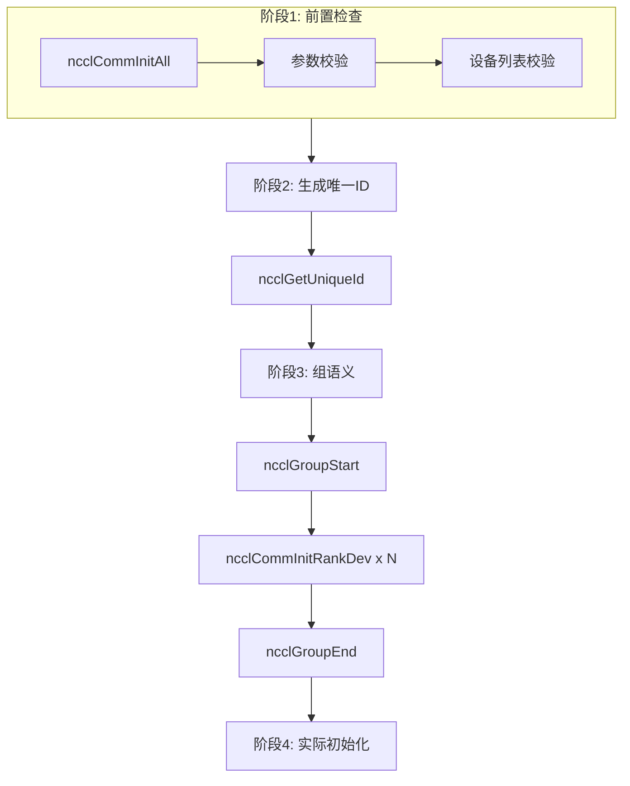
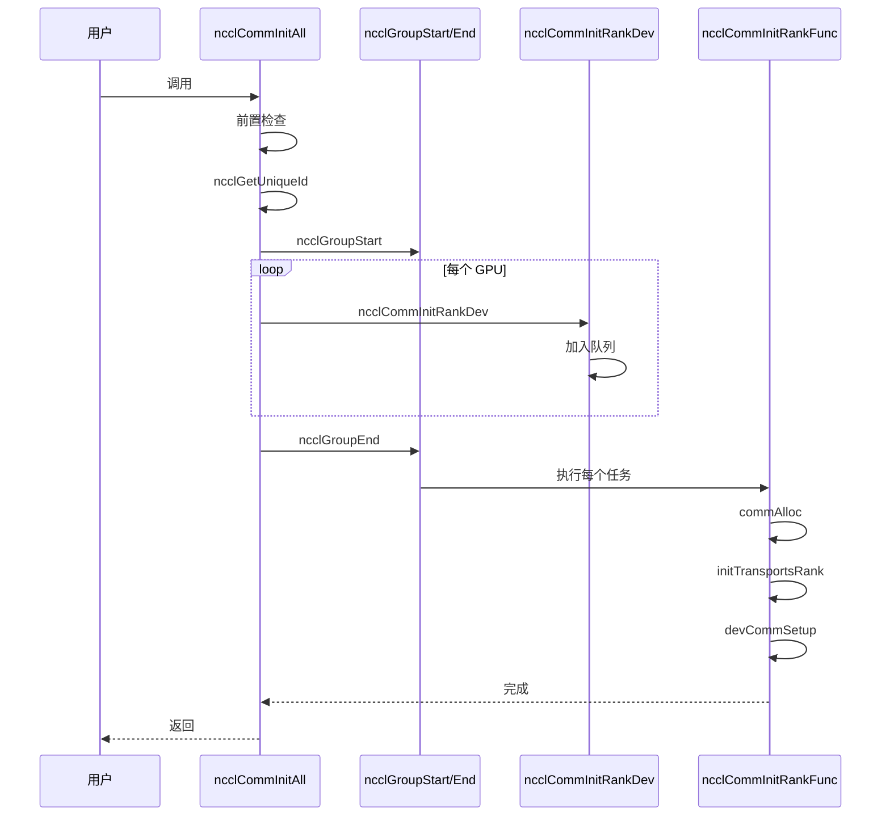
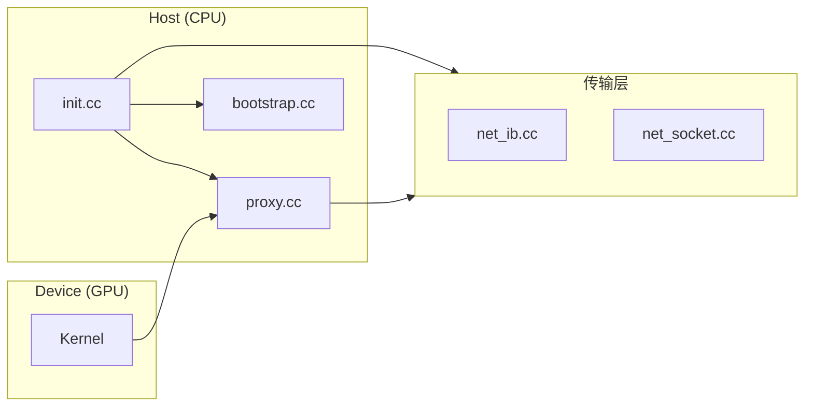

# 费曼学习法 · 代码/概念讲解提示词模板

> 用于将复杂的代码流程或技术概念，转化为结构清晰、易于理解的文档。
> 适用于：NCCL 源码阅读、RDMA/IB 驱动开发、高性能计算等相关学习。

---

## 示例与配套资源

| 资源 | 路径 | 说明 |
|------|------|------|
| 示例文档 | [费曼学习法_ncclCommInitAll详解.md](.claude/费曼学习法_ncclCommInitAll详解.md) | 按本模板生成的 ncclCommInitAll 讲解，含 7 张 Mermaid 图 |
| 图片目录 | [figures/](figures/README.md) | 存放从 Mermaid 导出的 PNG/SVG，见 README |
| Mermaid 在线编辑 | [mermaid.live](https://mermaid.live/) | 粘贴 Mermaid 代码 → 预览 → 导出 PNG/SVG |

---

## 一、提示词模板（直接复制使用）

```
请使用**费曼学习法**讲解 [目标：函数名/概念名/流程名] 的完整过程。

## 输出要求

### 1. 文档结构（必须包含以下章节）

#### 第一步：用最简单的语言解释（给12岁孩子听）
- 用 1–2 个生活场景类比（如：建微信群、公司通讯系统）
- 不超过 200 字，避免技术术语

#### 第二步：用生活场景类比
- 用 1 个完整类比贯穿整个流程（如：建立公司内部通讯系统）
- 把每个技术步骤映射到类比中的对应动作

#### 第三步：逐步深入技术细节
- 按**执行顺序**分阶段讲解，每个阶段包含：
  - **在做什么**：一句话概括
  - **代码位置**：文件:行号 或 函数名
  - **关键代码片段**：3–5 行，带简要注释
  - **类比**：对应到第二步的类比

#### 第四步：可视化
- **必须**使用 **Mermaid** 语法绘制，至少包含：
  - 一张**主流程/时序图**（`sequenceDiagram` 或 `flowchart TD/LR`）
  - 一张**子流程或模块关系图**（`flowchart`、`classDiagram` 或 `graph`）
  - 若流程较长，可增加「子步骤」的 Mermaid 图（如 initTransportsRank 的 8 步）
- 每张图：
  - 紧跟代码块后，用 *图N：……* 形式写 1–2 句说明
  - 图中节点文字尽量简短，过长时可换行：`节点名<br/>补充`
- 在「第四步」末尾增加小节：**如何将 Mermaid 导出为图片**
  - 写明 [Mermaid Live](https://mermaid.live/) 的用法：复制代码 → 粘贴 → 导出 PNG/SVG
  - 建议图片存放路径：`.claude/figures/{主题名}/`，命名：`{主题}_{图号}_{简短描述}.png`
  - 若文档所在环境不支持 Mermaid 渲染，可改用：``

#### 第五步：找出理解中的空白
- 列出 3–5 个读者容易产生的疑问
- 用 Q&A 形式回答，每个回答 2–4 句

#### 第六步：回顾和简化
- **核心流程总结**：5–7 步的编号列表
- **关键概念**：3–5 个名词 + 一句话解释
- **理解检查**：3–5 个自测问题（能回答则说明已理解）

### 2. 格式与风格

- 使用 **简体中文**
- 代码块注明语言（如 `c`, `cpp`）
- 技术术语第一次出现时加粗，必要时括注英文
- 每一大节用 `---` 分隔，便于折叠阅读

### 5. 可视化规范

- 所有流程图/时序图统一用 **Mermaid**
- 图要能表达：**谁/什么 → 做了什么 → 下一步**
- 图中文字尽量简短，过长说明放在图下
- 可提供 Mermaid 的在线渲染链接说明，便于导出为 PNG/SVG

### 4. 可选扩展

- 与 [已学概念/函数] 的对比（相同点、不同点、适用场景）
- 常见错误或踩坑（1–2 个）+ 正确做法
- 延伸阅读：相关文件、函数、论文或文档链接
```

---

## 二、使用方式

### 方式 A：在对话中直接使用

1. 复制上面「一、提示词模板」中 ` ``` ` 内的整段内容。
2. 将 `[目标：函数名/概念名/流程名]` 替换为你的学习目标，例如：
   - `ncclCommInitAll() 的完整流程`
   - `initTransportsRank 中 Bootstrap 与 AllGather 的作用`
   - `Proxy 线程与 ibv_post_send 的协作关系`
   - `Ring 算法的实现与通道选择`
3. 如需要，在模板末尾追加：
   - 侧重方向：如「重点讲 RDMA/IB 相关」「重点讲 Host/Device 分工」
   - 前置知识：如「假设读者已理解 ncclComm 和 ncclChannel」

### 方式 B：作为项目规则（Cursor / Claude 等）

1. 将本模板保存为：`<项目>/.claude/费曼学习法_提示词模板.md` 或 `docs/费曼学习法_提示词模板.md`。
2. 在 AI 的「规则 / Rule」中引用，例如：
   - 「当用户说：用费曼学习法讲 XXX 时，请严格遵循 `.claude/费曼学习法_提示词模板.md` 中的结构与输出要求。」

### 方式 C：迭代优化

- 第一次：用模板生成初版，重点看「第三步」是否按执行顺序、是否缺步骤。
- 第二次：针对「第四步」补充/修正 Mermaid 图，确保与代码一致。
- 第三次：根据「第五步」的 Q&A，在文档中加「常见问题」小节，或单独建 `FAQ_xxx.md`。

---

## 三、Mermaid 图表类型速查

| 用途           | 类型               | 示例场景                         |
|----------------|--------------------|----------------------------------|
| 时序/调用顺序  | `sequenceDiagram`  | API → 函数 A → 函数 B → 底层 API |
| 主流程/分支    | `flowchart`        | 初始化、错误处理、多路分支       |
| 模块/层次      | `flowchart` / `graph` | 各 .cc 文件、各层职责          |
| 状态变化       | `stateDiagram-v2`  | 通信器 initState、连接建立       |
| 类/结构关系    | `classDiagram`     | ncclComm、ncclChannel、proxyOp   |

### Mermaid 在线编辑与导出

- [Mermaid Live Editor](https://mermaid.live/)
- 用法：粘贴 Mermaid 代码 → 预览 → 导出 PNG/SVG，插入到 Markdown 或 Notion/语雀等。

### 插入到 Markdown 的两种方式

1. **在支持 Mermaid 的编辑器中直接写**（如 Typora、VS Code + 插件、Notion、语雀）：
   ````markdown
   ```mermaid
   flowchart TD
     A[ncclCommInitAll] --> B[前置检查]
     B --> C[ncclGetUniqueId]
   ```
   ````
2. **在只支持图片的编辑器**：  
   先在 [Mermaid Live](https://mermaid.live/) 导出 PNG/SVG，保存到 `.claude/figures/{主题}/`，再用 `` 插入。

### 文档生成时「图片」的约定

- **优先产出 Mermaid 代码块**，便于版本管理与二次修改；图片作为「导出物」由读者按需生成。
- 若 AI 在生成文档时**同时生成图片文件**（如项目支持），可放在：
  - `.claude/figures/{目标概念}/`  
  例如：`.claude/figures/ncclCommInitAll/`，下存 `图1_四阶段总览.png`、`图5_主流程.png` 等。
- 在「第四步」末尾必须有一小节说明：如何从 Mermaid 导出为 PNG/SVG、建议路径与命名，便于读者自行补图。

---

## 四、模板与现有文档的对应关系

| 模板章节             | 对应《费曼学习法_ncclCommInitAll详解》 |
|----------------------|----------------------------------------|
| 第一步 简单解释      | 「用最简单的语言解释」                 |
| 第二步 生活类比      | 「用生活场景类比」                     |
| 第三步 技术细节      | 「逐步深入技术细节」各阶段             |
| 第四步 可视化        | 「可视化流程图」+ 本节新增的 Mermaid 图 |
| 第五步 理解空白      | 「找出理解中的空白」                   |
| 第六步 回顾简化      | 「回顾和简化」                         |

---

## 五、可复用的 Mermaid 代码片段

### 1. 主流程（flowchart）



### 2. 时序图（sequenceDiagram）



### 3. 模块/层次（flowchart LR）



---

## 六、后续学习工作流建议

1. **选目标**：从「用户接口 → 入队 → Proxy → 传输层」自顶向下选一个函数/概念。
2. **用模板**：用本提示词生成一版费曼学习法文档（**必须包含第四步的 Mermaid 图**）。
3. **补图（可选）**：
   - 在 [Mermaid Live](https://mermaid.live/) 中粘贴各图代码，导出 PNG/SVG；
   - 放入 `.claude/figures/{主题名}/`，命名如 `图1_四阶段总览.png`；
   - 若编辑器不支持 Mermaid，在文档中用 `` 替换代码块。
4. **对照代码**：读源码时在文档里标注「文件:行号」，便于回溯。
5. **自测**：用「理解检查」里的问题自测，答不出则回到「第三步」补细节。

---

## 七、版本与修订

- **v1.0**：初版，基于《费曼学习法_ncclCommInitAll详解》提炼。
- 修订时请注明：日期、修改章节、修改原因（例如：增加 Mermaid 规范、补状态图示例）。
