# NCCL IB 传输层深度解析 — net_ib.cc Verbs 调用链串讲

> **定位**：本文面向熟悉 RDMA Verbs 编程的开发者，深度拆解 NCCL 中 `src/transport/net_ib.cc`
> 如何使用 IB Verbs 接口完成从建链到传输到销毁的全生命周期。
>
> **阅读前提**：你已掌握 `ibv_post_send`, `ibv_reg_mr`, `ibv_modify_qp` 等 Verbs API，
> 理解 QP/CQ/PD/MR 概念，写过至少一个 RDMA 应用。
>
> **姊妹篇**：Proxy 层如何调度这些接口 → 《NCCL Proxy 层串讲》（后续补充）

---

# 第一章：全局地图

## 1.1 ncclNet_t — NCCL 网络插件接口

NCCL 通过一个函数指针表 `ncclNet_t` 抽象网络传输。`net_ib.cc` 是 IB/RoCE 的实现：

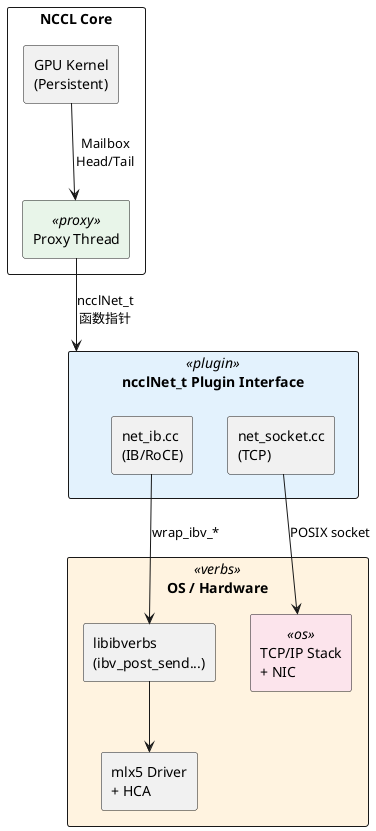

## 1.2 接口函数映射

`net_ib.cc` 末尾（行 1713-1731）导出的函数表：


| 生命阶段     | 接口函数          | net_ib.cc 实现          | 核心 Verbs 调用                                                                           |
| -------- | ------------- | --------------------- | ------------------------------------------------------------------------------------- |
| **初始化**  | init          | `ncclIbInit`          | `ibv_get_device_list`, `ibv_open_device`, `ibv_query_port`                            |
|          | devices       | `ncclIbDevices`       | —                                                                                     |
|          | getProperties | `ncclIbGetProperties` | —                                                                                     |
| **建链**   | listen        | `ncclIbListen`        | — (纯 TCP)                                                                             |
|          | connect       | `ncclIbConnect`       | `ibv_alloc_pd`, `ibv_create_cq`, `ibv_create_qp`, `ibv_modify_qp(INIT)`, `ibv_reg_mr` |
|          | accept        | `ncclIbAccept`        | 同上 + `ibv_modify_qp(RTR, RTS)`                                                        |
| **内存注册** | regMr         | `ncclIbRegMr`         | `ibv_reg_mr` / `ibv_reg_mr_iova2`                                                     |
|          | regMrDmaBuf   | `ncclIbRegMrDmaBuf`   | `ibv_reg_dmabuf_mr`                                                                   |
|          | deregMr       | `ncclIbDeregMr`       | `ibv_dereg_mr`                                                                        |
| **数据传输** | isend         | `ncclIbIsend`         | `ibv_post_send` (RDMA WRITE + WRITE_WITH_IMM)                                         |
|          | irecv         | `ncclIbIrecv`         | `ibv_post_recv` + `ibv_post_send` (RDMA WRITE to FIFO)                                |
|          | iflush        | `ncclIbIflush`        | `ibv_post_send` (RDMA READ)                                                           |
|          | test          | `ncclIbTest`          | `ibv_poll_cq`                                                                         |
| **销毁**   | closeSend     | `ncclIbCloseSend`     | `ibv_destroy_qp`, `ibv_dereg_mr`                                                      |
|          | closeRecv     | `ncclIbCloseRecv`     | 同上 + 销毁 gpuFlush QP                                                                   |
|          | closeListen   | `ncclIbCloseListen`   | — (关闭 TCP socket)                                                                     |


## 1.3 核心数据结构

NCCL IB 传输层的数据结构按 **三层** 组织：设备层、连接层、请求层。
理解这三层之间的所有权和生命周期关系，是读懂 `net_ib.cc` 的前提。

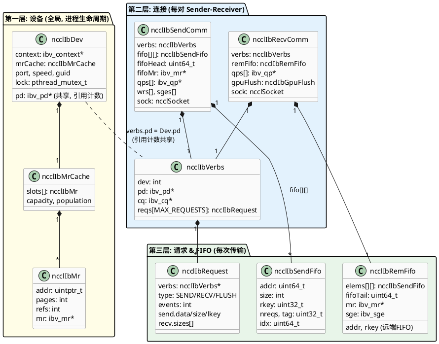

### 第一层：设备（`ncclIbDev`）— 全局共享，进程级生命周期

`ncclIbDevs[]` 是一个全局数组（最多 16 个设备），在 `ncclIbInit` 时填充，整个进程生命周期内不变。

```
ncclIbDev 的角色 ≈ 你写 RDMA 应用时打开设备后保存的那组全局状态
```


| 字段        | 设计意图                                                                                                                |
| --------- | ------------------------------------------------------------------------------------------------------------------- |
| `context` | `ibv_open_device` 的返回值，所有后续 Verbs 调用的入口                                                                             |
| `pd`      | **引用计数共享**。同设备的所有连接（SendComm/RecvComm）共用一个 PD，`pdRefs` 追踪当前有多少连接在用。只有最后一个连接关闭时才 `ibv_dealloc_pd`。这避免了每连接一个 PD 的资源浪费 |
| `mrCache` | **挂在设备上而非连接上**。因为 MR 是绑定 PD 的，同设备共用 PD，所以 MR Cache 自然也是设备级共享。不同连接 regMr 时查的是同一个 Cache                               |
| `lock`    | MR Cache 是跨连接共享的，多个 Proxy Thread 可能并发注册，需要互斥锁                                                                       |


> **RDMA 类比**：你写多连接 RDMA 应用时，通常也会让所有 QP 共用一个 PD——
> NCCL 的做法和你一样，只是额外加了引用计数来管理 PD 的生命周期。

### 第二层：连接（`ncclIbSendComm` / `ncclIbRecvComm`）— 每对 Sender-Receiver 一个

每建立一条 NCCL 连接（Listen/Connect/Accept），会创建一个 SendComm（发送端）或 RecvComm（接收端）。
两者**不对称**——这是 FIFO 通知机制决定的：

```
SendComm 持有 FIFO（被写端）    ←── Receiver 通过 RDMA WRITE 写入通知
RecvComm 持有 remFifo（写端）   ──→ 向 Sender 的 FIFO 发送通知
```


| 结构               | 独有字段                               | 设计意图                                                                                                                                                                       |
| ---------------- | ---------------------------------- | -------------------------------------------------------------------------------------------------------------------------------------------------------------------------- |
| `ncclIbSendComm` | `fifo[][]` + `fifoMr` + `fifoHead` | Sender 分配 FIFO 内存并注册 MR，连接时把 rkey/addr 告知 Receiver。`fifoHead` 是 Sender 的读指针                                                                                                |
| `ncclIbSendComm` | `wrs[]` + `sges[]`                 | 预分配的 WR/SGE 数组。**避免热路径上的 malloc**——`ncclIbMultiSend` 直接用，不分配新内存                                                                                                            |
| `ncclIbRecvComm` | `remFifo`                          | Receiver 保存 Sender FIFO 的远端 rkey/addr，加上本地暂存区 `elems[][]` 和写指针 `fifoTail`                                                                                                  |
| `ncclIbRecvComm` | `gpuFlush`                         | GDR 场景的 loopback QP + host buffer，用于 RDMA READ flush PCIe write buffer                                                                                                     |
| **两者共有**         | `verbs` (ncclIbVerbs)              | 封装了 PD（指向 Dev 共享的）、CQ、以及请求池 `reqs[]`                                                                                                                                       |
| **两者共有**         | `qps[]`                            | RC QP 数组（默认 1 个，可配多个用于多路径）                                                                                                                                                 |
| **两者共有**         | `sock`                             | TCP socket，作为 **OOB (Out-of-Band) 控制通道**：Listen/Connect/Accept 期间，通过它交换 QP 属性（LID/GID/QPN/PSN/MTU）、FIFO addr/rkey/size 等元数据；真正的数据面 payload 全走 RDMA 报文，这个 socket 只承载建链/控制信息 |


`**ncclIbVerbs` — 连接级 Verbs 资源容器**

```
ncclIbVerbs 是一个"工具箱"：
  pd   → 指向 ncclIbDev 共享的 PD（不独占，仅引用）
  cq   → 每连接独立的 CQ（Send/Recv 共用同一个 CQ）
  reqs → 固定大小的请求池（MAX_REQUESTS 个槽位，预分配避免 malloc）
```

CQ 容量设为 `2 * MAX_REQUESTS * nqps`，×2 是因为 Recv 端一次操作可能产生两个 CQE
（一个来自 PostFifo 的 signaled RDMA WRITE，一个来自接收 WRITE_WITH_IMM）。

### 第三层：请求与 FIFO — 每次传输操作

`**ncclIbRequest` — 追踪单次异步操作**

```
ncclIbRequest 的角色 ≈ 你的 RDMA 应用中跟踪一个 ibv_post_send 的上下文结构
```


| 字段               | 设计意图                                                                                         |
| ---------------- | -------------------------------------------------------------------------------------------- |
| `type`           | SEND / RECV / FLUSH 三种类型，Test 时走不同处理分支                                                       |
| `events`         | **未完成的 CQE 计数**。初始值 = nqps（多 QP 时 > 1），每收到一个 CQE 减 1，到 0 表示操作完成。这是一种轻量的"barrier"——等所有 QP 都完成 |
| `send.data/lkey` | 发送侧记录本地 buffer 地址和 MR 的 lkey，构建 WR 时用                                                        |
| `recv.sizes[]`   | 接收侧从 WRITE_WITH_IMM 的 imm_data 中提取实际传输大小                                                     |


请求从 `verbs.reqs[]` 池中分配（`ncclIbGetRequest` 找一个 `type == UNUSED` 的槽位），
用完后归还（`ncclIbFreeRequest` 重置 `type = UNUSED`）。不使用 malloc/free。

`**ncclIbSendFifo` — Sender/Receiver 之间的"动态握手信条"**

这个 32 字节的结构体是整个 FIFO 通知机制的原子单位（第五章详述）：

```
Receiver 填写 → RDMA WRITE 到 Sender 的 fifo[][] 中 → Sender 轮询 idx 后读取

  字段        谁写          谁读        作用
  ─────────────────────────────────────────────────
  addr        Receiver      Sender      "把数据写到这个地址"
  rkey        Receiver      Sender      "用这个 key 访问我的 buffer"
  size        Receiver      Sender      "预期接收这么大"
  tag         Receiver      Sender      "用这个标签匹配 send/recv"
  idx         Receiver      Sender      "这是第几轮通知（单调递增防ABA）"
  nreqs       Receiver      Sender      "这一轮有几个 sub-request"
```

`**ncclIbRemFifo` — Receiver 侧的"FIFO 写代理"**

Receiver 不能直接修改 Sender 内存，必须先写本地暂存区再 RDMA WRITE 过去：

```
ncclIbRemFifo:
  elems[][]   ← 本地暂存区（和 Sender 的 fifo[][] 结构完全一致）
  addr, rkey  ← Sender FIFO 的远端地址和 key（连接时通过 OOB 获取）
  fifoTail    ← 本地写指针（和 Sender 的 fifoHead 配对形成生产者-消费者）
  mr          ← 本地暂存区注册的 MR（RDMA WRITE 的源端需要 MR）
  sge         ← 预填好的 SGE（避免每次 PostFifo 重新构造）
```

### 所有权与生命周期关系总览

```
进程启动
  └─ ncclIbInit → ncclIbDev[0..N] (设备层，全局不变)
                    ├─ pd (引用计数: 当前 0)
                    └─ mrCache (空)

建立连接 #1
  └─ ncclIbConnect / ncclIbAccept
       ├─ ncclIbSendComm 或 ncclIbRecvComm (连接层)
       │    ├─ verbs.pd → ncclIbDev.pd (pdRefs: 0→1)
       │    ├─ verbs.cq (独立创建)
       │    ├─ verbs.reqs[] (预分配请求池)
       │    ├─ qps[] (RC QP, 绑到 pd + cq)
       │    └─ fifo/remFifo (FIFO 机制)
       └─ 第一次 regMr → mrCache 填入第一条记录

建立连接 #2 (同设备)
  └─ pd 引用计数: 1→2, mrCache 共享复用

关闭连接 #2
  └─ pd 引用计数: 2→1, CQ/QP 销毁, 请求池释放

关闭连接 #1
  └─ pd 引用计数: 1→0, ibv_dealloc_pd
     mrCache 中 refs=0 的 MR 全部 ibv_dereg_mr
```

## 1.4 完整生命周期一览

从 `net_ib.cc` 的角度看，生命周期更自然的划分是 **TX（发送端）** 和 **RX（接收端）** 两条独立的轨迹：

- TX 侧围绕 `ncclIbSendComm` 展开：连接、从 FIFO 取通知、RDMA WRITE 发送数据、轮询 CQ、关闭。  
- RX 侧围绕 `ncclIbRecvComm` 展开：Listen/Accept、准备 Recv/FIFO、PostFifo 通知、接收数据与可选 flush、关闭。  
- 全局的 `ncclIbInit` / 设备发现属于**公共前置条件**，已在 1.2 小节详述，这里不再重复。

### 1.4.1 发送端（TX / `ncclIbSendComm`）生命周期

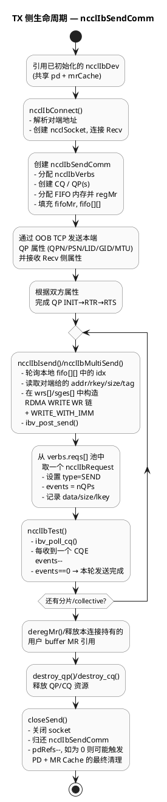

**TX 生命周期要点**

- **入口条件**：`ncclIbInit` 已完成，`ncclIbDev`/PD/MR Cache 就绪。TX 侧只是“借用”这些全局资源。  
- **控制面**：`ncclIbConnect` + OOB 交换负责把 `ncclIbSendComm` 和 `ncclIbRecvComm` 这对对象“拉上线”，完成 QP 建立与 FIFO 元数据同步。  
- **数据面热路径**：每一次 `ncclIbIsend`/`ncclIbMultiSend` 都是从 FIFO 取一条 Receiver 发来的“动态握手信条”，据此构造 RDMA WRITE WR 链，然后用 `ncclIbRequest.events` 做多 QP 完成同步。  
- **退出条件**：上层 collective 结束或 communicator 关闭时，TX 侧先把自己引用的 MR/WR/QP/CQ 清理干净，再通过 PD 引用计数把设备级资源往下释放。

### 1.4.2 接收端（RX / `ncclIbRecvComm`）生命周期

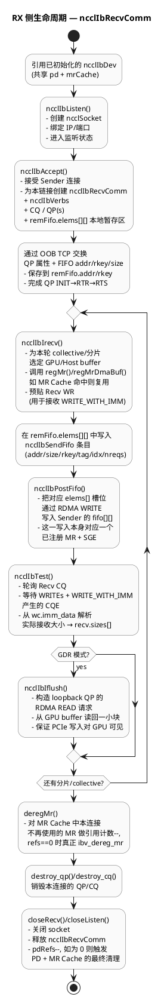

**RX 生命周期要点**

- **入口条件**：同样依赖 1.2 小节完成的全局初始化，但 RX 额外承担“被动接受连接”的职责（Listen/Accept）。  
- **控制面**：`ncclIbListen`/`ncclIbAccept` 建立 TCP 通道后，通过 OOB 同步 QP 与 FIFO 元数据，让 Sender 能直接 RDMA WRITE 到正确的 buffer/FIFO。  
- **数据面热路径**：每一轮 `ncclIbIrecv` + `ncclIbPostFifo` 就是在给 Sender 发“请按这个地址 / 这个 rkey 写数据”的命令，然后在 `ncclIbTest` 中等待 WRITE_WITH_IMM CQE，并在 GDR 模式下通过 `ncclIbIflush` 做可见性保证。  
- **退出条件**：Collective 结束时，RX 侧回收本连接相关的 MR 引用、QP/CQ、FIFO MR 与 socket，并在最后一条连接关闭时触发设备级资源的彻底清理。

---

# 第二章：控制面 — 初始化与设备发现

## 2.1 ncclIbInit（行 249-396）

NCCL 的 IB 初始化不是静态链接 libibverbs，而是**运行时 dlopen 加载**。
这让 NCCL 可以在没有 RDMA 硬件的机器上也能编译运行（降级到 Socket 传输）。

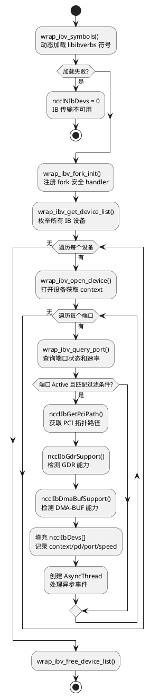

### RDMA 类比

如果你写过 RDMA 应用，这个流程你再熟悉不过：


| 你的 RDMA 应用                   | NCCL ncclIbInit              |
| ---------------------------- | ---------------------------- |
| `ibv_get_device_list()`      | `wrap_ibv_get_device_list()` |
| `ibv_open_device()`          | `wrap_ibv_open_device()`     |
| `ibv_query_port()` 检查 Active | 一样，只保留 Active 端口             |
| 直接链接 libibverbs.so           | **dlopen 动态加载**（可降级）         |


核心差异：NCCL 用 `wrap_ibv_`* 封装了所有 Verbs 调用。这些 wrapper 在 `ibvwrap.h` 中定义，
通过 `dlsym` 在运行时绑定函数指针。好处是 **编译时不依赖 libibverbs**。

### 速率计算

```c
// net_ib.cc 行 184-187
static int ibvWidths[] = { 1, 4, 8, 12, 2 };        // lanes
static int ibvSpeeds[] = { 2500, 5000, 10000, 10000, 14000, 25000, 50000 }; // Mbps/lane

// 端口速率 = width × speed × 2（双向）/ 8（bit→byte）
// 例: HDR (50000 Mbps) × 4X = 200 Gbps = 25 GB/s
```

### 关键配置参数


| 环境变量                           | 默认值  | 作用                       |
| ------------------------------ | ---- | ------------------------ |
| `NCCL_IB_DISABLE`              | 0    | 禁用 IB 传输                 |
| `NCCL_IB_GID_INDEX`            | 0    | RoCE GID 索引              |
| `NCCL_IB_TIMEOUT`              | 18   | QP 重传超时（指数值，18 ≈ 1 秒）    |
| `NCCL_IB_RETRY_CNT`            | 7    | QP 重传次数                  |
| `NCCL_IB_PKEY`                 | 0    | Partition Key            |
| `NCCL_IB_SL`                   | 0    | Service Level（QoS）       |
| `NCCL_IB_TC`                   | 0    | Traffic Class（RoCE DSCP） |
| `NCCL_IB_AR_THRESHOLD`         | 8192 | 自适应路由阈值（字节）              |
| `NCCL_IB_QPS_PER_CONNECTION`   | 1    | 每连接 QP 数量                |
| `NCCL_IB_PCI_RELAXED_ORDERING` | 2    | PCIe 放松排序                |


---

# 第三章：控制面 — 连接建立

## 3.1 总览

NCCL 连接建立涉及 **三个函数 + 一个延迟完成函数**，它们通过 TCP socket 做 OOB 交换，
不使用 `rdma_cm`。

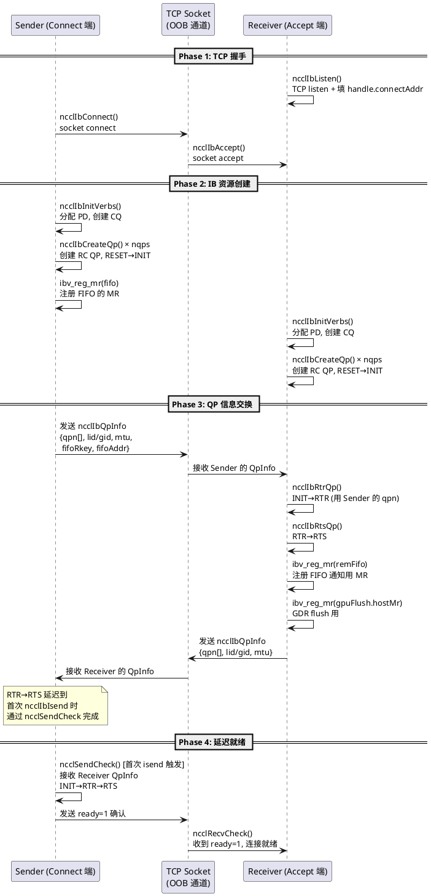

## 3.2 ncclIbListen（行 804-817）

Listen 只做一件事：**创建 TCP 监听 socket**，把地址写入 handle。

```c
// 简化后的核心逻辑
ncclResult_t ncclIbListen(int dev, void* opaqueHandle, void** listenComm) {
    ncclIbListenComm* comm = calloc(1, sizeof(*comm));
    comm->dev = dev;
    comm->sock.asyncFlag = 1;           // 非阻塞 socket
    GetSocketAddr(&comm->sock.addr);     // 获取本机 IP
    ncclSocketListen(&comm->sock);       // bind + listen
    handle->connectAddr = comm->sock.addr;  // 告知对端连接地址
}
```

> **RDMA 类比**：这里没有创建任何 IB 资源。类似于 `rdma_cm` 中的 `rdma_listen()`，
> 但 NCCL 选择了更轻量的 TCP socket 方案。

## 3.3 ncclIbConnect（行 836-920）

Connect 端是非阻塞状态机，关键步骤：

**Step 1: 创建 IB 资源**

```c
// PD 分配（引用计数共享，同设备的所有连接用同一个 PD）
ncclIbInitVerbs(dev, ctx, &comm->verbs);
// 内部: if (pdRefs++ == 0) ibv_alloc_pd()
// 内部: ibv_create_cq(ctx, 2*MAX_REQUESTS*nqps)
//        容量 ×2 是因为 Recv 请求可能产生两个 CQE（PostFifo + Recv）

// 创建 nqps 个 RC QP（默认 1，可配 NCCL_IB_QPS_PER_CONNECTION）
for (int q = 0; q < nqps; q++) {
    ncclIbCreateQp(ib_port, &comm->verbs, IBV_ACCESS_REMOTE_WRITE, comm->qps+q);
}
```

**Step 2: 注册 FIFO MR**

```c
// FIFO 是 Sender 端的一块内存，Receiver 通过 RDMA WRITE 写通知到这里
ibv_reg_mr(&comm->fifoMr, comm->verbs.pd, comm->fifo,
           sizeof(ncclIbSendFifo) * MAX_REQUESTS * NCCL_NET_IB_MAX_RECVS,
           IBV_ACCESS_LOCAL_WRITE | IBV_ACCESS_REMOTE_WRITE | IBV_ACCESS_REMOTE_READ);

// 把 FIFO 的 rkey 和地址塞进 QpInfo，后面通过 TCP 发给 Receiver
qpInfo.fifoRkey = comm->fifoMr->rkey;
qpInfo.fifoAddr = (uint64_t)comm->fifo;
```

**Step 3: OOB 发送 QP 信息**

```c
ncclSocketProgress(NCCL_SOCKET_SEND, &comm->sock, &qpInfo, sizeof(qpInfo), &offset);
```

## 3.4 ncclIbAccept（行 935-1051）

Accept 端的工作更重：它负责完成双方的 QP 状态转换。

**Step 1: 接收 Sender 的 QP 信息**

```c
ncclSocketProgress(NCCL_SOCKET_RECV, &rComm->sock, &remQpInfo, sizeof(remQpInfo), &offset);
```

**Step 2: 创建 QP 并完成 INIT→RTR→RTS**

```c
for (int q = 0; q < nqps; q++) {
    ncclIbCreateQp(ib_port, &rComm->verbs, IBV_ACCESS_REMOTE_WRITE, rComm->qps+q);
    ncclIbRtrQp(rComm->qps[q], remQpInfo.qpn[q], &remQpInfo);  // INIT→RTR
    ncclIbRtsQp(rComm->qps[q]);                                  // RTR→RTS
}
```

**Step 3: 保存远端 FIFO 信息**

```c
rComm->remFifo.rkey = remQpInfo.fifoRkey;   // Sender FIFO 的 remote key
rComm->remFifo.addr = remQpInfo.fifoAddr;   // Sender FIFO 的远端地址
ibv_reg_mr(&rComm->remFifo.mr, ...);        // 注册本地 FIFO 暂存区的 MR
```

**Step 4: GDR Flush 资源准备**

```c
if (ncclIbGdrSupport(dev) == 0) {
    rComm->gpuFlush.enabled = 1;
    ncclIbCreateQp(ib_port, &rComm->verbs, IBV_ACCESS_LOCAL_WRITE, &rComm->gpuFlush.qp);
    ibv_reg_mr(&rComm->gpuFlush.hostMr, ...);  // host 端小 buffer，RDMA READ 目标
    // gpuFlush QP 也要走 INIT→RTR→RTS（连回自己，loopback QP）
}
```

**Step 5: 回传自己的 QP 信息**

```c
ncclSocketProgress(NCCL_SOCKET_SEND, &rComm->sock, &localQpInfo, sizeof(localQpInfo), ...);
```

## 3.5 QP 状态机

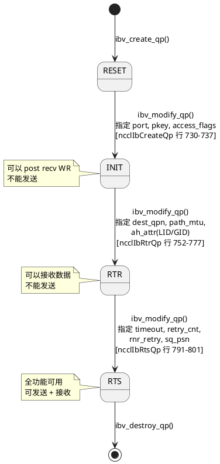

### QP 创建参数（行 717-739）


| 参数                | 值                            | 说明                      |
| ----------------- | ---------------------------- | ----------------------- |
| `qp_type`         | `IBV_QPT_RC`                 | 可靠连接，支持 RDMA WRITE/READ |
| `max_send_wr`     | `2 * MAX_REQUESTS`           | ×2: 每次发送含数据 WR + 通知 WR  |
| `max_recv_wr`     | `MAX_REQUESTS`               | 接收 WRITE_WITH_IMM 的完成通知 |
| `max_send_sge`    | 1                            | 每个 WR 只有一个 SGE          |
| `max_inline_data` | `sizeof(ncclIbSendFifo)` 或 0 | FIFO 通知可内联发送            |


### OOB 交换的 ncclIbQpInfo 结构（行 500-514）

```
┌────────────────────────────────────────────────────────────────┐
│                    ncclIbQpInfo (OOB 交换)                     │
├──────────────────┬─────────────────────────────────────────────┤
│ lid              │ IB 链路的 LID（RoCE 不用）                   │
│ ib_port          │ IB 端口号                                    │
│ link_layer       │ IB 或 Ethernet(RoCE)                        │
│ qpn[128]         │ 本端 QP Number 数组（对端 RTR 时需要）        │
│ spn + iid        │ RoCE GID (subnet prefix + interface id)      │
│ mtu              │ 协商后的 MTU                                  │
│ fifoRkey     ★   │ Sender FIFO 的 remote key                    │
│ fifoAddr     ★   │ Sender FIFO 的远端地址                        │
└──────────────────┴─────────────────────────────────────────────┘
  ★ 标记的字段是 FIFO 通知机制的关键，第五章详述
```

## 3.6 ncclSendCheck — 延迟完成（行 1074-1092）

Connect 端发送 QP 信息后**不立即做 RTR→RTS**。原因是 `ibv_modify_qp(RTR)` 需要对端的 QPN，
而此时对端可能还没创建 QP。所以 Connect 端把 RTR→RTS 推迟到首次 `ncclIbIsend` 调用时：

```c
ncclResult_t ncclSendCheck(ncclIbSendComm* comm) {
    // 非阻塞接收 Receiver 的 QpInfo
    ncclSocketProgress(NCCL_SOCKET_RECV, &comm->sock, &remQpInfo, ...);
    if (bytes == 0) return ncclSuccess;  // 还没到，下次再来

    // 完成 QP 状态转换
    for (q = 0; q < nqps; q++) {
        ncclIbRtrQp(qp, remQpInfo.qpn[q], &remQpInfo);
        ncclIbRtsQp(qp);
    }
    comm->ready = 1;
    ncclSocketSend(&comm->sock, &comm->ready, sizeof(int));  // 通知对端就绪
}
```

---

# 第四章：内存注册与 MR Cache

## 4.1 三条注册路径

`ncclIbRegMrDmaBuf`（行 1128-1183）根据条件选择不同的注册方式：

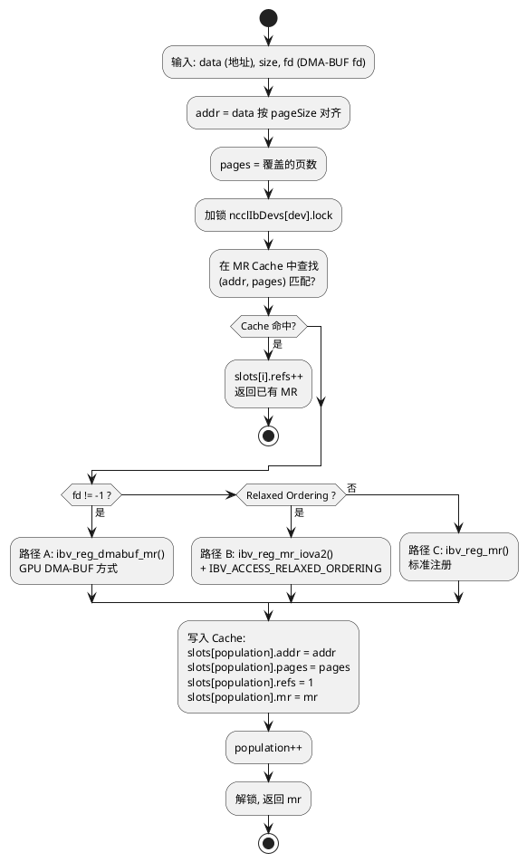

### Access Flags

所有路径统一使用：

```c
unsigned int flags = IBV_ACCESS_LOCAL_WRITE
                   | IBV_ACCESS_REMOTE_WRITE
                   | IBV_ACCESS_REMOTE_READ;
if (ncclIbRelaxedOrderingEnabled) flags |= IBV_ACCESS_RELAXED_ORDERING;
```

> **RDMA 类比**：你写 RDMA 应用时，通常只给接收 buffer 加 `REMOTE_WRITE`，
> 发送 buffer 只需要 `LOCAL_WRITE`。NCCL 统一加了三个权限，因为同一块 buffer
> 可能同时被本端读写和对端 RDMA WRITE/READ。

### 三条路径对比


| 路径                  | API                 | 适用场景                 | 性能特点                      |
| ------------------- | ------------------- | -------------------- | ------------------------- |
| A: DMA-BUF          | `ibv_reg_dmabuf_mr` | GPU 显存 + 新内核 (≥5.12) | 最优 GDR 路径，跳过 mmu_notifier |
| B: Relaxed Ordering | `ibv_reg_mr_iova2`  | 任意内存 + ConnectX-5+   | PCIe 乱序读取，DMA 吞吐更高        |
| C: 标准               | `ibv_reg_mr`        | 通用回退路径               | 最兼容，性能一般                  |


## 4.2 MR Cache 机制

### 数据结构（行 86-96）

```c
struct ncclIbMr {
    uintptr_t addr;   // 页对齐后的起始地址
    int pages;        // 覆盖的页数
    int refs;         // 引用计数
    ibv_mr *mr;       // Verbs MR 句柄
};

struct ncclIbMrCache {
    ncclIbMr *slots;  // 动态数组
    int capacity;     // 当前容量
    int population;   // 已使用数量
};
```

### 查找策略

**线性遍历**。Key 是 `(addr, pages)` 二元组。

为什么不用 Hash？因为 population 通常很小（几十个）。PyTorch 训练过程中，
活跃的 tensor buffer 数量有限，线性遍历足够快。

### 释放逻辑 — ncclIbDeregMr（行 1202-1227）

```c
for (i = 0; i < cache->population; i++) {
    if (mhandle == cache->slots[i].mr) {
        if (--cache->slots[i].refs == 0) {
            // 引用计数归零，真正释放
            memmove(&slots[i], &slots[--population], sizeof(ncclIbMr));  // 用最后一个填空洞
            ibv_dereg_mr(mhandle);
        }
        break;
    }
}
```

> **设计细节**：删除时用 `memmove` 把最后一个 slot 搬到被删位置（O(1) 删除），
> 不保持有序。这和你在 RDMA 应用中常用的"标记删除 + 惰性回收"不同，
> NCCL 选择了立即压缩。

---

# 第五章：FIFO 通知机制 — NCCL 最独特的设计

> 这是 `net_ib.cc` 中最精妙也最不直观的设计。如果你只熟悉标准 RDMA 编程模型，
> 这里会颠覆你的认知。请放慢速度，逐步理解。

## 5.1 为什么需要 FIFO？

### 标准 RDMA 应用的做法

```
你写 RDMA 应用时，连接建立阶段就确定了对端 buffer：
  1. 两端各 ibv_reg_mr 注册固定 buffer
  2. 通过 OOB 交换 rkey + remote_addr
  3. 之后反复 RDMA WRITE 到同一个 remote_addr

这种模式成立的前提是：buffer 地址在连接生命周期内不变。
```

### NCCL 面对的问题

```
NCCL 做不到 "buffer 地址不变"：
  - PyTorch 每次 allreduce 传入的 tensor 地址可能不同
    （显存分配器动态管理，tensor 的虚拟地址随分配释放变化）
  - 每次传输的 size 也可能不同
  - tensor 的 MR 也是动态注册的（通过 MR Cache）

所以 NCCL 需要在每次 isend/irecv 时，动态交换本次传输的 buffer 信息。
问题是：怎么高效地做这个 "每次交换"？
```

### 三种备选方案与 NCCL 的选择


| 方案                          | 做法                                     | 问题                     |
| --------------------------- | -------------------------------------- | ---------------------- |
| A: OOB TCP 交换               | 每次通过 TCP socket 发 addr/rkey            | 延迟太高（TCP syscall）      |
| B: RDMA SEND/RECV           | 用 IB SEND 传递 buffer 信息                 | 消耗 RQ 资源，且要处理接收 buffer |
| **C: RDMA WRITE to FIFO** ★ | 接收端把 buffer 信息 RDMA WRITE 到发送端的一块预分配内存 | **零拷贝、低延迟、无 syscall**  |


NCCL 选择了方案 C——**用 RDMA WRITE 替代传统的控制消息**。

## 5.2 FIFO 数据结构详解

### 发送端持有 FIFO（被写端）

```
ncclIbSendComm:
  fifo[MAX_REQUESTS][NCCL_NET_IB_MAX_RECVS]   ← 接收端 RDMA WRITE 的目标
  fifoMr                                        ← 这块内存的 MR
  fifoHead                                      ← 发送端的读指针（本地维护）

连接建立时，fifoMr->rkey 和 fifo 的地址通过 OOB 发给接收端。
```

### 接收端持有 FIFO 远端信息（写端）

```
ncclIbRecvComm:
  remFifo.elems[MAX_REQUESTS][NCCL_NET_IB_MAX_RECVS]  ← 本地暂存区（先填好再 WRITE 过去）
  remFifo.addr, remFifo.rkey                            ← 发送端 FIFO 的远端地址和 key
  remFifo.mr                                            ← 本地暂存区的 MR（作为 WRITE 的源）
  remFifo.fifoTail                                      ← 接收端的写指针（本地维护）
```

### ncclIbSendFifo — 每条通知的内容（行 586-593）

```
偏移    字段     类型         含义
──────────────────────────────────────────────────────────────
0x00    addr     uint64_t    "请往这个地址写数据" — 接收端 buffer 的远端地址
0x08    size     int         "写这么多字节"
0x0C    rkey     uint32_t    "用这个 key" — 接收端 buffer 的 remote key
0x10    nreqs    uint32_t    本轮 multi-recv 的请求数
0x14    tag      uint32_t    消息标签，用于匹配 send/recv 对
0x18    idx      uint64_t    单调递增索引 — 发送端轮询此字段判断条目是否有效

总计 32 字节 (0x20)。强制 32B 对齐，Relaxed Ordering 下保证原子写入。
```

## 5.3 四步工作流程

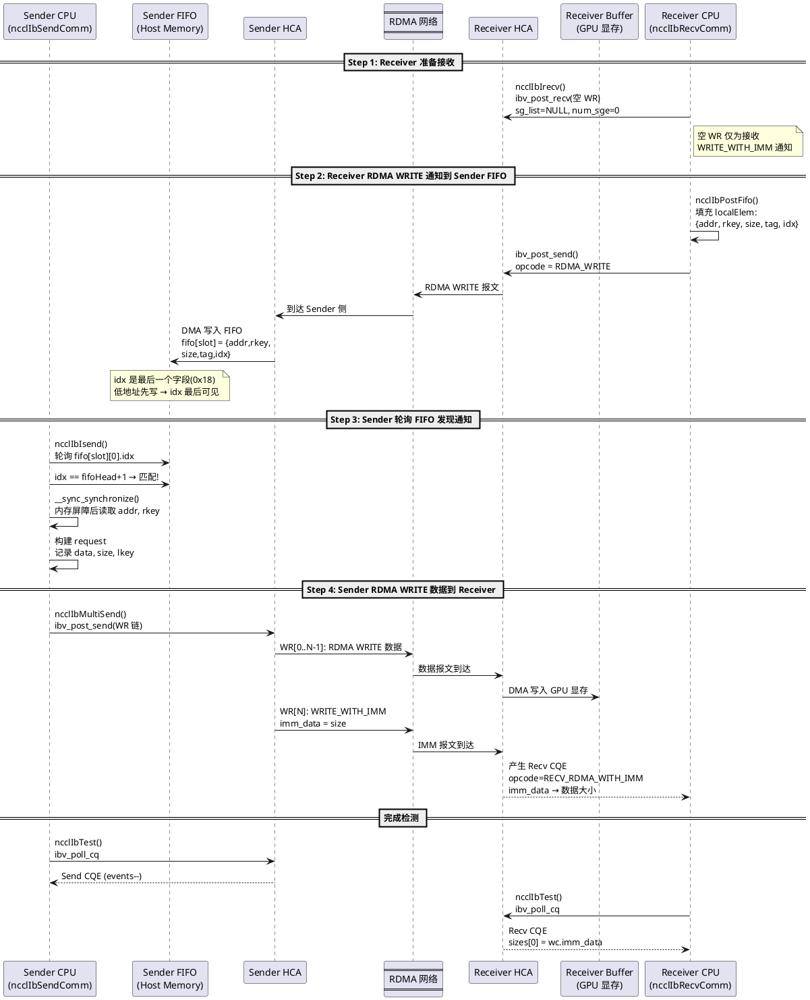

这张时序图可以理解为：**Recv 先“订阅”，再用 FIFO 告诉 Send 自己要收什么，最后由 Send 真正把数据 RDMA WRITE 过来**，细节如下：

- **Step 1：Recv 先占一个“完成槽位”**  
  - `ncclIbIrecv()` 里，Recv 侧调用 `ibv_post_recv` 贴了一个 **空 Recv WR**（`sg_list = NULL, num_sge = 0`）。  
  - 这个 Recv WR 不接收数据，只接收之后 `WRITE_WITH_IMM` 的 **IMM 通知**，所以图里说“空 WR 仅为接收 WRITE_WITH_IMM 通知”。  
  - 从 RDMA 语义看：后续 Sender 发的 `WRITE_WITH_IMM` 会在这个空 WR 上产生一个 `RECV_RDMA_WITH_IMM` CQE，起到“这一轮数据已经写完”的信号作用。

- **Step 2：Recv 用 RDMA WRITE 把 FIFO 元素写到 Sender**  
  - `ncclIbPostFifo()` 在本地 `localElem` 里填好 `{addr, rkey, size, tag, idx}`，然后把这个结构体作为 RDMA WRITE 的 **payload** 写到 Sender 的 `fifo[slot]` 上。  
  - `idx` 字段在结构体里是最后一个（偏移 `0x18`），硬件写内存是按 cacheline / 低地址优先的，所以 Sender 侧轮询 `idx` 时，可以确信：**看到新的 idx 值 → 低地址处的 addr/rkey/size/tag 已经写完且可见**。  
  - 这里的关键：Recv 侧完全不需要走 TCP，就把“请你往这个 addr，用这个 rkey，写 size 大小的数据”这些信息推到了 Sender 的 FIFO 里。

- **Step 3：Sender 轮询 FIFO，构建本地请求**  
  - Sender 的 `ncclIbIsend()` 在本地 busy-poll `fifo[slot][0].idx`，一旦发现 `idx == fifoHead+1`，就认为有新的“接收意向”到达。  
  - `__sync_synchronize()` 做一层内存屏障，防止 CPU 乱序读取到旧的 addr/rkey。  
  - 之后根据 FIFO 里的字段构造 `ncclIbRequest`：记录 send buffer 的 `data/size/lkey`，以及远端的 `addr/rkey`，为后面的 WR 链准备参数。

- **Step 4：Sender 真正 RDMA WRITE 数据到 Recv**  
  - `ncclIbMultiSend()` 按照前面构造的参数，把用户 buffer 切成若干 Slice，在 `wrs[]/sges[]` 里拼成一串 RDMA WRITE WR 链（`WR[0..N-1]`），最后再加一条 `WRITE_WITH_IMM`（`WR[N]`）。  
  - 数据 WR 把 payload 直接 DMA 写进 Recv 的 GPU 显存或 Host 缓冲区（`Receiver Buffer`），最后一条 `WRITE_WITH_IMM` 不带数据，只带 `imm_data = size`，作为“这一轮写完了，总共写了多少字节”的标记。  
  - Recv HCA 收到数据 WR 时只做 DMA，不产生活动；只有收到 `WRITE_WITH_IMM` 时，才在前面贴好的那个空 Recv WR 上产生 `RECV_RDMA_WITH_IMM` CQE。

- **完成检测：Sender / Receiver 各自独立 Test**  
  - Sender 侧 `ncclIbTest()` 在 Send CQ 上轮询，收到对应的 Send CQE 后把 `request.events--`，减到 0 才认为这一轮 send 全部完成（如果有多 QP，会等到所有 QP 都完成）。  
  - Recv 侧 `ncclIbTest()` 在 Recv CQ 上轮询，等到 `opcode = RECV_RDMA_WITH_IMM` 的 CQE 出现，取出其中的 `imm_data` 填进 `sizes[0]`，这就是最终可靠感知到的“实际收到的大小”。  
  - 整个过程里，**数据路径只走 RDMA**，TCP 只在更早的建链阶段用来交换 QP/FIFO 元数据；而 FIFO + WRITE_WITH_IMM 组合，则提供了一个不依赖 Recv buffer 链表的轻量级 flow-control / 完成通知机制。

### 完整数据流（ASCII 补充）

```
时间线 →

Receiver 端:                              Sender 端:
─────────────                             ─────────────
irecv():                                  
  post_recv(空WR)  ─────────────────────  
  PostFifo():                             
    localElem = {addr,rkey,size,tag,idx}  
    RDMA WRITE ──────────────────────→  fifo[slot] = {addr,rkey,...}
                                          
                                          isend():
                                            轮询 fifo[slot].idx ← 匹配!
                                            __sync_synchronize()
                                            读取 addr, rkey
                                            MultiSend():
                                              RDMA WRITE(data) ──→  直接写入 Receiver buffer
                                              WRITE_WITH_IMM   ──→  触发 Recv CQE
                                            
Test():                                   Test():
  poll CQ → IBV_WC_RECV_RDMA_WITH_IMM      poll CQ → Send 完成
  sizes[0] = imm_data                       events--
  events--
```

## 5.4 设计哲学深度分析

### 5.4.1 为什么 idx 用单调递增？

```c
// ncclIbPostFifo 行 1453
localElem[i].idx = comm->remFifo.fifoTail + 1;

// ncclIbIsend 行 1370-1371
int idx = comm->fifoHead + 1;
if (slots[0].idx != idx) { *request = NULL; return ncclSuccess; }  // 不匹配，下次再来
```

如果用 0/1 flag（"有效/无效"），存在 ABA 问题：Sender 读完设为 0，Receiver 写新数据设为 1，
但如果 Sender 还没来得及读旧数据，Receiver 又写了新数据——flag 还是 1，Sender 分不清新旧。

单调递增的 idx **天然避免 ABA**：每一轮的 idx 值唯一，Sender 只有看到精确匹配才处理。

### 5.4.2 `__sync_synchronize()` 的必要性（行 1375）

```c
if (slots[0].idx != idx) { ... }      // (1) 先读 idx
// 如果没有内存屏障，编译器/CPU 可能把 (2) 重排到 (1) 之前
__sync_synchronize();                  // 强制顺序
for (...) {
    addr  = slots[r].addr;             // (2) 再读 addr, rkey
    rkey  = slots[r].rkey;
}
```

RDMA WRITE 是远端 DMA，写入 FIFO 的各字段**不保证原子性**（特别是 Relaxed Ordering 下）。
内存屏障确保 Sender 读到 idx 匹配时，其他字段也已经完全可见。

### 5.4.3 32 字节对齐（行 620-624）

```c
static_assert((offsetof(ncclIbSendComm, fifo) % 32) == 0, ...);
static_assert((sizeof(ncclIbSendFifo) % 32) == 0, ...);
```

PCIe Relaxed Ordering 下，写入可能被拆分。如果一条 `ncclIbSendFifo`（32 字节）跨越
cache line 边界，可能出现 **前半部分写完、后半部分还没写** 的中间状态。
32 字节对齐确保每条条目在一个 cache line 内，避免撕裂写入。

### 5.4.4 Unsignaled WR 的 SQ 清理（行 1465-1490）

```c
// ncclIbPostFifo 行 1486-1490
if (slot == 0) {
    wr.send_flags |= IBV_SEND_SIGNALED;
    wr.wr_id = req - comm->verbs.reqs;
    req->events++;
}
```

FIFO 通知的 RDMA WRITE 大部分是 **unsignaled**（不生成 CQE），减少 CQ 开销。
但 IB 规范要求：**SQ 中的所有 WR 在一个 signaled WR 完成前都算 outstanding**。
如果永远不 signal，SQ 会满。所以每 `MAX_REQUESTS` 轮 signal 一次来清理 SQ。

> **RDMA 精确类比**：这和你写高性能 RDMA 应用时的 "每 N 个 WR signal 一次" 完全一致。
> rdmamojo.com 上经典的 unsignaled completion 陷阱，NCCL 也遇到了并正确处理。

---

# 第六章：数据面 — 发送与接收

## 6.1 ncclIbIsend — 发送入口（行 1356-1424）

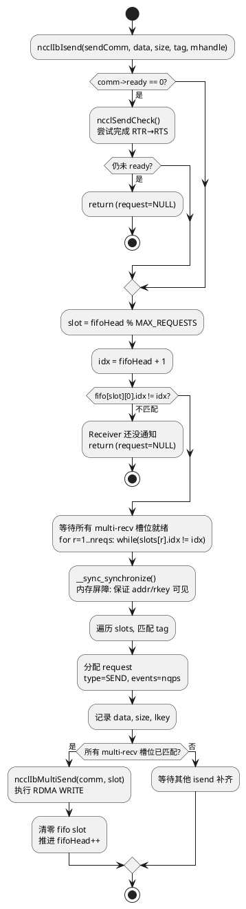

### 非阻塞设计

`ncclIbIsend` **绝不阻塞**。如果 FIFO 中没有 Receiver 的通知（idx 不匹配），
立即返回 `*request = NULL`。上层 Proxy 在下一次 progress loop 中会再次调用。

## 6.2 ncclIbMultiSend — WR 链式构建（行 1253-1333）

这是真正调用 `ibv_post_send` 的地方。

### WR 链结构

```
单次提交的 WR 链（以 2 个 multi-recv + Adaptive Routing 为例）:

  WR[0]                     WR[1]                     WR[2]
  ┌──────────────────┐      ┌──────────────────┐      ┌──────────────────┐
  │ opcode: WRITE    │ next │ opcode: WRITE    │ next │ opcode:          │
  │ remote_addr: R0  │─────→│ remote_addr: R1  │─────→│ WRITE_WITH_IMM   │
  │ rkey: rkey0      │      │ rkey: rkey1      │      │ imm_data: sizes  │
  │ sge: {data0,len0}│      │ sge: {data1,len1}│      │ sge: (empty)     │
  │ flags: 0         │      │ flags: 0         │      │ flags: SIGNALED  │
  │ wr_id: (ignored) │      │ wr_id: (ignored) │      │ wr_id: encoded   │
  └──────────────────┘      └──────────────────┘      └──────────────────┘
     数据 RDMA WRITE            数据 RDMA WRITE          完成通知（触发对端 CQE）
```

### 数据 WR 构建（行 1261-1275）

```c
for (r = 0; r < nreqs; r++) {
    sge->addr  = reqs[r]->send.data;     // 源地址（GPU 或 Host）
    sge->lkey  = reqs[r]->send.lkey;     // 本地 MR 的 lkey

    wr->opcode = IBV_WR_RDMA_WRITE;      // 单边写，不消耗对端 RQ
    wr->wr.rdma.remote_addr = slots[r].addr;  // 来自 FIFO 的目标地址
    wr->wr.rdma.rkey        = slots[r].rkey;  // 来自 FIFO 的目标 rkey
    wr->next = wr + 1;                   // 链到下一个 WR

    // wr_id 编码：每 8 位存一个 request 索引
    wr_id += (reqs[r] - comm->verbs.reqs) << (r * 8);
}
```

### 通知 WR 构建（行 1292-1304）

```c
// 判断是否需要分离通知 WR（Adaptive Routing 或 multi-recv）
if (nreqs > 1 || reqs[0]->send.size > ncclParamIbArThreshold()) {
    lastWr++;  // 额外一个 0 字节 WR
}
lastWr->opcode    = IBV_WR_RDMA_WRITE_WITH_IMM;
lastWr->imm_data  = immData;        // 单 recv: size; multi: 每 bit 表示一个 recv 是否有数据
lastWr->send_flags = IBV_SEND_SIGNALED;  // 唯一带 signal 的 WR
lastWr->next = NULL;                 // 链尾
```

> **为什么 Adaptive Routing 要分两步？**
> AR 可能让数据包走不同路径，到达顺序不确定。如果数据和 IMM 在同一个 WR 中，
> HCA 可能先完成 IMM 通知但数据还没全到。分开后，数据 WR 全部完成，
> 再发 0 字节 WRITE_WITH_IMM，保证对端收到通知时数据已全部落地。

### Multi-QP 切分（行 1306-1330）

```c
const int align = 128;  // LL/LL128 协议要求 128B 对齐
for (q = 0; q < nqps; q++) {
    for (r = 0; r < nreqs; r++) {
        chunkSize = DIVUP(DIVUP(size, nqps), align) * align;
        length = min(size - offset, chunkSize);
        sges[r].length = length;
        // 地址和 remote_addr 逐段推进
    }
    ibv_post_send(qps[q], wrs, &bad_wr);  // 每个 QP 发一段
    // 推进 offset 和地址
}
```

多 QP 的好处：不同 QP 的包可能走不同物理路径（ECMP/LAG），利用多条链路带宽。

### wr_id 编码设计

```
wr_id 是 64 位整数，每 8 位存一个 request 在 reqs[] 中的索引：

  wr_id = req0_idx | (req1_idx << 8) | (req2_idx << 16) | ...

  位布局 (以 3 个 multi-recv 为例):
  63                  24    16     8      0
  ├───── unused ──────┤ req2 │ req1 │ req0 │

完成时 ncclIbTest 通过位运算解码出每个 request 的索引。
最多支持 8 个 sub-request（64 / 8 = 8），够用了（NCCL_NET_IB_MAX_RECVS ≤ 8）。
```

## 6.3 ncclIbIrecv — 接收入口（行 1518-1554）

接收端做两件事：

**Step 1: Post 空 Recv WR**

```c
struct ibv_recv_wr wr;
wr.sg_list = NULL;   // 不绑定任何 buffer !
wr.num_sge = 0;

for (q = 0; q < nqps; q++) {
    ibv_post_recv(qps[q], &wr, &bad_wr);
}
req->events = nqps;
```

> **关键理解**：Recv WR 的 sg_list 是 NULL！
>
> 因为数据不是通过 RDMA SEND 到达的，而是通过 **RDMA WRITE 直接写入接收 buffer**。
> 这里 post recv 只是为了接收 `RDMA_WRITE_WITH_IMM` 触发的完成通知。
> IMM 数据携带在 Recv CQE 的 `imm_data` 字段中。
>
> 如果你之前只用过 RDMA SEND/RECV 模型，这里可能不好理解：
> WRITE_WITH_IMM 的特殊之处在于——它是唯一一个 **既是 RDMA 操作又消耗对端 Recv WR** 的操作。
> 纯 RDMA WRITE 不消耗 Recv WR，但 WRITE_WITH_IMM 会消耗一个，以便传递 imm_data。

**Step 2: PostFifo 通知 Sender**

```c
ncclIbPostFifo(comm, n, data, sizes, tags, mhandles, req);
```

这就是第五章描述的 FIFO 通知机制——把接收 buffer 的 {addr, rkey, size, tag, idx}
通过 RDMA WRITE 写到 Sender 的 FIFO。

## 6.4 ncclIbIflush — GDR 场景的 PCIe Flush（行 1556-1586）

### 问题

RDMA WRITE 把数据写到 GPU 显存（通过 BAR 空间映射）。但 PCIe 的 **posted write 语义**
意味着：NIC 完成写入后，数据可能还在 PCIe 总线的写缓冲中，GPU 不一定立即可见。

### 方案

用一次 **RDMA READ** 从 GPU 读 1 字节到 Host。RDMA READ 是 PCIe Non-Posted 操作，
必须等前面所有 Posted Write 完成后才能返回。这相当于一次 **PCIe 级别的 flush**。

```c
wr.opcode = IBV_WR_RDMA_READ;
wr.wr.rdma.remote_addr = data[last];       // GPU 显存地址（刚被 WRITE 写入的地方）
wr.wr.rdma.rkey = mr->rkey;                // GPU buffer 的 rkey
wr.sg_list = &comm->gpuFlush.sge;          // 读到 host 端的小 buffer
wr.send_flags = IBV_SEND_SIGNALED;
ibv_post_send(comm->gpuFlush.qp, &wr, &bad_wr);
```

> **gpuFlush QP 是 loopback QP**：它连接回自己（RTR 时 dest_qpn 填自己的 qpn），
> 用于发起从 GPU 到 Host 的 RDMA READ。这是一个常见的 GDR 技巧。

### 什么时候触发

```c
if (comm->gpuFlush.enabled == 0 || last == -1)
    return ncclSuccess;  // 不需要 flush: 没有 GDR 或没有有效数据
```

只在 GDR 启用且有实际数据传输时才 flush。`gpuFlush.enabled` 在 Accept 时根据
`ncclIbGdrSupport()` 判断。

---

# 第七章：完成检测与资源清理

## 7.1 ncclIbTest — CQ 轮询（行 1608-1661）

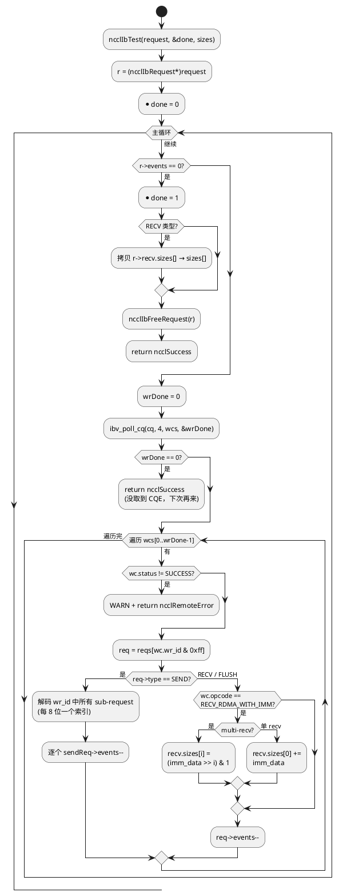

### events 计数机制


| 请求类型  | 初始 events | 每个 CQE 减几                  | 完成条件        |
| ----- | --------- | -------------------------- | ----------- |
| SEND  | nqps      | 每个 QP 的 signaled WR 完成 -1  | events == 0 |
| RECV  | nqps      | 每个 QP 收到 WRITE_WITH_IMM -1 | events == 0 |
| FLUSH | 1         | RDMA READ 完成 -1            | events == 0 |


注意 CQ 是 **Send 和 Recv 共用的**（创建 QP 时 `send_cq = recv_cq = verbs->cq`）。
所以 `ibv_poll_cq` 可能取出 Send CQE 也可能取出 Recv CQE，通过 `wc.opcode` 区分。

### imm_data 语义

- **单 recv**：`imm_data = size`（实际传输的字节数）
- **multi-recv**：`imm_data` 的每一位表示对应 recv 是否有数据（0 或 1），
因为 multi-recv 场景下各 recv 的 size 可能不同，不能用一个整数表示

## 7.2 资源销毁

### ncclIbCloseSend（行 1663-1675）

```c
close(comm->sock.fd);                          // 关闭 TCP socket
for (q = 0; q < nqps; q++)
    ibv_destroy_qp(comm->qps[q]);              // 销毁 QP
ibv_dereg_mr(comm->fifoMr);                    // 注销 FIFO MR
ncclIbDestroyVerbs(&comm->verbs);              // 销毁 CQ + PD（引用计数）
free(comm);
```

### ncclIbCloseRecv（行 1677-1692）

```c
close(comm->sock.fd);
for (q = 0; q < nqps; q++)
    ibv_destroy_qp(comm->qps[q]);
if (gpuFlush.enabled) {
    ibv_destroy_qp(comm->gpuFlush.qp);        // 销毁 loopback QP
    ibv_dereg_mr(comm->gpuFlush.hostMr);       // 注销 flush buffer MR
}
ibv_dereg_mr(comm->remFifo.mr);                // 注销 FIFO 本地暂存区 MR
ncclIbDestroyVerbs(&comm->verbs);
free(comm);
```

### 销毁顺序

```
Socket → QP → MR → CQ → PD (引用计数归零时)

重要：PD 由同设备的所有连接共享，只有最后一个连接关闭时才释放。
      ncclIbDestroyVerbs 中:
        if (--ncclIbDevs[dev].pdRefs == 0)
            ibv_dealloc_pd(pd);
```

> **RDMA 类比**：和你写 RDMA 应用时的销毁顺序一致——先销毁依赖者（QP 依赖 PD/CQ），
> 再销毁被依赖者。如果顺序反了，`ibv_destroy_qp` 会报错。

---

# 第八章：RDMA 开发者思考题

> 以下问题覆盖 FIFO 机制、RDMA 操作选择、连接管理和性能优化四个维度。
> 建议逐题思考后再看提示，写下你的理解。

## FIFO 机制

**Q1**：标准 RDMA 应用连接建立时交换 MR 信息，之后 buffer 地址固定不变。
NCCL 为什么不能这么做？

> *提示*：思考 PyTorch tensor 的生命周期。显存分配器（如 caching allocator）
> 会复用物理内存但改变虚拟地址。每次 allreduce 传入的 tensor 地址不同。

**Q2**：Receiver 通过 RDMA WRITE 把 {addr, rkey, idx} 写到 Sender FIFO。
如果 idx 先于 addr/rkey 到达（部分写入可见），Sender 会不会读到无效的 addr/rkey？

> *提示*：看 `ncclIbSendFifo` 的结构布局——idx 是最后一个字段（偏移 0x18）。
> RDMA WRITE 按 PCIe TLP 顺序写入，低地址先写、高地址后写。
> 所以 addr (0x00) 和 rkey (0x0C) 比 idx (0x18) 先可见。
> 再加上 `__sync_synchronize()` 内存屏障和 32B 对齐保证。

**Q3**：`ncclIbSendFifo` 为什么要 32 字节对齐？如果不对齐，Relaxed Ordering 下会发生什么？

> *提示*：PCIe Relaxed Ordering 允许写请求被拆分和重排。
> 如果一个 32 字节结构跨越 cache line 边界，前 16 字节和后 16 字节
> 可能以不同时间到达——Sender 可能读到半新半旧的数据。

## RDMA 操作选择

**Q4**：NCCL 用 RDMA WRITE 而不是 RDMA SEND 传输数据。最大的好处是什么？

> *提示*：RDMA SEND 需要对端 post Recv WR 并绑定接收 buffer，
> 消耗 RQ 资源且 buffer 大小必须预先确定。
> RDMA WRITE 不消耗对端任何资源（除了注册 MR）。
> 在 NCCL 的高吞吐场景下，省掉 RQ 管理是巨大的简化。

**Q5**：为什么完成通知用 `RDMA_WRITE_WITH_IMM` 而不是单独发一个 `RDMA_SEND`？

> *提示*：WRITE_WITH_IMM 的特殊性——它既写数据又触发对端 CQE，
> 且 imm_data 可以携带 32 位元数据（size）。
> 用 SEND 需要额外的接收 buffer 来存放控制信息，且要管理更多的 Recv WR。
> WRITE_WITH_IMM 把数据传输和完成通知合二为一。

**Q6**：GDR flush 为什么用 RDMA READ 而不是 `__threadfence_system()` 等内存屏障？

> *提示*：`__threadfence_system()` 是 GPU 侧的屏障，影响 GPU 发起的写入。
> 但 GDR 场景下，数据是 **NIC 通过 PCIe 写入 GPU BAR 空间**——GPU 没有参与写操作。
> GPU 侧屏障对 PCIe posted write 无效。RDMA READ 是 PCIe 层面的
> non-posted 操作，能真正 flush PCIe write buffer。

## 连接管理

**Q7**：NCCL 为什么不用 `rdma_cm` 建链，而是自己用 TCP socket 做 OOB？

> *提示*：考虑以下因素——
> (1) rdma_cm 依赖内核态的 RDMA CM 模块，增加部署复杂度
> (2) rdma_cm 的连接建立是阻塞/事件驱动模式，NCCL 需要非阻塞状态机
> (3) NCCL 已经有 bootstrap 用的 TCP 通道，复用它零额外成本
> (4) 自定义 OOB 可以携带 FIFO 地址等特定信息

**Q8**：Connect 端的 INIT→RTR→RTS 为什么不在 `ncclIbConnect` 中一步做完，
而要延迟到首次 `ncclIbIsend` 时（通过 `ncclSendCheck`）？

> *提示*：`ibv_modify_qp(RTR)` 需要对端的 QPN。Connect 端发送自己的 QpInfo 后，
> 对端可能还没创建 QP。如果在 Connect 中阻塞等待对端回复，
> 会破坏非阻塞状态机的设计。推迟到首次 isend 时，对端一定已经完成了 Accept
> 并发回了 QpInfo。

## 性能优化

**Q9**：Multi-QP（`NCCL_IB_QPS_PER_CONNECTION > 1`）对网络有什么好处？
数据切分为什么要 128B 对齐？

> *提示*：不同 QP 的包有不同的五元组（至少 QPN 不同），
> 交换机 ECMP/NIC LAG 可以把它们哈希到不同路径，利用多链路带宽。
> 128B 对齐是因为 NCCL 的 LL128 协议以 128 字节为传输粒度，
> 非对齐切分会破坏协议格式。

**Q10**：`ncclIbPostFifo` 中 unsignaled WR 每 `MAX_REQUESTS` 轮 signal 一次。
如果完全不 signal 会怎样？

> *提示*：IB 规范要求 SQ 中必须有 signaled WR 来推进 completion，
> 否则所有 outstanding WR 的状态永远 unknown。
> SQ 满后无法 post 新 WR，也无法通过 poll CQ 回收——死锁。
> 这是 RDMA 编程中最经典的陷阱之一（参考 rdmamojo.com）。

**Q11**：观察 `ncclIbMultiSend` 中的 WR 链，数据 WR 全部 unsignaled，
只有最后的 WRITE_WITH_IMM 是 signaled。这对性能有什么影响？

> *提示*：每个 CQE 都有处理开销。如果每个数据 WR 都 signaled，
> CQ 的 poll 压力会成倍增加。只在最后一个 WR signal，
> 通过 IB "ordered completion" 语义保证前面的 WR 也已完成。
> 这将 N 个 CQE 压缩为 1 个——典型的 RDMA 性能优化技巧。

**Q12**（开放题）：如果你来设计 NCCL 的 IB 传输层，有哪些不同的设计选择？
考虑以下维度：

- 是否可以用 Shared Receive Queue (SRQ) 替代当前的独立 RQ？
- 是否可以用 RDMA READ（Sender 主动拉取）替代当前的 RDMA WRITE（Sender 主动推送）模型？
- FIFO 通知是否可以用 in-band signaling（例如数据末尾的 magic word）替代？

---

# 附录 A：Verbs 调用链速查

## 控制面调用链

```
ncclIbInit
  └─ wrap_ibv_get_device_list → wrap_ibv_open_device → wrap_ibv_query_port

ncclIbConnect
  ├─ ncclIbInitVerbs
  │    ├─ wrap_ibv_alloc_pd (首次)
  │    └─ wrap_ibv_create_cq
  ├─ ncclIbCreateQp (×nqps)
  │    ├─ wrap_ibv_create_qp
  │    └─ wrap_ibv_modify_qp (RESET→INIT)
  └─ wrap_ibv_reg_mr (FIFO)

ncclIbAccept
  ├─ ncclIbInitVerbs (同上)
  ├─ ncclIbCreateQp (×nqps)
  ├─ ncclIbRtrQp → wrap_ibv_modify_qp (INIT→RTR)
  ├─ ncclIbRtsQp → wrap_ibv_modify_qp (RTR→RTS)
  ├─ wrap_ibv_reg_mr (remFifo + gpuFlush)
  └─ ncclIbCreateQp (gpuFlush loopback QP)

ncclSendCheck (延迟完成)
  ├─ ncclIbRtrQp → wrap_ibv_modify_qp (INIT→RTR)
  └─ ncclIbRtsQp → wrap_ibv_modify_qp (RTR→RTS)
```

## 数据面调用链

```
ncclIbIsend
  ├─ 轮询 FIFO (slots[0].idx)
  ├─ __sync_synchronize
  └─ ncclIbMultiSend
       └─ wrap_ibv_post_send (RDMA WRITE + WRITE_WITH_IMM)

ncclIbIrecv
  ├─ wrap_ibv_post_recv (空 WR)
  └─ ncclIbPostFifo
       └─ wrap_ibv_post_send (RDMA WRITE to Sender FIFO)

ncclIbIflush
  └─ wrap_ibv_post_send (RDMA READ, gpuFlush QP)

ncclIbTest
  └─ wrap_ibv_poll_cq
```

## 销毁调用链

```
ncclIbCloseSend
  ├─ wrap_ibv_destroy_qp (×nqps)
  ├─ wrap_ibv_dereg_mr (fifoMr)
  └─ ncclIbDestroyVerbs
       ├─ wrap_ibv_destroy_cq
       └─ wrap_ibv_dealloc_pd (引用计数归零时)

ncclIbCloseRecv
  ├─ wrap_ibv_destroy_qp (×nqps + gpuFlush QP)
  ├─ wrap_ibv_dereg_mr (gpuFlush.hostMr + remFifo.mr)
  └─ ncclIbDestroyVerbs (同上)
```

---

# 附录 B：NCCL vs 标准 RDMA 应用设计对比


| 维度            | 标准 RDMA 应用               | NCCL net_ib.cc             |
| ------------- | ------------------------ | -------------------------- |
| **连接管理**      | rdma_cm 或自定义 OOB         | TCP socket OOB             |
| **Buffer 地址** | 连接时固定，生命周期不变             | 每次传输动态变化（FIFO 通知）          |
| **MR 管理**     | 预注册固定 buffer             | MR Cache + 引用计数            |
| **数据操作**      | SEND/RECV 或 WRITE        | 纯 WRITE + WRITE_WITH_IMM   |
| **完成通知**      | CQE 或 Completion Channel | CQE (poll 模式)              |
| **流控**        | 应用层 credit               | FIFO slot 数 = MAX_REQUESTS |
| **多路径**       | 多 QP 或 多连接               | Multi-QP round-robin       |
| **GPU 集成**    | 无                        | GDR + DMA-BUF + PCIe flush |
| **符号链接**      | 静态链接 libibverbs          | dlopen 动态加载                |
| **阻塞模型**      | 阻塞/事件驱动                  | 纯非阻塞状态机                    |


