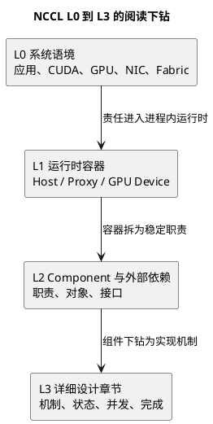

# NCCL 架构总索引（L0-L3）

## 1. 文档定位

本文是 NCCL 架构资料的入口，规定从系统语境到实现机制的下钻边界，并为阅读和
评审提供统一导航。源码基线固定为 NCCL `v2.31.2-1`，提交
`7b83616df3ae082a1f32bb74c27458bfe8153a13`。

本索引不修改 NCCL 源码、公开 API 或运行配置。现有 Archify HTML/JSON 保持独立，
不作为本索引的必需导航。

| 层级 | 核心问题 | 入口文档 |
| --- | --- | --- |
| L0 系统语境 | NCCL 在应用、CUDA、GPU、NIC 与 Fabric 之间承担什么责任 | [L0 系统语境](nccl-l0-system-context.md) |
| L1 运行时容器 | 哪些长期运行的执行容器承担 Host、Proxy 与 GPU 职责 | [L1 运行时容器](nccl-l1-runtime-containers.md) |
| L2 Component | 每个容器内有哪些稳定职责、对象与外部依赖 | [L2 Component 设计](../archify/nccl-l2-design.md) |
| L3 详细设计 | 每个组件内部的机制、状态、并发、所有权与完成边界如何实现 | [L3 详细设计索引](../l3/nccl-l3-design-index.md) |

## 2. 分层定义与禁止越层事项

| 层级 | 定义 | 允许回答 | 禁止越层事项 |
| --- | --- | --- | --- |
| L0 | 系统上下文视图。NCCL 被放在用户进程、CUDA、GPU、网络栈、NIC 与外部 Fabric 之间观察。 | 系统责任、外部参与者、输入输出和运行环境依赖。 | 不把外部 Fabric、NIC 或 CUDA 运行时描述为 NCCL 内部所有者；不根据系统图断言某次运行选择的算法、协议或路径。 |
| L1 | Runtime Container View。将 NCCL 进程内职责聚合为 Host NCCL Runtime、Proxy Progress Runtime 与 GPU Device Runtime。 | 哪个执行容器持有哪类长期状态，容器间如何交接控制与数据相关工作。 | 不把容器直接等同于线程、kernel 或单个函数；不在容器图中展开组件内部队列、字段和状态机。 |
| L2 | Component View。按稳定职责与状态边界拆 Host、Proxy、GPU 容器，并显式标出外部依赖。 | 组件输入输出、主要对象、组件协作及外部接口。 | 不把调用栈逐函数平铺为组件；不把外部 Fabric 强造为 NCCL L2 component；不省略外部依赖而暗示 NCCL 拥有 NIC 或网络。 |
| L3 | 详细设计视图。围绕一个机制写清入口、对象、状态、并发、所有权、退出与可观测性。 | 具体实现路径、结构字段、队列推进、同步和完成条件。 | 不以一个函数局部推翻 L0-L2 的责任边界；不把固定源码的静态分支表述为目标机器已经走过的运行路径。 |

## 3. 三级证据与术语边界

| 证据级别 | 定义 | 可支持的结论 | 不能支持的结论 |
| --- | --- | --- | --- |
| 源码事实 | 固定提交中可定位的函数、结构、字段、分支或接口。 | 代码存在某条静态路径、对象关系或接口契约。 | 目标机器实际执行了该路径，或获得了特定性能。 |
| 设计归纳 | 基于多个源码事实抽象出的职责、边界和阅读模型。 | 评审和维护时的组件划分、所有权解释。 | 官方 API 命名、ABI 承诺或机器运行事实。 |
| 待运行验证 | 日志、NCCL debug、Profiler、CUDA event、GPU/HCA/NIC 计数器或实验取得的观察。 | 目标环境的算法、协议、transport、GDR、rail、完成时序与性能。 | 未采集证据的其他机器或其他配置。 |

术语采用以下边界：collective API 表达通信语义；algorithm 表示 Ring、Tree 等
调度实现；protocol 表示 Simple、LL、LL128 等数据推进方式；transport 表示
P2P、SHM、NET 等连接与传输类型；GDR 表示目标运行中 GPU 与 NIC 内存路径的实际
条件。一次 API 调用不证明 algorithm、protocol、transport 或 GDR；静态源码也不证明目标机器的实际运行路径。

## 4. L0 到 L3 完整映射

下表的 L2 列同时容纳 NCCL component 与外部依赖。外部 Fabric 保留为 L0 外部
依赖，不新增虚构的 NCCL component。

| L0 系统责任 | L1 容器 | L2 Component / 外部依赖 | L3 章节 |
| --- | --- | --- | --- |
| Rank 会合、communicator 建立与持久状态 | Host NCCL Runtime | Communicator Init & State；Bootstrap、CUDA device 环境为外部依赖 | I1、C1 |
| GPU/NIC/PCI/NVLink 拓扑发现、路径与 collective graph 构造 | Host NCCL Runtime | Topology & Graph Builder；GPU、NIC、PCI/NVLink 拓扑为外部依赖 | I2、I3、I4、H6 |
| Collective API 语义、参数检查与显式或隐式 group 收口 | Host NCCL Runtime | API & Validation；Group Lifecycle | H1、H2、C1、C3 |
| 普通 collective 准入、请求持久化、排序和执行计划生成 | Host NCCL Runtime | Task Admission；Planner & Task Queues；Tuning & Cost Selection；Work & Plan Builder | H3、H4、H5、H6、H7、C1 |
| Host 侧提交 Proxy 工作和 CUDA kernel，建立异步完成观察点 | Host NCCL Runtime | Launch Coordinator；CUDA stream/runtime 为外部依赖 | H8、C2、C3 |
| 节点内 peer 连接、P2P/SHM 路径与 device FIFO/credit 推进 | GPU Device Runtime；Host NCCL Runtime | Transport Selection / Connector；Connector / FIFO；P2P、SHM、GPU interconnect、CUDA 为外部依赖 | T1、T2、D1、D4、D5、D6、C1、C2 |
| GPU 上 collective work 分发和 Ring/Tree 等已选定实现的执行 | GPU Device Runtime | Kernel Entry / Dispatcher；Algorithm Layer；Protocol Primitives | D1、D2、D3、D4、D5、D6 |
| 跨节点连接建立、资源注册、operation 提交与进度推进 | Proxy Progress Runtime；GPU Device Runtime | Proxy Client / Service；Connection & Resources；Operation Submission / Queue；Active Op Scheduler；Transport Progress；Connector / FIFO | T1、T3、P1、P2、P3、P4、D6、C1、C2 |
| NCCL 到网络后端的 ABI 交接与 net_ib 细节 | Proxy Progress Runtime | `ncclNet` / `net_ib` 适配与请求对象；NIC、QP/CQ、MR 为外部资源或后端实现边界 | N1、N2、N3、N4、N5、P4、C1、C2 |
| 外部网络 Fabric 的转发、拥塞和链路行为 | 无：位于 NCCL 进程外 | 外部 Fabric；不设 NCCL L2 component，NCCL 仅经 `ncclNet`/后端接口与其相关资源交接 | N1、N2、N4、N5、C3 |
| 跨 Host、Proxy、GPU 的对象所有权、错误传播、日志与可观测性 | Host NCCL Runtime；Proxy Progress Runtime；GPU Device Runtime | Cross-cutting Contracts；CUDA、网络后端与系统观测工具为外部依赖 | C1、C2、C3、H8、P4、D6 |

## 5. 四条阅读路线

### 5.1 初始化路线

目的：解释 communicator 如何从 rank 会合进入可规划的拓扑与 channel 状态。

`L0 系统语境 → L1 Host NCCL Runtime → I1 → I2 → I3 → I4 → C1`

停止边界：得到 communicator、拓扑模型和 collective graph 的静态设计，不据此断言
实际机器存在某个 NVLink、NIC rail 或最终 algorithm。

### 5.2 节点内通信路线

目的：解释 Host 如何形成 device work，以及 GPU 端如何沿本地 connector 推进。

`H1 → H2 → H3 → H4 → H5 → H6 → H7 → H8 → T1 → T2 → D1 → D2 或 D3 → D4 → D5 → D6 → C2`

停止边界：理解 P2P/SHM 和 FIFO/credit 的源码职责，不把源码中的候选路径当作某块
GPU 的实际节点内通信路径。

### 5.3 跨节点通信路线

目的：解释从 connector 到 Proxy 再到网络后端的控制与数据推进边界。

`T1 → T3 → P1 → P2 → P3 → P4 → N1 → N2 → N3 → N4 → N5 → C1 → C2`

停止边界：理解 `ncclNet` 与 `net_ib` 的静态接口和异步 request 关系；是否启用 NET、
实际 QP/CQ、MR/GDR 或 rail 映射必须在目标环境采集运行证据。

### 5.4 异步完成路线

目的：区分 API 返回、Host 提交、Proxy request 完成、device 进度和 buffer 可复用。

`H2 → H4 → H7 → H8 → P2 → P3 → P4 → D1 → D6 → C1 → C2 → C3`

停止边界：只有相应 CUDA stream 同步、event、NCCL 错误查询或后端完成观察满足调用方
契约时，才能主张 buffer 可复用；`ncclInfo` 生命周期和 task 入队都不是完成证明。

## 6. L3 章节族总览

| 章节族 | 覆盖主题 | 设计文档 |
| --- | --- | --- |
| I1-I4 | 初始化、拓扑、路径与 collective graph | [L3 初始化与拓扑](../l3/nccl-l3-01-init-topology.md) |
| H1-H8 | API、group、task、planner、tuning、work、launch | [L3 Host Planner](../l3/nccl-l3-02-host-planner.md) |
| T1-T3 | transport 选择、节点内路径、NET 连接与缓冲区 | [L3 Transport 与 Connector](../l3/nccl-l3-03-transport-connector.md) |
| P1-P4 | Proxy 控制面、队列、调度、send/recv progress | [L3 Proxy Runtime](../l3/nccl-l3-04-proxy-runtime.md) |
| D1-D6 | kernel、work batch、Ring/Tree、protocol、FIFO/credit | [L3 GPU Device Runtime](../l3/nccl-l3-05-device-runtime.md) |
| N1-N5 | `ncclNet` ABI、连接、MR/GDR、request、rail | [L3 ncclNet 与 net_ib](../l3/nccl-l3-06-net-ib.md) |
| C1-C3 | 所有权、异步完成与错误、参数/日志/Profiler/证据 | [L3 运行时契约](../l3/nccl-l3-07-runtime-contracts.md) |

## 7. 第一版非目标

第一版不展开 CE Collective、RMA、CFT、GIN、NVLS、CollNet、PAT、Enqueue
Rearchitecture 和 `net_ib` resiliency。固定源码中出现这些分支时，本文档只保留
它们与经典通信主链的过滤边界，不进入其内部设计。
