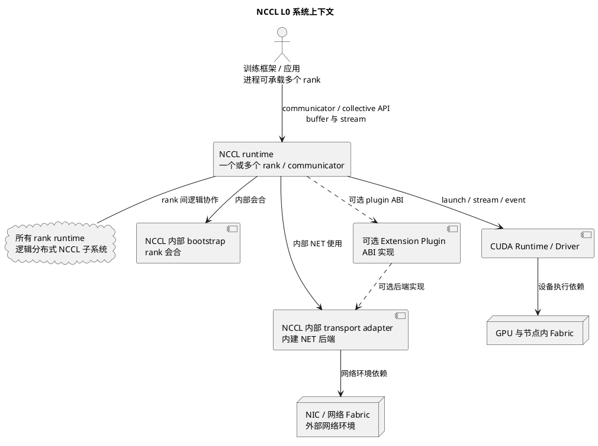
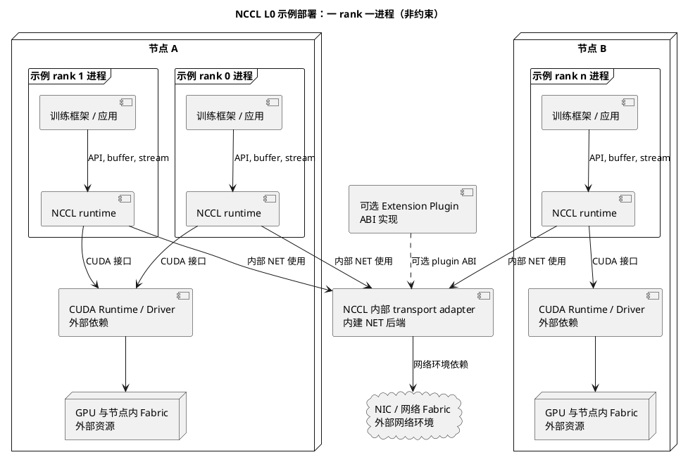
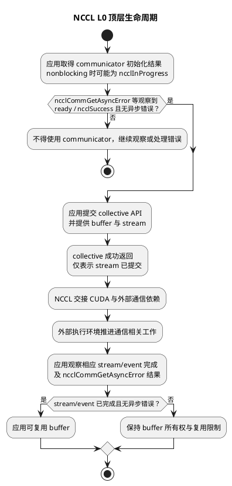
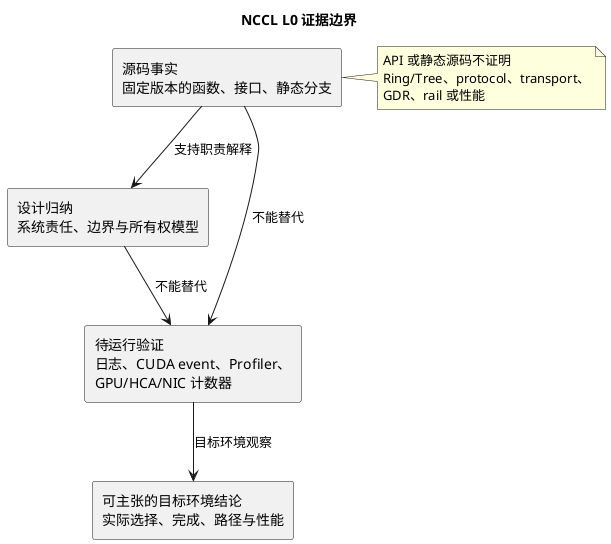

# NCCL L0 系统语境与责任边界

本文给出 NCCL 的 L0 系统语境：它说明 NCCL 对谁负责、同谁交换什么，以及哪些
结论必须留给运行证据。源码基线固定为 NCCL `v2.31.2-1`，提交
`7b83616df3ae082a1f32bb74c27458bfe8153a13`。本层只描述系统责任；实现容器、
组件和状态机分别由下层文档承担。

导航：[架构总索引](nccl-architecture-index.md)；下钻：[L1 运行时容器](nccl-l1-runtime-containers.md)。

文档范围：本文不展开 CE、RMA、CFT、GIN、NVLS、CollNet、PAT、Enqueue
Rearchitecture 与 `net_ib` resiliency 的实现设计；这是一版 L0 阅读范围，不是这些
NCCL 能力的系统非目标。

## L0-1. 系统使命、能力与非目标

NCCL 的系统使命是在承载一个或多个 rank/communicator 的应用进程中承接多 GPU /
多 rank collective 通信语义，并协调其与 CUDA、设备和网络依赖的交接。所有 rank
对应的 NCCL runtime 共同构成一个逻辑分布式 NCCL 子系统；它不是一个独立拥有硬件的
外部服务。

| 契约字段         | L0-1 定义                                                                                                                                                                                                                           |
| ---------------- | ----------------------------------------------------------------------------------------------------------------------------------------------------------------------------------------------------------------------------------- |
| 目标与非目标     | 目标是提供 communicator 和 collective 语义的系统交接。非目标是替应用定义训练计算、拥有用户数据或替 CUDA、GPU、NIC、Fabric 承担硬件资源管理。                                                                                        |
| 参与者和系统边界 | 系统是嵌入应用进程的 NCCL runtime 及其跨 rank 的逻辑协作；一个进程可承载一个或多个 rank/communicator。训练框架或应用、CUDA Runtime/Driver、GPU、节点内 Fabric、NIC/网络 Fabric 是外部参与者；Extension Plugin 是可选 ABI 扩展实现。 |
| 外部接口         | 应用通过 communicator/collective API 表达通信；CUDA Runtime/Driver 提供 stream、launch 与 event 相关接口；NCCL 内部 bootstrap 完成 rank 会合，内部 transport adapter 经 NET 后端能力与网络环境交接；可选扩展经 plugin ABI 接入。    |
| 控制或数据交换   | NCCL 接收 collective 请求、communicator 身份和 stream 语境，并由内部 bootstrap 与 transport adapter 协调对外控制和数据访问条件；应用 buffer 的内容不因 API 调用而转移给 NCCL 所有。                                                 |
| 资源与所有权     | NCCL 不拥有 CUDA、GPU、NIC 或任何 Fabric，却管理 communicator 生命周期内分配的通信状态、连接和注册句柄的创建、使用与释放。应用拥有 send/receive buffer，并以 stream/event 建立其可复用边界。                                        |
| 可观测证据       | 固定源码可证明公开入口和静态依赖存在；设计归纳可说明责任边界；目标环境的路径、完成时序和性能必须待运行验证。                                                                                                                        |
| L1 下钻入口      | [L1 运行时容器](nccl-l1-runtime-containers.md) 用 Host NCCL Runtime、Proxy Progress Runtime 与 GPU Device Runtime 承接本层责任，未在此展开其内部。                                                                                   |

静态源码锚点（仅支持职责存在）：`src/init.cc:ncclCommInitRank` 提供 rank
communicator 初始化入口；`src/init.cc:ncclCommInitAll` 支持单进程多 CUDA device 的
communicator clique；`src/collectives.cc:ncclAllReduce` 提供一个 collective API 入口。

## L0-2. System of Interest 边界与外部参与者

System of Interest 是“承载一个或多个 rank/communicator 的应用进程内 NCCL runtime，
加上这些 runtime 的逻辑分布式协作”。它与外部参与者有明确交接，却不把硬件资源或
网络环境纳入 NCCL 所有权；bootstrap 和 transport adapter 是 NCCL 内部模块。

| 契约字段         | L0-2 定义                                                                                                                                                                                                                                               |
| ---------------- | ------------------------------------------------------------------------------------------------------------------------------------------------------------------------------------------------------------------------------------------------------- |
| 目标与非目标     | 目标是标出系统内外和责任交接。非目标是把 CUDA、GPU、节点内 Fabric、NIC、网络 Fabric 或插件实现重述为 NCCL 内部子系统。                                                                                                                                  |
| 参与者和系统边界 | 训练框架/应用驻留在可承载一个或多个 rank/communicator 的进程；该进程嵌入 NCCL runtime。所有 rank runtime 共同构成逻辑分布式 NCCL 子系统。CUDA Runtime/Driver、GPU 与节点内 Fabric、NIC/网络 Fabric 是外部参与者；Extension Plugin 是可选 ABI 扩展实现。 |
| 外部接口         | 应用面为 communicator/collective API；CUDA 面为 launch/stream/event；NCCL 内部 bootstrap 负责 rank 会合，内部 transport adapter 以 NET 后端能力对接网络环境；可选扩展面为 plugin ABI。                                                                  |
| 控制或数据交换   | 应用向 NCCL 交接请求、buffer 地址与 stream；NCCL 向 CUDA 交接提交语境，并经内部 bootstrap、transport adapter 和可选 ABI 扩展使用网络环境能力。节点内与网络 Fabric 承担其自身的数据承载责任。                                                            |
| 资源与所有权     | 应用保有 buffer；CUDA Runtime/Driver、GPU、节点内 Fabric、NIC 与网络 Fabric 各自保有其资源。NCCL 管理 communicator 生命周期内的通信状态、连接和注册句柄，但不取得硬件资源所有权；可选 plugin 也不因 ABI 接入而成为 NCCL 所有资源。                      |
| 可观测证据       | 源码事实能定位 API、初始化和 plugin 接口；系统图是设计归纳。图中的连接不证明实际使用的硬件路径、网络后端或设备间链路。                                                                                                                                  |
| L1 下钻入口      | [L1 运行时容器](nccl-l1-runtime-containers.md) 解释进程内长期执行容器如何承接这些外部交接，而不改变本层系统边界。                                                                                                                                        |

静态源码锚点（仅支持边界相关职责）：`src/init.cc:ncclCommInitRank` 是
communicator 初始化入口；`src/plugin/net.cc:ncclNetInit` 枚举可用 NET 后端，含内建
后端与可选外部 plugin 的静态实现边界。

## L0-3. 外部接口与交换信息契约

外部接口按调用方和依赖方分开描述。它们表达语义、提交语境或能力交接，不能被
反推为目标机器选择了某一种具体实现路径。

| 契约字段         | L0-3 定义                                                                                                                                                                                                                                        |
| ---------------- | ------------------------------------------------------------------------------------------------------------------------------------------------------------------------------------------------------------------------------------------------ |
| 目标与非目标     | 目标是区分四类外部契约及其交换信息。非目标是不在 L0 规定内部请求保存、选择逻辑、Proxy 行为或 device 执行细节。                                                                                                                                   |
| 参与者和系统边界 | 调用方是训练框架/应用；外部依赖方是 CUDA Runtime/Driver、GPU、NIC 与网络 Fabric。NCCL runtime 是进程内契约适配者；bootstrap、transport adapter 和内建 NET 后端在 NCCL 内，Extension Plugin 是可选 ABI 扩展实现。                                 |
| 外部接口         | communicator/collective API 交接通信语义和 communicator；CUDA launch/stream/event 接口交接异步执行语境；NCCL 内部 bootstrap 负责 rank 会合，内部 transport adapter/内建 NET 后端对接网络环境；可选 plugin ABI 由`ncclNet_t` 约束扩展后端能力。 |
| 控制或数据交换   | collective API 传递 buffer 地址、count、datatype、op、communicator 与 stream；CUDA 接收提交与完成观察语境；NCCL 内部 bootstrap 协调会合，transport adapter 以内建后端或可选 plugin ABI 使用网络能力。接口不复制并拥有应用 buffer。               |
| 资源与所有权     | 应用继续拥有 buffer，并以其 stream/event 同步建立安全复用边界。NCCL 不拥有 CUDA、GPU、NIC 或 Fabric，却管理 communicator 生命周期内通信状态、连接和注册句柄的创建、使用与释放；外部依赖保持硬件与网络资源所有权。                                |
| 可观测证据       | API 与 ABI 定义是源码事实；接口层责任是设计归纳。一次 API 调用或静态源码都不证明 Ring/Tree、protocol、transport、GDR、rail 或性能。                                                                                                              |
| L1 下钻入口      | [L1 运行时容器](nccl-l1-runtime-containers.md) 将 API 接入、异步交接和外部依赖映射为容器间职责，但接口的调用者与所有权不在 L1 改写。                                                                                                              |

静态源码锚点（仅支持接口存在）：`src/collectives.cc:ncclAllReduce` 连接公开
collective API；`src/group.cc:ncclGroupStart` 与 `src/group.cc:ncclGroupEnd` 提供
显式分组边界；`src/include/plugin/nccl_net.h:ncclNet_t` 定义网络 plugin ABI 类型。

## L0-4. 分布式部署、资源与所有权边界

部署视图强调进程、rank/communicator 与外部资源的嵌入关系及归属。一个进程可承载
一个或多个 rank/communicator；`ncclCommInitAll` 是单进程多 CUDA device/rank 的静态
入口。逻辑分布式子系统跨 rank 存在，但不跨越进程边界去拥有 CUDA、GPU、NIC 或
Fabric。

| 契约字段         | L0-4 定义                                                                                                                                                                                                                                                                                                                 |
| ---------------- | ------------------------------------------------------------------------------------------------------------------------------------------------------------------------------------------------------------------------------------------------------------------------------------------------------------------------- |
| 目标与非目标     | 目标是表达进程、节点与网络层面的部署和所有权。非目标是从部署图推断任何实际拓扑、rail 数量、设备亲和性、传输选择或性能结果。                                                                                                                                                                                               |
| 参与者和系统边界 | 一个应用进程可包含应用与承载一个或多个 rank/communicator 的 NCCL runtime；同一节点可包含多个这类进程及其 GPU/节点内 Fabric 依赖。NIC/网络 Fabric 与 CUDA Runtime/Driver 位于 NCCL 外部；bootstrap、transport adapter 和内建 NET 后端位于 NCCL 内，可选 plugin 经 ABI 扩展。全部 rank runtime 合起来才是逻辑分布式子系统。 |
| 外部接口         | 进程内使用 communicator/collective API 和 CUDA launch/stream/event；NCCL 内部 bootstrap 协调 rank 会合，内部 transport adapter/NET 后端对接网络环境；可选外部后端经 plugin ABI 交接。                                                                                                                                     |
| 控制或数据交换   | 应用把请求和 buffer 地址交给其 NCCL runtime；NCCL 向 CUDA 交接执行语境，并经内部模块使用网络环境能力。节点内 Fabric 与网络 Fabric 的实际转发/搬运不属于 NCCL 所有。                                                                                                                                                       |
| 资源与所有权     | 应用拥有 buffer 并以 stream/event 建立复用边界。CUDA Runtime/Driver 管理 CUDA 资源，GPU 拥有设备资源，NIC/网络 Fabric 拥有网络资源；NCCL 管理 communicator 生命周期内通信状态、连接和注册句柄，但不拥有其中任何硬件资源。                                                                                                 |
| 可观测证据       | 源码可支持 communicator 和网络初始化入口的静态存在；部署模型是设计归纳。实际 GPU、NIC、Fabric 映射及其资源使用需从目标运行环境验证。                                                                                                                                                                                      |
| L1 下钻入口      | [L1 运行时容器](nccl-l1-runtime-containers.md) 从承载一个或多个 rank/communicator 的进程内 NCCL runtime 开始划分执行容器；本节不将容器等同于线程或 kernel。                                                                                                                                                                |

静态源码锚点（仅支持静态职责）：`src/init.cc:ncclCommInitRank` 表明 rank
communicator 初始化入口；`src/init.cc:ncclCommInitAll` 是单进程多 device/rank 静态
入口；`src/plugin/net.cc:ncclNetInit` 表明内建与可选外部 NET 后端的静态初始化边界。

## L0-5. 初始化、提交、执行、完成顶层生命周期与证据边界

本生命周期只说明系统责任的外部可见阶段：初始化先取得 communicator，再确认其
ready；提交把请求交给异步执行语境，执行依赖 CUDA 与外部通信环境，完成必须由调用方
可观察的同步或错误接口确认。nonblocking communicator 初始化可能返回
`ncclInProgress`，只能在 `ncclCommGetAsyncError` 等观察到 ready/`ncclSuccess` 后使用。
collective 成功返回只表示其已向 stream 提交，不等于通信完成，更不等于 buffer 可复用。

| 契约字段         | L0-5 定义                                                                                                                                                                                                                                                                                 |
| ---------------- | ----------------------------------------------------------------------------------------------------------------------------------------------------------------------------------------------------------------------------------------------------------------------------------------- |
| 目标与非目标     | 目标是区分初始化 ready、提交、执行和完成的顶层责任，以及每阶段能证明什么。非目标是不在 L0 描述内部 task、algorithm/protocol、Proxy 内部、kernel 内部或 L2/L3 状态机。                                                                                                                     |
| 参与者和系统边界 | 应用和训练框架发起初始化与 collective；进程内 NCCL runtime 可承载一个或多个 rank/communicator 并参与逻辑分布式协作；CUDA Runtime/Driver、GPU/节点内 Fabric、NIC/网络 Fabric 提供外部执行环境。                                                                                            |
| 外部接口         | 初始化经 communicator API 取得 communicator；NCCL 内部 bootstrap 协调 rank 会合，内部 transport adapter/NET 后端使用网络环境。提交使用 collective API 与 CUDA launch/stream/event；ready 和异步错误经`ncclCommGetAsyncError` 观察，完成由应用的 stream/event 同步与无异步错误共同判定。 |
| 控制或数据交换   | 初始化交换 rank 协作所需身份与内部依赖能力；nonblocking 初始化可能返回`ncclInProgress`，应用须等待 ready/`ncclSuccess`。提交交换 collective 参数、buffer 地址与 stream；执行期间数据承载在外部设备和 Fabric 资源上；完成把同步和错误观察结果交回应用。                                |
| 资源与所有权     | communicator 生命周期由应用使用的 API 约束，NCCL 管理其生命周期内通信状态、连接和注册句柄。应用一直拥有 buffer，并必须在相应 stream/event 已完成且无异步错误后复用；NCCL 不拥有 CUDA、GPU、NIC 或 Fabric。                                                                                |
| 可观测证据       | 源码事实支持 nonblocking 返回、ready 检查和各类入口的静态职责；设计归纳支持阶段划分。仅运行日志、CUDA event/同步、NCCL 错误查询、Profiler 或 GPU/HCA/NIC 计数器能验证目标环境的完成、Ring/Tree、protocol、transport、GDR、rail 或性能。                                                   |
| L1 下钻入口      | [L1 运行时容器](nccl-l1-runtime-containers.md) 继续解释顶层责任如何落到 Host、Proxy 与 GPU Device 容器；本层不把其内部进度路径当作完成事实。                                                                                                                                               |

静态源码锚点（仅支持顶层静态职责）：`src/init.cc:ncclCommInitRank` 是初始化
入口；`src/init.cc:ncclCommInitRankConfig` 在 nonblocking 配置下可通过
`ncclCommGetAsyncError` 返回异步状态；`src/collectives.cc:ncclAllReduce` 是提交语义入口；
`src/init.cc:ncclCommGetAsyncError` 提供 ready/异步错误观察接口；
`src/group.cc:ncclGroupStart` / `src/group.cc:ncclGroupEnd` 提供 API 分组边界。
