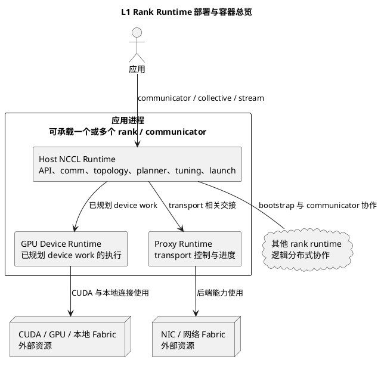
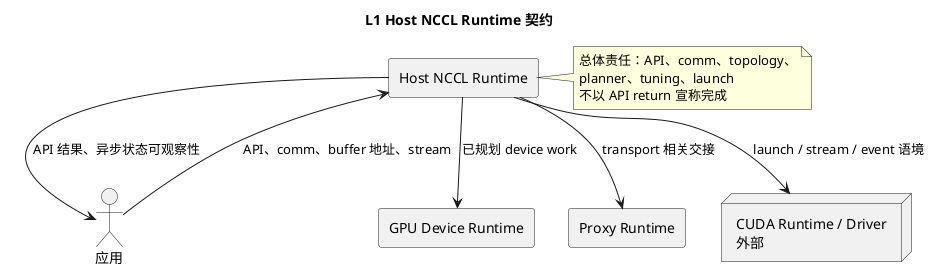
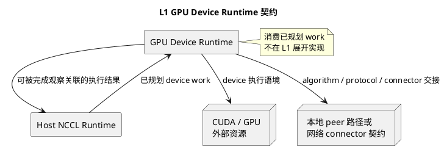
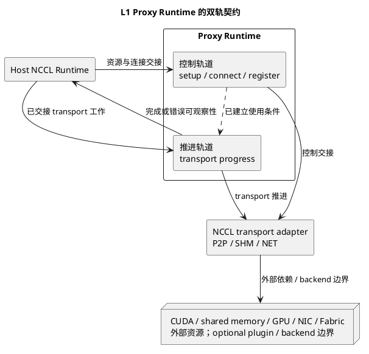
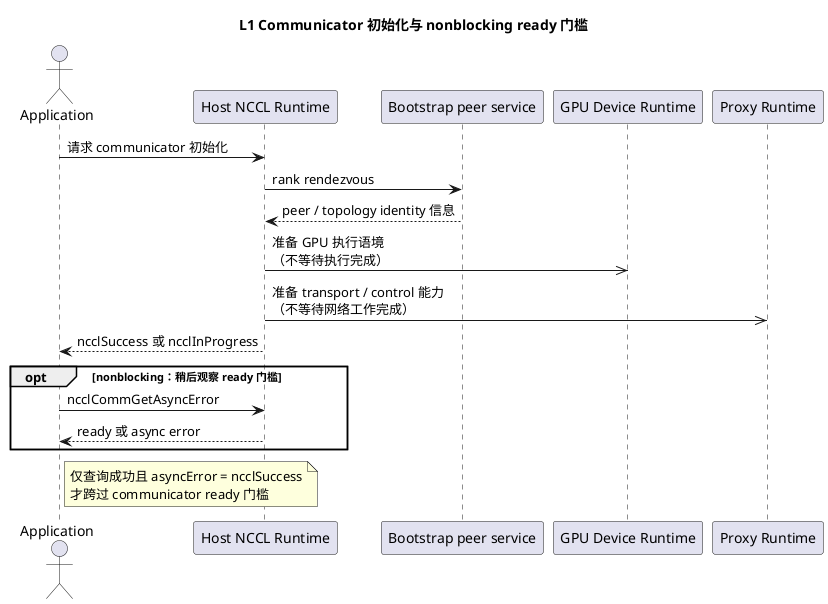
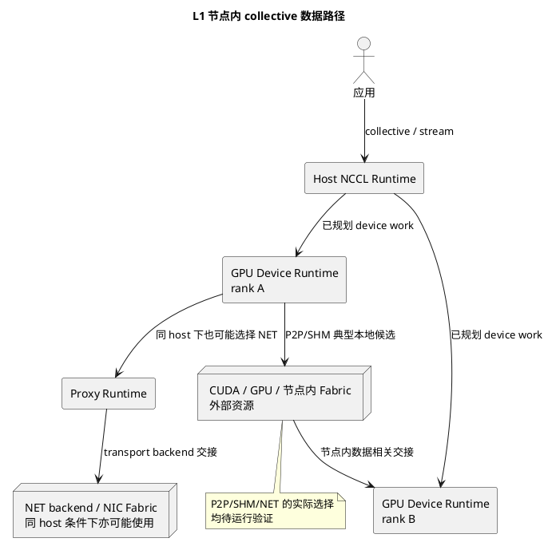
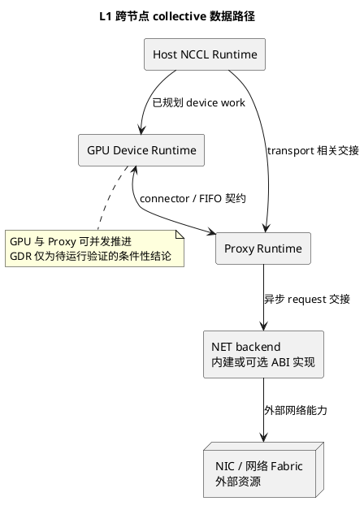
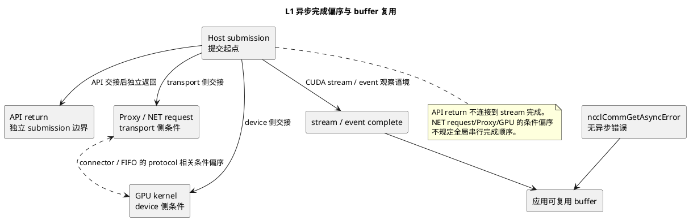

# NCCL L1 Runtime Container Design

源码基线固定为 NCCL `v2.31.2-1`，提交
`7b83616df3ae082a1f32bb74c27458bfe8153a13`。本层把 rank runtime 的长期职责
归入 Host NCCL Runtime、GPU Device Runtime 与 Proxy Progress Runtime（本文简称
Proxy Runtime）三类逻辑容器，并只定义它们与外部资源之间的交接契约。两个名称指向
同一逻辑容器，均包含 control 与 progress 两条职责轨道。

导航：[架构总索引](nccl-architecture-index.md)；上层语境：[L0 系统语境](nccl-l0-system-context.md)；下钻：[L2 Component 设计](../archify/nccl-l2-design.md)；[L3 详细设计索引](../l3/nccl-l3-design-index.md)。

证据口径：下列“源码事实”只表明固定版本存在对应 API、接口或静态职责边界；
“设计归纳”是 L1 的容器模型；“待运行验证”才可判断目标机器实际的 algorithm、
protocol、transport、GDR、rail、完成时序或性能。collective API 与静态源码均不
证明这些运行选择。

第一版不展开 CE、RMA、CFT、GIN、NVLS、CollNet、PAT、Enqueue Rearchitecture 或
`net_ib` resiliency；它们不改变本层经典主链的容器边界。

## L1-1. Rank Runtime 部署模型与容器清单

一个应用进程可承载一个或多个 rank/communicator；一个 communicator 也不等同于
单一进程、线程或 kernel。每个 rank 的 NCCL runtime 按职责包含 Host、GPU Device、
以及承接 transport 相关控制与进度的 Proxy 三类逻辑容器。它们是责任与状态边界，不是
对 OS 线程、CUDA kernel 或进程数的强制 cardinality 声明。

| 契约字段           | L1-1 容器部署契约                                                                                                                                                    |
| ------------------ | -------------------------------------------------------------------------------------------------------------------------------------------------------------------- |
| 职责与非职责       | 职责是给 rank runtime 划定三类长期责任容器及其外部交接；非职责是规定一个进程必须对应一个 rank、一个容器必须对应一个线程或 kernel，或从部署关系推断运行路径。         |
| 输入与输出         | 输入为应用创建的 communicator、collective 请求、stream 语境和 rank 会合条件；输出为 Host 到 GPU/Proxy 的职责交接以及对外资源使用条件。                               |
| 持久状态及所有者   | communicator 生命周期内的 NCCL 通信状态、连接、分配和注册句柄由 NCCL 管理；应用保有 buffer，CUDA/GPU/NIC/Fabric 保有其硬件资源。容器不转移这些外部资源的所有权。     |
| 控制面或数据面契约 | Host 承接 API 与总体控制；GPU 承接已规划 device work 的数据相关执行；Proxy 承接 transport 相关控制与进度。具体 algorithm、protocol 与 transport 留给下层和运行验证。 |
| 同步与完成边界     | 容器交接或 API 返回都不是完成证明；完成必须回到相应 CUDA stream/event 与 communicator 异步错误观察。                                                                 |
| 失败传播           | 初始化、提交或外部依赖错误沿 communicator 可观察结果向应用传播；不得以另一个容器尚在推进推断错误已被消除。                                                           |
| L2/L3 下钻映射     | L2 分拆 Host、GPU、Proxy 内稳定职责；L3 解释初始化 I1-I4、Host H1-H8、Device D1-D6、Proxy P1-P4、Transport T1-T3、NET N1-N5 与横切 C1-C3。                           |

源码锚点：[源码事实] `src/init.cc:ncclCommInitRankConfig` 是 rank communicator
初始化入口；`src/collectives.cc:ncclAllReduce` 是 collective 语义入口。二者只支撑
rank/communicator 与 API 边界存在，不支撑运行中选择了特定算法或网络路径。

## L1-2. Host NCCL Runtime

Host NCCL Runtime 是应用 API 与异步执行环境之间的总协调容器：承接 communicator
初始化、API/group 语义、topology、planner、tuning 与 launch 的总体责任。它向 GPU
交接已规划 device work，向 Proxy 交接 transport 相关工作；这些交接不等同于 GPU 已
完成或 transport request 已完成。

| 契约字段           | L1-2 Host 容器契约                                                                                                                                                          |
| ------------------ | --------------------------------------------------------------------------------------------------------------------------------------------------------------------------- |
| 职责与非职责       | 职责是承接 API/comm/topology/planner/tuning/launch 的总体责任，并安排跨容器交接；非职责是替 GPU 执行已规划 work、替 Proxy 持续推进网络，或拥有应用 buffer。                 |
| 输入与输出         | 输入为 communicator、collective 语义、buffer 地址与 stream，以及初始化所需会合/设备条件；输出为 communicator 可用性、已规划 device work、transport 相关交接和异步提交结果。 |
| 持久状态及所有者   | communicator 生命周期内的 Host 侧通信、拓扑、规划与提交相关状态由 NCCL 管理；应用仍拥有 buffer，CUDA 保有 stream/event 与设备执行资源。                                     |
| 控制面或数据面契约 | 该容器主导控制面与提交语境；它只将数据相关的已规划 work 交给 GPU，不能把计划形成表述为数据已移动。                                                                          |
| 同步与完成边界     | group 收口、launch 提交和 API return 都止于 Host 交接；应用须以其 stream/event 完成并结合异步错误结果判断 buffer 可复用。                                                   |
| 失败传播           | 参数、初始化、规划、launch 或交接失败作为 communicator/API 结果暴露；nonblocking communicator 的未就绪与异步错误须由应用观察接口区分。                                      |
| L2/L3 下钻映射     | L2 的 Host stable responsibilities；L3 I1-I4 覆盖初始化/拓扑，H1-H8 覆盖 API 到 launch，C1-C3 覆盖所有权、完成与证据。                                                      |

源码锚点：[源码事实] `src/collectives.cc:ncclAllReduce`、`src/group.cc` 的 group APIs
和 `src/enqueue/enqueue.cc` 的 planner/launch 入口表明 Host 侧接入、分组与提交边界
存在；它们不证明 Ring/Tree、protocol 或实际 launch 后完成。

## L1-3. GPU Device Runtime

GPU Device Runtime 消费 Host 已规划的 device work，并通过下层 algorithm、protocol
和 connector 契约执行 collective 的设备侧部分。L1 只定义该消费与交接责任，不把
它展开为 kernel 内部 component、调用链、队列字段或状态机。

| 契约字段           | L1-3 GPU 容器契约                                                                                                                                        |
| ------------------ | -------------------------------------------------------------------------------------------------------------------------------------------------------- |
| 职责与非职责       | 职责是消费已规划 device work，并按已选 algorithm/protocol/connector 契约执行设备侧 collective；非职责是重新承担 API、topology、tuning 或 Host 规划责任。 |
| 输入与输出         | 输入为 Host 交接的已规划 device work、CUDA 执行语境和 connector 使用条件；输出为对本地或跨节点数据相关路径的设备侧推进及可关联的完成条件。               |
| 持久状态及所有者   | NCCL 管理 communicator 生命周期内与 device work 和连接交接相关的状态；CUDA/GPU 保有执行与硬件资源，应用仍保有业务 buffer 所有权。                        |
| 控制面或数据面契约 | 该容器主要承担数据面相关执行；algorithm、protocol、connector 的具体内部实现属于 L2/L3，且静态源码不证明本次运行实际选用的组合。                          |
| 同步与完成边界     | kernel 发起、device work 被消费或 connector 被交接都不是应用复用 buffer 的边界；必须由对应 stream/event 的完成与无异步错误共同封口。                     |
| 失败传播           | 设备执行或其交接错误须纳入 communicator 的异步可观察结果；Host API 的先行返回不覆盖此后的设备侧错误。                                                    |
| L2/L3 下钻映射     | L2 的 GPU Device Runtime components；L3 D1-D6 处理 kernel、algorithm、protocol 与 connector/FIFO，C1-C3 处理跨层所有权和完成。                           |

源码锚点：[源码事实] `src/enqueue/enqueue.cc:ncclLaunchKernel` 标出 Host 向 device 的
提交边界，`src/device/common.h:ncclKernelMain` 是 device kernel 入口边界。二者证明
device 交接和执行入口存在，不能证明本机使用了某个 algorithm、protocol、transport 或
GDR。

## L1-4. Proxy Runtime 控制轨道与推进轨道

Proxy Runtime 是 transport 相关控制与进度的逻辑容器，必须区分两条职责轨道。控制
轨道负责 setup/connect/register 的资源与连接交接；推进轨道负责已交接 transport 工作
的持续推进。P2P/SHM setup 也可经此容器交接；Proxy Runtime 的使用与生命周期可跨
communicator 共享，受共享所有者关系约束，不能假定一 communicator 一独立 Proxy。两条
轨道可并发存在，但 L1 不将其描写成内部状态机，也不承诺一条轨道对应固定线程数。

| 契约字段           | L1-4 Proxy 容器契约                                                                                                                                                                                                                      |
| ------------------ | ---------------------------------------------------------------------------------------------------------------------------------------------------------------------------------------------------------------------------------------- |
| 职责与非职责       | 职责是区分 setup/connect/register 控制轨道和 transport 推进轨道，并经内部 adapter 与外部依赖/后端边界交接；非职责是选择 collective algorithm、拥有应用 buffer 或把自身等同于单一 CPU 线程。                                              |
| 输入与输出         | 输入为 Host 给出的资源/连接条件与 transport 工作；输出为经内部 adapter 交接的可使用连接、分配和注册句柄条件，以及持续推进后的 request 完成或错误可观察性。                                                                               |
| 持久状态及所有者   | NCCL 管理 communicator 生命周期内连接、分配、注册句柄及其使用条件；Proxy Runtime 的使用与生命周期可跨 communicator 共享，并受共享所有者关系约束，不能假定一 communicator 一独立 Proxy。外部 backend/Fabric 保有其资源，应用保有 buffer。 |
| 控制面或数据面契约 | 控制轨道和推进轨道先与内部 transport adapter 交接，再由 adapter 到 CUDA/shared memory/GPU/NIC/Fabric 或 optional plugin/backend 边界。P2P/SHM setup 也可经过该通用容器；二者的内部组织和细粒度状态不属于 L1。                            |
| 同步与完成边界     | 控制轨道成功不等于传输完成；一次推进也不等于应用可复用 buffer。request 结果须与 device stream/event 和异步错误共同解释。                                                                                                                 |
| 失败传播           | setup/connect/register 或 request 推进失败通过 communicator 的异步错误路径对 Host/应用可见；一个控制交接成功不能掩盖后续推进失败。                                                                                                       |
| L2/L3 下钻映射     | L2 的 Proxy control/progress responsibilities；L3 P1-P4 解释控制交接、operation、推进与完成，T1-T3/N1-N5 解释 P2P、SHM、NET/后端 ABI 与资源边界。                                                                                        |

源码锚点：[源码事实] `src/proxy.cc:ncclProxyCallAsync` 与 `ncclProxyProgress` 分别提供
控制交接和推进入口；`src/transport/p2p.cc` 与 `src/transport/shm.cc` 的 setup 可使用
Proxy。它们不证明特定 NIC、rail、GDR 或进度并发度已在目标环境发生。

## L1-5. Plugin、Backend、GPU Fabric 与 NIC Fabric 外部边界

NCCL 内部 bootstrap 用于 rank 会合；内部 transport adapter 选择并使用传输能力；
内建 network backend 是 NCCL 内部实现边界；可选 external plugin 通过 `ncclNet_t` ABI
提供扩展后端。CUDA、GPU/节点内 Fabric、NIC 与网络 Fabric 都是外部资源。NCCL 不
拥有这些硬件，却仍管理 communicator 生命周期内连接、分配和注册句柄的创建、使用与
释放。

| 契约字段           | L1-5 外部边界契约                                                                                                                                                                            |
| ------------------ | -------------------------------------------------------------------------------------------------------------------------------------------------------------------------------------------- |
| 职责与非职责       | 职责是分清内部 bootstrap、内部 transport adapter、内建 network backend、可选 external plugin ABI 与硬件外部资源；非职责是把 plugin 或 Fabric 直接描述为 NCCL 容器，或把硬件所有权交给 NCCL。 |
| 输入与输出         | 输入为 rank 会合条件、transport 使用条件和后端能力；输出为 communicator 可使用的连接、分配与注册句柄条件，以及向硬件资源发起的能力调用。                                                     |
| 持久状态及所有者   | NCCL 管理 communicator 生命周期内的通信状态、连接、分配和注册句柄；CUDA/GPU/Fabric/NIC 及 plugin 实现保有其外部资源和实现状态。                                                              |
| 控制面或数据面契约 | bootstrap 是内部控制面；transport adapter 和 backend/ABI 是 NCCL 到网络能力的适配边界；GPU/本地 Fabric/NIC/网络 Fabric 承载外部资源与数据路径，不成为 NCCL 所有物。                          |
| 同步与完成边界     | handle 可用、ABI 调用返回或 backend request 建立都不是端到端完成；外部执行完成需与 stream/event 和 communicator 异步错误一起观察。                                                           |
| 失败传播           | bootstrap、adapter、backend 或 plugin 的错误作为 NCCL communicator/API 结果传播；硬件链路状态和性能原因需要独立运行证据。                                                                    |
| L2/L3 下钻映射     | L2 将外部依赖保持在容器外；L3 I1、T1-T3、N1-N5 和 C1-C3 分别处理会合、transport、ABI/资源及横切契约。                                                                                        |

源码锚点：[源码事实] `src/transport.cc:selectTransport` 体现内部 transport 选择边界；
`src/transport/{p2p,shm,net}.cc` 提供候选 transport 实现边界；
`src/plugin/net.cc:ncclNetInit` 与 `src/include/plugin/nccl_net.h:ncclNet_t` 划出内建
backend 和可选 external plugin ABI。它们不证明目标环境选择 NET、plugin、GDR 或
某条 Fabric。

## L1-6. Communicator 初始化跨容器路径

初始化由 Host 协调 rank 会合、communicator 建立与对 GPU/Proxy 的必要交接。采用
nonblocking 配置时，初始化 API 返回 `ncclInProgress` 不等于 communicator 可使用；
应用必须以 `ncclCommGetAsyncError` 观察 ready 门槛，只有查询成功且其 `asyncError` 输出
为 `ncclSuccess` 时才可将 communicator 用于后续 collective。

| 契约字段           | L1-6 初始化跨容器契约                                                                                                                                                                      |
| ------------------ | ------------------------------------------------------------------------------------------------------------------------------------------------------------------------------------------ |
| 职责与非职责       | Host 协调初始化与跨容器条件交接，GPU/Proxy 接收各自可使用条件；非职责是以初始化返回直接断言某种拓扑、algorithm、transport、GDR、rail 或性能。                                              |
| 输入与输出         | 输入为 rank 数、rank 身份、communicator 标识、配置与外部环境条件；输出为 communicator、各容器可使用条件，以及 nonblocking 下的 ready 或错误可观察状态。                                    |
| 持久状态及所有者   | communicator 及其生命周期内连接、分配和注册句柄由 NCCL 管理；外部 CUDA/GPU/NIC/Fabric 仍保有硬件资源。                                                                                     |
| 控制面或数据面契约 | 初始化是控制面协作，内部 bootstrap 处理 rank 会合；此阶段形成的使用条件不代表 collective payload 已发生数据移动。                                                                          |
| 同步与完成边界     | blocking 成功可跨过 ready 门槛；nonblocking 返回`ncclInProgress` 时，必须轮询 `ncclCommGetAsyncError`，直至查询成功且 `asyncError` 输出为 `ncclSuccess`，才允许使用 communicator。 |
| 失败传播           | 会合、资源条件或异步初始化失败通过初始化结果或`ncclCommGetAsyncError` 暴露；未就绪不是可忽略的成功。                                                                                     |
| L2/L3 下钻映射     | L2 的 Communicator Init & State、Topology/Graph responsibilities；L3 I1-I4 与 C1-C3 解释初始化、资源生命周期和错误观察。                                                                   |

源码锚点：[源码事实] `src/init.cc:ncclCommInitRankConfig` 与
`src/init.cc:ncclCommGetAsyncError` 提供 nonblocking 初始化和异步状态观察边界。
它们不证明目标节点的 GPU/NIC 拓扑、连接选择或运行时 transport。

## L1-7. 节点内 collective 数据路径

P2P 与 SHM 是节点内 collective 的典型本地候选。Host 形成并交接已规划 device work 后，
GPU Device Runtime 依 connector 契约使用实际选出的 transport，并依赖 CUDA/GPU 与节点内
Fabric 外部资源。`selectTransport` 仍可能在同 host 条件下选择 NET；实际 transport 必须
由运行验证确认，不能由 rank 共址或静态候选顺序推断。

| 契约字段           | L1-7 节点内路径契约                                                                                                                                            |
| ------------------ | -------------------------------------------------------------------------------------------------------------------------------------------------------------- |
| 职责与非职责       | Host 负责交接已规划 work，GPU 容器按 connector 契约推进同 host collective；非职责是由同 host、P2P/SHM 候选或静态顺序断言实际 transport、硬件链路或性能。       |
| 输入与输出         | 输入为 communicator、已规划 device work、stream 和 transport 使用条件；输出为 GPU 容器间的数据相关推进及可关联的完成条件，必要时包括经 Proxy/NET 的交接。      |
| 持久状态及所有者   | NCCL 管理 communicator 生命周期内所选 transport 的连接相关状态与句柄；CUDA/GPU/节点内 Fabric/NIC 保有外部资源，应用保有 buffer。                               |
| 控制面或数据面契约 | Host→GPU 为控制/提交交接；GPU↔connector 是数据面相关契约。P2P/SHM 是典型本地候选，而`selectTransport` 在同 host 条件下仍可能选择 NET；实际选择待运行验证。 |
| 同步与完成边界     | Host 提交、connector 可用或 device work 开始均不是 buffer 复用边界；相应 stream/event 完成且无异步错误才构成应用侧完成。                                       |
| 失败传播           | 所选 P2P、SHM、NET 连接或 device 执行问题须经 communicator 的异步结果向应用传播；API return 不排除其后错误。                                                   |
| L2/L3 下钻映射     | L2 的 Transport Selection/Connector、GPU 与 Proxy responsibilities；L3 T1-T3、P1-P4、D1-D6 和 C1-C3 解释 transport、device 执行和完成契约。                    |

源码锚点：[源码事实] `src/transport.cc:selectTransport` 与
`src/transport/p2p.cc`、`src/transport/shm.cc` 与 `src/transport/net.cc` 表明候选
transport 边界；`src/device/common.h:ncclKernelMain` 表明 device 执行入口。它们不证明
同 host 的实际 P2P/SHM/NET 选择、GPU interconnect 或吞吐。

## L1-8. 跨节点 collective 数据路径

跨节点路径保留 GPU、Proxy、backend 的并发责任，不把它收缩为单一 Host 到 NIC 的
线性流程。Host 交接已规划 device work 与 transport 相关条件；GPU 与 Proxy 可并发推进其
各自职责；Proxy 通过 backend 使用外部 NIC/Fabric。GPU 与 Proxy 之间以 connector/FIFO
契约交接，但其内部结构属于 L2/L3。GDR 是条件性结论，必须待运行验证。

| 契约字段           | L1-8 跨节点路径契约                                                                                                                                                  |
| ------------------ | -------------------------------------------------------------------------------------------------------------------------------------------------------------------- |
| 职责与非职责       | Host 负责总体交接，GPU 消费已规划 work，Proxy 负责网络控制/推进，backend 适配网络能力；非职责是将路径简化为单一串行链，或将 GDR/rail/NIC 路径作为源码已证事实。      |
| 输入与输出         | 输入为已规划 device work、transport 相关条件、connector/FIFO 使用契约与 backend 能力；输出为 GPU、Proxy、backend 并发推进的跨节点数据相关进展及其异步完成/错误结果。 |
| 持久状态及所有者   | NCCL 管理 communicator 生命周期内连接、分配和注册句柄；backend/plugin、CUDA/GPU、NIC/Fabric 各自保有外部实现或硬件资源，应用保有 buffer。                            |
| 控制面或数据面契约 | Host→GPU/Proxy 是总体交接；GPU↔Proxy 保持 connector/FIFO 契约；Proxy→backend→NIC/Fabric 是异步网络能力交接。GDR 只可标为待运行验证的条件性路径。                 |
| 同步与完成边界     | GPU、Proxy 和 backend 可并发推进，不能强制 API return、NET request done、kernel done 为串行关系；buffer 复用仍等待 stream/event 完成且无异步错误。                   |
| 失败传播           | backend request、Proxy 推进或 device 侧错误均应归入 communicator 异步错误可观察路径；NET request 完成并不自动证明 kernel 或 stream 已完成。                          |
| L2/L3 下钻映射     | L2 的 GPU、Proxy、NET external dependencies；L3 T3、P1-P4、D1-D6、N1-N5 和 C1-C3 解释 connector、推进、ABI、request 与完成。                                         |

源码锚点：[源码事实] `src/proxy.cc:ncclProxyCallAsync`/
`src/proxy.cc:ncclProxyProgress` 标出 Proxy 交接与推进，`src/transport/net.cc` 标出 NET
transport 边界，`src/plugin/net.cc:ncclNetInit` 和 `ncclNet_t` 标出 backend/ABI 边界。
这些事实不能证明实际 NET、GDR、rail、NIC 映射或性能。

## L1-9. 异步完成、错误传播与 buffer 所有权

完成关系以 Host submission 为起点，是偏序而非强制串行管线。API return 是独立的
submission 边界，只说明 Host 已完成该 API 的交接，不能连接为 stream 完成的前置条件。
NET request、Proxy 与 GPU 经 connector/FIFO 建立 protocol 相关条件偏序；其实际先后和
是否存在取决于所选 transport/protocol。只有应用所关联的 stream/event 已完成，且
`ncclCommGetAsyncError` 未报告异步错误，应用才可复用其 buffer。

| 契约字段           | L1-9 完成、错误与所有权契约                                                                                                                                                                          |
| ------------------ | ---------------------------------------------------------------------------------------------------------------------------------------------------------------------------------------------------- |
| 职责与非职责       | 职责是从 Host submission 定义 Host、GPU、Proxy 与应用间的完成偏序、异步错误传播和 buffer 所有权边界；非职责是把某一局部条件或 API return 提升为全部通信完成，或将 buffer 所有权转给 NCCL。           |
| 输入与输出         | 输入为 Host submission、API return、device 侧条件、transport request、stream/event 与 communicator 异步状态；输出为应用可判断的完成/错误结果和安全 buffer 复用边界。                                 |
| 持久状态及所有者   | 应用始终拥有 send/receive buffer；NCCL 管理 communicator 生命周期内的通信状态、连接、分配和注册句柄；CUDA/后端各自管理其完成观察资源。                                                               |
| 控制面或数据面契约 | Host submission/API return、Proxy/NET request 和 GPU kernel 分别是不同层次的控制或数据相关事件；Proxy/NET 与 GPU 只经 connector/FIFO 建立 protocol 相关条件偏序，均不可互相替代。                    |
| 同步与完成边界     | API return 是独立 submission 边界，不是 stream 完成的前置边；NET request、Proxy 和 GPU 无强制全局串行顺序。只有相关 stream/event 完成且`ncclCommGetAsyncError` 无异步错误时，应用才可复用 buffer。 |
| 失败传播           | 各容器发现的异步错误通过 communicator 状态向应用传播；应用在复用前必须同时检查同步完成与错误结果，不能只依赖某一次 API 返回。                                                                        |
| L2/L3 下钻映射     | L2 的 Cross-cutting Contracts；L3 H8、P4、D6、N4 与 C1-C3 分别说明提交、request、device、所有权、错误和可观测性。                                                                                    |

源码锚点：[源码事实] `src/init.cc:ncclCommGetAsyncError` 是 communicator 异步错误
观察接口；`src/enqueue/enqueue.cc` 的 launch 入口与 `src/device/common.h:ncclKernelMain`
分别标出 Host submission 和 device 执行边界；`src/proxy.cc:ncclProxyProgress` 标出 Proxy
推进边界。它们不能单独证明目标运行的完成偏序、buffer 已可复用或性能结果。
