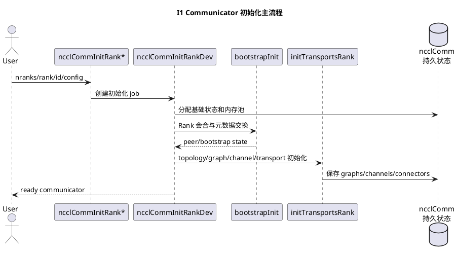
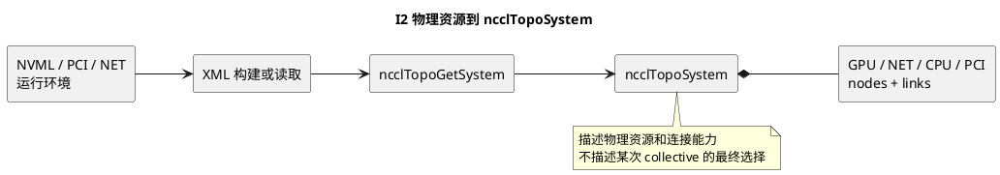
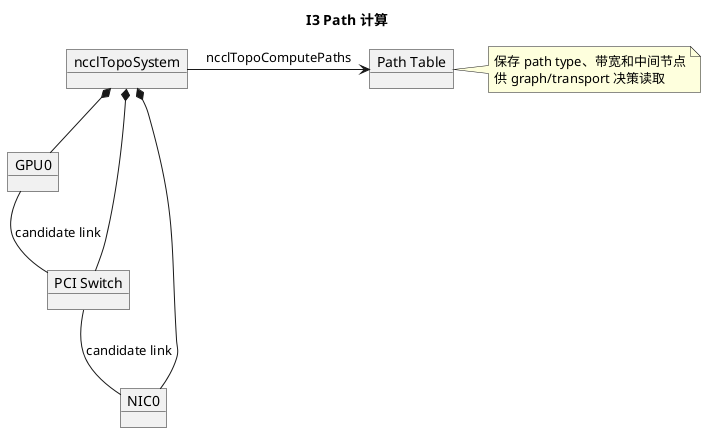
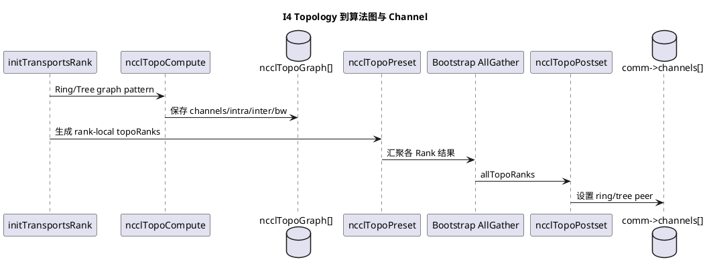
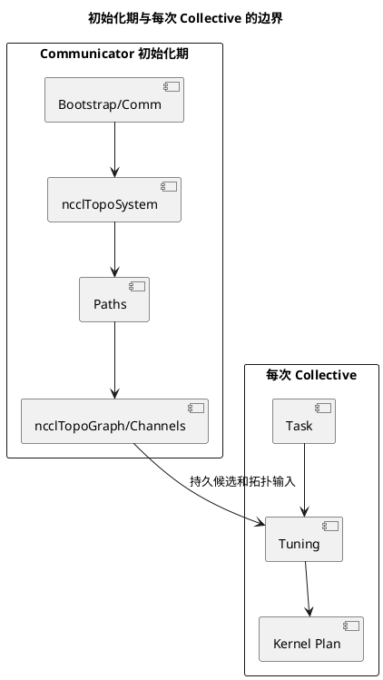

# NCCL L3-01：Communicator 初始化与拓扑

## 1. 文档范围

本卷描述 communicator 从 Rank 会合到获得可供后续 tuning 使用的 topology graph 的过程。
它解释初始化期持久状态，不解释单次 collective 的算法选择和 device 执行。

证据基线：NCCL v2.31.2-1，提交
7b83616df3ae082a1f32bb74c27458bfe8153a13。

## I1. Bootstrap、Rank 会合与 Communicator 生命周期

### 设计卡

| 字段               | 内容                                                                                                                                         |
| ------------------ | -------------------------------------------------------------------------------------------------------------------------------------------- |
| 设计目标           | 让所有 Rank 建立共同身份、交换初始化元数据，并创建 rank-local ncclComm 持久状态                                                              |
| 非目标             | 不选择单次 AllReduce 的 algorithm/protocol；不推进数据面 WQE                                                                                 |
| 输入               | nranks、rank、ncclUniqueId、device、config、可选 parent communicator                                                                         |
| 输出与停止边界     | 输出 ready communicator；停止在初始化 job 完成并返回用户句柄                                                                                 |
| 上下游接口         | 上游为 ncclCommInitRank 系列 API；下游为 bootstrap、topology、transport 和 channel 初始化                                                    |
| 核心对象           | ncclComm、ncclBootstrapHandle、peerInfo、bootstrapState、memory pools                                                                        |
| 主流程             | 创建 comm → bootstrapInit → 交换 peer 信息 → initTransportsRank → 初始化 channel/connector                                               |
| 状态与生命周期     | ncclComm 跨越多次 collective；bootstrap 临时状态在初始化完成后不承担数据面推进                                                               |
| 并发、同步与所有权 | 多 Rank 独立进程通过 bootstrap 同步；rank-local comm 由对应进程持有                                                                          |
| 异常与退出         | 任一阶段失败进入 fail/cleanup 路径；未 ready 的 comm 不得进入 enqueue                                                                        |
| 性能与可观测       | 关注 INIT/BOOTSTRAP 日志、初始化延迟和 Rank 卡点，不用 collective busbw 衡量                                                                 |
| 源码证据与遗留     | 源码事实：src/init.cc 的 ncclCommInitRankDev、initTransportsRank；src/bootstrap.cc 的 bootstrapInit。待运行：目标作业的 bootstrap 拓扑和耗时 |

### 设计说明

初始化的关键产物不是“一次通信任务”，而是后续任务共享的 communicator context。
Topology、channel、peer 和 memory pool 都属于初始化期或 communicator 生命周期状态。
因此，单次 ncclAllReduce 不应重新发现整机拓扑或重新完成 Rank 会合。

核心不变量：

- communicator 未 ready 时，enqueue 必须先触发或等待 ensure-ready 逻辑。
- Rank 身份、nranks 和 peer 元数据在 communicator 生命周期内保持一致。
- 初始化成功只证明资源和控制面就绪，不证明任何 collective 已经执行。

### 源码锚点

- src/init.cc：ncclCommInitRankDev、initTransportsRank、ncclCommEnsureReady
- src/bootstrap.cc：bootstrapInit
- src/include/comm.h：ncclComm
- src/include/bootstrap.h：ncclBootstrapHandle

## I2. 物理拓扑发现与 ncclTopoSystem 建模

### 设计卡

| 字段               | 内容                                                                                       |
| ------------------ | ------------------------------------------------------------------------------------------ |
| 设计目标           | 将 GPU、NIC、CPU、PCI、NVLink 等物理资源归一化为可查询的 topology system                   |
| 非目标             | 不决定本次 4 KB AllReduce 使用 Ring 还是 Tree                                              |
| 输入               | communicator、NVML/PCI/NET 属性、可选 XML topology                                         |
| 输出与停止边界     | ncclTopoSystem 及节点/链路属性；停止在物理模型建立完成                                     |
| 上下游接口         | 上游为 initTransportsRank；下游为 path computation 和 graph search                         |
| 核心对象           | ncclTopoSystem、ncclTopoNode、GPU/NET/CPU/PCI 节点、link                                   |
| 主流程             | 读取或构建 XML → 填充系统节点 → 加入 NIC/GPU 属性 → 归一化 topology                     |
| 状态与生命周期     | topology system 绑定 communicator 初始化结果，由后续 path/graph 阶段读取                   |
| 并发、同步与所有权 | 初始化期构建；不作为每次 collective 的可变任务状态                                         |
| 异常与退出         | 缺失或非法属性导致 topology 构建失败或能力降级；不得伪造不可达链路                         |
| 性能与可观测       | NCCL_DEBUG_SUBSYS=GRAPH,INIT；XML dump 可复核发现结果                                      |
| 源码证据与遗留     | 源码事实：ncclTopoGetSystem、ncclTopoGetSystemFromXml。待运行：目标机器实际 GPU/NIC/PCI 树 |

### 设计说明

ncclTopoSystem 回答“系统里有什么，以及它们怎样物理连接”。例如“GPU0 到 NIC0
比到 NIC1 更近”属于这一层。它不包含消息大小，也不负责产生单次 collective 的
algorithm/protocol 结论。

模型应保持两类信息分离：

- 节点属性：类型、设备标识、带宽或能力属性。
- 边属性：PCI/NVLink/NET 等连接及其路径类型。

### 源码锚点

- src/graph/topo.cc：ncclTopoGetSystem、ncclTopoGetSystemFromXml、ncclTopoPopulateNics
- src/graph/topo.h：ncclTopoSystem、ncclTopoNode
- src/graph/xml.cc：topology XML 解析
- src/include/graph.h：Topology API

## I3. GPU/GPU、GPU/NIC 路径计算与可达性

### 设计卡

| 字段               | 内容                                                                                     |
| ------------------ | ---------------------------------------------------------------------------------------- |
| 设计目标           | 在物理 topology 上计算节点间可达路径、路径类型和有效带宽                                 |
| 非目标             | 不创建 Proxy operation；不发布 IB WQE                                                    |
| 输入               | 已建立的 ncclTopoSystem、communicator 及 peer/NET 能力                                   |
| 输出与停止边界     | 节点 path 表和 P2P/NET 可达性；停止在 graph search 前                                    |
| 上下游接口         | 上游为 I2；下游为 graph search、transport selection 和 NIC 选择                          |
| 核心对象           | ncclTopoLinkList/path、path type、bandwidth、intermediate nodes                          |
| 主流程             | 从目标节点反向或分类型传播路径 → 比较候选 → 保存最佳可用路径                           |
| 状态与生命周期     | 初始化期计算，结果供 graph 和 transport 复用                                             |
| 并发、同步与所有权 | 属于 communicator 初始化，不与单次 task 并发修改                                         |
| 异常与退出         | 无可达路径时对应能力不可用；不能把“存在 NET 节点”当作“GPU 可直接 GDR”                |
| 性能与可观测       | GRAPH 日志、topology dump；路径带宽是模型输入，不是实际链路计数器                        |
| 源码证据与遗留     | 源码事实：ncclTopoComputePaths、ncclTopoSetPaths。待运行：ACS/IOMMU/GDR 对实际路径的影响 |

### 设计说明

Path 是物理 topology 到算法映射之间的桥梁。它把“连接图”转化为“从某 GPU 到
某 peer 或 NIC 可以怎样走”的可比较结果。Path 计算只建立能力与成本基础，
仍不能单独证明某次运行选择了哪张 NIC 或是否发生 host staging。

### 源码锚点

- src/graph/paths.cc：ncclTopoComputePaths、ncclTopoSetPaths
- src/include/graph.h：ncclTopoComputePaths、ncclTopoGetNetDev
- src/graph/topo.h：path 数据结构

## I4. Collective Graph 搜索及 Channel/Ring/Tree 构造

### 设计卡

| 字段               | 内容                                                                                        |
| ------------------ | ------------------------------------------------------------------------------------------- |
| 设计目标           | 将 topology/path 能力映射为可执行的算法图和 channel 连接顺序                                |
| 非目标             | 不根据本次消息大小做最终 algorithm/protocol 选择                                            |
| 输入               | ncclTopoSystem、path 表、algorithm graph pattern 和 channel 约束                            |
| 输出与停止边界     | ncclTopoGraph、每 Rank topo ranks、channel Ring/Tree peer；停止在 graph 持久化              |
| 上下游接口         | 上游为 I2/I3；下游为 tuning、channel/connector setup                                        |
| 核心对象           | ncclTopoGraph、ncclTopoRanks、ncclChannel、ring/tree peer                                   |
| 主流程             | 初始化搜索条件 → 递归搜索候选 → 保存 graph → preset/postset 聚合各 Rank 结果             |
| 状态与生命周期     | graph 随 communicator 保存；channel peer 映射在 collective 到来前已经存在                   |
| 并发、同步与所有权 | 各 Rank 本地搜索后通过 bootstrap 汇聚；最终映射必须跨 Rank 一致                             |
| 异常与退出         | 搜索约束不足时降低 channel/带宽目标或放弃候选；不能生成断裂 Ring                            |
| 性能与可观测       | GRAPH 日志中的 pattern、channels、type、bandwidth；模型结果不是实测吞吐                     |
| 源码证据与遗留     | 源码事实：ncclTopoCompute、ncclTopoPreset、ncclTopoPostset。待运行：目标机器实际 graph dump |

### 设计说明

ncclTopoGraph 描述“某类 algorithm 怎样映射到物理资源”，例如某个 Ring channel
的 Rank 顺序。Tuning 在 collective 到来后读取这些已构造图和消息属性，再决定
本次使用 Ring、Tree、Simple、LL 或 LL128。两者时间尺度必须分开。

核心不变量：

- 每个 channel 的 Ring 前驱/后继必须形成一致闭环。
- Tree 的 parent/children 关系必须跨 Rank 对称匹配。
- Graph 是合法候选能力，不是单次 collective 的最终选择记录。

### 源码锚点

- src/graph/search.cc：ncclTopoCompute、ncclTopoSearchRec
- src/graph/connect.cc：ncclTopoPreset、ncclTopoPostset
- src/graph/rings.cc、src/graph/trees.cc：Ring/Tree 连接生成
- src/include/graph.h：ncclTopoGraph
- src/include/channel.h：ncclChannel

## 本卷边界总结

