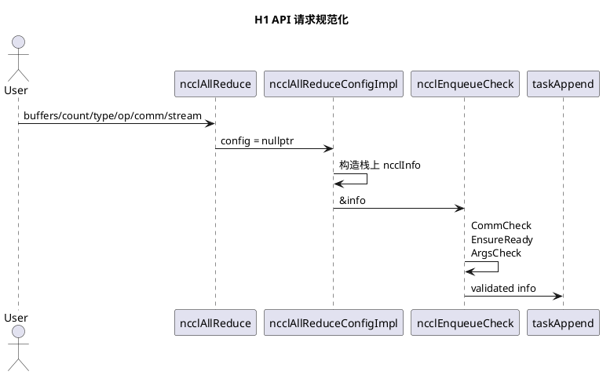
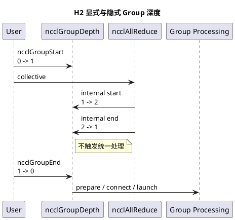
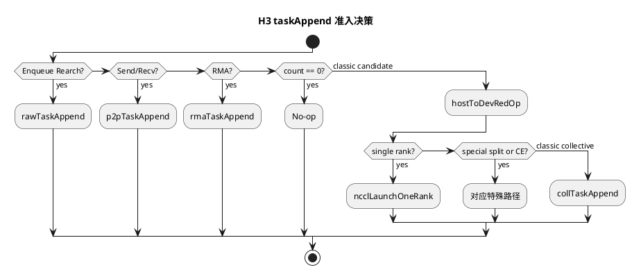
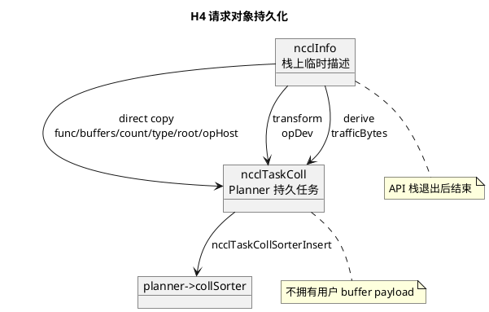
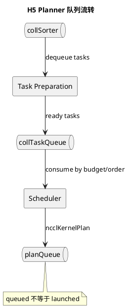
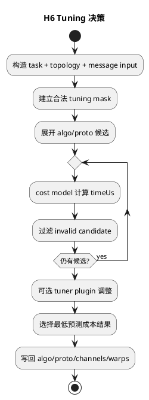
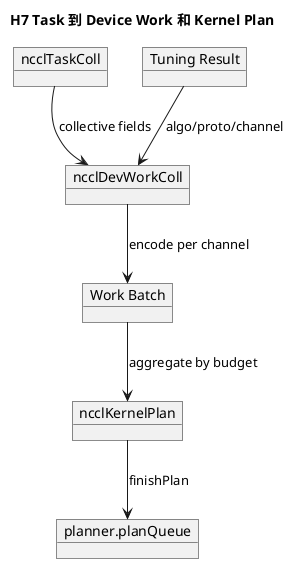
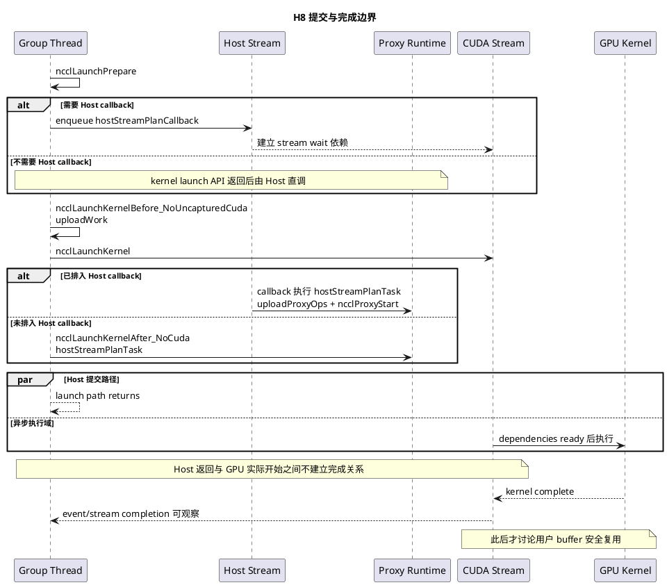
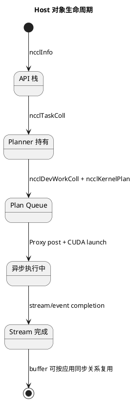

# NCCL L3-02：Host 请求与 Planner

## 1. 文档范围

本卷从 collective API 参数进入 NCCL 开始，追踪到 Host 把 Proxy 工作和 CUDA kernel
提交到异步执行系统。重点是请求对象如何跨越 API 栈帧、Group 边界和 Planner 阶段。

## H1. Collective API 语义与参数校验

### 设计卡

| 字段               | 内容                                                                                                                          |
| ------------------ | ----------------------------------------------------------------------------------------------------------------------------- |
| 设计目标           | 将公开 API 参数规范化为 ncclInfo，并在进入 Planner 前拒绝非法 communicator、buffer、datatype 和 op                            |
| 非目标             | 不选择 Ring/Tree，不启动 kernel，不等待 GPU 完成                                                                              |
| 输入               | sendbuff、recvbuff、count、datatype、op、comm、stream、可选 config                                                            |
| 输出与停止边界     | 栈上 ncclInfo 进入 ncclEnqueueCheck；停止在请求通过参数检查                                                                   |
| 上下游接口         | 上游为 ncclAllReduce/API；下游为 Group 和 taskAppend                                                                          |
| 核心对象           | ncclInfo、ncclConfig、reduction op、communicator                                                                              |
| 主流程             | 构造 ncclInfo → 解析 config → CommCheck/EnsureReady/ArgsCheck → taskAppend                                                 |
| 状态与生命周期     | ncclInfo 只在 Host 调用链中短暂存在；不得由 Planner 保存其指针                                                                |
| 并发、同步与所有权 | stream 只是异步依赖上下文；API 返回不转移用户 buffer 的所有权                                                                 |
| 异常与退出         | 参数或 comm 错误直接返回 ncclResult_t；失败请求不应进入 task queue                                                            |
| 性能与可观测       | API/NVTX 和参数日志可观察提交，不可证明 device 执行                                                                           |
| 源码证据与遗留     | 源码事实：src/collectives.cc 的 ncclAllReduceConfigImpl；src/enqueue/enqueue.cc 的 ncclEnqueueCheck。待运行：应用 stream 依赖 |

### 设计说明与源码锚点

AllReduce API 只确定 collective 语义。ncclInfo 中的 coll/opName/sendbuff/recvbuff/count/
datatype/op/comm/stream/chunkSteps/sliceSteps 描述请求，不包含最终运行算法的证据。

- src/collectives.cc：ncclAllReduce、ncclAllReduceConfigImpl
- src/include/info.h：ncclInfo
- src/enqueue/enqueue.cc：ncclEnqueueCheck
- src/include/checks.h、src/include/argcheck.h：检查接口

## H2. Group 嵌套、隐式 Group 与提交边界

### 设计卡

| 字段               | 内容                                                                                                               |
| ------------------ | ------------------------------------------------------------------------------------------------------------------ |
| 设计目标           | 把一个或多个 API 请求聚合为统一准备和提交批次，并支持显式 Group 嵌套                                               |
| 非目标             | 不把 Group 结束等同于 stream 完成                                                                                  |
| 输入               | thread-local ncclGroupDepth、group 内 communicator/job/task                                                        |
| 输出与停止边界     | 外层 depth 归零时启动 group processing；停止在 plans 提交或错误返回                                                |
| 上下游接口         | 上游为 ncclGroupStart/End 和各 API 的内部 Group；下游为 prepare、preconnect、launch                                |
| 核心对象           | ncclGroupDepth、groupCommHead、async jobs、comm->planner                                                           |
| 主流程             | internal start 增深 → append task → internal end 减深 → depth 为零时 prepare/launch                             |
| 状态与生命周期     | 内层 API Group 只配平深度；最外层 Group End 是收口点                                                               |
| 并发、同步与所有权 | ncclGroupDepth 为 thread-local；多个 comm 可在同一 Group 内统一处理                                                |
| 异常与退出         | Group 内错误汇总并沿 group result 返回；清理未提交 job/plan                                                        |
| 性能与可观测       | Group 可减少提交开销并形成跨 comm 协调；观察 GROUP/LAUNCH 日志                                                     |
| 源码证据与遗留     | 源码事实：src/group.cc 的 ncclGroupDepth、ncclGroupStartInternal、ncclGroupEndInternal。待运行：多 comm Group 时序 |

### 设计说明与源码锚点

Group 是提交事务边界，不是通信完成门闩。显式 Group 中，每次 API 自己的 internal
start/end 只产生 1→2→1；用户最后的 Group End 才产生 1→0 并触发处理。

- src/group.cc：ncclGroupDepth、ncclGroupStartInternal、ncclGroupEndInternal
- src/include/group.h：Group 内部接口
- src/enqueue/enqueue.cc：Planner 与 Group 的衔接

## H3. taskAppend 任务准入与特殊分支过滤

### 设计卡

| 字段               | 内容                                                                                                        |
| ------------------ | ----------------------------------------------------------------------------------------------------------- |
| 设计目标           | 根据 API 语义和运行条件把请求路由到 classic collective、P2P、RMA、CE 或特殊路径                             |
| 非目标             | 不在本章展开被过滤分支；不做最终 tuning                                                                     |
| 输入               | 已检查 ncclInfo、comm 状态、count、nRanks、reduction op                                                     |
| 输出与停止边界     | classic 多 Rank collective 调用 collTaskAppend；停止在完成分支路由                                          |
| 上下游接口         | 上游为 ncclEnqueueCheck；下游为 collTaskAppend/p2pTaskAppend 等                                             |
| 核心对象           | ncclInfo、ncclDevRedOpFull、task 类型、feature params                                                       |
| 主流程             | 检查 rearchitecture/P2P/RMA/zero count → 转换 redop → 过滤 single rank/特殊 collective/CE → classic path |
| 状态与生命周期     | 本层决定任务类别，不持有长期网络进度                                                                        |
| 并发、同步与所有权 | 在 API Host 线程和 Group 上下文中运行                                                                       |
| 异常与退出         | redop 转换或分支 append 失败则请求不进入对应 Planner 结构                                                   |
| 性能与可观测       | 分支决定后续实现族；源码默认值不等于目标机器实际参数                                                        |
| 源码证据与遗留     | 源码事实：taskAppend。当前主线条件为 classic AllReduce、count>0、nRanks>1、无 CE。待运行：环境参数          |

### 设计说明与源码锚点

本章的价值是定义阅读过滤器。当前学习主链进入 collTaskAppend，不代表其他分支不存在，
也不允许把 CE、RMA 或 P2P 的状态机混入 classic AllReduce 解释。

- src/enqueue/enqueue.cc：taskAppend、hostToDevRedOp
- src/include/info.h：ncclInfo
- src/include/comm.h：Task 类型

## H4. ncclInfo 到 ncclTaskColl 持久化

### 设计卡

| 字段               | 内容                                                                                          |
| ------------------ | --------------------------------------------------------------------------------------------- |
| 设计目标           | 把短生命周期 API 描述复制、转换为 Planner 可持有的 collective task                            |
| 非目标             | ncclTaskColl 不是 GPU/Proxy 全程 completion context；不复制用户 payload                       |
| 输入               | ncclInfo、device reduction op、communicator memory pool                                       |
| 输出与停止边界     | ncclTaskColl 插入 planner->collSorter；停止在 sorter insert                                   |
| 上下游接口         | 上游为 taskAppend；下游为 Planner sorting/tuning                                              |
| 核心对象           | ncclInfo、ncclTaskColl、trafficBytes、memPool_ncclTaskColl、collSorter                        |
| 主流程             | pool allocate → 复制语义字段 → 保存 transformed opDev → 派生 trafficBytes → sorter insert |
| 状态与生命周期     | ncclInfo 随 API 栈退出；task 跨越 Group 收口并由 Planner 回收                                 |
| 并发、同步与所有权 | task 保存 buffer 地址而非数据；buffer 可复用仍受 stream completion 约束                       |
| 异常与退出         | 分配或 op 处理失败时不得增加有效 task；错误沿 Host 路径返回                                   |
| 性能与可观测       | trafficBytes 用于排序/规划，不是 NIC counter；观察 nTasksColl 和 sorter                       |
| 源码证据与遗留     | 源码事实：collTaskAppend、ncclTaskCollSorterInsert。待运行：不同 task group 的排序结果        |

### 设计说明与源码锚点

直接复制字段描述 collective 语义；opDev 是 Host reduction op 到 device 表示的转换结果；
trafficBytes 是根据 count、element size 和 collective traffic factor 派生的规划量。

- src/enqueue/enqueue.cc：collTaskAppend
- src/include/info.h：ncclInfo
- src/include/comm.h：ncclTaskColl、ncclTaskCollSorterInsert
- src/include/alloc.h：communicator memory pool 机制

## H5. Planner Sorter、Queue 与任务排序

### 设计卡

| 字段               | 内容                                                                                       |
| ------------------ | ------------------------------------------------------------------------------------------ |
| 设计目标           | 持有 Group 内待调度任务，并把 admission 顺序转换为可供计划器消费的 task queues             |
| 非目标             | Sorter 顺序不是 GPU 完成顺序；不直接发布 CUDA kernel                                       |
| 输入               | collSorter 中 ncclTaskColl、P2P tasks、planner counters                                    |
| 输出与停止边界     | 准备后的 collTaskQueue/planQueue；停止在任务可被 scheduler 取走                            |
| 上下游接口         | 上游为 collTaskAppend；下游为 ncclPrepareTasks 和 scheduleCollTasksToPlan                  |
| 核心对象           | ncclKernelPlanner、ncclTaskCollSorter、collTaskQueue、planQueue、WipPlan                   |
| 主流程             | sorter 收集 → dequeue/prepare → 分类 task queue → scheduler 消费 → plan queue          |
| 状态与生命周期     | Planner 状态绑定 comm；task/plan 从 pool 获取并在 launch 后回收                            |
| 并发、同步与所有权 | Group processing 期间由 Host 规划路径推进；队列所有权转移必须唯一                          |
| 异常与退出         | 准备失败时不可留下半消费 task；cleanup 负责归还 pool/state                                 |
| 性能与可观测       | 排序影响 plan 聚合和 channel 利用；trafficBytes 不是实际传输完成量                         |
| 源码证据与遗留     | 源码事实：ncclTaskCollSorter、ncclKernelPlanner、ncclPrepareTasks、scheduleCollTasksToPlan |

### 设计说明与源码锚点

Planner 是 Host 侧任务和计划的所有者，不是某个单独函数。Sorter 负责把 append
阶段的 collective task 组织起来；prepare 和 scheduler 再把它们变为 plan。

- src/include/comm.h：ncclTaskCollSorter、ncclKernelPlanner、ncclKernelPlan
- src/enqueue/enqueue.cc：ncclPrepareTasks、scheduleCollTasksToPlan、finishPlan

## H6. Tuning 候选生成、成本估计与选择

### 设计卡

| 字段               | 内容                                                                                                |
| ------------------ | --------------------------------------------------------------------------------------------------- |
| 设计目标           | 从合法实现组合中估算成本并选出本次 task 的 algorithm、protocol 和并行配置                           |
| 非目标             | 不把估算时间当作 benchmark 实测；不重新发现物理 topology                                            |
| 输入               | task 语义、nBytes、nRanks、graphs、tuning context、用户强制参数、plugin                             |
| 输出与停止边界     | task/结果中的 algo、proto、channels/warps 等执行参数；停止在最佳 tuning 选定                        |
| 上下游接口         | 上游为 prepared task；下游为 work/plan builder                                                      |
| 核心对象           | ncclTuningInput_t、ncclTuningResult_t、tuning mask、timeUs、tuningContext                           |
| 主流程             | 构造合法 mask → 展开候选 → model simulate → tuner plugin 调整 → 选择最低成本                    |
| 状态与生命周期     | topology/model 常量随 comm；本次 tuning result 随 task/plan 使用                                    |
| 并发、同步与所有权 | Host 侧选择；device kernel 只消费结果，不在 runRing 内重新 tuning                                   |
| 异常与退出         | 无合法候选或 plugin 错误时返回失败或受控 fallback；强制参数仍需满足合法性                           |
| 性能与可观测       | NCCL_DEBUG_SUBSYS=TUNING；记录候选 timeUs、algo/proto/channel，不代表实测                           |
| 源码证据与遗留     | 源码事实：ncclGetAlgoInfo、ncclTuningCompute、ncclTuningComputeAllTunings。待运行：目标机器最终选择 |

### 设计说明与源码锚点

Collective 语义、algorithm、protocol、channel 和 transport 是不同层次。AllReduce
可以由 Ring 或 Tree 实现；Ring 又可搭配 Simple、LL 或 LL128；channel 数控制并行 lane。

- src/enqueue/enqueue.cc：ncclGetAlgoInfo
- src/tuning/tuning.cc：ncclTuningCompute、ncclTuningSelectBestTuning、ncclTuningComputeAllTunings
- src/tuning/cost_model.cc：cost model 公共逻辑
- src/tuning/ring.cc、src/tuning/tree.cc：经典算法模型
- src/include/tuning.h：tuning 输入输出结构

## H7. Device Work 编码与 Kernel Plan

### 设计卡

| 字段               | 内容                                                                                         |
| ------------------ | -------------------------------------------------------------------------------------------- |
| 设计目标           | 把已调优 Host task 编码为 GPU 可消费 work，并按 launch 预算聚合为 kernel plan                |
| 非目标             | 不在 Host 端执行 recvReduceSend；不等待 plan 完成                                            |
| 输入               | 已选 algo/proto/channel 的 ncclTaskColl、plan budget、channel state                          |
| 输出与停止边界     | ncclDevWorkColl、work batch、ncclKernelPlan 进入 planQueue                                   |
| 上下游接口         | 上游为 H5/H6；下游为 launch coordinator 和 device runtime                                    |
| 核心对象           | ncclDevWorkColl、ncclDevWorkType、work batch、WipPlan、ncclKernelPlan                        |
| 主流程             | 创建 plan → 按 channel 编码 devWork → 追加 work batch → finishPlan → enqueue plan        |
| 状态与生命周期     | task 被消费；plan 持有 launch 前所需 Host/device work 描述                                   |
| 并发、同步与所有权 | work buffer 对 device 可见；plan 回收必须晚于 launch 所需元数据使用                          |
| 异常与退出         | 超预算则结束当前 plan 并新建；编码失败不得提交残缺 batch                                     |
| 性能与可观测       | plan 聚合、channel 数和 work bytes 影响 launch/调度开销                                      |
| 源码证据与遗留     | 源码事实：scheduleCollTasksToPlan、ncclAddWorkBatchToPlan、finishPlan。待运行：plan 聚合规模 |

### 设计说明与源码锚点

ncclDevWorkColl 是 device collective 语义的编码，ncclKernelPlan 是一次 kernel
提交批次。一个 plan 可以承载多个 work batch，因此不能把 task、work 和 plan 当成同一对象。

- src/include/device.h：ncclDevWorkColl、ncclDevWorkType
- src/include/comm.h：ncclKernelPlan、ncclKernelPlanner
- src/enqueue/enqueue.cc：scheduleCollTasksToPlan、ncclAddWorkBatchToPlan、finishPlan

## H8. Proxy/Kernel 提交、CUDA Stream 返回与完成边界

### 设计卡

| 字段               | 内容                                                                                                                                                                                                 |
| ------------------ | ---------------------------------------------------------------------------------------------------------------------------------------------------------------------------------------------------- |
| 设计目标           | 按 Group/stream 依赖启动 Proxy 工作并提交 CUDA kernel，同时保持异步 API 语义                                                                                                                         |
| 非目标             | Host launch 返回不等于 GPU、NIC 或 collective 完成                                                                                                                                                   |
| 输入               | planQueue、ncclKernelPlan、proxy ops、CUDA stream、capture 状态                                                                                                                                      |
| 输出与停止边界     | Proxy ops 可推进、kernel 已提交到 stream；停止在 Host launch path 返回                                                                                                                               |
| 上下游接口         | 上游为 Group processing；下游为 Proxy runtime、CUDA runtime 和 GPU kernel                                                                                                                            |
| 核心对象           | ncclKernelPlan、unlaunchedPlansHead、proxy ops、strong stream、events                                                                                                                                |
| 主流程             | ncclLaunchPrepare 建立 stream 依赖并按需排入 Host callback → before launch 上传 work → ncclLaunchKernel 入 stream → callback 或 after-launch 直调 hostStreamPlanTask → Host 返回且异步域继续推进 |
| 状态与生命周期     | launched plan 与异步工作分离；buffer 复用边界由 stream/event completion 决定                                                                                                                         |
| 并发、同步与所有权 | Host、Proxy thread、GPU stream 并发；必须通过 connector/event/stream 建立 happens-before                                                                                                             |
| 异常与退出         | CUDA launch、Proxy 或 async error 进入 comm error 路径；不可把失败 plan 标为完成                                                                                                                     |
| 性能与可观测       | LAUNCH/PROXY 日志、NVTX、CUDA events；launch latency 与 collective latency 分开                                                                                                                      |
| 源码证据与遗留     | 源码事实：ncclLaunchPrepare、ncclLaunchKernelBefore_NoUncapturedCuda、ncclLaunchKernel、ncclLaunchKernelAfter_NoCuda。待运行：stream timeline                                                        |

### 设计说明与源码锚点

必须区分四个观察点：task 入队、plan 建立、kernel launch、stream completion。
`ncclLaunchPrepare` 会在需要时把 `hostStreamPlanCallback` 排入 Host stream，并让
launch stream 等待该 Host stream；否则 `ncclLaunchKernelAfter_NoCuda` 在 kernel launch
API 返回后直接调用 `hostStreamPlanTask`。两条路径最终都由 `hostStreamPlanTask` 上传
Proxy ops 并调用 `ncclProxyStart`。Proxy request completion 只是网络推进链中的完成条件
之一，不能代替 CUDA stream 对应用 buffer 生命周期的约束。

- src/group.cc：Group processing 与 plan launch
- src/enqueue/enqueue.cc：ncclLaunchPrepare、ncclLaunchKernelBefore_NoUncapturedCuda、
  ncclLaunchKernel、ncclLaunchKernelAfter_NoCuda
- src/proxy.cc：Proxy start/post
- src/include/strongstream.h：stream 协调

## 本卷核心对象生命周期

