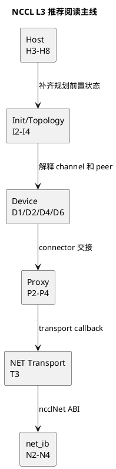

# NCCL L3 详细设计索引

## 1. 文档定位

本目录描述 NCCL v2.31.2-1 经典通信主链的 L3 详细设计。源码基线为提交
7b83616df3ae082a1f32bb74c27458bfe8153a13。

L2 回答“有哪些稳定组件以及它们如何协作”；L3 回答“组件内部的机制、状态、
并发、所有权和完成边界如何实现”。L3 不是函数目录，也不是把调用栈改画成方框。

本套文档只修改设计资料，不修改 NCCL 源码、公开 API 或运行配置。

## 2. 证据分级

| 标记       | 含义                                     | 可以支持的结论                              |
| ---------- | ---------------------------------------- | ------------------------------------------- |
| 源码事实   | 固定提交中可定位到函数、结构、字段或分支 | 代码具备某条静态路径或状态                  |
| 设计归纳   | 根据多个源码单元抽象的职责和边界         | 用于解释、评审和维护，不等同官方命名        |
| 待运行验证 | 必须结合日志、Profiler、GPU/HCA 或计数器 | 实际算法、协议、Transport、GDR、rail 和性能 |

静态源码不得用来证明目标机器实际选择了 Ring、LL128、NET/IB 或 GDR。

## 3. L3 章节统一设计卡

每个功能章节必须覆盖以下字段，字段可以放在同一张设计卡中：

| 字段               | 必须回答的问题                         |
| ------------------ | -------------------------------------- |
| 设计目标           | 本机制解决什么工程问题                 |
| 非目标             | 哪些相邻职责明确不属于本章             |
| 输入               | 入口调用、对象和前置状态               |
| 输出与停止边界     | 产出什么，追踪在哪个动作停止           |
| 上下游接口         | 谁调用它，它把什么交给谁               |
| 核心对象           | 主要结构、关键字段和状态所有者         |
| 主流程             | 正常路径的控制流和数据流               |
| 状态与生命周期     | 对象和状态如何创建、推进、回收         |
| 并发、同步与所有权 | 线程、GPU、队列、stream 和 buffer 约束 |
| 异常与退出         | 失败如何传播，资源如何保持一致         |
| 性能与可观测       | 主要开销、日志、Profiler 和验证点      |
| 源码证据与遗留     | 源码锚点、设计归纳和待运行问题         |

PlantUML 按问题选择：结构使用 component/class/object，过程使用 sequence/activity，
状态使用 state，所有权使用 object/lifecycle，并发配合使用 sequence/timing。

## 4. L2 到 L3 映射

| L2 Component                    | L3 功能章节        |
| ------------------------------- | ------------------ |
| Communicator Init & State       | I1                 |
| Topology & Graph Builder        | I2、I3、I4         |
| API & Validation                | H1                 |
| Group Lifecycle                 | H2                 |
| Task Admission                  | H3、H4             |
| Planner & Task Queues           | H5                 |
| Tuning & Cost Selection         | H6                 |
| Work & Plan Builder             | H7                 |
| Launch Coordinator              | H8                 |
| Transport Selection / Connector | T1、T2、T3         |
| Proxy Client / Service          | P1                 |
| Operation Submission / Queue    | P2                 |
| Active Op Scheduler             | P3                 |
| Transport Progress              | P4                 |
| Kernel Entry / Dispatcher       | D1                 |
| Algorithm Layer                 | D2、D3             |
| Protocol Primitives             | D4、D5             |
| Connector / FIFO                | D6                 |
| ncclNet / net_ib                | N1、N2、N3、N4、N5 |
| Cross-cutting Contracts         | C1、C2、C3         |

## 5. 分卷入口

1. [Communicator 初始化与拓扑](nccl-l3-01-init-topology.md)
2. [Host 请求与 Planner](nccl-l3-02-host-planner.md)
3. [Transport 与 Connector](nccl-l3-03-transport-connector.md)
4. [Proxy Runtime](nccl-l3-04-proxy-runtime.md)
5. [GPU Device Runtime](nccl-l3-05-device-runtime.md)
6. [ncclNet 与 net_ib](nccl-l3-06-net-ib.md)
7. [横切运行时契约](nccl-l3-07-runtime-contracts.md)

## 6. 33 章目录与状态

| ID | 功能设计                                     | 文档 | 状态 |
| -- | -------------------------------------------- | ---- | ---- |
| I1 | Bootstrap、Rank 会合与 Communicator 生命周期 | 01   | 初稿 |
| I2 | 物理拓扑发现与 ncclTopoSystem                | 01   | 初稿 |
| I3 | GPU/GPU、GPU/NIC 路径计算                    | 01   | 初稿 |
| I4 | Collective Graph 与 Channel 构造             | 01   | 初稿 |
| H1 | Collective API 语义与参数校验                | 02   | 初稿 |
| H2 | Group 嵌套与提交边界                         | 02   | 初稿 |
| H3 | taskAppend 准入与分支过滤                    | 02   | 初稿 |
| H4 | ncclInfo 到 ncclTaskColl 持久化              | 02   | 初稿 |
| H5 | Planner Sorter、Queue 与任务排序             | 02   | 初稿 |
| H6 | Tuning 候选、成本与选择                      | 02   | 初稿 |
| H7 | Device Work 编码与 Kernel Plan               | 02   | 初稿 |
| H8 | Proxy/Kernel 提交与 Stream 完成边界          | 02   | 初稿 |
| T1 | Transport 选择与 Connector 生命周期          | 03   | 初稿 |
| T2 | P2P/SHM 本地路径                             | 03   | 初稿 |
| T3 | NET Transport 连接与缓冲区契约               | 03   | 初稿 |
| P1 | Proxy Client、Service Thread 与控制面        | 04   | 初稿 |
| P2 | Proxy Operation 与 Posted Queue              | 04   | 初稿 |
| P3 | Active Operation Scheduler                   | 04   | 初稿 |
| P4 | Send/Recv Progress 与完成检测                | 04   | 初稿 |
| D1 | Kernel Entry、Work Batch 与分发              | 05   | 初稿 |
| D2 | Ring AllReduce Device Schedule               | 05   | 初稿 |
| D3 | Tree AllReduce Device Schedule               | 05   | 初稿 |
| D4 | Simple Protocol Primitive Pipeline           | 05   | 初稿 |
| D5 | LL/LL128 布局与推进                          | 05   | 初稿 |
| D6 | Connector/FIFO、Step/Credit 同步             | 05   | 初稿 |
| N1 | ncclNet ABI、Backend、NIC 与 Rail            | 06   | 初稿 |
| N2 | Listen/Connect、QP/CQ 建立                   | 06   | 初稿 |
| N3 | MR/GDR 注册生命周期                          | 06   | 初稿 |
| N4 | isend/irecv/test 到 WQE/CQ                   | 06   | 初稿 |
| N5 | 多 NIC、Rail 与 QP 映射                      | 06   | 初稿 |
| C1 | 跨层对象所有权与生命周期                     | 07   | 初稿 |
| C2 | 异步完成与错误传播                           | 07   | 初稿 |
| C3 | 参数、日志、Profiler 与证据                  | 07   | 初稿 |

## 7. 推荐阅读顺序

当前学习主线从 H3、H4、H5 开始，然后依次阅读 H6、H7、H8。理解 Host 规划后，
阅读 I2、I3、I4 建立拓扑前置条件，再阅读 D1、D2、D4、D6。跨节点路径最后按
P2、P3、P4、T3、N2、N3、N4 串联。

## 8. 术语与对象索引

| 对象                         | 主要阶段               | 详见           |
| ---------------------------- | ---------------------- | -------------- |
| ncclInfo                     | API 请求描述           | H1、H4、C1     |
| ncclTaskColl                 | Host Planner Task      | H4、H5、H6、C1 |
| ncclKernelPlanner            | Task/Plan 持有者       | H5、H7         |
| ncclDevWorkColl              | Device Collective Work | H7、D1、C1     |
| ncclKernelPlan               | Kernel 提交批次        | H7、H8、C1     |
| ncclTopoSystem               | 物理拓扑模型           | I2、I3         |
| ncclTopoGraph                | 算法拓扑映射           | I4、H6         |
| ncclConnector / ncclConnInfo | Peer 连接和进度状态    | T1、D6、C1     |
| ncclProxyArgs / ncclProxyOp  | Proxy 推进状态         | P2、P3、C1     |
| ncclIbRequest                | net_ib 异步请求        | N4、C1         |

## 9. 第一版非目标

第一版不展开 CE Collective、RMA、CFT、GIN、NVLS、CollNet、PAT、Enqueue
Rearchitecture 和 net_ib resiliency。源码中出现这些分支时，只标出过滤边界，不进入其内部设计。
