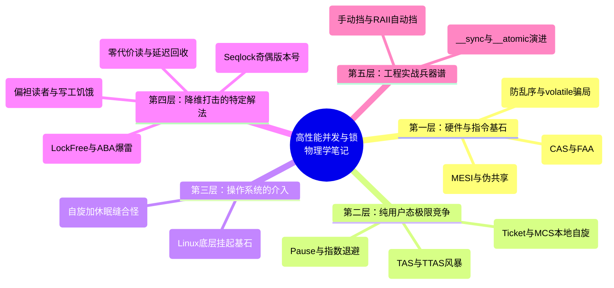

# 高性能系统：锁与并发的物理学笔记

> 本文档致力于从底层硬件和物理视角，自底向上地拆解锁与并发机制。
> 摒弃纯软件视角的八股文，聚焦 CPU 架构、缓存一致性、原子指令以及操作系统调度。
> 采用“技术定义 + 大白话 + 物理逻辑 + 代码佐证”的四段式范式。

---

## 🗺️ 全景思维导图 (Mind Map)



---

## 目录
- [高性能系统：锁与并发的物理学笔记](#高性能系统锁与并发的物理学笔记)
  - [目录](#目录)
  - [第一层：锁的物理基石（硬件与指令层）](#第一层锁的物理基石硬件与指令层)
    - [1. Cache 一致性与伪共享 (MESI \& False Sharing)](#1-cache-一致性与伪共享-mesi--false-sharing)
      - [1. 技术定义](#1-技术定义)
      - [2. 大白话与物理逻辑](#2-大白话与物理逻辑)
      - [3. 代码佐证](#3-代码佐证)
    - [2. 原子指令 (Atomics \& CAS / FAA)](#2-原子指令-atomics--cas--faa)
      - [1. 技术定义](#1-技术定义-1)
      - [2. 大白话与物理逻辑](#2-大白话与物理逻辑-1)
      - [3. 代码与汇编佐证](#3-代码与汇编佐证)
    - [3. 内存屏障 (Memory Barriers)](#3-内存屏障-memory-barriers)
      - [1. 技术定义](#1-技术定义-2)
      - [2. 大白话与物理逻辑](#2-大白话与物理逻辑-2)
      - [3. 代码与汇编佐证](#3-代码与汇编佐证-1)
  - [第二层：纯用户态的极限竞争（自旋锁体系）](#第二层纯用户态的极限竞争自旋锁体系)
    - [4. 朴素自旋锁 (TAS与TTAS) 与总线风暴](#4-朴素自旋锁-tas与ttas-与总线风暴)
      - [1. 技术定义](#1-技术定义-3)
      - [2. 大白话与物理逻辑](#2-大白话与物理逻辑-3)
      - [3. 代码佐证](#3-代码佐证-1)
    - [5. 退让机制 (Pause 指令与 Exponential Backoff)](#5-退让机制-pause-指令与-exponential-backoff)
      - [1. 技术定义](#1-技术定义-4)
      - [2. 大白话与物理逻辑](#2-大白话与物理逻辑-4)
      - [3. 代码佐证](#3-代码佐证-2)
    - [6. 排队自旋锁 (Ticket Lock 与 MCS Lock)](#6-排队自旋锁-ticket-lock-与-mcs-lock)
      - [1. 技术定义](#1-技术定义-5)
      - [2. 大白话与物理逻辑](#2-大白话与物理逻辑-5)
      - [3. 代码佐证：Linux 内核曾经的王者 MCS Lock](#3-代码佐证linux-内核曾经的王者-mcs-lock)

---

## 第一层：锁的物理基石（硬件与指令层）

### 1. Cache 一致性与伪共享 (MESI & False Sharing)

#### 1. 技术定义
**一句话概括**：多核 CPU 依靠 MESI 等缓存一致性协议通过底层总线广播来同步各个核心的独立 L1/L2 Cache；而当多个线程无意间修改位于同一个缓存行（通常为 64 Bytes）的独立变量时，会引发无意义的一致性流量风暴，这被称为伪共享（False Sharing）。

#### 2. 大白话与物理逻辑

**【前置硬件结构：L1/L2/L3 缓存金字塔】**
在讲一致性之前，必须先看清 CPU 内部的物理存储层级：
```text
 ┌────────────────┐     ┌────────────────┐
 │     Core 0     │     │     Core 1     │
 │ ┌────────────┐ │     │ ┌────────────┐ │
 │ │ L1 Cache   │ │     │ │ L1 Cache   │ │ <--- 工人的裤兜 (极小~64KB，~1纳秒，绝对私有)
 │ └────────────┘ │     │ └────────────┘ │
 │ ┌────────────┐ │     │ ┌────────────┐ │
 │ │ L2 Cache   │ │     │ │ L2 Cache   │ │ <--- 工人的背包 (稍大~1MB，~3纳秒，单个核私有)
 │ └────────────┘ │     │ └────────────┘ │
 └───────┬────────┘     └───────┬────────┘
         │                      │
         └──────────┬───────────┘
           ┌────────┴─────────┐
           │     L3 Cache     │ <--- 车间的储物柜 (大~数十MB，~15纳秒，所有核共享)
           └────────┬─────────┘
           ┌────────┴─────────┐
           │  Main Memory(RAM)│ <--- 厂外的远郊大仓库 (海量，~100纳秒，极慢！)
           └──────────────────┘
```
**物理职责分配**：
- **L1/L2 (私有)**：离计算单元最近，负责喂饱极速运算的 CPU。但正因为是**私有**的，当 Core 0 将变量 `X` 读进自己的 L1 并修改为 1 时，这个新值被“捂在”了 Core 0 的裤兜里。外面的 L3 和 RAM 里的 `X` 还是旧值 0，Core 1 去读也会读到 0。这就是并发读写时“缓存不一致”的物理根源。
- **L3 (共享)**：作为私有缓存和极慢主存之间的缓冲带，所有 Core 都能看见它。

**大白话**：
结合上面的图，我们把 Core 想象成工人，L1/L2 想象成小本子（私有），主存想象成大档案柜。
- **MESI 协议**：为了防止大家本子上的数据打架，硬件搞了个“广播喇叭”（总线）。如果工人 A 把自己本子上的数据改了，他必须通过喇叭大喊一声：“这一页作废了！”（发总线广播 RFO）。其他工人听到后，必须把自己本子上这一页划掉（Invalidate）。下次再用，就得重新去找大档案柜或找 A 拿最新的。
- **伪共享 (False Sharing)**：这个“一页”在物理上是 64 个字节（Cache Line）。假设工人 A 负责算总销售额（变量 `X`），工人 B 负责算退款额（变量 `Y`）。他俩明明井水不犯河水，但如果 `X` 和 `Y` 在内存里挨得太近，被印在了“同一页”纸上。结果就是：A 改 `X`，大喊一声“这页废了”，B 连带把 `Y` 也划掉了；B 改 `Y`，大喊一声，A 又把 `X` 划掉了。两人天天互相使绊子，工作效率大跌。这就是没有竞争（逻辑独立）却引发了硬件级“锁竞争”的惨剧。

**【灵魂拷问：L1/L2 和 L3/RAM 之间会不会有不一致问题？】**
- **纵向无忧（L1到L2，L3到RAM）**：对于并发程序而言，纵向不一致不会引发 Bug。L1/L2 属于同一个 Core 私有，本地控制器会打理好内部同步；而当数据进入 L3 后，由于所有 Core 寻址时**必定先查 L3**，L3 就成了单一真相来源。即使此时 RAM 里是旧数据，也没有任何 Core 会越过 L3 去读 RAM。
- **横向设防（不同 Core 的 L1/L2 之间）**：MESI 协议防的正是“横向私藏”。Core 0 改了 L1 的数据，如果没有 MESI 总线广播，Core 1 去读自己 L1 或 L3 时就会读到旧值。因此，Cache 一致性协议主要消耗的是**跨核横向通讯（Ring Bus）**的物理带宽。

> **⚠️ 扩展极客点（网卡/DMA视角）：**
> 对于 CPU 而言，L3 和 RAM 不一致没有关系，因为所有 Core 都以 L3 为唯一真理。但对于网卡（网卡也是一个独立访问内存的硬件）却有致命关系！这就是为什么我们在读 NCCL `net_ib.cc` 源码时，需要接收端网卡发起一笔 PCIe Flush。因为网卡（DMA）去读内存时，是**直接越过 CPU 的 L1/L2/L3 去读主存 RAM 的**（或者有些架构支持网卡读 L3，叫 DDIO）。如果 CPU 改了数据还憋在 L1/L2 里没刷回 RAM，网卡发出去的就是错的！这解释了网络编程中强制 Flush 的物理必要性。

**物理逻辑**：
- 现代 CPU 读写内存不是按 Byte 来的，而是按 **Cache Line（一般是 64 字节）** 作为最小搬运单位。
- MESI 协议有四个状态：`M`(修改), `E`(独占), `S`(共享), `I`(失效)。
- 当一个核写一个处于 `S` 状态的 Cache Line 时，必须向总线发送 **RFO (Read For Ownership)** 消息，索要独占权，并把其他核的该行设为 `I`（失效）。
- 高频的 RFO 广播会塞满 CPU Ring Bus / QPI 总线，并造成极大的 Cache Miss（缓存未命中延迟约为 100 纳秒级别）。

#### 3. 代码佐证
**反面教材：引发伪共享的代码**
```cpp
struct Counter {
    long thread1_count; // 8 bytes
    long thread2_count; // 8 bytes
    // 总共 16 bytes，绝对会挤在同一个 64 bytes 的 Cache Line 里
};
Counter global_counter;

// 线程 1 疯狂执行：
global_counter.thread1_count++; 
// 线程 2 疯狂执行：
global_counter.thread2_count++;
// 结果：看似无锁，实际上底层总线被 RFO 广播打爆，性能极差。
```

**解局之道：空间换时间（Cache Line 对齐/填充）**
在 C++17 中，可以直接使用 `alignas` 强行把变量撑开，或者手动填充。
```cpp
struct alignas(64) AlignedCounter {
    long thread1_count;
    // 编译器会自动在这里填补 56 个字节的空白，确保下一个变量在另一行
};

// 或者手动 Padding (类似 NCCL proxy.h 里的做法)
struct PaddedCounter {
    long thread1_count;
    char padding1[56]; // 强行占满一个 Cache Line
    
    long thread2_count;
    char padding2[56];
};
```
在咱们之前看的 NCCL `proxy.h` 中，`static_assert(sizeof(struct ncclProxyOp) == 64)` 就是利用这个物理特性，确保每张“发货单”独立霸占一行，互不干扰！

### 2. 原子指令 (Atomics & CAS / FAA)

#### 1. 技术定义
**一句话概括**：依靠底层 CPU 指令集（如 x86 的 `LOCK` 前缀）提供的硬件级保证，使“读取-修改-写回”（RMW）这三个步骤在物理总线上成为不可分割的单一原子操作，是所有高级锁和无锁数据结构构建的“绝对地基”。

#### 2. 大白话与物理逻辑
**大白话**：
代码里写个简单的 `i++`，实际上分三步：① 把 `i` 从内存掏出来看一眼；② 在脑子里加1；③ 把新值塞回内存。
如果不加保护，A 和 B 两个人同时掏出 `i=5`，各自加1，最后塞回去，`i` 只变成了 6（丢了一次计数）。
所谓**原子指令**，就是硬件给你一把“尚方宝剑”。只要你挥舞这把剑（加了 `LOCK` 前缀），你在做这三步的时候，系统仿佛按下了时间停止键，其他任何人（哪怕是另一个 CPU 核心）都绝对插不进来。

**物理逻辑：指令到底是怎么做到“不可分割”的？**
我们以 `LOCK CMPXCHG` (CAS) 为例，来看看 CPU 硬件在微秒/纳秒级别究竟做了什么：
1. **申请独占（锁）**：当 Core 0 执行到带有 `LOCK` 前缀的指令时，它首先利用 MESI 协议向总线发出 RFO 信号，强行把包含该变量的 Cache Line 的状态置为 `M`（修改/独占状态）。
2. **关门干活（RMW 三步曲）**：此时这 64 字节的缓存行被 Core 0 在物理电路上“反锁”。在这期间如果有其他核（比如 Core 1）想读写这块内存，硬件总线控制器会直接把 Core 1 的请求“挂起 / 延后处理”。借着这个绝对真空期，Core 0 在自己的运算器里飞速完成三步：**读取**当前值 -> **比较**是否等于预期 -> **写回**新值。
3. **开门放行（解锁）**：写回完成后，汇编指令结束。Core 0 释放独占权，总线控制器才允许处理其他核刚才被挂起的请求。

**核心结论**：这 3 步（Read-Modify-Write，简称 RMW）在 CPU 内部其实分了好几个时钟周期，绝对不是瞬间完成的。**但因为在第 1 步时，硬件电路在物理上拒接了所有其他核的探针（Snoop），所以对外界来说，这 3 步就像是被打包成了一个不可切分的“黑盒”，外界要么看到执行前，要么看到执行后，绝对看不到中间态。这就是物理原子性（Atomicity）的真相！**

**底层锁的演进**：
- **总线锁 (Bus Lock) - 上古时代**：在早期，`LOCK` 指令会直接拉高 CPU 物理引脚的电压，锁死整个北桥总线（FSB）。相当于“为了上个厕所，把整栋楼的门全封了”，其他核连访问完全不相关的内存都会被卡死，代价恐怖。
- **缓存锁 (Cache Lock) - 现代时代**：现代 CPU 依靠 MESI 协议，`LOCK` 指令进化成了上面讲的“缓存锁”。它只锁当前这 64 字节的局部缓存行，其他核访问别的地方完全不受影响。

**【灵魂拷问：CAS / FAA 和 Atomics 是什么关系？】**
- **Atomics (原子变量/原子操作)**：是高级语言（如 C++ 的 `std::atomic`）提供给程序员的**抽象软件接口**。
- **CAS 和 FAA**：是 CPU 硬件厂商（如 Intel/AMD/ARM）直接刻在硅片里的**物理汇编指令**。
两者是**表与里、皮与骨**的关系。高级语言里的所有 Atomics 操作，在被编译器翻译成机器码时，最终都会降级为这“两大家族”的物理原子指令。换句话说：没有硬件层面的 CAS 和 FAA 指令托底，软件层面就不可能存在真正的 Atomics。

**硬件原子指令的两大家族**：
1. **CAS (Compare-And-Swap / x86汇编为 `CMPXCHG`)**：“看一眼旧值对不对，对的话我就改”。这是一种**试探性**指令。如果被别人抢先改了，它会失败并返回旧值，你需要用个 `while` 循环不断重试（自旋）。我们在 NCCL `proxy.cc` 的无锁链表回收中看到的，就是它。
2. **FAA (Fetch-And-Add / x86汇编为 `XADD`)**：“不管三七二十一，直接给我在内存里加个值，顺便告诉我加之前是多少”。这是一种**强制性**指令，在硬件总线上强制排队加，必定成功，无需 `while` 循环。

#### 3. 代码与汇编佐证
在 C++11 中，我们使用 `std::atomic`：
```cpp
#include <atomic>

std::atomic<int> counter{0};

// 1. FAA 的使用 (无脑加)
counter.fetch_add(1, std::memory_order_relaxed);
// 对应 x86 汇编：
// lock xadd DWORD PTR [counter], eax

// 2. CAS 的使用 (试探改)
int expected = 0;
// 如果 counter 当前是 expected(0)，就改成 1，返回 true；否则 expected 被覆盖为当前真实值，返回 false。
bool success = counter.compare_exchange_strong(expected, 1);
// 对应 x86 汇编：
// lock cmpxchg DWORD PTR [counter], edx
```

**实战指导**：
- 如果只是为了抢号、计数，**无脑优先用 FAA**。因为它不需要 `while` 循环，在极端冲突下也不会引发大量废弃的重试流量。
- 但如果是要替换链表指针（像 NCCL 里的 `freeOps`），因为新指针的计算依赖于旧指针的值，你不得不使用 **CAS + while 循环**。

### 3. 内存屏障 (Memory Barriers)

#### 1. 技术定义
**一句话概括**：为了压榨性能，现代编译器会重排代码，CPU 硬件会乱序执行指令并引入 Store Buffer（写缓存）；内存屏障是一条强力的硬件指令（如 `MFENCE`），用来强行阻断这些乱序行为，确保在屏障两侧的内存读写操作严格按照代码字面顺序在物理总线上可见。

#### 2. 大白话与物理逻辑
**大白话**：
你是一个老板（CPU），你给秘书写了两张便签：①“把 100 万打入张三账户”（`data = 100`）；②“贴个告示，说钱已经打完了”（`flag = true`）。
正常人觉得肯定先打钱再贴告示。但秘书（编译器/乱序 CPU）是个极度追求效率的“小聪明”。她一看，打钱手续复杂（等 Cache Miss），贴告示顺手就干了（正好在 L1 Cache 里）。于是她先贴了告示！
结果别的公司一看告示，立刻去查张三账户，发现钱没到，直接懵逼了。
**内存屏障**就是你作为老板的怒吼：“这两件事之间必须给我加一道铁门！第一件事没彻底干完（落入对方可见的缓存中），绝对不允许干第二件事！”

**物理逻辑**：
- **编译期乱序**：GCC 等编译器在开启 `-O2` 或 `-O3` 时，为了优化寄存器分配，会打乱毫不相干的变量读写顺序。
- **硬件期乱序 (Store Buffer 陷阱)**：哪怕编译器没乱排，CPU 核也是乱序的。当你执行 `A = 1`（写操作）时，如果变量 `A` 不在当前核的 L1 Cache 中，当前核**不会傻等**，而是把 `A = 1` 扔进一个叫 **Store Buffer** 的极速小黑盒里，然后立刻去执行后面的 `flag = true`。此时，`A=1` 并没有广播给其他核（甚至还没进入 L1），而 `flag=true` 却被其他核看到了。这在并发编程中是致命的。
- **屏障的作用**：执行一条全屏障（如 `MFENCE`，对应 `__sync_synchronize()`），它的物理动作是：**强迫当前核停下一切脚步，必须把 Store Buffer 里的所有待写数据彻底排空（Flush）到 L1 Cache 并走完 MESI 协议让其他核失效，然后才允许执行屏障后的任何读写。**

#### 3. 代码与汇编佐证
这是我们在 NCCL `net_ib.cc` 中讲 FIFO 握手时见过的经典场景（典型的 Producer-Consumer 模型）：

**生产者端（Sender）：**
```cpp
data[0] = 42;             // 1. 准备数据
// 如果没有下面这句，编译器或 CPU 可能会把 flag=1 提前执行！
__sync_synchronize();     // 2. 内存屏障（汇编: mfence）
flag = 1;                 // 3. 设置完成标志
```

**消费者端（Receiver）：**
```cpp
while (flag == 0) {}      // 1. 等待标志就绪
// 如果没有下面这句，CPU 可能会在 flag 还没变成 1 之前，就靠“分支预测”提前去读 data！
__sync_synchronize();     // 2. 内存屏障
int my_data = data[0];    // 3. 安全地读取数据
```

**C++11 现代写法（Acquire-Release 语义）**：
`__sync_synchronize()` 是一刀切的全屏障（极重）。C++11 细化了这把刀：
- **Release (释放，用于生产者)**：确保 `store` 之前的所有写操作，都不会被重排到 `store` 之后。
- **Acquire (获取，用于消费者)**：确保 `load` 之后的所有读操作，都不会被重排到 `load` 之前。
```cpp
std::atomic<int> flag{0};
int data = 0;

// 生产者
data = 42;
flag.store(1, std::memory_order_release); // 替代 __sync_synchronize()

// 消费者
while (flag.load(std::memory_order_acquire) == 0) {} // 替代 __sync_synchronize()
int my_data = data;
```

**【灵魂拷问：在 C/C++ 中，给变量加个 `volatile` 关键字能代替内存屏障和原子操作吗？】**
**绝对不能！这是 C/C++ 并发编程里流传最广、害人最深的千古骗局！**
- **Java 程序员的错觉**：在 Java 中，`volatile` 确实带有内存屏障和保证多线程可见性的奇效。很多转 C++ 的人把这个习惯带了过来。
- **物理真相**：在 C/C++ 的标准中，`volatile` 的**唯一**物理作用是告诉**编译器**：“不要把这个变量优化（缓存）到 CPU 寄存器里，每次读写都必须老老实实去内存（或 Cache）里取”。
- **致命三无**：
  1. 它**无**法阻止 CPU 硬件层面的乱序执行（它不生成任何内存屏障指令，如 `MFENCE`）。
  2. 它**无**法保证操作的原子性（`volatile int i; i++` 依然会发生读写覆盖）。
  3. 它**无**法触发强制的 Cache 同步广播。
- **正确用法**：C/C++ 的 `volatile` 是给**底层驱动工程师**读写硬件设备映射内存（MMIO）用的（因为硬件寄存器的值会由外部硬件悄悄改变）。**在任何正经的多线程并发代码中，只要你用了 `volatile` 来做线程同步，100% 都是 Bug！请立刻换成 `std::atomic`！**

---
（第一层：锁的物理基石 完结。这三把斧头：MESI、原子指令、内存屏障，构成了接下来所有高级锁的物理地基。）

## 第二层：纯用户态的极限竞争（自旋锁体系）

### 4. 朴素自旋锁 (TAS与TTAS) 与总线风暴

#### 1. 技术定义
**一句话概括**：自旋锁（Spinlock）是一种纯用户态的锁机制，线程在获取不到锁时不会陷入系统内核睡眠，而是通过 `while` 死循环和原子指令疯狂轮询锁的状态；其中最原始的 TAS (Test-And-Set) 和 TTAS (Test-and-Test-And-Set) 锁虽然实现简单，但在高并发下会引发毁灭性的 MESI 总线风暴。

#### 2. 大白话与物理逻辑
**大白话**：
假设厕所（临界区）只有一把钥匙，挂在门口。
- **TAS（无脑抢）**：100 个人在门外，每个人都不停地伸手去抓钥匙（CAS 操作）。即便门里面有人，这 100 个人依然疯狂地伸手去拽那把根本拉不动的钥匙。
- **TTAS（看一眼再抢）**：大家变聪明了一点。100 个人先用眼睛盯着钥匙孔（普通的读操作）。一旦看到里面的人把钥匙插回来了，这 100 个人才同时伸出手去抢（CAS 操作）。抢到的进去，没抢到的继续用眼睛死盯。

**【灵魂拷问：为什么 TAS 和 TTAS 会有这种行为差异？是硬件特点决定的吗？】**
是的！这是由 **“写独占（RFO）”** 与 **“读共享（Share）”** 这两个底层硬件特性决定的：
- **TAS 为什么是“伸手抓”？** TAS 的本质是 `while(!CAS)`。`CAS` 是一个**写操作**指令。在硬件层面，任何写操作都必须先获取当前缓存行的独占权（发送 RFO 广播，把别人的缓存变失效）。所以不管锁解没解开，这 100 个核心的硬件电路都在疯狂发送“我要独占这个变量”的写请求，导致总线带宽被写请求彻底撑爆。
- **TTAS 为什么是“用眼盯”？** TTAS 的内层循环是 `while(lock == 1)`。这是一个**纯读操作（Load）**。在硬件层面，读操作允许这个缓存行在所有 100 个核心的 L1 Cache 里以 `S（共享）` 状态并存。大家都在安静地读取自己 CPU 裤兜里的副本，**没有任何写请求**，总线上安安静静。直到真正开锁的那一刻，大家才冲上去发起一次 `CAS` 写操作。

**物理逻辑**：
- **TAS 的灾难 (Test-And-Set)**：
  TAS 的核心代码是 `while(!CAS(&lock, 0, 1));`。
  上一层我们讲过，`CAS` 是一条硬件指令，会发出 RFO（Read For Ownership）独占广播。100 个核心疯狂执行 `CAS`，意味着总线上每纳秒都有 100 个 RFO 在乱飞，疯狂抢夺这个 Cache Line 的 `M`（独占）状态。
  **致命后果**：总线带宽被这 100 个废物的 RFO 广播彻底塞满！里面那个真正在干活的 Core 0，想把自己算好的数据写回内存，结果发现总线一直堵车，根本出不来！这就叫**“不仅没抢到锁，还把干活的人憋死了”**。
- **TTAS 的微调与“惊群效应” (Test-and-Test-And-Set)**：
  TTAS 优化了一下：`while(true) { while(lock == 1); if(CAS(&lock, 0, 1)) break; }`。
  内部那个 `while(lock == 1)` 只是普通读（Load）。根据 MESI 协议，这 100 个核的 L1 Cache 都会处于 `S`（共享）状态。总线上安静了，因为大家都在读自己裤兜里的局部缓存！
  **惊群效应来了**：当里面的人开锁（把 lock 置为 0），他发出一个 RFO，把另外 99 个核的 L1 里的 lock 全变成 `I`（失效）。这 99 个核瞬间发现缓存失效，立刻同时跳出内层循环，**同时发出 `CAS`（RFO 广播）去抢锁！** 这就像一声发令枪响，总线上瞬间再次爆发一场极高密度的流量海啸。

#### 3. 代码佐证
**C++ 实现最原始的 TTAS 自旋锁：**
```cpp
#include <atomic>

class TTASLock {
    std::atomic<int> flag{0}; // 0=没锁，1=被锁了
public:
    void lock() {
        while (true) {
            // 第一个 Test：纯读操作，在自己的 L1 Cache 里自旋，不占用总线（处于 S 状态）
            while (flag.load(std::memory_order_relaxed) == 1) {
                // ！！！致命缺陷待修补 ！！！
                // 如果这里是个纯粹的空循环，CPU 流水线会被撑爆，功耗直接拉满！
                // 见下一节：Pause 指令
            }
            
            // 第二个 Test-And-Set：看到锁被释放了，冲上去尝试修改（发出 RFO 广播）
            int expected = 0;
            // 谁的 CAS 成功了，谁就拿到了锁
            if (flag.compare_exchange_strong(expected, 1, std::memory_order_acquire)) {
                return; // 抢到了！退出循环，进入临界区
            }
            // 没抢到，退回去继续执行第一个 Test 死盯
        }
    }

    void unlock() {
        // 释放锁，触发 MESI 失效广播，引发门外 99 个核的“惊群效应”
        flag.store(0, std::memory_order_release);
    }
};
```

### 5. 退让机制 (Pause 指令与 Exponential Backoff)

#### 1. 技术定义
**一句话概括**：为了缓解自旋锁在获取失败时死循环带来的 CPU 流水线拥塞和解锁时的性能倒退，引入底层 `PAUSE` 汇编指令让 CPU 暂停预测，同时配合指数退避（Exponential Backoff）算法，在多次失败后主动降低轮询频率。

#### 2. 大白话与物理逻辑
**大白话**：
如果你站在门外死死盯着门把手（死循环），连眼睛都不眨一下。
- **没加 Pause 的后果**：你大脑（CPU）处于极度亢奋的紧绷状态，心跳 180（功耗飙升）。突然门开了，你因为过度紧绷反而懵了一下（流水线清空惩罚），错过了最佳冲锋时机。
- **加了 Pause / Backoff 的后果**：你深呼吸了一口（Pause 指令），稍微打了个盹（退避）。这不仅让心跳降了下来（省电），还能在你清醒的那一刻保持最好的反应速度。如果等了很久还不开，你就闭眼等更长的时间（指数退避），不至于把自己的精力耗干。

**物理逻辑（Pause 为什么这么神？）**：
- **CPU 的流水线与分支预测**：现代 CPU 执行指令是超流水线的。当你在跑一个极紧凑的 `while` 循环时，CPU 的预测器会疯狂预测“下一次还是在循环里”，并把大量后续指令塞进流水线执行。
- **解锁时的“大洗牌”（Memory Order Violation）**：当锁突然被释放，那个循环的跳出条件突然成立了！此时 CPU 发现之前的疯狂预测全错了，必须**清空整条几十级的流水线**，重新从正确的地方取指令。这会带来高达几百个周期的极其严重的**性能倒退惩罚（Penalty）**。
- **_mm_pause() 的物理动作**：这其实是一条 `rep nop` 汇编指令。它告诉 CPU：“兄弟，这是一个自旋循环。你稍微停顿几十个周期，别疯狂预测了，省点电。” 这样一来，当锁真正释放时，流水线里没有被预测的垃圾指令，CPU 能以最快速度跳出循环。

#### 3. 代码佐证
在极高频的底层组件（如 DPDK、无锁队列）中，这是标准的自旋退避写法：
```cpp
#include <atomic>
#include <emmintrin.h> // for _mm_pause()

class BackoffSpinLock {
    std::atomic<int> flag{0};
public:
    void lock() {
        int backoff = 1;
        while (true) {
            while (flag.load(std::memory_order_relaxed) == 1) {
                // 根据连续失败的次数，指数级增加 Pause 的次数
                for (int i = 0; i < backoff; ++i) {
                    _mm_pause(); // x86 指令：让 CPU 流水线“深呼吸”
                }
                // 限制最大退避上限，防止睡过头
                if (backoff < 64) backoff *= 2; 
            }
            
            int expected = 0;
            if (flag.compare_exchange_strong(expected, 1, std::memory_order_acquire)) {
                return; // 抢到了
            }
        }
    }
```  

### 6. 排队自旋锁 (Ticket Lock 与 MCS Lock)

#### 1. 技术定义
**一句话概括**：为了彻底解决朴素自旋锁（TTAS）引发的总线惊群效应和不公平竞争，Ticket Lock 引入了原子递增指令（FAA）实现公平排队；而 **MCS Lock（封神之作）** 更是通过巧妙的链表结构，让每个等待的 CPU 核心**只在自己本地私有的缓存行上自旋**，在物理上实现了真正的 O(1) 恒定总线流量。

#### 2. 大白话与物理逻辑
**大白话**：
- **Ticket Lock（银行叫号）**：100 个人挤在门口抢太乱了（惊群）。咱们弄个取号机（FAA指令）。来的每个人按顺序抽一张号（my_ticket）。门上挂个显示屏显示当前正在办业务的号码（now_serving）。你抽到号后，只要死死盯着显示屏就行了，只有显示屏上的数字等于你的号码，你才进去。进去办完，你把显示屏上的数字 +1（叫下一个人）。
- **Ticket 的缺点（盯着同一块屏幕）**：虽然大家不抢了，但这 100 个人还是在同时盯着同一块屏幕（`now_serving` 变量）。当里面的人把数字 +1 时，依然会触发 MESI 协议把这 100 个人的缓存全部标记为失效（I），引发一次轻微的总线风暴。
- **MCS Lock（拍肩膀传纸条）**：终极解法。不要显示屏了！每个人自带一张小纸条（本地变量 `locked = 1`），站在前一个人身后，并拍拍他的肩膀告诉他：“你办完了把我的纸条划掉”。这样，这 100 个人**每个人都在低头看自己手里的纸条**。当第一个人办完事，他转过身，**精准地只在第二个人手里的纸条上划一下**。其他 98 个人连头都不抬，完全不知道发生了什么。**总线流量从 100 瞬间降到了 1！**

**物理逻辑（MCS 如何做到本地自旋？）**：
- 在物理层面，TTAS 和 Ticket Lock 的灾难根源是：**所有 CPU 核都在自旋等待同一个全局变量的缓存行**。只要这个变量一变，所有核的 L1 Cache 都会因为 MESI 协议集体失效。
- **MCS 的空间隔离魔法**：MCS 锁要求每个来排队的线程，在自己的栈上（甚至可以对齐到独立 Cache Line）分配一个节点（Node）。线程在 `while(node->locked)` 上自旋。因为这个 `node` 是当前线程私有的，所以物理上，当前核只在读自己专属的一个局部 Cache Line！
- **精准解锁**：解锁时，持有锁的线程通过链表指针 `next`，直接去修改下一个线程的私有 `node->locked = 0`。此时，总线上只会产生一次点对点的 RFO 广播，只会让下一个核的 Cache 失效。其余的核不受任何打扰。

#### 3. 代码佐证：Linux 内核曾经的王者 MCS Lock
（精简版实现，展示只在本地自旋的精髓）
```cpp
#include <atomic>

struct MCSNode {
    std::atomic<MCSNode*> next{nullptr};
    std::atomic<bool> locked{true}; // 每个线程只盯自己节点的这个布尔值！
};

class MCSLock {
    // 全局只保存一个队尾指针
    std::atomic<MCSNode*> tail{nullptr};

public:
    void lock(MCSNode* my_node) {
        // 1. 初始化自己的节点
        my_node->next = nullptr;
        my_node->locked = true;

        // 2. 施展 XCHG (原子的 Swap)，把自己挂到队尾，并拿到前一个人的节点
        MCSNode* prev = tail.exchange(my_node, std::memory_order_acquire);

        // 3. 如果前面有人，排在他后面
        if (prev != nullptr) {
            prev->next = my_node; // 拍拍前一个人的肩膀：“你的下一个是我”
            
            // 【核心精髓：本地自旋！】
            // 只在 my_node->locked 上空转，这块内存在当前核的局部 L1 Cache 里
            // 别人解锁不会干扰我，我也不会干扰别人！
            while (my_node->locked.load(std::memory_order_acquire)) {
                _mm_pause(); 
            }
        }
    }

    void unlock(MCSNode* my_node) {
        // 1. 如果我后面没人，尝试把全局队尾清空
        if (my_node->next == nullptr) {
            MCSNode* expected = my_node;
            if (tail.compare_exchange_strong(expected, nullptr, std::memory_order_release)) {
                return; // 真没人了，安全离开
            }
            // 如果 CAS 失败，说明就在这一瞬间，有人挂到我后面了（正在执行 lock 的 step 2）
            // 必须等他把 my_node->next 指针设置好 (等 step 3 完成)
            while (my_node->next == nullptr) { _mm_pause(); }
        }

        // 2. 【核心精髓：精准解锁！】
        // 直接去改下一个人的私有变量，只触发一次 MESI 失效！
        my_node->next.load()->locked.store(false, std::memory_order_release);
    }
};
```
*注：MCS 锁是计算机并发科学的丰碑之一。在早期的 Linux 内核（如 x86 架构）中，Mutex 的底层长期由 MCS 衍生版本（如 qspinlock）统治，因为它彻底驯服了 Cache 一致性协议的物理缺陷。*

---
（第二层：纯用户态极限竞争 完结。如果你只在用户态折腾，这就是性能的尽头了。但如果不幸线程被操作系统强行抢占了怎么办？请看第三层。）

## 第三层：操作系统的介入（睡眠与唤醒）

### 7. Linux 锁的灵魂：Futex (Fast Userspace Mutex)

#### 1. 技术定义
**一句话概括**：Futex 是 Linux 内核提供的一种基础同步机制，它的核心哲学是“无竞争时完全在用户态用原子指令解决（极快），有竞争时才陷入内核态将线程挂起（睡眠）并由内核负责唤醒”。它是现代所有高级锁（如 `std::mutex`, Java `synchronized`）在 Linux 上的底层基石。

#### 2. 大白话与物理逻辑
**大白话**：
假设你想上公共厕所（临界区）。
- **上古时代的悲剧（每次都找警察）**：以前，无论厕所有人没人，你都必须先跑去警察局（系统调用陷入内核态），让警察帮你查一下。就算厕所是空的，你也得跑这一趟。这好比为了买包盐却非要过一次海关安检，极其浪费时间。
- **Futex 的智慧（自己先看，搞不定再报警）**：你在厕所门上挂个牌子（用户态的原子变量）。
  - **情况 A（无冲突）**：你来了一看，牌子是 0，你直接一把划成 1（`CAS` 成功），然后进去上厕所。**全程没有惊动任何警察（没有系统调用，没有上下文切换）！**
  - **情况 B（有冲突）**：你来了一看，牌子是 1。你试着抢了一下没抢到。这时你不能像第二层的“自旋锁”那样傻站着干耗体力（浪费 CPU）。你立刻打电话报警（发 `futex` 系统调用），告诉警察：“我要在这睡一觉，等门牌号变成 0 了，你叫醒我！” 于是你安心睡去，把 CPU 让给了别的程序。

**物理逻辑（系统调用的昂贵代价）**：
- 在物理层面，“用户态”和“内核态”是两套完全不同的 CPU 运行特权级（Ring 3 vs Ring 0）。
- 一次系统调用（Syscall）意味着：触发软中断/陷阱指令（如 `syscall` 或 `int 0x80`） -> 强行清空用户态的 CPU 寄存器和流水线 -> 切换到内核页表 -> 执行内核代码 -> 再切回用户态。
- 这个上下文切换的过程，大约要消耗 **几百到上千个 CPU 时钟周期**（相当于执行了几千条普通指令）。
- **Futex 的伟大于此**：在绝大多数健康的并发程序中，锁在 99% 的时间里都是没有竞争的。Futex 利用了这一点，把这 99% 的加/解锁操作全部拦截在用户态（通过一两条原子的 `CMPXCHG` 指令瞬间搞定，耗时约十几纳秒），彻底免去了昂贵的系统调用税。

#### 3. 代码与系统调用佐证
Futex 的核心是一个 32 位的整型变量，加上系统提供的两个魔法函数：
1. `futex_wait(addr, expected_val)`：如果 `*addr == expected_val`，内核就把我挂起休眠；否则立即返回（说明刚要睡的时候别人解锁了，运气好，再抢一次）。
2. `futex_wake(addr, count)`：唤醒等待在 `addr` 上的 `count` 个线程。

**最简 Futex 互斥锁模型：**
```cpp
#include <atomic>
#include <linux/futex.h>
#include <sys/syscall.h>
#include <unistd.h>

class SimpleFutexLock {
    // 0: 未锁, 1: 已锁但没人排队, 2: 已锁且有人在睡觉排队
    std::atomic<int> state{0};

public:
    void lock() {
        int expected = 0;
        // 1. 【极速用户态路径】：如果是 0，瞬间改成 1，直接成功！（无系统调用）
        if (state.compare_exchange_strong(expected, 1, std::memory_order_acquire)) {
            return; 
        }

        // 2. 【慢速内核态路径】：没抢到，或者发现状态已经是 2 了
        while (true) {
            // 确保状态变成 2（通知里面的人：我在外面睡觉，你出来记得叫我）
            if (expected == 2 || state.exchange(2, std::memory_order_acquire) != 0) {
                // 3. 【系统调用】：真正陷入内核去睡觉！
                // 语义：如果 state 还是 2，内核请把我挂起
                syscall(SYS_futex, &state, FUTEX_WAIT_PRIVATE, 2, nullptr, nullptr, 0);
            }
            // 醒来后，或者上面的 exchange 刚好拿到 0（运气好），再次尝试把状态设为 2 并获取锁
            expected = 0;
            if (state.compare_exchange_strong(expected, 2, std::memory_order_acquire)) {
                return;
            }
        }
    }

    void unlock() {
        // 1. 【极速用户态路径】：如果 state 原来是 1，说明外面没人睡觉，直接改成 0 走人！（无系统调用）
        if (state.fetch_sub(1, std::memory_order_release) != 1) {
            // 2. 【慢速内核态路径】：刚才减完发现不对劲（比如原来是 2，减完变 1），说明外面有人睡觉！
            state.store(0, std::memory_order_release);
            // 3. 【系统调用】：陷入内核，让内核叫醒 1 个正在睡觉的线程
            syscall(SYS_futex, &state, FUTEX_WAKE_PRIVATE, 1, nullptr, nullptr, 0);
        }
    }
};
```

### 8. 真实世界的霸主：pthread_mutex 深度解剖 (自旋+休眠混合态)

#### 1. 技术定义
**一句话概括**：在 glibc（NPTL）中实现的 `pthread_mutex` 是工程界最常用的互斥锁，它是一个“混合缝合怪”：在加锁时，先在用户态进行短暂的自旋（Spin），如果实在等不到，才会退化调用底层的 `futex_wait` 陷入内核休眠。它融合了自旋锁的低延迟和休眠锁的低功耗。

#### 2. 大白话与物理逻辑
**大白话**：
你去饭店吃饭，发现没位子了（锁被占用）。
- **纯自旋锁的搞法**：你死死盯着吃饭的人，每秒钟问他一次“你吃完了没”。如果你等了 10 分钟他才吃完，这 10 分钟你就白白浪费了大量体力（占满 CPU 100%）。
- **纯 Futex 的搞法**：你一看没位子，立刻跑到饭店外面的长椅上睡死过去（陷入内核）。结果你刚闭上眼睛，里面的人就吃完买单了。服务员又得跑出来把你摇醒。你这刚睡下就起床，折腾得够呛（上下文切换代价大于等待时间）。
- **pthread_mutex 的搞法（混合态）**：你一看没位子，**先不急着睡，在旁边站着等一小会儿（用户态自旋 100 次左右）**。因为根据经验，大部分人吃饭很快就能吃完。如果这一小会儿里面的人真吃完了，你顺势坐下，完美！如果站了一会儿他还在吃，你再出去睡觉（调用 Futex）。

**物理逻辑**：
- **两极管困境**：自旋锁（Spinlock）怕长临界区，一旦对方被内核挂起，自旋者会直接把 CPU 烧干；睡眠锁（Futex）怕短临界区，如果对方只需要 1 纳秒就解锁了，你却花了几千纳秒去陷入内核睡觉，血亏。
- **自适应混合（Adaptive Spinning）**：现代的 `pthread_mutex` 会检测：持有锁的那个线程目前是不是正在其他的 CPU 核心上运行？
  - 如果持有锁的人正在别的核上跑，说明他随时可能解锁，值得自旋等一等！
  - 如果持有锁的人已经被操作系统休眠了，那你自旋也是白搭（他醒不来怎么解锁？），不如直接调用 `futex` 一起睡。

#### 3. 代码佐证：glibc 的底层骨架
下面是 glibc 中 `pthread_mutex_lock` 的极简伪代码逻辑（剥离了复杂特性）：
```c
int pthread_mutex_lock(pthread_mutex_t *mutex) {
    // 1. 尝试第一把斧头：极速用户态 CAS
    if (CAS(&mutex->lock, 0, 1) == 0) {
        return 0; // 秒抢成功
    }
    
    // 2. 尝试第二把斧头：自旋重试 (Spin)
    // 只有在多核机器上，且持有锁的线程还在运行，才进行短暂自旋
    int spin_count = 0;
    while (spin_count < MAX_SPIN_COUNT) {
        if (mutex->lock == 0 && CAS(&mutex->lock, 0, 1) == 0) {
            return 0; // 自旋期间抢到了！赚翻了，免去了一次系统调用！
        }
        _mm_pause(); // 记得加 Pause 防止撑爆流水线
        spin_count++;
    }
    
    // 3. 尝试第三把斧头：Futex 睡眠
    // 自旋失败，实在等不到了，把状态标记为“有人排队(2)”并陷入内核睡觉
    while (exchange(&mutex->lock, 2) != 0) {
        syscall(SYS_futex, &mutex->lock, FUTEX_WAIT, 2);
    }
    
    return 0;
}
```

---
（第三层：操作系统的介入 完结。现实工程中 99% 的场景，直接用 `std::mutex` 就能获得最优的综合性能。但在极端高并发场景下，锁本身就成了瓶颈，这时我们需要进入第四层：无锁与读写分离。）

## 第四层：特定场景的降维打击（读写分离与无锁）

### 9. 读写锁 (RW-Lock) 与写工饥饿

#### 1. 技术定义
**一句话概括**：读写锁（Read-Write Lock，如 `pthread_rwlock_t` 或 `std::shared_mutex`）是一种针对“读多写少”场景优化的锁机制，允许多个读线程同时进入临界区（共享读），但写线程必须独占进入（排他写），虽然提升了读吞吐，但容易引发严重的“写者饥饿”问题。

#### 2. 大白话与物理逻辑
**大白话**：
假设有一个布告栏。
- **互斥锁**：不管你是来贴新公告的，还是仅仅来看一眼公告的，每次只能进一个人。100 个人想看公告，得排一整天的队。太傻了。
- **读写锁**：分发两种胸牌。
  - **读牌（共享）**：只要里面没有人在贴新公告（没人拿写牌），任何人都可以拿读牌进去。100 个人可以同时在里面看公告，速度极快！
  - **写牌（独占）**：如果你要贴新公告，你必须等里面所有看公告的人都出来。而且你贴的时候，别人既不能进来看，也不能进来贴。
- **致命缺陷（写工饥饿）**：如果你拿着写牌站在门口等。但是看公告的人络绎不绝，里面的人还没看完，又源源不断有新人拿读牌进去。结果就是，你（写者）在门外可能**永远等不到**所有读者都出来的那个绝对真空期，被活活饿死！

**物理逻辑（底层的 Cache 踩踏）**：
- 读写锁在物理上真的“无代价”吗？**不是！**
- 当 100 个核心同时发起“读加锁”操作时，即使逻辑上允许并发读，但在底层，这 100 个核心都在疯狂执行 `FAA(&reader_count, 1)`（原子递增读者数量）。
- 这就意味着这 100 个核心都在疯狂争夺 `reader_count` 这个变量所在的 Cache Line（写入修改状态 `M`）。
- **悲剧的结论**：在极高并发下，读写锁的“读加锁”操作会引发跟自旋锁一样恐怖的 MESI 总线风暴。它的性能在核心数增多时，不仅不会提升，反而会断崖式下降（所谓的 Scalability Collapse）。

#### 3. 代码佐证（写者饥饿的直观体现）
这是一个极简的基于原子的读写锁模型（偏袒读者版）：
```cpp
#include <atomic>
#include <emmintrin.h>

class SimpleRWLock {
    // 0 = 没人; > 0 = 几个读者在读; -1 = 有 1 个写者在写
    std::atomic<int> state{0};

public:
    void lock_read() {
        while (true) {
            int current = state.load(std::memory_order_acquire);
            if (current >= 0) { // 只要不是写者(-1)，我就试图加进来
                // 如果在我 CAS 的时候，又来了一个读者，导致 current 变了，CAS 会失败并重试
                if (state.compare_exchange_strong(current, current + 1)) {
                    return; 
                }
            } else {
                _mm_pause(); // 有人在写，我等一会
            }
        }
    }

    void unlock_read() {
        state.fetch_sub(1, std::memory_order_release); // 读者走人
    }

    void lock_write() {
        int expected = 0;
        // 【写者饥饿的根源】：必须等 state 绝对等于 0 (没有任何读者) 才能成功
        // 如果读者源源不断，expected 永远无法匹配 0！
        while (!state.compare_exchange_strong(expected, -1, std::memory_order_acquire)) {
            expected = 0; // 重置 expected，继续苦等
            _mm_pause();
        }
    }

    void unlock_write() {
        state.store(0, std::memory_order_release);
    }
};
```

### 10. 顺序锁 (Seqlock)：读写锁的优雅进化

#### 1. 技术定义
**一句话概括**：为了解决读写锁中致命的“写者饥饿”问题，Linux 内核设计了基于递增版本号（Sequence Counter）的无锁同步机制；写者永远不会被阻塞（直接更新数据并增加奇偶版本号），而读者通过在读取前后校验版本号的一致性和偶数性，来判断读取期间是否发生了撕裂（脏读），如果被踩踏则通过 `while` 循环重试。

#### 2. 大白话与物理逻辑
**大白话**：
还是看布告栏的例子。
- 读写锁让贴布告的（写者）一直等看布告的（读者）走光，结果写者饿死了。
- **Seqlock（顺序锁）的做法**：
  - 布告栏旁边挂个计分板（版本号），初始是 0（偶数）。
  - **写者（极其霸道）**：贴布告的人来了，根本不管有没有人在看。他走上前，先把计分板改成 1（奇数），然后直接用浆糊往上贴新布告，贴完后，把计分板改成 2（偶数），拍拍屁股走人。
  - **读者（自强不息）**：看布告的人来之前，先看一眼计分板（比如是 0）。然后他开始抄布告。抄完之后，他**再看一眼计分板**。
    - 如果计分板还是 0，说明刚才抄的时候没人来捣乱，拿走，安全！
    - 如果计分板变成了奇数（说明刚才写者正在贴！），或者变成了 2（说明被别人覆盖了），读者二话不说，把手里的废纸撕了，重新抄一次！

**物理逻辑（轻量级与适用边界）**：
- Seqlock 最大的物理优势是：**读者完全不需要修改任何全局变量！** 读者只有纯粹的 Load 操作。这就意味着不论有多少个核心并发读，都不会引发 RFO 总线广播，不会产生 Cache 踩踏！
- **适用边界极度严苛**：
  1. 数据必须小且能被快速拷贝（如果是一棵巨大的红黑树，读者拷到一半大概率会被打断，导致陷入无尽的 `while` 重试循环）。
  2. **读操作绝对不能带有副作用，绝对不能引发崩溃**（如果你读出来的旧指针刚好是个野指针，而你又顺着野指针往下读，直接 Segmentation Fault 崩了，连重试的机会都没有！）。
- 因此，Seqlock 在 Linux 中最经典的应用场景只有一个：**读取系统时间戳（`jiffies`）**。写者高频打点，读者高频读取且极其轻量。

#### 3. 代码佐证（Linux 内核同款 Seqlock）

```cpp
#include <atomic>
#include <emmintrin.h>

struct SeqlockData {
    std::atomic<unsigned int> seq{0}; // 核心：版本号（偶数代表稳定，奇数代表正在写）
    int val1;
    int val2;
};
SeqlockData global_data;

// ================= 写者端（霸道总裁，从不等待读者） =================
void write_data(int v1, int v2) {
    // 1. 宣告开始写：版本号变奇数
    unsigned int seq = global_data.seq.load(std::memory_order_relaxed);
    global_data.seq.store(seq + 1, std::memory_order_release);
    
    // 2. 暴力写入（即使有人在读也直接覆盖）
    global_data.val1 = v1;
    global_data.val2 = v2;
    
    // 3. 宣告写完：版本号变偶数
    global_data.seq.store(seq + 2, std::memory_order_release);
}

// ================= 读者端（自强不息，读错重来） =================
void read_data(int& out_v1, int& out_v2) {
    unsigned int seq_start;
    do {
        // 1. 读前拿号
        seq_start = global_data.seq.load(std::memory_order_acquire);
        
        // 如果是奇数，说明写者正在疯狂写入，我现在读全是乱码，先等一下
        if (seq_start % 2 != 0) {
            _mm_pause();
            continue;
        }
        
        // 2. 飞速拷贝数据（纯读，不弄脏 Cache）
        out_v1 = global_data.val1;
        out_v2 = global_data.val2;
        
        // 3. 读后校验！
        // 如果这期间没有写者进来捣乱，seq_start 应该和现在的 seq 严格相等
        // 如果不相等，说明刚才读取的数据是“一半新一半旧”的撕裂脏数据，while 循环重来！
    } while (global_data.seq.load(std::memory_order_acquire) != seq_start);
}
```

### 11. RCU (Read-Copy-Update) 极致降维打击

#### 1. 技术定义
**一句话概括**：RCU 是 Linux 内核中针对“极度读多写少”场景的最高性能同步原语；它通过“空间换时间”的策略，使得读者（Read）**完全不需要执行任何原子操作和内存屏障（0 锁、0 阻塞、0 缓存踩踏）**；写者（Update）则通过拷贝副本（Copy）并在所有旧读者退出后才延迟回收旧内存的方式，实现了读者与写者的绝对并发。

#### 2. 大白话与物理逻辑
**大白话**：
假设墙上有一张“公司通讯录”。
- **读写锁的做法**：看通讯录的人和换通讯录的人互相防着。换的时候不准看，看的时候不准换。如果大家都抢着拿笔在胸牌上登记（原子递增读者数量），场面依然混乱。
- **RCU 的神级做法**：
  - **看（Read）**：随便看！不需要做任何登记！看的过程绝对不会被打断。
  - **换（Copy-Update）**：HR 想要换一张新通讯录。他**不会**去撕墙上的旧表（因为有人正在看）。他直接在自己的办公室打印一张**新表**，把数据改好。然后他走到墙边，趁没人注意，“啪”的一下，用**光速**把墙上的指针（箭头）指向了新表！
  - **延迟打扫（Grace Period）**：那么旧表怎么办？新表贴上去的瞬间，那些**刚进门**的人自然会顺着新箭头去看新表；但那些**在新表贴上去之前就已经盯着旧表看**的人（他们眼里的世界还是旧的），不能立刻把旧表撕了，否则他们会看到一半突然表没了（Segmentation Fault 段错误）。所以 HR 必须在旁边搬个小板凳坐着等（这个等待期叫 Grace Period 宽限期）。等他确认：**“在新表贴上去之前那一批看旧表的人，现在都已经转过头不再看了”**，他才把那张落满灰尘的旧表扔进垃圾桶（回收内存）。

**物理逻辑（0 缓存踩踏的奇迹）**：
- RCU 的核心是：**读者不执行任何写操作（没有 CAS，没有 FAA）！** 甚至连内存屏障都可以省去（依赖数据依赖屏障 `smp_read_barrier_depends`，在大多数架构上是空指令）。
- 在物理层面上，100 个核心去读 RCU 保护的指针，完全不会发出任何 RFO（读写独占）广播。数据安安静静地以 `S`（共享）状态躺在所有核的 L1 Cache 中。这是真正的 **0 物理开销**，吞吐量随核心数呈完美线性增长。

#### 3. 代码佐证（RCU 的精髓伪代码）
```cpp
// 全局共享的数据指针
struct Data { int x, y; };
std::atomic<Data*> global_ptr{new Data{1, 2}};

// ================= 读者端 =================
void reader() {
    rcu_read_lock(); // 仅仅是告诉操作系统：“我要开始读了，这期间别把旧内存回收！”
    
    // 【零开销读取】：普通的指针读取，没有 CAS！
    Data* p = global_ptr.load(std::memory_order_consume); 
    
    printf("x=%d, y=%d\n", p->x, p->y); // 安心地读，绝不会有人来改这块内存
    
    rcu_read_unlock(); // 告诉操作系统：“我读完了，你可以回收旧内存了”
}

// ================= 写者端 =================
void writer() {
    // 1. Read & Copy（在私有空间操作，不影响任何人）
    Data* old_p = global_ptr.load(std::memory_order_relaxed);
    Data* new_p = new Data(*old_p); // 拷一份出来
    
    // 修改新副本
    new_p->x = 100;
    new_p->y = 200;
    
    // 2. Update（光速替换指针：此时新来的读者会看到 new_p，老读者还在看 old_p）
    // 这是一个原子的指针替换操作
    global_ptr.store(new_p, std::memory_order_release);
    
    // 3. Grace Period（宽限期等待）
    // 操作系统黑科技：阻塞在这里，直到“在 store 之前开始读的所有老读者”都调用了 rcu_read_unlock()
    synchronize_rcu(); 
    
    // 4. 回收旧内存（此时绝对没有任何人在看 old_p 了，安全销毁！）
    delete old_p;
}
```

### 11. 无锁数据结构 (Lock-Free) 与 ABA 问题

#### 1. 技术定义
**一句话概括**：无锁数据结构通过巧妙安排 CAS 等原子指令的顺序，使得多个线程并发修改同一数据结构时，即使发生冲突也不需要任何线程休眠或使用互斥锁（哪怕某个线程被挂起，其他线程依然能推进整体进度）；但它必须面对 CAS 语义中的经典漏洞——**ABA 问题**。

#### 2. 大白话与物理逻辑
无锁编程（就像我们在 `proxy.cc` 的 `ncclProxyOpsPool` 里看到的 CAS 链表）是最考验脑细胞的领域。我们不细讲如何写一个无锁队列，只讲最致命的 **ABA 问题**。

**大白话（ABA 问题）**：
你想从公司（栈顶）拿走一个蓝色杯子（A）。
1. 你先看了一眼，最上面是个蓝色杯子（A），下面压着个红色杯子（B）。你在脑子里记下：`当前=A，下一个=B`。
2. 就在你刚准备伸手去拿（准备执行 CAS 把栈顶改成 B）的一瞬间，你老板喊你接了个 5 分钟的电话（线程被系统挂起）。
3. 这 5 分钟里，你的同事把蓝色杯子（A）拿走了，又把红色杯子（B）拿走了，然后他又买了个**一模一样的蓝色杯子（名字也叫 A）**，放回了最上面！
4. 你打完电话回来，看了一眼最上面：**“哦，还是那个蓝色杯子 A 啊！”（条件匹配，CAS 成功！）** 于是你一把将栈顶改成了 B（你记忆中的下一个）。
5. **灾难发生**：但是真正的 B 早就被别人拿走了！你把公司总账的指针指向了一个不存在的虚空杯子（悬空指针），整个系统当场崩溃。

**物理逻辑**：
- `CAS(addr, expected, new)` 指令的物理特性是：**它只对比“内存地址里的二进制值”是否相等，它根本无法分辨这个值“是否曾经被改过又改回来了”。**
- 在无锁链表中，节点被回收复用（或者像 `proxy.cc` 里的槽位回收）是极其高频的。内存地址（指针值）一模一样，不代表它还是原来的那个节点！

#### 3. 破局之道（Hazard Pointer 与版本号 Tagging）
怎么解决 ABA？核心思想就是：**不能只看长相，得看身份证号！**

我们把指针和一个递增的**版本号（Version/Tag）**打包在一起，通常打包成一个 64 位或 128 位的超大结构。每次有人动过这个节点，就把版本号 +1。

```cpp
// 把指针和版本号打包到一个结构里（必须能被单条原子指令 CAS 搞定）
struct alignas(16) TaggedPointer {
    void* ptr;
    uint64_t version;
};
// x86 架构有专门的 CMPXCHG16B 指令，可以原子地比对并交换这整整 16 个字节！

// 现在，CAS 失败的逻辑就变了：
// 即使指针还是那个蓝色杯子 A，但由于同事动过它，它的 version 已经从 1 变成了 3。
// 你的 CAS( {A, 1}, {B, 2} ) 去对比现在的 {A, 3}，发现版本号对不上！
// CAS 拒绝执行，果断失败重试，完美避免了 ABA 灾难！
```

---
（第四层：降维打击 完结。如果你需要从纯底层的硬件逻辑回归到日常工程开发，请看第五层：C 与 C++ 的锁兵器谱。）

## 第五层：工程实践中的锁兵器谱（C 与 C++ 对比）

### 12. C 语言与 C++ 锁的选型与实战对比

#### 1. 技术定义
**一句话概括**：在工程实践中，C 语言主要依赖 POSIX 线程库（pthreads）提供的底层 API（如 `pthread_mutex_t`）进行细粒度控制，且需要手动管理生命周期；而 C++（C++11 及以后）则通过 `std::mutex`、`std::atomic` 以及 RAII 机制（如 `std::lock_guard`）提供了跨平台的、内存安全的面向对象锁封装。

#### 2. 大白话与物理逻辑
**大白话**：
- **C 语言的锁（手动挡赛车）**：你需要自己踩离合、挂挡、松手刹。你可以做出漂移等高难度动作（比如精细设置锁的属性：跨进程共享、优先级继承等），但如果你忘了拉手刹（忘了 `pthread_mutex_unlock` 或者中途 `goto` / `return` 跳出了），车就直接滑下悬崖了（死锁）。
- **C++ 的锁（自动挡汽车带自动刹车）**：你只需要踩油门和刹车。C++ 用 RAII 技术发明了“智能锁套”（`lock_guard` / `unique_lock`）。当你离开这个房间（作用域结束）时，C++ 编译器会自动帮你把锁解开。哪怕房间里发生了爆炸（抛出异常），门也会被魔法自动解锁。

**物理逻辑（开销对比）**：
- 在 Linux 系统上，C++ 的 `std::mutex` 在底层**100% 就是对 `pthread_mutex_t` 的封装**。
- 所以，在绝对性能上，两者的物理开销是**完全一样**的。它们最终都会走到我们第三层讲的 Futex 系统调用上去。
- C++ 多的只是一层薄薄的编译器壳（模板展开和析构函数插入），这层壳在现代编译器（`-O2`）下会被完全内联优化掉，真正的“零成本抽象”。

#### 3. 兵器谱：常见锁类型的支持与对比

| 锁的类型 | C 语言 (pthreads 库) | C++11 / C++14 / C++17 | 适用场景 |
| :--- | :--- | :--- | :--- |
| **互斥锁 (Mutex)** | `pthread_mutex_t` | `std::mutex` | 99% 的常规同步场景。混合了自旋与休眠。 |
| **递归锁 (Recursive)** | `pthread_mutex_t` (设 PTHREAD_MUTEX_RECURSIVE) | `std::recursive_mutex` | 同一个线程需要多次进入同一个临界区。**尽量少用**，容易掩盖糟糕的设计。 |
| **读写锁 (RW Lock)** | `pthread_rwlock_t` | `std::shared_mutex` (C++17) | 读极多、写极少，且读操作耗时较长（避免纯读也被挂起）。注意防范写者饥饿。 |
| **自旋锁 (Spinlock)** | `pthread_spinlock_t` | 需手搓 (`std::atomic_flag`) | 极短的临界区，且保证线程不会被 OS 抢占（如中断处理、DPDK）。普通业务**绝对禁用**。 |
| **条件变量 (CondVar)** | `pthread_cond_t` | `std::condition_variable` | 生产者-消费者模型，通知机制。必须配合 Mutex 使用。 |

#### 4. 代码佐证：同样的逻辑，两种写法

**场景**：对一个全局计数器加锁，如果出现异常情况提前返回。

**C 语言写法（危机四伏的手动挡）**：
```c
#include <pthread.h>
#include <stdio.h>

int counter = 0;
pthread_mutex_t lock = PTHREAD_MUTEX_INITIALIZER;

void add_count(int val) {
    pthread_mutex_lock(&lock);
    
    if (val < 0) {
        printf("Error: val is negative!\n");
        // ！！！极易踩坑处！！！
        // 如果这里直接 return，锁就永远无法解开了，导致死锁！
        pthread_mutex_unlock(&lock); 
        return;
    }
    
    counter += val;
    pthread_mutex_unlock(&lock); // 正常出口解锁
}
```

**C++ 写法（优雅且安全的自动挡 RAII）**：
```cpp
#include <mutex>
#include <iostream>

int counter = 0;
std::mutex mtx;

void add_count(int val) {
    // 进门上锁，把锁交给 guard 托管。
    // guard 是栈上的局部变量。
    std::lock_guard<std::mutex> guard(mtx); 
    
    if (val < 0) {
        std::cout << "Error: val is negative!" << std::endl;
        return; 
        // 提前 return？没关系！
        // return 时 guard 的生命周期结束，它的析构函数会自动调用 mtx.unlock()！
    }
    
    // 如果这里抛出了 C++ 异常 (throw)？没关系！
    // 栈展开 (Stack Unwinding) 时依然会自动析构 guard，完美解锁！
    counter += val;
} // 正常执行到这里，guard 析构，自动解锁。
```

### 13. C 语言极致性能的暗器：GCC 内置原子操作 (`__sync` 与 `__atomic`)

#### 1. 技术定义
**一句话概括**：在纯 C 语言（特别是 C11 标准普及之前，或在极其底层的如 NCCL 这种追求极致性能的代码中），开发者往往抛弃重量级的 `pthread` 库，直接调用 GCC/Clang 编译器提供的内置原子函数（Built-in Functions），如 `__sync_val_compare_and_swap`，这些函数在编译时会被**直接展开为单条底层汇编指令（如 `LOCK CMPXCHG`）**，且自带或允许精细控制内存屏障。

#### 2. 大白话与物理逻辑
**大白话**：
如果说 `pthread_mutex` 是一把买来的重型机械锁（好用但沉重），那么 GCC 的内置原子函数就是直接丢给你一堆**“打铁的锤子和熔炉”**。你连封装的那一层函数调用的开销都不想付，你就是要编译器直接在这一行 C 代码的位置，硬生生地砸进一条物理 CPU 指令！这就是为什么我们在 NCCL 的代码里到处都能看到 `__sync` 开头的奇怪函数。

**物理逻辑（两大家族的演进）**：
GCC 提供了两代打铁工具：
1. **上古家族 (`__sync_*` 系列)**：
   - 比如 `__sync_val_compare_and_swap`。
   - **特点**：极其霸道！它不仅会被编译成硬件原子指令，而且**默认自带最强的全内存屏障（Full Memory Barrier，如 `MFENCE`）**。
   - **缺点**：一刀切。有时候你只是想原子的加个1，不需要防指令重排，但 `__sync` 依然会强制给你加一个极度耗时的全屏障，浪费性能。
2. **现代家族 (`__atomic_*` 系列)**：
   - 比如 `__atomic_compare_exchange_n`。
   - **特点**：对应 C++11 的内存模型（Memory Order）。你可以精细地告诉编译器：“这里用 `__ATOMIC_RELAXED`（完全不加屏障，只保证操作原子），或者用 `__ATOMIC_ACQUIRE`（只防后面的读跑上来）”。
   - **优势**：在极端榨取性能的场景（如高频无锁队列），少一个全屏障，就能省下几十纳秒的延迟。

#### 3. 常见暗器谱与使用场景

| 动作类型 | 上古暗器 (`__sync` 家族, 默认带全屏障) | 现代暗器 (`__atomic` 家族, 可控屏障) | 适用场景 / 对应汇编 |
| :--- | :--- | :--- | :--- |
| **CAS试探改** | `__sync_val_compare_and_swap(ptr, old, new)` | `__atomic_compare_exchange_n(ptr, &old, new, weak, suc_mem, fail_mem)` | **无锁编程的核心**。用于抢锁、改链表指针。底层对应 `LOCK CMPXCHG`。 |
| **无脑累加** | `__sync_fetch_and_add(ptr, val)` | `__atomic_fetch_add(ptr, val, mem_order)` | **极速计数器**。发号器、引用计数。底层对应 `LOCK XADD`。 |
| **原子读** | (无，只能靠普通读取+屏障) | `__atomic_load_n(ptr, mem_order)` | **安全读取**。保证不被编译器撕裂读取。 |
| **原子写** | (无，只能靠普通赋值+屏障) | `__atomic_store_n(ptr, val, mem_order)` | **安全写入**。常结合 `__ATOMIC_RELEASE` 用于发布数据。 |
| **内存屏障** | `__sync_synchronize()` | `__atomic_thread_fence(mem_order)` | **防乱序**。`__sync` 对应最重的 `MFENCE`，`__atomic` 可选轻量级屏障。 |

#### 4. 代码佐证与深度对比：为什么后来要发明 `__atomic`？

**核心矛盾**：`__sync` 家族太死板，它假设所有的操作都必须是**全局串行一致性（Sequential Consistency）**的，所以它会在操作前后无脑插入最重的全内存屏障。但很多时候，我们只是想要个“原子计数”，根本不需要防备上下代码的乱序！

**场景对比**：实现一个极其高频的并发打点计数器（不需要关心先后顺序，只关心总数别加错）。

**【上古写法：`__sync`】**
```c
long counter = 0;
void add_sync() {
    // 这句代码保证了累加的原子性
    // 【代价】：但在 ARM 等弱一致性架构上，它会在加法前后强制插入 DMB (Data Memory Barrier) 全屏障指令！
    // 即使在 x86 上，也限制了编译器对周边普通变量操作的指令重排优化。
    __sync_fetch_and_add(&counter, 1);
}
```

**【现代极客写法：`__atomic` + Relaxed 模型】**
```c
long counter = 0;
void add_atomic() {
    // __ATOMIC_RELAXED 的物理语义：
    // “编译器和 CPU 老哥，我只要你保证 counter 加 1 这一步是原子的，
    // 至于这行代码前后的其他普通变量怎么乱序执行，我一概不管，千万别给我加任何多余的内存屏障！”
    __atomic_fetch_add(&counter, 1, __ATOMIC_RELAXED);
    
    // 【收益】：在 ARM 架构上，它只生成单条的 LDADDAL 指令，没有任何屏障指令！延迟直接缩减 50% 以上！
}
```

**实战总结**：
1. **如果你在看 10 年前的老项目**（或者像 NCCL 早期为了兼容性写的代码），你会看到满屏的 `__sync_val_compare_and_swap`。
2. **如果你今天手写 C 语言底层组件**，请**全面抛弃 `__sync`，拥抱 `__atomic`**。
   - 当你在实现锁或发布数据时，精确使用 `__ATOMIC_ACQUIRE` 和 `__ATOMIC_RELEASE`。
   - 当你只是做独立的数值统计时，大胆使用 `__ATOMIC_RELAXED` 榨干最后一滴硬件性能！

---
（全文完。从底层物理世界的 Cache 与原子指令，到操作系统内核的 Futex，再到上层工程世界中 C 与 C++ 的语言级封装以及 GCC 极致性能的暗器函数。打通这条自底向上的任督二脉，才算真正掌握了高性能系统的并发之道。）
